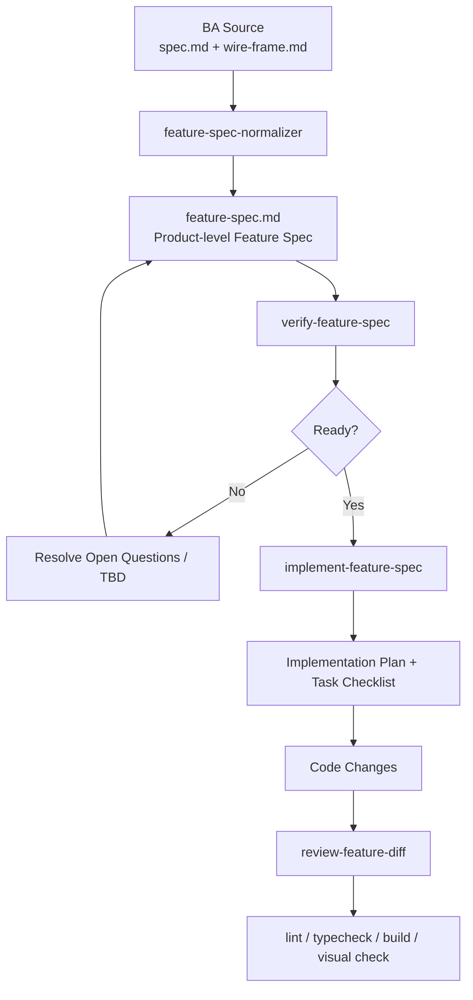

<!-- Generated by SpecStory, Markdown v2.1.0 -->

# 2026-06-04 09:04:15Z

<!-- Codex CLI Session 019e91df-e763-7c41-8a96-2a490c5f2404 (2026-06-04 09:04:15Z) -->

_**User (2026-06-04 09:04:15Z)**_

kết hợp với project structure, và có ascii wireframe thì có thể làm gì để ra được UI không?


---

_**Agent (gpt-5.5 2026-06-04 09:04:47Z)**_

Có. Nếu có **project structure** + **ASCII wireframe**, mình có thể chuyển thành UI khá hiệu quả, nhưng cần thêm tối thiểu một lớp thông tin để tránh “vẽ bừa” business logic.

Có thể làm theo quy trình này:

1. **Đọc project structure**
   - Xác định màn hình thuộc module nào: `admin`, `portal-msm`, hay `thi-nghiem-cbm`.
   - Đặt file đúng chỗ: `app/<module>/`, `components/<module>/`, `types/<module>/`, `mock-data/<module>/`.
   - Kiểm tra component sẵn có trong `components/ds/`, `components/shared/`, `components/ui/`.

2. **Dịch ASCII wireframe thành layout**
   - Xác định vùng: header, filter bar, KPI, table, form, drawer, modal, detail panel.
   - Map sang DS wrapper hiện có như:
     - `DSDataTable`
     - `DSFilterBar`
     - `DSStatusBadge`
     - `DSKpiCard`
     - `DSFormField`

3. **Bổ sung dữ liệu tối thiểu**
   Cần biết:
   - Các field hiển thị là gì.
   - Field nào filter/sort/search được.
   - Trạng thái nghiệp vụ dùng nhãn nào.
   - Action nào có trên từng row/detail.
   - Loading, empty, error, no result hiển thị ra sao.
   - Mock data có những edge case nào.

4. **Sinh UI tr∆∞·ªõc b·∫±ng mock data**
   - T·∫°o type.
   - T·∫°o mock data trong `mock-data/<module>/`.
   - T·∫°o component/page theo layout.
   - Chưa tự bịa API thật, permission thật, workflow thật nếu spec chưa có.

5. **Sau đó mới nối business/API**
   - API đặt dưới `lib/<module>/api/`.
   - Hook đặt dưới `hooks/<module>/`.
   - Permission/lifecycle/validation đưa vào `lib/permissions`, `lib/lifecycle`, `lib/validation` nếu có logic nghiệp vụ.

Nói ngắn gọn: **ASCII wireframe đủ để dựng UI skeleton và interaction cơ bản**, còn để ra UI đúng nghiệp vụ thì cần thêm **field definitions, status/action rules, validation, data source, acceptance criteria**.

Format tốt nhất là đưa wireframe vào `.specs/<module>/<code>.md`, ví dụ:

```txt
.specs/thi-nghiem-cbm/CBM-SCR-01.md
```

Rồi mình có thể verify spec trước, sau đó implement UI theo đúng project structure và design system.

---

_**User (2026-06-04 22:44:40Z)**_

vậy trong spec nên tổ chức thế nào? ví dụ tôi đang có .spec/thi-nghiem-cbm/01-danh-sach-ke-hoach-cbm thì đã đủ chưa?


---

_**Agent (gpt-5.5 2026-06-04 22:47:07Z)**_

Mình sẽ dùng nhẹ skill `verify-feature-spec` ở mức hướng dẫn, vì câu hỏi đang xoay quanh việc spec đủ để implement UI hay chưa. Để tránh phán mò, mình sẽ đối chiếu với chuẩn spec local của repo trước.

_**Agent (gpt-5.5 2026-06-04 22:47:07Z)**_

<tool-use data-tool-type="shell" data-tool-name="exec_command"><details>
<summary>Tool use: **exec_command** `sed -n '1,220p' /Users/chiennguyen/Desktop/EVN/evn_ui_shadcn/.agents/skills/verify-feature-spec/SKILL.md`</summary>
```
Chunk ID: 10a94d
Wall time: 0.0000 seconds
Process exited with code 0
Original token count: 1072
Output:
---
name: verify-feature-spec
description: Verify a local Feature Spec before implementation. Use when checking whether `.specs/<module>/<code>.md` is complete enough to implement, comparing it against `docs/templates/FEATURE_SPEC_TEMPLATE.md`, and reporting blocking issues, warnings, assumptions, and readiness.
---

# Verify Feature Spec

Use this skill before implementing any feature from `.specs/<module>/`.

The goal is to decide whether a Feature Spec is ready for implementation. Do not implement code while using this skill.

## Inputs

Required:

```txt
.specs/<module>/<FEATURE-CODE>.md
```

Reference:

```txt
docs/templates/FEATURE_SPEC_TEMPLATE.md
AGENTS.md
docs/architecture/PROJECT_STRUCTURE.md
```

## Workflow

1. Read the target Feature Spec.
2. Read `docs/templates/FEATURE_SPEC_TEMPLATE.md`.
3. Confirm the module is one of:

```txt
admin
portal-msm
thi-nghiem-cbm
```

4. Check that the spec includes enough information for implementation.
5. Do not invent missing business rules, validations, permissions, APIs, or workflow behavior.
6. Report readiness clearly.

## Required Checks

Check these sections:

- Metadata
- User Story
- Description
- UI / UX
- Business Rules
- Data Fields
- Shared Rules References
- Acceptance Criteria
- Implementation Notes
- Change Request, only when the spec is a CR

## Detailed Checklist

Metadata:

- Module is present and valid.
- Module slug matches the target `.specs/<module>/` folder.
- Use case ID or screen ID is present.
- Version is present.
- Owner/status are present or explicitly marked TBD.

UI / UX:

- Spec has either ASCII layout or a Figma/design link.
- Primary layout regions are clear.
- Primary actions are visible.
- Empty/loading/error/success states are described or referenced.

Data Fields:

- Each field has a UI type.
- Required/optional state is specified or marked TBD.
- Data source is specified or marked TBD.
- Shared rules are linked or marked TBD.
- Upload fields define file count, file type, max size, and failure behavior, or mark them TBD.

Business Rules:

- Rules are explicit enough to implement.
- Missing rules are marked `TODO(<owner>)` or `TBD`.
- No hidden workflow behavior is implied without being written.

Validation:

- Validation requirements are explicit or linked.
- Error behavior is clear.
- Validation failure preserves entered data.

Acceptance Criteria:

- ACs are testable.
- ACs cover success and failure paths.
- ACs do not contradict business rules or UI details.

Implementation Notes:

- Route/module placement is clear enough.
- Expected API/mock-data/type needs are clear enough.
- Any permission/lifecycle dependency is explicit or marked TBD.

Change Request:

- Old version and new version are declared.
- Old/new spec links are included.
- Current behavior and requested change are both described.
- Impact is listed for UI, validation, API, permissions, lifecycle, and mock data where relevant.

## Readiness Rules

Return `Ready for implementation: No` when any blocking issue exists.

Blocking issues include:

- Missing target spec file.
- Invalid or unclear module.
- No user story or description.
- No UI layout or design reference.
- Data fields are too incomplete to build the screen.
- Business rules required for behavior are missing.
- Validation rules required for submit/save are missing.
- Acceptance Criteria are absent or not testable.
- API/workflow/permission behavior is required but unspecified.
- Spec contains contradictions.

Return `Ready for implementation: Yes` only when implementation can proceed without inventing business behavior.

Warnings are allowed when they do not block implementation, for example:

- Minor copy text TBD.
- Non-critical empty state wording TBD.
- Nice-to-have edge case not specified.
- Design spacing can follow existing DS pattern.

## Output Format

Use this exact structure:

```txt
Ready for implementation: Yes/No

Spec:
- Path: <path>
- Module: <module>
- Code: <code>
- Version: <version or TBD>

Blocking issues:
- <issue or "None">

Warnings:
- <warning or "None">

Assumptions:
- <assumption or "None">

Implementation scope:
- Routes:
- Components:
- Hooks:
- API:
- Types:
- Mock data:

Reviewer notes:
- <short notes for designer/BA/dev>
```

Keep the result concise and actionable.
```
</details></tool-use>

_**Agent (gpt-5.5 2026-06-04 22:47:07Z)**_

<tool-use data-tool-type="shell" data-tool-name="exec_command"><details>
<summary>Tool use: **exec_command** `sed -n '1,220p' docs/templates/FEATURE_SPEC_TEMPLATE.md`</summary>
```
Chunk ID: f29690
Wall time: 0.0000 seconds
Process exited with code 0
Original token count: 1318
Output:
# Feature Spec Template

Use this template for local synced specs under `.specs/<module>/`.

Recommended filename:

```txt
.specs/<module>/<MODULE>-UC-<number>.md
```

Example:

```txt
.specs/thi-nghiem-cbm/CBM-UC-01.md
```

## Metadata

```txt
Module: <Admin | Portal MSM | Thí nghiệm CBM>
Module slug: <admin | portal-msm | thi-nghiem-cbm>
Use case ID: <MODULE>-UC-<number>
Screen ID: <MODULE>-SCR-<number>
Version: <major.minor>
Status: <Draft | In Review | Approved>
Owner: <name/team>
Last updated: <dd/mm/YYYY>
Related documents: <document name, section, link/path>
```

## User Story

```txt
Là <vai trò>, tôi muốn <hành động/mục tiêu> để <giá trị nghiệp vụ>.
```

Example:

```txt
Là NVTN, tôi muốn tạo kế hoạch CBM để quản lý kế hoạch thí nghiệm CBM.
```

## Description

```txt
<Mô tả ngắn gọn chức năng>
```

Example:

```txt
T·∫°o k·∫ø ho·∫°ch CBM.
```

## UI / UX

Use ASCII wireframes to describe the screen layout, primary regions, key controls, and action placement.

```txt
+------------------------------------------------------------+
| Header / Breadcrumb                                        |
+------------------------------------------------------------+
| Page title: Tạo kế hoạch CBM                  [Hủy] [Lưu]  |
+------------------------------------------------------------+
| Thông tin thiết bị                                         |
| +----------------------+ +-------------------------------+ |
| | Mã thiết bị          | | Tên thiết bị                  | |
| +----------------------+ +-------------------------------+ |
| | Đơn vị quản lý       | | Trạm / vị trí                 | |
| +----------------------+ +-------------------------------+ |
+------------------------------------------------------------+
| Thông tin kế hoạch                                        |
| +----------------------+ +-------------------------------+ |
| | Ngày thực hiện       | | Người thực hiện               | |
| +----------------------+ +-------------------------------+ |
| | Ghi ch√∫ k·∫ø ho·∫°ch                                      | |
| +--------------------------------------------------------+ |
| | File bằng chứng: [Upload]                             | |
| +--------------------------------------------------------+ |
| | Nội dung đầy đủ                                      | |
| +--------------------------------------------------------+ |
+------------------------------------------------------------+
| Validation / error area                                    |
+------------------------------------------------------------+
```

## Business Rules

Khi `<vai trò>` thực hiện `<hành động>`, cần đảm bảo các rules sau:

```txt
- <Rule 1>
- <Rule 2>
- <Rule 3>
```

If rules are not finalized, mark them explicitly.

```txt
TODO(<owner>): Bổ sung validation rules.
```

Do not invent missing rules during implementation.

## Data Fields

| Field | UI Type | Required | Source | Shared Rule | Notes |
| --- | --- | --- | --- | --- | --- |
| Thông tin thiết bị | Display / selector | TBD | TBD | TBD | Giải thích lấy từ đâu |
| Ngày thực hiện | Datepicker | TBD | User input | Shared date format rule | Format `dd/mm/YYYY` |
| Ghi ch√∫ k·∫ø ho·∫°ch | Textarea | TBD | User input | Shared text length rule | Link shared rule when available |
| File bằng chứng | File upload | TBD | User upload | Shared attachment rule | Define multiple files, file types, max size |
| Nội dung đầy đủ | Textarea | TBD | User input | Shared text length rule | Link shared rule when available |

## Shared Rules References

Use this section to link common project rules instead of repeating them in every ticket.

```txt
Date format rule: <link/path>
Text length rule: <link/path>
Attachment upload rule: <link/path>
Permission rule: <link/path>
Lifecycle rule: <link/path>
Validation rule: <link/path>
```

## Acceptance Criteria

```txt
1. Các validations cần được thực hiện cả FE và BE.
2. Tạo dữ liệu thành công và thông báo thành công cho người dùng.
3. Khi validation thất bại, dữ liệu đã nhập được giữ lại và lỗi hiển thị inline.
4. Khi hệ thống lỗi, hiển thị lỗi rõ ràng và không mất dữ liệu đã nhập.
```

## Implementation Notes

```txt
Route: app/<module>/<route>/page.tsx
Components: components/<module>/<feature>/
Hooks: hooks/<module>/
API: lib/<module>/api/
Types: types/<module>/
Mock data: mock-data/<module>/
Lifecycle: lib/lifecycle/
Permissions: lib/permissions/
Validation: lib/validation/
```

## Change Request

Use this section only for CR specs.

```txt
Current version: <MODULE>-UC-<number>.<old-version>
New version: <MODULE>-UC-<number>.<new-version>
Old spec link/path: <link/path>
New spec li
... (truncated)
```
</details></tool-use>

_**Agent (gpt-5.5 2026-06-04 22:47:07Z)**_

<tool-use data-tool-type="shell" data-tool-name="exec_command"><details>
<summary>Tool use: **exec_command** `ls -la .specs thi-nghiem-cbm .spec 2>/dev/null`</summary>
```
Chunk ID: 8c6cad
Wall time: 0.0000 seconds
Process exited with code 1
Original token count: 188
Output:
.specs:
total 120
drwxr-xr-x@ 11 chiennguyen  staff    352 Jun  5 05:41 .
drwx------@ 37 chiennguyen  staff   1184 Jun  4 16:01 ..
-rw-r--r--@  1 chiennguyen  staff   6148 Jun  3 08:03 .DS_Store
drwxr-xr-x@  2 chiennguyen  staff     64 Jun  3 08:02 admin
-rw-r--r--@  1 chiennguyen  staff   7411 Jun  5 05:39 create-plan-popup.md
-rw-r--r--@  1 chiennguyen  staff  13459 Jun  5 05:39 import-plan.md
-rw-r--r--@  1 chiennguyen  staff   9060 Jun  5 05:39 plan-detail.md
drwxr-xr-x@  2 chiennguyen  staff     64 Jun  3 08:02 portal-msm
-rw-r--r--@  1 chiennguyen  staff   6807 Jun  5 05:39 sync-pmis-popup.md
drwxr-xr-x@  3 chiennguyen  staff     96 Jun  5 05:41 thi-nghiem-cbm
-rw-r--r--@  1 chiennguyen  staff   5610 Jun  5 05:39 update-plan-popup.md
```
</details></tool-use>

_**Agent (gpt-5.5 2026-06-04 22:47:15Z)**_

Mình thấy repo đang dùng `.specs/` chứ không phải `.spec/`. Điểm này nhỏ nhưng đáng giữ chuẩn, vì workflow/spec skills trong project đều đang trỏ vào `.specs/<module>/<code>.md`.

_**Agent (gpt-5.5 2026-06-04 22:47:15Z)**_

<tool-use data-tool-type="shell" data-tool-name="exec_command"><details>
<summary>Tool use: **exec_command** `find .specs/thi-nghiem-cbm -maxdepth 2 -type f -print`</summary>
```
Chunk ID: ece9c6
Wall time: 0.0000 seconds
Process exited with code 0
Original token count: 30
Output:
.specs/thi-nghiem-cbm/01-danh-sach-ke-hoach-cbm/plan-list.md
.specs/thi-nghiem-cbm/01-danh-sach-ke-hoach-cbm/spec.md
```
</details></tool-use>

_**Agent (gpt-5.5 2026-06-04 22:47:15Z)**_

<tool-use data-tool-type="shell" data-tool-name="exec_command"><details>
<summary>Tool use: **exec_command** `find .specs/thi-nghiem-cbm -maxdepth 2 -type d -print`</summary>
```
Chunk ID: c9222d
Wall time: 0.0000 seconds
Process exited with code 0
Original token count: 18
Output:
.specs/thi-nghiem-cbm
.specs/thi-nghiem-cbm/01-danh-sach-ke-hoach-cbm
```
</details></tool-use>

_**Agent (gpt-5.5 2026-06-04 22:47:23Z)**_

Trong thư mục đó hiện có `spec.md` và `plan-list.md`, nên mình sẽ nhìn nhanh cấu trúc nội dung. Nếu đủ các phần metadata, field, rules, states, acceptance criteria thì có thể triển khai UI; nếu chỉ có wireframe thì mới đủ để dựng khung.

_**Agent (gpt-5.5 2026-06-04 22:47:23Z)**_

<tool-use data-tool-type="shell" data-tool-name="exec_command"><details>
<summary>Tool use: **exec_command** `sed -n '1,260p' .specs/thi-nghiem-cbm/01-danh-sach-ke-hoach-cbm/spec.md`</summary>
```
Chunk ID: f50187
Wall time: 0.0000 seconds
Process exited with code 0
Original token count: 1340
Output:
1. Mục tiêu
Là NVTN tôi muốn xem/tìm kiếm danh sách kế hoạch CBM — UC-PLAN-01 §2.1

2. Description
Theo dõi, tìm kiếm và rà soát danh sách kế hoạch CBM; thực hiện các workflow action hợp lệ theo trạng thái. Đây là màn hình trung tâm để tạo mới, import, đồng bộ PMIS, xem chi tiết, cập nhật, xóa và chuyển kế hoạch sang thực hiện.

3. Traceability
UC: UC-PLAN-01 — Quản lý kế hoạch CBM
SRS: MSM_CBM_SRS_v1.1.docx §2.1 (v1.1)
Màn UI: §2.1.2
Parent Feature: #8966
4. UI/UX
[Ảnh UI – SRS §2.1.2: Danh sách kế hoạch CBM] (sẽ nhúng ảnh thật khi có PAT)

Filter/Search (§2.1.3): Tìm kiếm (mã/tên/số seri); Ngày thực hiện (preset date range, mặc định tháng hiện tại); Trạng thái (Tất cả/Nháp/Chờ GĐXN duyệt/Đã duyệt/Từ chối/Đã chuyển); Đơn vị (PMIS); Vị trí (PMIS); Đặt lại.

Cột bảng (§2.1.4): Mã thiết bị (link→chi tiết), Tên thiết bị, Vị trí, Đơn vị quản lý, Ngày thực hiện (dd/mm/yyyy), Trạng thái (badge), Nguồn tạo, Thời gian cập nhật.

Action (§2.1.5): Tạo mới, Import Excel, Đồng bộ PMIS, Xem chi tiết, Chỉnh sửa, Xóa (confirm), Xóa nhiều, Chuyển sang thực hiện CBM, Chọn nhiều, Tùy chỉnh cột, Export.

Flow: mở màn danh sách → nhập keyword/đổi filter → reload → chọn action theo trạng thái dòng.

States (§2.1.7): default, loading, searching, filtering, empty result, invalid date filter, filter reset, row/bulk action unavailable, multi-selection, customize columns, pagination (50/trang), delete confirm/success/failed, update popup opened/success/failed.

5. Business Rule
Khi NVTN theo dõi và thao tác danh sách kế hoạch CBM, đảm bảo các rule sau:

5.1 Rule cần validate (map BR-ID của SRS §2.1.8)
BR-PLAN-LIST-01: chỉ xem kế hoạch thuộc đơn vị/phạm vi quản lý được phép.
BR-PLAN-LIST-02: hiển thị theo điều kiện search/filter hiện tại.
BR-PLAN-LIST-03: chỉ “Nháp”/“Từ chối” được cập nhật.
BR-PLAN-LIST-04: chỉ “Nháp” được xóa.
BR-PLAN-LIST-05: chỉ “Đã duyệt” được chuyển sang thực hiện CBM.
BR-PLAN-LIST-06 & 08: bulk action chỉ khi tất cả kế hoạch được chọn đều hợp lệ.
BR-PLAN-LIST-07: cấu hình cột áp dụng trên danh sách hiện tại.
5.2 Trường dữ liệu & nguồn
Thông tin thiết bị (nguồn: PMIS — CR-DATASOURCE): Mã thiết bị, Tên thiết bị, Vị trí, Đơn vị quản lý.
Thông tin kế hoạch (nguồn: MSM): Ngày thực hiện, Trạng thái workflow, Nguồn tạo, Thời gian cập nhật.
5.3 Rule dùng chung (link — không copy)
Ph√¢n trang: CR-PAGING
Quyền truy cập: CR-AUTHZ
Tr·∫°ng th√°i workflow: CR-STATES
Ngày thực hiện: CR-DATE
6. Acceptance Criteria (§2.1.9)
AC-PLAN-LIST-01: Người dùng có thể tìm kiếm kế hoạch theo mã thiết bị, tên thiết bị hoặc số seri thiết bị.
AC-PLAN-LIST-02: Người dùng có thể lọc danh sách kế hoạch theo ngày thực hiện, trạng thái kế hoạch, đơn vị quản lý và vị trí.
AC-PLAN-LIST-03: Khi người dùng thay đổi điều kiện tìm kiếm hoặc filter, hệ thống reload danh sách kế hoạch tương ứng.
AC-PLAN-LIST-04: Hệ thống chỉ hiển thị các workflow action hợp lệ theo trạng thái của từng kế hoạch.
AC-PLAN-LIST-05: Người dùng có thể chọn nhiều kế hoạch để thực hiện bulk action phù hợp.
AC-PLAN-LIST-06: Hệ thống không cho thực hiện bulk action nếu tồn tại kế hoạch không hợp lệ với workflow action tương ứng.
AC-PLAN-LIST-07: Người dùng có thể tùy chỉnh hiển thị cột dữ liệu trên danh sách kế hoạch CBM.
AC-PLAN-LIST-08: Khi không có dữ liệu phù hợp với điều kiện tìm kiếm hoặc filter, hệ thống hiển thị trạng thái empty result.
AC-PLAN-LIST-09: Người dùng có thể xóa kế hoạch ở trạng thái “Nháp” sau khi xác nhận thao tác xóa.
AC-PLAN-LIST-10: Hệ thống không cho xóa kế hoạch nếu kế hoạch không ở trạng thái “Nháp”.
AC-PLAN-LIST-11: Người dùng có thể xóa nhiều kế hoạch nếu tất cả kế hoạch được chọn đều thỏa điều kiện xóa.
AC-PLAN-LIST-12: Người dùng có thể mở popup cập nhật kế hoạch từ danh sách nếu kế hoạch ở trạng thái cho phép cập nhật.
AC-PLAN-LIST-13: Sau khi cập nhật kế hoạch thành công, hệ thống reload danh sách và hiển thị dữ liệu mới nhất.
Validate được thực hiện ở cả FE và BE.
Khi thành công: cập nhật dữ liệu đúng trạng thái + thông báo thành công, 
... (truncated)
```
</details></tool-use>

_**Agent (gpt-5.5 2026-06-04 22:47:23Z)**_

<tool-use data-tool-type="shell" data-tool-name="exec_command"><details>
<summary>Tool use: **exec_command** `sed -n '1,260p' .specs/thi-nghiem-cbm/01-danh-sach-ke-hoach-cbm/plan-list.md`</summary>
```
Chunk ID: 3c9e71
Wall time: 0.0000 seconds
Process exited with code 0
Original token count: 1693
Output:
# 01-plan-list-full.md

## Source

SRS Section:
- 2.1 Xem danh sách / Tìm kiếm kế hoạch CBM
- 2.1.2 UI
- 2.1.3 Filter Components / Search Criteria
- 2.1.4 Data Table Columns
- 2.1.5 Action Components
- 2.1.7 Feedback & State Components

---

## ASCII Wireframe

```text
+----------------------------------------------------------------------------------------------------------------------+
| ☰  | MSM Portal / Thí nghiệm CBM / Theo dõi kế hoạch CBM                  [Tìm kiếm hệ thống...] [?] [User]        |
+----+-----------------------------------------------------------------------------------------------------------------+
|    |                                                                                                                 |
| SB | PAGE HEADER                                                                                                     |
|    | Theo dõi kế hoạch CBM                                                                                           |
|    | Theo dõi, tìm kiếm và xử lý workflow kế hoạch CBM                         Hiển thị 1-50 trên 236  [<] [>]      |
|    |                                                                                              [Import] [PMIS] [+ T·∫°o m·ªõi] |
|----+-----------------------------------------------------------------------------------------------------------------|
|    | FILTER PANEL                                                                                                   |
|    | [🔍 Tìm mã thiết bị / tên thiết bị / số seri...................................................]              |
|    |                                                                                                                 |
|    | [Ngày thực hiện ▼] [Trạng thái ▼] [Đơn vị quản lý ▼] [Vị trí ▼]                                  [Đặt lại]    |
|----+-----------------------------------------------------------------------------------------------------------------|
|    | BULK ACTION BAR (Visible When Selected > 0)                                                                     |
|    | Đã chọn: n kế hoạch                                                               [Xóa nhiều kế hoạch]         |
|----+-----------------------------------------------------------------------------------------------------------------|
|    | DATA TABLE                                                                                                      |
|    | [ ] | Mã thiết bị | Tên thiết bị | Vị trí | Đơn vị quản lý | Ngày TH | Trạng thái | Nguồn tạo | Cập nhật | ... |
|    |---------------------------------------------------------------------------------------------------------------  |
|    | [ ] | MBA001 | M√°y bi·∫øn √°p T1 | Tr·∫°m 110kV HN | EVNHN  | 15/06 | Nh√°p      | T·∫°o m·ªõi | 10/06 09:30 | ... |
|    | [ ] | MBA002 | Máy biến áp T2 | Trạm 110kV ĐA | EVNHN  | 16/06 | Chờ duyệt | Import  | 10/06 10:15 | ... |
|    | [ ] | MBA003 | Máy biến áp T3 | Trạm 110kV GL | EVNBAC | 17/06 | Đã duyệt  | PMIS    | 11/06 08:45 | ... |
|----+-----------------------------------------------------------------------------------------------------------------|
+----+-----------------------------------------------------------------------------------------------------------------+
```

---

## Display Fields

### Page Header

| Field | Type |
|---------|---------|
| Page Title | Text |
| Page Description | Text |
| Total Records | Text |
| Current Range | Text |

### Filter Fields

| Field | Type |
|---------|---------|
| Tìm kiếm kế hoạch | Search Input |
| Ngày thực hiện | Date Range Picker |
| Tr·∫°ng th√°i k·∫ø ho·∫°ch | Dropdown |
| Đơn vị quản lý | Dropdown |
| Vị trí | Dropdown |
| Đặt lại | Button |

### Data Table Columns

| Column | Type |
|---------|---------|
| Checkbox Selection | Checkbox |
| Mã thiết bị | Link |
| Tên thiết bị | Text |
| Vị trí | Text |
| Đơn vị quản lý | Text |
| Ngày thực hiện | Date |
| Tr·∫°ng th√°i k·∫ø ho·∫°ch | Status Badge |
| Nguồn tạo kế hoạch | Badge/Text |
| Th·ªùi gian c·∫≠p nh·∫≠t | DateTime |
| Actions | Action Menu |

### Table Utilities

| Field | Type |
|---------|---------|
| Tùy chỉnh cột hiển thị | Dropdown / Modal |
| Pagination | Pagination |

---

## Filter / Search / Sort

### Search

- Mã thiết bị
- Tên thiết bị
- Số seri thiết bị

### Filter

| Field | Default |
|---------|---------|
| Ngày thực hiện | Tháng hiện tại |
| Trạng thái kế hoạch | Tất cả |
| Đơn vị quản lý | Tất cả |
| Vị trí | Tất cả |

### Date Presets

- Hôm nay
- 7 ngày qua
- 30 ngày qua
- Năm nay
- Năm trước
- Khoảng ngày tùy chỉnh

### So
... (truncated)
```
</details></tool-use>

_**Agent (gpt-5.5 2026-06-04 22:47:45Z)**_

Có, thư mục hiện tại **gần đủ để dựng UI danh sách**:

```txt
.specs/thi-nghiem-cbm/01-danh-sach-ke-hoach-cbm/
├── spec.md
└── plan-list.md
```

Nhưng nếu hỏi “đã đủ để implement không cần hỏi lại chưa?” thì câu trả lời là: **chưa hoàn toàn**. Nó đủ mạnh để dựng màn hình list với mock data, filter, table, bulk bar, trạng thái loading/empty/error, nhưng còn thiếu vài điểm để tránh agent tự bịa logic.

Nên tổ chức spec theo 2 cách, mình khuyên cách 1.

**Cách 1: Một file spec chuẩn, dễ cho agent verify**

```txt
.specs/thi-nghiem-cbm/CBM-SCR-01-danh-sach-ke-hoach-cbm.md
```

Trong file đó gom đủ:

```txt
1. Metadata
2. User Story
3. Description
4. Traceability
5. UI / UX
   - ASCII wireframe
   - layout regions
   - actions
   - states
6. Business Rules
7. Data Fields
8. Shared Rules References
9. Acceptance Criteria
10. Implementation Notes
11. Out of Scope / Dependencies
12. Versioning / CR
```

**C√°ch 2: M·ªôt folder cho feature l·ªõn**

Cách bạn đang làm cũng ổn, nhưng nên có `index.md` hoặc `spec.md` là file chính, còn các file phụ tách theo màn hình/popup:

```txt
.specs/thi-nghiem-cbm/01-danh-sach-ke-hoach-cbm/
├── spec.md              # spec tổng, source of truth
├── plan-list.md         # wireframe + UI detail
├── create-popup.md      # nếu thuộc phạm vi
├── update-popup.md      # nếu thuộc phạm vi
└── mock-data.md         # edge cases nếu nhiều
```

Điểm cần chỉnh: repo chuẩn là **`.specs/`**, không phải `.spec/`.

Với spec hiện tại, mình thấy **đủ các phần tốt**: user story, traceability, filter/table/actions/states, business rules, acceptance criteria, mock edge cases. Phần này rất dùng được.

Các thiếu hụt nên bổ sung trước khi implement thật:

```txt
Metadata:
- Module: Thí nghiệm CBM
- Module slug: thi-nghiem-cbm
- Screen ID: CBM-SCR-01
- Version: 1.1
- Status / Owner / Last updated

Implementation Notes:
- Route cụ thể: app/thi-nghiem-cbm/<route>/page.tsx
- Components dự kiến
- Types dự kiến
- Mock data path
- API có mock-only hay endpoint thật

Permission / lifecycle:
- CR-AUTHZ, CR-STATES đang là reference nhưng chưa có path cụ thể.
- Nếu chưa có file rule thật thì ghi rõ TBD(owner), để agent không tự chế.

Status consistency:
- AGENTS.md yêu cầu giữ workflow labels:
  Nháp, Chờ duyệt, Đã duyệt, Từ chối
- Spec hiện có dùng thêm “Chờ GĐXN duyệt”, “Đã chuyển sang thực hiện”.
  Cần xác nhận đây là label chính thức hay display variant.

Action behavior:
- Export xuất gì, theo filter hiện tại hay toàn bộ?
- Tùy chỉnh cột có lưu local/session/user profile không?
- Bulk delete khi có dòng không hợp lệ: disable button hay cho bấm rồi báo lỗi?

Data source:
- Đơn vị / vị trí từ PMIS: dùng mock local hay API nào?
```

Tóm lại: **đủ để ra UI prototype/implementation bằng mock data**, nhưng để “đóng spec” cho agent implement sạch theo rule của repo, nên bổ sung metadata, route, rule references thật, và làm rõ status/action edge cases. Hiện spec của bạn đã đi đúng hướng rồi, không phải dạng wireframe trống.

---

_**User (2026-06-04 22:57:41Z)**_

đầu tiên check mỗi màn hình danh sách đã


---

_**Agent (gpt-5.5 2026-06-04 22:57:52Z)**_

Mình sẽ chỉ kiểm tra màn hình danh sách trước: `.specs/thi-nghiem-cbm/01-danh-sach-ke-hoach-cbm/`. Trọng tâm là spec đã đủ để implement UI list chưa, chưa mở rộng sang popup tạo/import/PMIS/cập nhật.

_**Agent (gpt-5.5 2026-06-04 22:57:52Z)**_

<tool-use data-tool-type="shell" data-tool-name="exec_command"><details>
<summary>Tool use: **exec_command** `sed -n '1,220p' docs/architecture/PROJECT_STRUCTURE.md`</summary>
```
Chunk ID: e20104
Wall time: 0.0002 seconds
Process exited with code 0
Original token count: 1418
Output:
# Project Structure

This repository is a multi-application enterprise frontend. The active modules are Admin, Portal MSM, and Thí nghiệm CBM. Folder names for business modules use Vietnamese slugs without accents. UI labels should keep the full Vietnamese business names.

## Application Routes

Next.js App Router routes live in `app/`.

```txt
app/
  admin/
  portal-msm/
  thi-nghiem-cbm/
  system/
```

Use these folders for route segments, pages, layouts, loading states, and route-level composition. Do not place reusable business logic directly in page files.

## Local Specification Cache

Externally owned feature, layout, and screen specifications can be synced into `.specs/` for local agent access.

```txt
.specs/
  admin/
  portal-msm/
  thi-nghiem-cbm/
```

Use `.specs/<module>/` for module-specific specifications, including use cases, screen specs, layout specs, validation rules, and FE implementation notes.

The `.specs/` folder is ignored by Git because these documents are originally stored outside this repository.

Spec files should preserve the module code or screen code in the filename when available.

```txt
.specs/thi-nghiem-cbm/CBM-UC-01.md
.specs/thi-nghiem-cbm/CBM-SCR-01.md
.specs/portal-msm/MSM-UC-01.md
.specs/admin/ADMIN-UC-01.md
```

When implementing a feature, read the relevant local cached Feature Spec before changing code. If the cached file was synced from an external system, treat the cached Feature Spec as the local implementation reference.

Use `docs/templates/FEATURE_SPEC_TEMPLATE.md` for local synced specs. Specs should include user story, description, ASCII UI layout, business rules, data fields, shared rule references, related document links, acceptance criteria, and CR/version information when applicable.

## Components

```txt
components/
  ds/
  ui/
  shared/
  admin/
  portal-msm/
  thi-nghiem-cbm/
```

- `components/ds/`: project design-system wrappers. Prefer these first.
- `components/ui/`: raw shadcn/ui primitives.
- `components/shared/`: reusable enterprise UI shared across modules.
- `components/<module>/`: module-specific UI components.

Do not bypass DS wrappers unless no suitable wrapper exists.

## Library Code

```txt
lib/
  shared-api-client/
    client.ts
    errors.ts
    endpoints.ts
    types.ts
    auth.ts

  shared/
  lifecycle/
  permissions/
  validation/
  mappings/

  admin/
    api/
  portal-msm/
    api/
  thi-nghiem-cbm/
    api/
```

- `lib/shared-api-client/`: shared HTTP request infrastructure, including base client, auth headers, response parsing, error normalization, and common API types.
- `lib/<module>/api/`: backend endpoint functions for each business module.
- `lib/lifecycle/`: centralized workflow and readonly lifecycle logic.
- `lib/permissions/`: centralized permission checks.
- `lib/validation/`: deterministic validation rules.
- `lib/mappings/`: shared mappings, including status and display mappings when appropriate.
- `lib/shared/`: non-UI utilities shared across modules.

Pages, components, and hooks must not define raw backend HTTP requests directly.

Preferred dependency flow:

```txt
app / components
  -> hooks/<module>/
    -> lib/<module>/api/
      -> lib/shared-api-client/
```

## Constants

```txt
constants/
  workflow/
  status/
  permissions/
  navigation/
```

Use constants for canonical workflow states, status values, permission identifiers, and navigation definitions. Do not hardcode workflow states, status labels, or permissions inside components.

Vietnamese workflow labels must remain canonical:

```txt
Nh√°p
Chờ duyệt
Đã duyệt
Từ chối
```

## Hooks

```txt
hooks/
  shared/
  admin/
  portal-msm/
  thi-nghiem-cbm/
```

Hooks may orchestrate UI state and call API functions from `lib/<module>/api/`. Hooks should not contain raw `fetch` or `axios` request logic.

## Mock Data

```txt
mock-data/
  admin/
  portal-msm/
  thi-nghiem-cbm/
```

Mock data must be typed, realistic, and enterprise-oriented. Include multiple organizations, statuses, lifecycle states, timestamps, and edge cases required by the Feature Spec.

## Types

```txt
types/
  shared/
  admin/
  portal-msm/
  thi-nghiem-cbm/
```

Use `types/shared/` for cross-module types. Use `types/<module>/` for module-specific domain types. Avoid duplicate type definitions.

## Module Slugs and Labels

Use stable Vietnamese slugs without accents for folders and routes.

```txt
admin
portal-msm
thi-nghiem-cbm
```

Use full Vietnamese labels in navigation and UI configuration.

```ts
export const APP_MODULES = [
  { id: "admin", label: "Admin", href: "/admin" },
  { id: "portal-msm", label: "Portal MSM (b√°o c√°o)", href: "/portal-msm" },
  { id: "thi-nghiem-cbm", label: "Thí nghiệm CBM", href: "/thi-nghiem-cbm" },
]
```

## Placement Rules

- Put route files in `app/<module>/`.
- Put synced local feature and screen specs in `.specs/<module>/`.
- 
... (truncated)
```
</details></tool-use>

_**Agent (gpt-5.5 2026-06-04 22:57:52Z)**_

<tool-use data-tool-type="shell" data-tool-name="exec_command"><details>
<summary>Tool use: **exec_command** `sed -n '1,220p' docs/architecture/DESIGN_SYSTEM.md`</summary>
```
Chunk ID: 1de20f
Wall time: 0.0000 seconds
Process exited with code 0
Original token count: 1890
Output:
# Design System

This project is a Next.js + Tailwind CSS + shadcn foundation using the existing shadcn preset in `components.json`.

- Style: `radix-vega`
- Base color: `taupe`
- CSS variables: enabled
- Icon library: `hugeicons`
- App route playground: `/system`

Do not replace `app/globals.css`, reset the theme, or introduce legacy palette colors. Build product UI from `components/ds` first, and use `components/ui` as the low-level shadcn primitive layer.

## Project Structure

```txt
app/
  globals.css                 # Preset tokens and Tailwind theme mapping. Do not reset.
  layout.tsx                  # Font variables and app shell providers.
  system/
    page.tsx                  # Playground composition only.
    _components/              # Playground example sections.
    _data/demo-data.ts        # Playground-only demo data.

components/
  ui/                         # Generated shadcn primitives.
  ds/                         # Design-system wrappers and enterprise patterns.
    index.ts                  # Public DS exports.

lib/
  utils.ts                    # cn helper.
```

## DS vs UI Import Policy

Product screens should import from `@/components/ds` when a DS abstraction exists.

Use `@/components/ui` directly only when:

- building or maintaining DS components,
- composing a low-level primitive that has not been wrapped yet,
- using shadcn primitives that are intentionally not abstracted.

Do not re-export every raw UI primitive from `components/ds/index.ts`. The DS boundary should stay clear: DS wrappers encode product conventions, while `components/ui` remains the primitive toolbox.

Recommended product import:

```tsx
import { DSButton, DSCard, DSDataTable } from "@/components/ds"
```

Recommended DS implementation import:

```tsx
import { Button } from "@/components/ui/button"
```

## App Shell and Header

Use `DSAppShell` for authenticated product screens. It owns the sidebar, sticky global app bar, and scroll containment.

`DSAppHeader` is the compact global top bar. It should not render large page titles or page-specific actions. Its left side renders breadcrumbs when provided, with `pageTitle` as a fallback.

```tsx
<DSAppShell
  pageTitle="Edit user"
  breadcrumbs={[
    { label: "Users", href: "/demo/users" },
    { label: "Edit user" },
  ]}
>
  {children}
</DSAppShell>
```

Header rules:

- Use breadcrumbs for global app context.
- Keep the top-bar search as global workspace search through `DSGlobalSearch`. `DSAppHeader` exposes `globalSearchPlaceholder`, `globalSearchValue`, `onGlobalSearchChange`, `onGlobalSearchSubmit`, and `recentSearchKeywords`.
- Use `DSHelpMenu` for the header help action. Keep items lightweight until real help, training, policy, and feedback routes exist.
- Use `DSNotificationPopover` for the header notification action. The badge count is derived from unread notifications, notification clicks can mark individual items read, and Mark all as read clears the unread badge.
- The notification popover is for recent activity only; add a full notifications page later when product scope requires it.
- Put page-specific search, filters, and table tools inside page toolbars such as `DSFilterBar` or `DSListPageCard.toolbar`.
- Keep page content titles/actions in `DSPageHeader` or `DSListPageCard`, not in `DSAppHeader`.
- The sidebar owns user/avatar UI; do not add avatar menus to the app header.

## Token Usage Rules

Use Tailwind classes mapped to existing CSS variables. Do not hard-code hex, RGB, HSL, OKLCH, or legacy brand values in components.

Core tokens:

| Token class | Use |
| --- | --- |
| `bg-background`, `text-foreground` | Page background and primary text |
| `bg-card`, `text-card-foreground` | Cards and panel surfaces |
| `bg-popover`, `text-popover-foreground` | Dialogs, sheets, menus, select content |
| `border-border` | Standard dividers and container borders |
| `border-input` | Form control borders |
| `ring-ring`, `outline-ring` | Focus and interaction rings |
| `bg-primary`, `text-primary-foreground` | Primary actions and active emphasis |
| `bg-secondary`, `text-secondary-foreground` | Secondary actions and neutral emphasis |
| `bg-muted`, `text-muted-foreground` | Subtle surfaces, helper text, metadata |
| `bg-accent`, `text-accent-foreground` | Hover, selected, and soft emphasis states |
| `bg-destructive`, `text-destructive`, `border-destructive` | Error and destructive states |

DS semantic color references:

| Token | Value | Use |
| --- | --- | --- |
| `dsColors.operationalOrange` | `#ff7a5d` | EVN operational orange for pending, processing, operational waiting, and workflow continuation states |

Rules:

- Prefer token utility classes over direct `var(...)` usage in markup.
- Use opacity modifiers on token classes when needed, for example `border-destructive/40`.
- Keep custom layout classes token-based: border, background, text, 
... (truncated)
```
</details></tool-use>

_**Agent (gpt-5.5 2026-06-04 22:57:52Z)**_

<tool-use data-tool-type="shell" data-tool-name="exec_command"><details>
<summary>Tool use: **exec_command** `find components/ds components/shared components/ui components/thi-nghiem-cbm app/thi-nghiem-cbm types/thi-nghiem-cbm mock-data/thi-nghiem-cbm hooks/thi-nghiem-cbm lib/thi-nghiem-cbm -maxdepth 2 -type f 2>/dev/null | sort`</summary>
```
Chunk ID: b99a4b
Wall time: 0.0000 seconds
Process exited with code 0
Original token count: 631
Output:
app/thi-nghiem-cbm/.gitkeep
components/ds/alert.tsx
components/ds/app-header.tsx
components/ds/app-navigation.ts
components/ds/app-shell.tsx
components/ds/app-sidebar.tsx
components/ds/badge.tsx
components/ds/breadcrumb.tsx
components/ds/bulk-action-bar.tsx
components/ds/button.tsx
components/ds/calendar.tsx
components/ds/card.tsx
components/ds/checkbox-field.tsx
components/ds/confirm-dialog.tsx
components/ds/data-table.tsx
components/ds/date-range-filter.tsx
components/ds/filter-bar.tsx
components/ds/form-field.tsx
components/ds/global-search.tsx
components/ds/help-menu.tsx
components/ds/icon-button-tooltip.tsx
components/ds/import-file-dialog.tsx
components/ds/import-review-dialog.tsx
components/ds/import-review-summary.tsx
components/ds/import-review-table.tsx
components/ds/index.ts
components/ds/input.tsx
components/ds/kpi-card.tsx
components/ds/layout.tsx
components/ds/list-page-card.tsx
components/ds/notification-badge.tsx
components/ds/notification-popover.tsx
components/ds/page.tsx
components/ds/pagination.tsx
components/ds/search-input.tsx
components/ds/section.tsx
components/ds/select-field.tsx
components/ds/sheet.tsx
components/ds/spinner.tsx
components/ds/state-empty.tsx
components/ds/state-error.tsx
components/ds/state-loading.tsx
components/ds/status-actions.ts
components/ds/status-badge.tsx
components/ds/switch-field.tsx
components/ds/table-row-actions.tsx
components/ds/textarea.tsx
components/ds/toast.ts
components/ds/tokens.ts
components/ds/tooltip.tsx
components/shared/.gitkeep
components/thi-nghiem-cbm/.gitkeep
components/ui/alert-dialog.tsx
components/ui/alert.tsx
components/ui/avatar.tsx
components/ui/badge.tsx
components/ui/breadcrumb.tsx
components/ui/button.tsx
components/ui/calendar.tsx
components/ui/card.tsx
components/ui/checkbox.tsx
components/ui/collapsible.tsx
components/ui/command.tsx
components/ui/dialog.tsx
components/ui/dropdown-menu.tsx
components/ui/empty.tsx
components/ui/input-group.tsx
components/ui/input.tsx
components/ui/label.tsx
components/ui/pagination.tsx
components/ui/popover.tsx
components/ui/radio-group.tsx
components/ui/select.tsx
components/ui/separator.tsx
components/ui/sheet.tsx
components/ui/sidebar.tsx
components/ui/skeleton.tsx
components/ui/sonner.tsx
components/ui/spinner.tsx
components/ui/switch.tsx
components/ui/table.tsx
components/ui/tabs.tsx
components/ui/textarea.tsx
components/ui/tooltip.tsx
hooks/thi-nghiem-cbm/.gitkeep
lib/thi-nghiem-cbm/api/.gitkeep
mock-data/thi-nghiem-cbm/.gitkeep
types/thi-nghiem-cbm/.gitkeep
```
</details></tool-use>

_**Agent (gpt-5.5 2026-06-04 22:58:13Z)**_

Đã check riêng màn hình danh sách: [spec.md](/Users/chiennguyen/Desktop/EVN/evn_ui_shadcn/.specs/thi-nghiem-cbm/01-danh-sach-ke-hoach-cbm/spec.md) + [plan-list.md](/Users/chiennguyen/Desktop/EVN/evn_ui_shadcn/.specs/thi-nghiem-cbm/01-danh-sach-ke-hoach-cbm/plan-list.md).

Ready for implementation: **No, nếu hiểu là implement hoàn chỉnh theo rule của repo**  
Ready for UI mock/list screen: **Yes, đủ để dựng màn hình danh sách bằng mock data**

**Spec**
- Path: `.specs/thi-nghiem-cbm/01-danh-sach-ke-hoach-cbm/`
- Module: `thi-nghiem-cbm`
- Code: nên đặt rõ `CBM-SCR-01` hoặc `CBM-UC-PLAN-01`
- Version: có nhắc SRS `v1.1`, nhưng metadata chưa chuẩn hóa

**Blocking Issues**
- Thiếu metadata chuẩn: `Module`, `Module slug`, `Screen ID`, `Version`, `Status`, `Owner`, `Last updated`.
- Chưa có `Implementation Notes`: route cụ thể, component path, hook path, type path, mock-data path.
- Data fields chưa ở dạng bảng đủ để implement chắc tay: thiếu `Required`, `Source`, `Shared Rule`, `Notes` cho từng field.
- `CR-AUTHZ`, `CR-STATES`, `CR-DATE`, `CR-PAGING` mới là mã tham chiếu, chưa có path/file rule cụ thể hoặc đánh dấu `TBD(owner)`.
- Có lệch nhãn trạng thái với governance repo: AGENTS yêu cầu `Nháp`, `Chờ duyệt`, `Đã duyệt`, `Từ chối`; spec dùng thêm `Chờ GĐXN duyệt`, `Đã chuyển sang thực hiện`.
- Một số action chưa đủ behavior: `Export`, `Tùy chỉnh cột`, pagination, lưu cấu hình cột, bulk action disable/error behavior.

**Warnings**
- ASCII wireframe tốt, nhưng đang dùng icon/emoji trong wireframe; khi implement nên map sang DS/icon library, không bê nguyên.
- Popup tạo/import/PMIS/update đã ghi ngoài phạm vi, vậy list screen chỉ nên mở trigger/dialog placeholder nếu spec con chưa được duyệt.
- “Số seri thiết bị” có trong search nhưng không có trong cột bảng/data fields chính, nên cần xác nhận field này có trong mock/type hay chỉ search backend.

**Assumptions**
- Dựng UI list trước bằng mock data là hợp lệ.
- Actions ngoài phạm vi chỉ render entry point, chưa implement business flow sâu.
- Permission/lifecycle nếu chưa có rule file thì chỉ được biểu diễn theo rules đã ghi trong spec, không tự thêm quyền mới.

**Implementation Scope**
- Routes: cần xác nhận, gợi ý `app/thi-nghiem-cbm/ke-hoach-cbm/page.tsx`
- Components: `components/thi-nghiem-cbm/ke-hoach-cbm/`
- Hooks: `hooks/thi-nghiem-cbm/`
- API: mock/local trước, nếu có thật thì `lib/thi-nghiem-cbm/api/`
- Types: `types/thi-nghiem-cbm/`
- Mock data: `mock-data/thi-nghiem-cbm/`

**Reviewer Notes**
- Spec này đã khá “có xương sống”, không phải bản mơ hồ. Để agent implement sạch, mình chỉ cần bạn/BA bổ sung metadata + route + bảng data fields + thống nhất status labels. Sau đó màn hình danh sách có thể làm được rất nhanh và ít phải đoán.

---

_**User (2026-06-04 22:59:24Z)**_

cái này đã chính là cái mà BA đưa cho mình. Tuy nhiên thì nó là 1 cái liên quan đến business & màn hình nhiều hơn


---

_**Agent (gpt-5.5 2026-06-04 22:59:38Z)**_

Đúng, cái BA đưa cho bạn hiện là **business/screen spec** hơn là **implementation-ready FE spec**. Nó có giá trị rất tốt: mô tả nghiệp vụ, màn hình, action, trạng thái, AC. Nhưng để agent/dev dựng UI trong repo này ít đoán nhất, mình nên thêm một lớp “FE adapter spec” mỏng lên trên, không sửa bản BA quá nhiều.

Mình khuyên tổ chức như này:

```txt
.specs/thi-nghiem-cbm/01-danh-sach-ke-hoach-cbm/
├── ba-spec.md              # giữ nguyên nội dung BA đưa
├── ui-wireframe.md         # ASCII / UI detail nếu tách riêng
└── fe-implementation.md    # lớp chuyển dịch cho dev/agent
```

Trong đó `fe-implementation.md` chỉ cần trả lời mấy câu rất thực dụng:

```txt
## Scope
Implement màn danh sách kế hoạch CBM only.
Out of scope: tạo mới, import, đồng bộ PMIS, cập nhật popup, chi tiết.

## Route
app/thi-nghiem-cbm/ke-hoach-cbm/page.tsx

## Components
components/thi-nghiem-cbm/ke-hoach-cbm/plan-list-page.tsx
components/thi-nghiem-cbm/ke-hoach-cbm/plan-filter-bar.tsx
components/thi-nghiem-cbm/ke-hoach-cbm/plan-data-table.tsx

## Data Model
PlanListItem:
- id
- deviceCode
- deviceName
- serialNumber
- location
- managingUnit
- executionDate
- status
- source
- updatedAt

## Status Mapping
- Nh√°p
- Chờ duyệt
- Đã duyệt
- Từ chối
- Đã chuyển sang thực hiện

Note: nếu "Chờ GĐXN duyệt" là label chính thức thì ghi rõ thay thế "Chờ duyệt".

## Actions By Status
- Nháp: xem chi tiết, chỉnh sửa, xóa
- Từ chối: xem chi tiết, chỉnh sửa
- Đã duyệt: xem chi tiết, chuyển sang thực hiện CBM
- Chờ duyệt: xem chi tiết
- Đã chuyển sang thực hiện: xem chi tiết

## UI States
- loading
- error
- empty
- no result
- multi-selection
- delete confirm
- delete success/error

## Mock Data Requirements
- 0 record
- 1 record
- 50 records
- 200+ records
- all statuses
- long text
- invalid bulk selection
```

Cách này hay ở chỗ: **BA spec vẫn là source of truth**, còn `fe-implementation.md` là bản “dịch cho frontend”. Nó không bịa business mới, chỉ chốt route, type, component boundary, mock data, và các ambiguity.

Nói vui một chút: BA spec là “câu chuyện nghiệp vụ”, còn FE adapter là “bản đồ để thợ dựng không xây cầu thang vào tường”. Hai cái nên đi cùng nhau.

---

_**User (2026-06-04 23:00:08Z)**_

tức là sẽ phải có 1 skill convert từ spec + wireframe ra fe-spec?


---

_**Agent (gpt-5.5 2026-06-04 23:00:15Z)**_

Mình sẽ dùng `skill-creator` ở mức tư vấn, vì đây đang là câu hỏi về việc có nên tạo một skill riêng để chuyển BA spec + wireframe thành FE spec.

_**Agent (gpt-5.5 2026-06-04 23:00:16Z)**_

<tool-use data-tool-type="shell" data-tool-name="exec_command"><details>
<summary>Tool use: **exec_command** `sed -n '1,220p' /Users/chiennguyen/.codex/skills/.system/skill-creator/SKILL.md`</summary>
```
Chunk ID: cd9f62
Wall time: 0.0002 seconds
Process exited with code 0
Original token count: 2744
Output:
---
name: skill-creator
description: Guide for creating effective skills. This skill should be used when users want to create a new skill (or update an existing skill) that extends Codex's capabilities with specialized knowledge, workflows, or tool integrations.
metadata:
  short-description: Create or update a skill
---

# Skill Creator

This skill provides guidance for creating effective skills.

## About Skills

Skills are modular, self-contained folders that extend Codex's capabilities by providing
specialized knowledge, workflows, and tools. Think of them as "onboarding guides" for specific
domains or tasks—they transform Codex from a general-purpose agent into a specialized agent
equipped with procedural knowledge that no model can fully possess.

### What Skills Provide

1. Specialized workflows - Multi-step procedures for specific domains
2. Tool integrations - Instructions for working with specific file formats or APIs
3. Domain expertise - Company-specific knowledge, schemas, business logic
4. Bundled resources - Scripts, references, and assets for complex and repetitive tasks

## Core Principles

### Concise is Key

The context window is a public good. Skills share the context window with everything else Codex needs: system prompt, conversation history, other Skills' metadata, and the actual user request.

**Default assumption: Codex is already very smart.** Only add context Codex doesn't already have. Challenge each piece of information: "Does Codex really need this explanation?" and "Does this paragraph justify its token cost?"

Prefer concise examples over verbose explanations.

### Set Appropriate Degrees of Freedom

Match the level of specificity to the task's fragility and variability:

**High freedom (text-based instructions)**: Use when multiple approaches are valid, decisions depend on context, or heuristics guide the approach.

**Medium freedom (pseudocode or scripts with parameters)**: Use when a preferred pattern exists, some variation is acceptable, or configuration affects behavior.

**Low freedom (specific scripts, few parameters)**: Use when operations are fragile and error-prone, consistency is critical, or a specific sequence must be followed.

Think of Codex as exploring a path: a narrow bridge with cliffs needs specific guardrails (low freedom), while an open field allows many routes (high freedom).

### Protect Validation Integrity

You may use subagents during iteration to validate whether a skill works on realistic tasks or whether a suspected problem is real. This is most useful when you want an independent pass on the skill's behavior, outputs, or failure modes after a revision.  Only do this when it is possible to start new subagents.

When using subagents for validation, treat that as an evaluation surface. The goal is to learn whether the skill generalizes, not whether another agent can reconstruct the answer from leaked context.

Prefer raw artifacts such as example prompts, outputs, diffs, logs, or traces. Give the minimum task-local context needed to perform the validation. Avoid passing the intended answer, suspected bug, intended fix, or your prior conclusions unless the validation explicitly requires them.

### Anatomy of a Skill

Every skill consists of a required SKILL.md file and optional bundled resources:

```
skill-name/
├── SKILL.md (required)
│   ├── YAML frontmatter metadata (required)
│   │   ├── name: (required)
│   │   └── description: (required)
│   └── Markdown instructions (required)
├── agents/ (recommended)
│   └── openai.yaml - UI metadata for skill lists and chips
└── Bundled Resources (optional)
    ├── scripts/          - Executable code (Python/Bash/etc.)
    ├── references/       - Documentation intended to be loaded into context as needed
    └── assets/           - Files used in output (templates, icons, fonts, etc.)
```

#### SKILL.md (required)

Every SKILL.md consists of:

- **Frontmatter** (YAML): Contains `name` and `description` fields. These are the only fields that Codex reads to determine when the skill gets used, thus it is very important to be clear and comprehensive in describing what the skill is, and when it should be used.
- **Body** (Markdown): Instructions and guidance for using the skill. Only loaded AFTER the skill triggers (if at all).

#### Agents metadata (recommended)

- UI-facing metadata for skill lists and chips
- Read references/openai_yaml.md before generating values and follow its descriptions and constraints
- Create: human-facing `display_name`, `short_description`, and `default_prompt` by reading the skill
- Generate deterministically by passing the values as `--interface key=value` to `scripts/generate_openai_yaml.py` or `scripts/init_skill.py`
- On updates: validate `agents/openai.yaml` still matches SKILL.md; regenerate 
... (truncated)
```
</details></tool-use>

_**Agent (gpt-5.5 2026-06-04 23:00:33Z)**_

Đúng ý rồi. Không nhất thiết “phải”, nhưng **nên có một skill riêng** kiểu:

```txt
ba-spec-to-fe-spec
```

Nhiệm vụ của skill này không phải implement UI, mà là **convert BA/business spec + ASCII wireframe thành FE implementation spec** đủ rõ để skill khác hoặc agent implement.

Luồng hợp lý sẽ là:

```txt
BA spec + wireframe
        ‚Üì
ba-spec-to-fe-spec
        ‚Üì
FE implementation spec
        ‚Üì
verify-feature-spec
        ‚Üì
implement-feature-spec
        ‚Üì
review-feature-diff
```

Skill `ba-spec-to-fe-spec` nên làm mấy việc này:

```txt
1. Đọc BA spec gốc
2. Giữ nguyên business source of truth, không tự sửa nghĩa
3. Tách scope màn hình hiện tại
4. Chuẩn hóa metadata
5. Suy ra layout regions t·ª´ ASCII wireframe
6. Map UI sang DS components hiện có
7. T·∫°o data model/type proposal
8. Liệt kê filters/table columns/actions/states
9. Đánh dấu ambiguity bằng TBD, không tự bịa business rule
10. Sinh file fe-spec.md ho·∫∑c update spec.md theo template repo
```

Ví dụ với màn danh sách CBM, output nên ra kiểu:

```txt
.specs/thi-nghiem-cbm/01-danh-sach-ke-hoach-cbm/
├── ba-spec.md
├── wireframe.md
└── fe-spec.md
```

Trong `fe-spec.md` sẽ có:

```txt
## Metadata
Module slug: thi-nghiem-cbm
Screen ID: CBM-SCR-01
Source BA spec: ba-spec.md

## Implementation Scope
Only danh s√°ch k·∫ø ho·∫°ch CBM.
Out of scope: create popup, import, PMIS sync, update popup.

## Route
app/thi-nghiem-cbm/ke-hoach-cbm/page.tsx

## DS Mapping
- Page shell: DSAppShell
- Header: DSPageHeader
- Filter: DSFilterBar, DSSearchInput, DSDateRangeFilter, DSSelectField
- Table: DSDataTable
- Status: DSStatusBadge
- Bulk actions: DSBulkActionBar
- Confirm: DSConfirmDialog

## Data Model
PlanListItem fields...

## UI States
loading, error, empty, no result, selection, delete confirm, success/error toast

## Open Questions / TBD
- Status label canonical?
- Export behavior?
- Column config persistence?
```

Điểm hay là bạn không bắt BA viết theo format kỹ thuật. BA vẫn viết theo ngôn ngữ nghiệp vụ/màn hình. Skill này đóng vai “phiên dịch viên FE”, biến tài liệu đó thành bản mà agent/dev có thể làm mà không đoán mò.

Nếu muốn chắc bài, mình sẽ tạo skill theo cặp:

```txt
ba-spec-to-fe-spec      # chuyển đổi
verify-feature-spec     # kiểm tra đủ chưa
implement-feature-spec  # code
```

Và với repo này, `ba-spec-to-fe-spec` nên là local project skill trong:

```txt
/Users/chiennguyen/Desktop/EVN/evn_ui_shadcn/.agents/skills/ba-spec-to-fe-spec/SKILL.md
```

---

_**User (2026-06-04 23:03:29Z)**_

fe spec là feature spec à?


---

_**Agent (gpt-5.5 2026-06-04 23:03:42Z)**_

Ở đây mình dùng **FE spec** = **Frontend implementation spec**, không phải **Feature Spec**.

Hai cái gần nhau nhưng khác vai:

```txt
Feature Spec
= BA/business spec
= mô tả nghiệp vụ, user story, màn hình, rule, AC, nguồn dữ liệu

FE Spec
= Frontend implementation spec
= bản dịch kỹ thuật để dev/agent biết đặt route nào, component nào, type nào, mock data nào, DS component nào, state nào
```

Trong repo của bạn, file template đang gọi chung là:

```txt
docs/templates/FEATURE_SPEC_TEMPLATE.md
```

Nhưng template này thực ra đang lai giữa **feature/business spec** và **implementation spec**, vì nó có cả:

```txt
User Story
Business Rules
Data Fields
Acceptance Criteria
Implementation Notes
Route / Components / Hooks / API / Types / Mock data
```

Nên để khỏi loạn tên, mình đề xuất gọi rõ hơn như này:

```txt
ba-spec.md
```

Là bản BA đưa, giữ nguyên.

```txt
feature-spec.md
```

Là bản chuẩn hóa theo template repo, có cả business + FE implementation notes.

Hoặc nếu muốn tách kỹ hơn:

```txt
ba-spec.md
fe-implementation-spec.md
```

Cá nhân mình thích cách này cho repo của bạn:

```txt
.specs/thi-nghiem-cbm/01-danh-sach-ke-hoach-cbm/
├── ba-spec.md
├── wireframe.md
└── feature-spec.md
```

Trong đó `feature-spec.md` là bản agent dùng chính để verify/implement. Nó lấy business từ BA spec, lấy layout từ wireframe, rồi thêm phần FE như route, component, type, mock data, state mapping.

Tên “FE spec” dễ gây hiểu nhầm thật. Gọi **implementation spec** hoặc **agent-ready feature spec** sẽ sạch hơn.

---

_**User (2026-06-04 23:04:15Z)**_

thế thì gọi chung hết là feature spec đi, ko bị nhầm


---

_**Agent (gpt-5.5 2026-06-04 23:04:24Z)**_

Đồng ý. Gọi chung là **Feature Spec** cho sạch ngôn ngữ.

Mình sẽ dùng quy ước này:

```txt
BA input / BA note
```

Là tài liệu BA đưa, có thể thiên về business + màn hình.

```txt
Feature Spec
```

Là bản đã chuẩn hóa để agent/dev implement được: vẫn chứa business, nhưng có thêm route, component, data fields, UI states, mock data, assumptions/TBD.

Vậy skill nên đặt tên theo hướng:

```txt
ba-spec-to-feature-spec
```

Hoặc ngắn hơn:

```txt
feature-spec-normalizer
```

Mình thích tên thứ hai hơn một chút, vì nó không chỉ “convert” mà còn:
- gom BA notes + wireframe,
- chuẩn hóa theo template repo,
- phát hiện thiếu sót,
- đánh dấu TBD,
- không tự bịa business rule.

Luồng sẽ là:

```txt
BA note + ASCII wireframe
        ‚Üì
feature-spec-normalizer
        ‚Üì
.specs/<module>/<feature>/feature-spec.md
        ‚Üì
verify-feature-spec
        ‚Üì
implement-feature-spec
```

Với case hiện tại:

```txt
.specs/thi-nghiem-cbm/01-danh-sach-ke-hoach-cbm/
├── ba-note.md
├── wireframe.md
└── feature-spec.md
```

Hoặc nếu muốn ít file hơn:

```txt
.specs/thi-nghiem-cbm/01-danh-sach-ke-hoach-cbm/
├── source.md
└── feature-spec.md
```

Mình sẽ tránh dùng lại chữ **FE spec** về sau.

---

_**User (2026-06-04 23:05:17Z)**_

thế thì nếu đúng, file feature spec có thể sẽ dùng được cho cả BE>


---

_**Agent (gpt-5.5 2026-06-04 23:05:31Z)**_

Đúng. Nếu gọi là **Feature Spec** đúng nghĩa, thì nó nên dùng được cho cả **FE và BE**.

Nhưng cần tách rõ trong cùng một file:

```txt
Feature Spec
= nghiệp vụ chung + UI/API/data/validation/workflow/permission đủ để FE và BE cùng bám
```

Nó không phải chỉ là “file để vẽ UI”. Nó nên là contract chung.

Cấu trúc tốt hơn sẽ là:

```txt
## Metadata

## User Story

## Business Context

## Scope / Out of Scope

## UI / UX
- ASCII wireframe
- screen states
- actions
- empty/loading/error/success behavior

## Data Fields
- field name
- type
- required
- source
- validation
- displayed in UI?
- sent to API?
- returned by API?

## Business Rules
- workflow rules
- permission rules
- validation rules
- lifecycle rules

## API Contract
- endpoint intent, chưa cần URL thật nếu BE chưa chốt
- request fields
- response fields
- error cases
- pagination/filter/sort contract

## Frontend Implementation Notes
- route
- components
- DS mapping
- hooks
- mock data

## Backend Implementation Notes
- aggregate/entity/service hints nếu cần
- persistence expectations
- integration source: PMIS/MSM
- authorization points

## Acceptance Criteria
- FE-visible AC
- BE/API AC
- validation/error AC

## Open Questions / TBD
```

Với màn danh sách CBM, Feature Spec nên trả lời được cả hai phía:

FE cần:
```txt
Render cột nào?
Filter nào?
Action nào hiện/ẩn?
Loading/empty/error ra sao?
Route nào?
Mock data gồm edge case nào?
```

BE cần:
```txt
Query theo keyword những field nào?
Filter ngày mặc định tháng hiện tại xử lý ở FE hay BE?
Pagination page size 50?
Status enum chính thức là gì?
Permission scope theo đơn vị quản lý áp dụng thế nào?
Bulk delete validate ra sao?
Response trả action availability hay FE tự tính từ status?
```

Điểm then chốt: **Feature Spec là source of truth nghiệp vụ + contract hành vi**, còn phần “implementation notes” của FE/BE chỉ là phụ lục kỹ thuật. Như vậy một file dùng được cho cả hai team, và agent FE/BE đều không phải đoán.

Tên skill lúc này càng hợp lý hơn là:

```txt
feature-spec-normalizer
```

Nó normalize BA note + wireframe thành **Feature Spec chuẩn**, không phải riêng frontend.

---

_**User (2026-06-04 23:06:00Z)**_

ví dụ từ plan-list.md và spec.md thì đã đủ nội dung để generate ra chưa?


---

_**Agent (gpt-5.5 2026-06-04 23:06:13Z)**_

Có. Từ `plan-list.md` + `spec.md` hiện tại **đủ để generate ra một bản Feature Spec chuẩn hóa bản nháp tốt**.

Nhưng bản generate ra sẽ có hai loại nội dung:

```txt
1. Nội dung chắc chắn
```

Có thể lấy trực tiếp:
- Mục tiêu/user story
- Description
- Traceability
- ASCII wireframe
- Search/filter/table columns
- Page actions, row actions, bulk actions
- UI states
- Business rules `BR-PLAN-LIST-*`
- Acceptance criteria `AC-PLAN-LIST-*`
- Mock data edge cases
- Out of scope/dependencies

```txt
2. Nội dung phải đánh dấu TBD hoặc Open Question
```

Chưa đủ để chốt tuyệt đối:
- Metadata chuẩn: `Screen ID`, `Version`, `Status`, `Owner`, `Last updated`
- Route chính thức
- API contract chi ti·∫øt
- Status enum canonical: `Chờ duyệt` vs `Chờ GĐXN duyệt`
- `Đã chuyển sang thực hiện` là workflow status hay derived/display status?
- Export behavior
- Column config persistence
- Permission rule path cho `CR-AUTHZ`
- Pagination/filter/sort contract FE-BE
- Response có trả `availableActions` không, hay FE tự tính từ status?

Nên câu trả lời ngắn gọn là:

**Đủ để generate Feature Spec chuẩn hóa, nhưng chưa đủ để generate bản “Approved/implementation-ready” không có câu hỏi mở.**

Output hợp lý sau khi generate sẽ là:

```txt
.specs/thi-nghiem-cbm/01-danh-sach-ke-hoach-cbm/feature-spec.md
```

Trong đó các phần thiếu không bị bịa, mà được ghi rõ:

```txt
TBD(BA): ...
TBD(BE): ...
Open question: ...
Assumption: ...
```

Mình nghĩ đây là đúng luồng: để skill generate ra bản Feature Spec sạch trước, rồi chạy verify. Nếu verify còn đỏ thì quay lại BA/BE chốt đúng những dòng TBD, không cần đọc lại cả đống tài liệu từ đầu.

---

_**User (2026-06-04 23:07:52Z)**_

## Metadata

## User Story

## Business Context

## UI / UX
- ASCII wireframe
- screen states
- actions
- empty/loading/error/success behavior

## Data Fields
- field name
- type
- required
- source
- validation

## Business Rules
- workflow rules
- permission rules
- validation rules
- lifecycle rules

## Acceptance Criteria
- FE-visible AC
- BE/API AC
- validation/error AC

nếu gọi là spec thì chỉ đến mức này thôi, làm sao mà đã ra được các thứ trực tiếp liên quan đến BE FE


---

_**Agent (gpt-5.5 2026-06-04 23:08:07Z)**_

Đúng. Nếu gọi là **Feature Spec** đúng nghĩa thì nên dừng ở mức bạn liệt kê. Nó là **spec nghiệp vụ/sản phẩm**, không nên nhét thẳng route, component path, hook, API endpoint cụ thể vào đó. Nếu nhét quá sâu thì nó thành implementation design mất rồi.

Mình chỉnh lại cách nghĩ:

```txt
Feature Spec
= mô tả tính năng cần làm, hành vi đúng, dữ liệu, rule, state, AC
```

Còn các thứ trực tiếp FE/BE nên là **implementation derivation** từ Feature Spec + project structure.

Luồng sạch hơn:

```txt
BA note + wireframe
        ‚Üì
feature-spec-normalizer
        ‚Üì
Feature Spec
        ‚Üì
FE implementation plan / BE implementation plan
        ‚Üì
Code
```

Feature Spec nên có:

```txt
## Metadata
## User Story
## Business Context
## UI / UX
## Data Fields
## Business Rules
## Acceptance Criteria
## Open Questions / TBD
```

Không nên bắt buộc có:

```txt
Route
Component path
Hook path
API endpoint URL
Database table
Service name
DTO file path
```

Những cái đó để agent/dev tự derive sau khi đọc:

```txt
Feature Spec
+ AGENTS.md
+ PROJECT_STRUCTURE.md
+ DESIGN_SYSTEM.md
+ codebase patterns
```

Ví dụ từ Feature Spec “Danh sách kế hoạch CBM”, FE agent sẽ tự suy ra:

```txt
app/thi-nghiem-cbm/...
components/thi-nghiem-cbm/...
DSDataTable / DSFilterBar / DSStatusBadge
mock-data/thi-nghiem-cbm/...
```

BE agent sẽ tự suy ra theo backend repo:

```txt
query/filter/pagination contract
service/usecase
repository
permission check
workflow validation
```

Vậy skill nên tách thành 2 loại:

```txt
feature-spec-normalizer
```

Chỉ tạo **Feature Spec chuẩn**, không đưa implementation cụ thể vào.

```txt
implement-feature-spec
```

Đọc Feature Spec + project structure rồi mới quyết định FE code.

Câu hay nhất để giữ ranh giới là:

> Feature Spec nói “cái gì phải đúng”. Implementation nói “làm đúng bằng cách nào”.

Với bộ mục bạn đưa, mình thấy đó là scope Feature Spec rất hợp lý. Chỉ nên thêm một mục nhỏ:

```txt
## Open Questions / TBD
```

để gom các điểm chưa chốt như status label, permission source, API ownership, export behavior.

---

_**User (2026-06-04 23:09:03Z)**_

ok, vậy chốt lại template


---

_**Agent (gpt-5.5 2026-06-04 23:10:51Z)**_

Chốt template **Feature Spec** ở mức product/business, chưa nhúng chi tiết FE/BE implementation:

```md
# <Feature Name>

## Metadata

| Field | Value |
| --- | --- |
| Module | <Admin / Portal MSM / Thí nghiệm CBM> |
| Module slug | <admin / portal-msm / thi-nghiem-cbm> |
| Feature ID | <ID or TBD> |
| Use Case ID | <ID or TBD> |
| Screen ID | <ID or TBD> |
| Version | <major.minor> |
| Status | <Draft / In Review / Approved> |
| Owner | <name/team or TBD> |
| Last updated | <dd/mm/YYYY> |
| Source documents | <doc name, section, link/path> |

## User Story

Là `<vai trò>`, tôi muốn `<hành động / mục tiêu>` để `<giá trị nghiệp vụ>`.

## Business Context

<Mô tả ngắn gọn tính năng, bối cảnh sử dụng, người dùng chính, phạm vi nghiệp vụ.>

### Scope

- <Trong ph·∫°m vi 1>
- <Trong ph·∫°m vi 2>

### Out of Scope

- <Ngoài phạm vi 1>
- <Ngoài phạm vi 2>

## UI / UX

### ASCII Wireframe

```txt
<ASCII wireframe>
```

### Screen Regions

| Region | Description |
| --- | --- |
| <Region name> | <Purpose / content> |

### Actions

| Action | Trigger | Availability | Result |
| --- | --- | --- | --- |
| <Action name> | <Button/menu/link> | <When available> | <Expected result> |

### Screen States

| State | Condition | Expected Behavior |
| --- | --- | --- |
| Default | <condition> | <behavior> |
| Loading | <condition> | <behavior> |
| Empty | <condition> | <behavior> |
| No result | <condition> | <behavior> |
| Error | <condition> | <behavior> |
| Success | <condition> | <behavior> |

## Data Fields

| Field | Type | Required | Source | Validation |
| --- | --- | --- | --- | --- |
| <Field name> | <Text/Date/Enum/File/etc.> | <Yes/No/TBD> | <User input/System/PMIS/MSM/etc.> | <Rule or TBD> |

## Business Rules

### Workflow Rules

- `<Rule ID>`: <rule>

### Permission Rules

- `<Rule ID>`: <rule>

### Validation Rules

- `<Rule ID>`: <rule>

### Lifecycle Rules

- `<Rule ID>`: <rule>

## Acceptance Criteria

### FE-visible AC

1. <User-visible behavior>
2. <User-visible behavior>

### BE / API AC

1. <Data/query/persistence/integration behavior>
2. <Data/query/persistence/integration behavior>

### Validation / Error AC

1. <Validation behavior>
2. <Error handling behavior>

## Open Questions / TBD

| Item | Owner | Impact |
| --- | --- | --- |
| <Question or TBD> | <BA/FE/BE/PO/etc.> | <What is blocked or affected> |
```

Quy ước quan trọng:

- **Feature Spec nói cái gì phải đúng**, không nói chi tiết code đặt ở đâu.
- Không bắt buộc có route, component path, hook path, API URL, DB table.
- Nếu thiếu rule thì ghi `TBD(owner)`, không tự bịa.
- ASCII wireframe nằm trong `UI / UX`, nhưng business rule vẫn là nguồn quyết định behavior.
- FE/BE implementation sẽ được derive sau từ Feature Spec + project structure + codebase patterns.

---

_**User (2026-06-04 23:22:58Z)**_

vậy viết skill đi


---

_**Agent (gpt-5.5 2026-06-04 23:23:09Z)**_

Mình sẽ tạo local skill `feature-spec-normalizer` trong `.agents/skills/`. Skill này sẽ chỉ chuẩn hóa BA note + wireframe thành Feature Spec theo template vừa chốt, không sinh route/component/API cụ thể.

_**Agent (gpt-5.5 2026-06-04 23:23:09Z)**_

<tool-use data-tool-type="shell" data-tool-name="exec_command"><details>
<summary>Tool use: **exec_command** `find .agents/skills -maxdepth 2 -type f | sort`</summary>
```
Chunk ID: 224d55
Wall time: 0.0000 seconds
Process exited with code 0
Original token count: 94
Output:
.agents/skills/.DS_Store
.agents/skills/implement-feature-spec/SKILL.md
.agents/skills/review-feature-diff/SKILL.md
.agents/skills/vercel-react-best-practices/AGENTS.md
.agents/skills/vercel-react-best-practices/README.md
.agents/skills/vercel-react-best-practices/SKILL.md
.agents/skills/vercel-react-best-practices/metadata.json
.agents/skills/verify-feature-spec/SKILL.md
```
</details></tool-use>

_**Agent (gpt-5.5 2026-06-04 23:23:09Z)**_

<tool-use data-tool-type="shell" data-tool-name="exec_command"><details>
<summary>Tool use: **exec_command** `sed -n '1,220p' .agents/skills/verify-feature-spec/SKILL.md`</summary>
```
Chunk ID: 36e63a
Wall time: 0.0000 seconds
Process exited with code 0
Original token count: 1072
Output:
---
name: verify-feature-spec
description: Verify a local Feature Spec before implementation. Use when checking whether `.specs/<module>/<code>.md` is complete enough to implement, comparing it against `docs/templates/FEATURE_SPEC_TEMPLATE.md`, and reporting blocking issues, warnings, assumptions, and readiness.
---

# Verify Feature Spec

Use this skill before implementing any feature from `.specs/<module>/`.

The goal is to decide whether a Feature Spec is ready for implementation. Do not implement code while using this skill.

## Inputs

Required:

```txt
.specs/<module>/<FEATURE-CODE>.md
```

Reference:

```txt
docs/templates/FEATURE_SPEC_TEMPLATE.md
AGENTS.md
docs/architecture/PROJECT_STRUCTURE.md
```

## Workflow

1. Read the target Feature Spec.
2. Read `docs/templates/FEATURE_SPEC_TEMPLATE.md`.
3. Confirm the module is one of:

```txt
admin
portal-msm
thi-nghiem-cbm
```

4. Check that the spec includes enough information for implementation.
5. Do not invent missing business rules, validations, permissions, APIs, or workflow behavior.
6. Report readiness clearly.

## Required Checks

Check these sections:

- Metadata
- User Story
- Description
- UI / UX
- Business Rules
- Data Fields
- Shared Rules References
- Acceptance Criteria
- Implementation Notes
- Change Request, only when the spec is a CR

## Detailed Checklist

Metadata:

- Module is present and valid.
- Module slug matches the target `.specs/<module>/` folder.
- Use case ID or screen ID is present.
- Version is present.
- Owner/status are present or explicitly marked TBD.

UI / UX:

- Spec has either ASCII layout or a Figma/design link.
- Primary layout regions are clear.
- Primary actions are visible.
- Empty/loading/error/success states are described or referenced.

Data Fields:

- Each field has a UI type.
- Required/optional state is specified or marked TBD.
- Data source is specified or marked TBD.
- Shared rules are linked or marked TBD.
- Upload fields define file count, file type, max size, and failure behavior, or mark them TBD.

Business Rules:

- Rules are explicit enough to implement.
- Missing rules are marked `TODO(<owner>)` or `TBD`.
- No hidden workflow behavior is implied without being written.

Validation:

- Validation requirements are explicit or linked.
- Error behavior is clear.
- Validation failure preserves entered data.

Acceptance Criteria:

- ACs are testable.
- ACs cover success and failure paths.
- ACs do not contradict business rules or UI details.

Implementation Notes:

- Route/module placement is clear enough.
- Expected API/mock-data/type needs are clear enough.
- Any permission/lifecycle dependency is explicit or marked TBD.

Change Request:

- Old version and new version are declared.
- Old/new spec links are included.
- Current behavior and requested change are both described.
- Impact is listed for UI, validation, API, permissions, lifecycle, and mock data where relevant.

## Readiness Rules

Return `Ready for implementation: No` when any blocking issue exists.

Blocking issues include:

- Missing target spec file.
- Invalid or unclear module.
- No user story or description.
- No UI layout or design reference.
- Data fields are too incomplete to build the screen.
- Business rules required for behavior are missing.
- Validation rules required for submit/save are missing.
- Acceptance Criteria are absent or not testable.
- API/workflow/permission behavior is required but unspecified.
- Spec contains contradictions.

Return `Ready for implementation: Yes` only when implementation can proceed without inventing business behavior.

Warnings are allowed when they do not block implementation, for example:

- Minor copy text TBD.
- Non-critical empty state wording TBD.
- Nice-to-have edge case not specified.
- Design spacing can follow existing DS pattern.

## Output Format

Use this exact structure:

```txt
Ready for implementation: Yes/No

Spec:
- Path: <path>
- Module: <module>
- Code: <code>
- Version: <version or TBD>

Blocking issues:
- <issue or "None">

Warnings:
- <warning or "None">

Assumptions:
- <assumption or "None">

Implementation scope:
- Routes:
- Components:
- Hooks:
- API:
- Types:
- Mock data:

Reviewer notes:
- <short notes for designer/BA/dev>
```

Keep the result concise and actionable.
```
</details></tool-use>

_**Agent (gpt-5.5 2026-06-04 23:23:09Z)**_

<tool-use data-tool-type="shell" data-tool-name="exec_command"><details>
<summary>Tool use: **exec_command** `sed -n '1,220p' .agents/skills/implement-feature-spec/SKILL.md`</summary>
```
Chunk ID: a35d65
Wall time: 0.0000 seconds
Process exited with code 0
Original token count: 1062
Output:
---
name: implement-feature-spec
description: Implement a verified local Feature Spec into the Next.js frontend. Use when building or updating screens from `.specs/<module>/<code>.md`, following AGENTS.md, project structure, DS wrappers, existing components, and vercel-react-best-practices.
---

# Implement Feature Spec

Use this skill only after the Feature Spec has been verified or the user explicitly accepts remaining assumptions.

The goal is to implement the requested frontend behavior without inventing business rules, workflow states, APIs, permissions, or validations.

## Inputs

Required:

```txt
.specs/<module>/<FEATURE-CODE>.md
```

Required references:

```txt
AGENTS.md
docs/architecture/PROJECT_STRUCTURE.md
docs/architecture/DESIGN_SYSTEM.md
docs/templates/FEATURE_SPEC_TEMPLATE.md
```

Also apply:

```txt
vercel-react-best-practices
```

for React, Next.js, data fetching, server/client boundaries, rendering, and bundle-performance decisions.

## Workflow

1. Read the target Feature Spec.
2. Confirm the module is valid:

```txt
admin
portal-msm
thi-nghiem-cbm
```

3. Read `AGENTS.md`.
4. Read `docs/architecture/PROJECT_STRUCTURE.md`.
5. Read `docs/architecture/DESIGN_SYSTEM.md` when touching UI.
6. Use `vercel-react-best-practices` for React/Next.js implementation details.
7. Inspect existing code before writing new files.
8. Implement with the smallest scoped change that satisfies the spec.
9. Run lint and typecheck when possible.
10. Report changed files, new files, checks run, and unresolved assumptions.

## Reuse First

Before creating any UI component, inspect:

```txt
components/ds/
components/shared/
components/ui/
components/<module>/
```

Priority:

1. Existing DS wrapper
2. Existing shared enterprise component
3. Raw shadcn primitive from `components/ui/`
4. New module component

Do not create a new component when an existing component can be reused or extended cleanly.

## File Placement

Place files by module:

```txt
app/<module>/
components/<module>/
hooks/<module>/
lib/<module>/api/
mock-data/<module>/
types/<module>/
```

Shared code only when truly reused:

```txt
components/shared/
hooks/shared/
lib/shared/
types/shared/
```

Shared HTTP client infrastructure:

```txt
lib/shared-api-client/
```

Do not put raw backend HTTP requests in `app/`, `components/`, or hooks.

## Implementation Rules

Do:

- preserve existing app shell, layout, table, form, and status patterns
- use DS wrappers first
- use typed mock data when backend contracts are unavailable
- centralize lifecycle, permission, validation, mapping, and status logic
- keep changes localized to the target module unless shared behavior is truly needed
- preserve Vietnamese labels from the spec

Do not:

- invent business rules
- invent workflow states
- invent API behavior
- invent permissions
- invent validations
- hardcode status mappings in UI components
- scatter lifecycle or validation logic across components
- rewrite unrelated files
- introduce broad refactors without explicit request

## State Requirements

Implement required UI states from the Feature Spec.

If the spec does not define exact copy, follow existing DS/project patterns and report the wording as an assumption.

Common required states:

- loading
- error
- empty
- no result
- success feedback after successful mutation
- inline validation error

## Validation And Workflow

Validation must:

- run before submit/workflow actions
- preserve entered data after failure
- show inline errors
- distinguish validation errors from integration/system errors

Readonly/editable behavior must come from centralized lifecycle and permission logic when such logic exists.

If required lifecycle, permission, or validation behavior is missing from the spec, stop and report it unless the user explicitly accepted an assumption.

## Checks

Run when available:

```txt
npm run lint
npm run typecheck
npm run build
```

If a command does not exist or cannot run, report that clearly.

## Output Format

Use this structure in the final response:

```txt
Implemented:
- <short summary>

Changed files:
- <file>

New files:
- <file or None>

Checks:
- <command>: <result>

Unresolved assumptions:
- <assumption or None>
```

Keep the report concise.
```
</details></tool-use>

_**Agent (gpt-5.5 2026-06-04 23:23:15Z)**_

Mình sẽ viết skill gọn, có guardrail rõ: đầu vào là BA note/wireframe/source docs, đầu ra là Feature Spec product-level. Nó sẽ cố tình không sinh route/component/API/DB để giữ đúng ranh giới mình vừa chốt.

_**Agent (gpt-5.5 2026-06-04 23:23:16Z)**_

<tool-use data-tool-type="shell" data-tool-name="exec_command"><details>
<summary>Tool use: **exec_command** `mkdir -p .agents/skills/feature-spec-normalizer`</summary>
```
Chunk ID: 45a228
Wall time: 0.0000 seconds
Process exited with code 1
Original token count: 18
Output:
mkdir: .agents/skills/feature-spec-normalizer: Operation not permitted
```
</details></tool-use>

_**Agent (gpt-5.5 2026-06-04 23:23:22Z)**_

<tool-use data-tool-type="shell" data-tool-name="exec_command"><details>
<summary>Tool use: **exec_command** `mkdir -p .agents/skills/feature-spec-normalizer`</summary>
```
Chunk ID: 7280a9
Wall time: 0.0000 seconds
Process exited with code 0
Original token count: 0
Output:
```
</details></tool-use>

_**Agent (gpt-5.5 2026-06-04 23:23:29Z)**_

Sandbox ban đầu không cho ghi vào `.agents`, nên mình đã xin quyền để tạo thư mục skill. Giờ mình sẽ thêm `SKILL.md` với workflow và template output cụ thể.

_**Agent (gpt-5.5 2026-06-04 23:24:09Z)**_

<tool-use data-tool-type="write" data-tool-name="apply_patch"><details>
<summary>Tool use: **apply_patch**</summary>
**Add: `.agents/skills/feature-spec-normalizer/SKILL.md`**

```diff
+---
+name: feature-spec-normalizer
+description: Normalize BA notes, business/screen specs, ASCII wireframes, and source snippets into a product-level Feature Spec for this EVN Next.js project. Use before verify-feature-spec when source material is business-focused, fragmented, or not yet in the project Feature Spec format. Do not generate frontend/backend implementation details such as routes, component paths, API URLs, database tables, hooks, or service names.
+---
+
+# Feature Spec Normalizer
+
+Use this skill to convert BA-provided notes, screen specs, SRS excerpts, and ASCII wireframes into a clean product-level Feature Spec under `.specs/<module>/`.
+
+The goal is to define what must be true for the feature: user value, business context, UI behavior, fields, rules, states, and acceptance criteria. This skill does not implement code and does not produce FE/BE implementation design.
+
+## Inputs
+
+Typical inputs:
+
+```txt
+.specs/<module>/<feature-folder>/spec.md
+.specs/<module>/<feature-folder>/wireframe.md
+.specs/<module>/<feature-folder>/<screen>.md
+```
+
+Reference files:
+
+```txt
+AGENTS.md
+docs/architecture/PROJECT_STRUCTURE.md
+docs/templates/FEATURE_SPEC_TEMPLATE.md
+```
+
+Valid module slugs:
+
+```txt
+admin
+portal-msm
+thi-nghiem-cbm
+```
+
+## Output
+
+Create or update one normalized Feature Spec:
+
+```txt
+.specs/<module>/<feature-folder>/feature-spec.md
+```
+
+If the user asks for a different path, use that path as long as it stays under `.specs/<module>/`.
+
+## Hard Boundaries
+
+Do not include implementation details such as:
+
+- Next.js route paths
+- React component paths
+- hook names
+- API endpoint URLs
+- database tables
+- backend service names
+- DTO filenames
+- design-system component mappings
+
+Those are derived later by implementation agents from the Feature Spec, project structure, and codebase patterns.
+
+Do include product-level contracts such as:
+
+- fields and data sources
+- filter/search/sort/pagination behavior when specified
+- UI states and user-visible outcomes
+- business rules
+- workflow, permission, validation, and lifecycle rules
+- FE-visible acceptance criteria
+- BE/API behavior acceptance criteria, when source material states the behavior
+- validation and error acceptance criteria
+
+## Workflow
+
+1. Read all source files for the target feature folder.
+2. Identify the module and confirm it is one of the valid module slugs.
+3. Extract source-of-truth statements from BA notes, SRS sections, and wireframes.
+4. Preserve exact Vietnamese business labels unless the source contains a contradiction.
+5. Normalize the content into the template below.
+6. When information is missing, write `TBD(<owner>)` or add an Open Question. Do not invent business rules, workflows, permissions, validations, or API behavior.
+7. If source files conflict, preserve both values in `Open Questions / TBD` and explain the conflict.
+8. Keep out-of-scope items explicit, especially related popups or flows that are visible from the screen but not part of the current feature.
+9. Write the normalized Feature Spec to the output path.
+10. Report the output path, source files used, and unresolved TBD/open questions.
+
+## Normalization Rules
+
+Metadata:
+
+- Use the folder module slug when the source omits module slug.
+- Use `TBD(BA)` for missing Feature ID, Use Case ID, Screen ID, status, owner, or last updated.
+- Keep version from source documents when present; otherwise use `TBD(BA)`.
+
+User Story:
+
+- Convert BA prose into `Là <vai trò>, tôi muốn <hành động/mục tiêu> để <giá trị nghiệp vụ>.`
+- If value is missing, keep the action and mark the value as `TBD(BA)`.
+
+Business Context:
+
+- Summarize what the feature does and why it exists.
+- Separate `Scope` and `Out of Scope`.
+- Treat linked but separately specified popups/import/sync/detail flows as out of scope unless the source says this spec owns them.
+
+UI / UX:
+
+- Include the ASCII wireframe exactly when available.
+- Convert screen regions, actions, and states into tables.
+- Include visible loading, empty, no-result, error, and success behavior when specified.
+- If only a state name is listed and behavior is not described, mark expected behavior as `TBD(BA/UX)`.
+
+Data Fields:
+
+- Include fields used by display, filters, search, actions, forms, uploads, request/response behavior, or validation.
+- Use product-level types such as `Text`, `Date`, `DateTime`, `Enum`, `Number`, `Boolean`, `File`, `List`, `Object`.
+- Use `TBD(BA)` for required/source/validation when not specified.
+- Preserve stated external sources such as `PMIS`, `MSM`, or `User input`.
+
+Business Rules:
+
+- Keep rule IDs from source when available.
+- Group rules under workflow, permission, validation, and lifecycle.
+- If a rule does not fit those groups, put it under `Other Business Rules`.
+- Do not translate a UI availability hint into a permission rule unless the source states it as permission.
+
+Acceptance Criteria:
+
+- Keep existing AC IDs and wording when possible.
+- Group ACs as FE-visible, BE/API, and validation/error.
+- If an AC spans multiple groups, place it where the externally visible behavior is clearest.
+- Do not create new ACs that add behavior not present in source.
+
+Open Questions:
+
+- Add contradictions, missing ownership, unclear labels, undefined statuses, unspecified rule references, and ambiguous action behavior.
+- Include the owner when obvious: `BA`, `BE`, `FE`, `PO`, or `UX`; otherwise use `TBD`.
+
+## Feature Spec Template
+
+Use this exact section structure:
+
+```md
+# <Feature Name>
+
+## Metadata
+
+| Field | Value |
+| --- | --- |
+| Module | <Admin / Portal MSM / Thí nghiệm CBM> |
+| Module slug | <admin / portal-msm / thi-nghiem-cbm> |
+| Feature ID | <ID or TBD(BA)> |
+| Use Case ID | <ID or TBD(BA)> |
+| Screen ID | <ID or TBD(BA)> |
+| Version | <major.minor or TBD(BA)> |
+| Status | <Draft / In Review / Approved / TBD(BA)> |
+| Owner | <name/team or TBD(BA)> |
+| Last updated | <dd/mm/YYYY or TBD(BA)> |
+| Source documents | <doc name, section, link/path> |
+
+## User Story
+
+Là `<vai trò>`, tôi muốn `<hành động / mục tiêu>` để `<giá trị nghiệp vụ>`.
+
+## Business Context
+
+<Mô tả ngắn gọn tính năng, bối cảnh sử dụng, người dùng chính, phạm vi nghiệp vụ.>
+
+### Scope
+
+- <Trong ph·∫°m vi 1>
+- <Trong ph·∫°m vi 2>
+
+### Out of Scope
+
+- <Ngoài phạm vi 1>
+- <Ngoài phạm vi 2>
+
+## UI / UX
+
+### ASCII Wireframe
+
+```txt
+<ASCII wireframe>
+```
+
+### Screen Regions
+
+| Region | Description |
+| --- | --- |
+| <Region name> | <Purpose / content> |
+
+### Actions
+
+| Action | Trigger | Availability | Result |
+| --- | --- | --- | --- |
+| <Action name> | <Button/menu/link> | <When available> | <Expected result> |
+
+### Screen States
+
+| State | Condition | Expected Behavior |
+| --- | --- | --- |
+| Default | <condition> | <behavior> |
+| Loading | <condition> | <behavior> |
+| Empty | <condition> | <behavior> |
+| No result | <condition> | <behavior> |
+| Error | <condition> | <behavior> |
+| Success | <condition> | <behavior> |
+
+## Data Fields
+
+| Field | Type | Required | Source | Validation |
+| --- | --- | --- | --- | --- |
+| <Field name> | <Text/Date/Enum/File/etc.> | <Yes/No/TBD(BA)> | <User input/System/PMIS/MSM/etc.> | <Rule or TBD(BA)> |
+
+## Business Rules
+
+### Workflow Rules
+
+- `<Rule ID>`: <rule>
+
+### Permission Rules
+
+- `<Rule ID>`: <rule>
+
+### Validation Rules
+
+- `<Rule ID>`: <rule>
+
+### Lifecycle Rules
+
+- `<Rule ID>`: <rule>
+
+### Other Business Rules
+
+- `<Rule ID>`: <rule>
+
+## Acceptance Criteria
+
+### FE-visible AC
+
+1. <User-visible behavior>
+2. <User-visible behavior>
+
+### BE / API AC
+
+1. <Data/query/persistence/integration behavior>
+2. <Data/query/persistence/integration behavior>
+
+### Validation / Error AC
+
+1. <Validation behavior>
+2. <Error handling behavior>
+
+## Open Questions / TBD
+
+| Item | Owner | Impact |
+| --- | --- | --- |
+| <Question or TBD> | <BA/FE/BE/PO/UX/TBD> | <What is blocked or affected> |
+```
+
+## Final Response
+
+After normalizing, respond with:
+
+```txt
+Created/updated:
+- <feature-spec path>
+
+Source files used:
+- <path>
+
+Open questions:
+- <question or "None">
+
+Notes:
+- <short normalization notes>
+```
+
+Keep the response concise.
```


```
Exit code: 0
Wall time: 0.5 seconds
Output:
Success. Updated the following files:
A .agents/skills/feature-spec-normalizer/SKILL.md
```
</details></tool-use>

_**Agent (gpt-5.5 2026-06-04 23:24:18Z)**_

Skill đã được thêm. Mình sẽ đọc lại nhanh để kiểm tra frontmatter, ranh giới “không sinh implementation detail”, và template markdown không bị lỗi cấu trúc.

_**Agent (gpt-5.5 2026-06-04 23:24:18Z)**_

<tool-use data-tool-type="shell" data-tool-name="exec_command"><details>
<summary>Tool use: **exec_command** `sed -n '1,260p' .agents/skills/feature-spec-normalizer/SKILL.md`</summary>
```
Chunk ID: 39cd22
Wall time: 0.0005 seconds
Process exited with code 0
Original token count: 1972
Output:
---
name: feature-spec-normalizer
description: Normalize BA notes, business/screen specs, ASCII wireframes, and source snippets into a product-level Feature Spec for this EVN Next.js project. Use before verify-feature-spec when source material is business-focused, fragmented, or not yet in the project Feature Spec format. Do not generate frontend/backend implementation details such as routes, component paths, API URLs, database tables, hooks, or service names.
---

# Feature Spec Normalizer

Use this skill to convert BA-provided notes, screen specs, SRS excerpts, and ASCII wireframes into a clean product-level Feature Spec under `.specs/<module>/`.

The goal is to define what must be true for the feature: user value, business context, UI behavior, fields, rules, states, and acceptance criteria. This skill does not implement code and does not produce FE/BE implementation design.

## Inputs

Typical inputs:

```txt
.specs/<module>/<feature-folder>/spec.md
.specs/<module>/<feature-folder>/wireframe.md
.specs/<module>/<feature-folder>/<screen>.md
```

Reference files:

```txt
AGENTS.md
docs/architecture/PROJECT_STRUCTURE.md
docs/templates/FEATURE_SPEC_TEMPLATE.md
```

Valid module slugs:

```txt
admin
portal-msm
thi-nghiem-cbm
```

## Output

Create or update one normalized Feature Spec:

```txt
.specs/<module>/<feature-folder>/feature-spec.md
```

If the user asks for a different path, use that path as long as it stays under `.specs/<module>/`.

## Hard Boundaries

Do not include implementation details such as:

- Next.js route paths
- React component paths
- hook names
- API endpoint URLs
- database tables
- backend service names
- DTO filenames
- design-system component mappings

Those are derived later by implementation agents from the Feature Spec, project structure, and codebase patterns.

Do include product-level contracts such as:

- fields and data sources
- filter/search/sort/pagination behavior when specified
- UI states and user-visible outcomes
- business rules
- workflow, permission, validation, and lifecycle rules
- FE-visible acceptance criteria
- BE/API behavior acceptance criteria, when source material states the behavior
- validation and error acceptance criteria

## Workflow

1. Read all source files for the target feature folder.
2. Identify the module and confirm it is one of the valid module slugs.
3. Extract source-of-truth statements from BA notes, SRS sections, and wireframes.
4. Preserve exact Vietnamese business labels unless the source contains a contradiction.
5. Normalize the content into the template below.
6. When information is missing, write `TBD(<owner>)` or add an Open Question. Do not invent business rules, workflows, permissions, validations, or API behavior.
7. If source files conflict, preserve both values in `Open Questions / TBD` and explain the conflict.
8. Keep out-of-scope items explicit, especially related popups or flows that are visible from the screen but not part of the current feature.
9. Write the normalized Feature Spec to the output path.
10. Report the output path, source files used, and unresolved TBD/open questions.

## Normalization Rules

Metadata:

- Use the folder module slug when the source omits module slug.
- Use `TBD(BA)` for missing Feature ID, Use Case ID, Screen ID, status, owner, or last updated.
- Keep version from source documents when present; otherwise use `TBD(BA)`.

User Story:

- Convert BA prose into `Là <vai trò>, tôi muốn <hành động/mục tiêu> để <giá trị nghiệp vụ>.`
- If value is missing, keep the action and mark the value as `TBD(BA)`.

Business Context:

- Summarize what the feature does and why it exists.
- Separate `Scope` and `Out of Scope`.
- Treat linked but separately specified popups/import/sync/detail flows as out of scope unless the source says this spec owns them.

UI / UX:

- Include the ASCII wireframe exactly when available.
- Convert screen regions, actions, and states into tables.
- Include visible loading, empty, no-result, error, and success behavior when specified.
- If only a state name is listed and behavior is not described, mark expected behavior as `TBD(BA/UX)`.

Data Fields:

- Include fields used by display, filters, search, actions, forms, uploads, request/response behavior, or validation.
- Use product-level types such as `Text`, `Date`, `DateTime`, `Enum`, `Number`, `Boolean`, `File`, `List`, `Object`.
- Use `TBD(BA)` for required/source/validation when not specified.
- Preserve stated external sources such as `PMIS`, `MSM`, or `User input`.

Business Rules:

- Keep rule IDs from source when available.
- Group rules under workflow, permission, validation, and lifecycle.
- If a rule does not fit those groups, put it under `Other Business Rules`.
- Do not translate a UI availability hint into a permission rule unless the source states it as permission.

Acceptance Criteria:

- Ke
... (truncated)
```
</details></tool-use>

_**Agent (gpt-5.5 2026-06-04 23:24:18Z)**_

<tool-use data-tool-type="shell" data-tool-name="exec_command"><details>
<summary>Tool use: **exec_command** `git status --short`</summary>
```
Chunk ID: eb043b
Wall time: 0.0000 seconds
Process exited with code 0
Original token count: 41
Output:
 M .specstory/history/2026-06-03_00-36-55Z-is-this-a-good.md
?? .cursorindexingignore
?? .specstory/.project.json
?? .specstory/cli/
?? .specstory/statistics.json
```
</details></tool-use>

_**Agent (gpt-5.5 2026-06-04 23:24:29Z)**_

Có một chi tiết cần sửa: trong `SKILL.md` có template Markdown chứa code fence lồng nhau, nên nên đổi fence ngoài thành bốn backtick để file đọc không bị cụt nghĩa. Mình sẽ chỉnh ngay, kiểu lỗi nhỏ mà về sau làm skill hơi “lạc giọng”.

_**Agent (gpt-5.5 2026-06-04 23:24:31Z)**_

<tool-use data-tool-type="write" data-tool-name="apply_patch"><details>
<summary>Tool use: **apply_patch**</summary>
**Update: `.agents/skills/feature-spec-normalizer/SKILL.md`**

```diff
@@
-```md
+````md
 # <Feature Name>
@@
 | Item | Owner | Impact |
 | --- | --- | --- |
 | <Question or TBD> | <BA/FE/BE/PO/UX/TBD> | <What is blocked or affected> |
-```
+````
```


```
Exit code: 0
Wall time: 0.2 seconds
Output:
Success. Updated the following files:
M .agents/skills/feature-spec-normalizer/SKILL.md
```
</details></tool-use>

_**Agent (gpt-5.5 2026-06-04 23:24:40Z)**_

<tool-use data-tool-type="shell" data-tool-name="exec_command"><details>
<summary>Tool use: **exec_command** `sed -n '120,280p' .agents/skills/feature-spec-normalizer/SKILL.md`</summary>
```
Chunk ID: 09c225
Wall time: 0.0000 seconds
Process exited with code 0
Original token count: 894
Output:
Business Rules:

- Keep rule IDs from source when available.
- Group rules under workflow, permission, validation, and lifecycle.
- If a rule does not fit those groups, put it under `Other Business Rules`.
- Do not translate a UI availability hint into a permission rule unless the source states it as permission.

Acceptance Criteria:

- Keep existing AC IDs and wording when possible.
- Group ACs as FE-visible, BE/API, and validation/error.
- If an AC spans multiple groups, place it where the externally visible behavior is clearest.
- Do not create new ACs that add behavior not present in source.

Open Questions:

- Add contradictions, missing ownership, unclear labels, undefined statuses, unspecified rule references, and ambiguous action behavior.
- Include the owner when obvious: `BA`, `BE`, `FE`, `PO`, or `UX`; otherwise use `TBD`.

## Feature Spec Template

Use this exact section structure:

````md
# <Feature Name>

## Metadata

| Field | Value |
| --- | --- |
| Module | <Admin / Portal MSM / Thí nghiệm CBM> |
| Module slug | <admin / portal-msm / thi-nghiem-cbm> |
| Feature ID | <ID or TBD(BA)> |
| Use Case ID | <ID or TBD(BA)> |
| Screen ID | <ID or TBD(BA)> |
| Version | <major.minor or TBD(BA)> |
| Status | <Draft / In Review / Approved / TBD(BA)> |
| Owner | <name/team or TBD(BA)> |
| Last updated | <dd/mm/YYYY or TBD(BA)> |
| Source documents | <doc name, section, link/path> |

## User Story

Là `<vai trò>`, tôi muốn `<hành động / mục tiêu>` để `<giá trị nghiệp vụ>`.

## Business Context

<Mô tả ngắn gọn tính năng, bối cảnh sử dụng, người dùng chính, phạm vi nghiệp vụ.>

### Scope

- <Trong ph·∫°m vi 1>
- <Trong ph·∫°m vi 2>

### Out of Scope

- <Ngoài phạm vi 1>
- <Ngoài phạm vi 2>

## UI / UX

### ASCII Wireframe

```txt
<ASCII wireframe>
```

### Screen Regions

| Region | Description |
| --- | --- |
| <Region name> | <Purpose / content> |

### Actions

| Action | Trigger | Availability | Result |
| --- | --- | --- | --- |
| <Action name> | <Button/menu/link> | <When available> | <Expected result> |

### Screen States

| State | Condition | Expected Behavior |
| --- | --- | --- |
| Default | <condition> | <behavior> |
| Loading | <condition> | <behavior> |
| Empty | <condition> | <behavior> |
| No result | <condition> | <behavior> |
| Error | <condition> | <behavior> |
| Success | <condition> | <behavior> |

## Data Fields

| Field | Type | Required | Source | Validation |
| --- | --- | --- | --- | --- |
| <Field name> | <Text/Date/Enum/File/etc.> | <Yes/No/TBD(BA)> | <User input/System/PMIS/MSM/etc.> | <Rule or TBD(BA)> |

## Business Rules

### Workflow Rules

- `<Rule ID>`: <rule>

### Permission Rules

- `<Rule ID>`: <rule>

### Validation Rules

- `<Rule ID>`: <rule>

### Lifecycle Rules

- `<Rule ID>`: <rule>

### Other Business Rules

- `<Rule ID>`: <rule>

## Acceptance Criteria

### FE-visible AC

1. <User-visible behavior>
2. <User-visible behavior>

### BE / API AC

1. <Data/query/persistence/integration behavior>
2. <Data/query/persistence/integration behavior>

### Validation / Error AC

1. <Validation behavior>
2. <Error handling behavior>

## Open Questions / TBD

| Item | Owner | Impact |
| --- | --- | --- |
| <Question or TBD> | <BA/FE/BE/PO/UX/TBD> | <What is blocked or affected> |
````

## Final Response

After normalizing, respond with:

```txt
Created/updated:
- <feature-spec path>

Source files used:
- <path>

Open questions:
- <question or "None">

Notes:
- <short normalization notes>
```

Keep the response concise.
```
</details></tool-use>

_**Agent (gpt-5.5 2026-06-04 23:24:40Z)**_

<tool-use data-tool-type="shell" data-tool-name="exec_command"><details>
<summary>Tool use: **exec_command** `ls -la .agents/skills/feature-spec-normalizer`</summary>
```
Chunk ID: 21147a
Wall time: 0.0000 seconds
Process exited with code 0
Original token count: 45
Output:
total 16
drwxr-xr-x@ 3 chiennguyen  staff    96 Jun  5 06:24 .
drwxr-xr-x@ 8 chiennguyen  staff   256 Jun  5 06:23 ..
-rw-r--r--@ 1 chiennguyen  staff  8128 Jun  5 06:24 SKILL.md
```
</details></tool-use>

_**Agent (gpt-5.5 2026-06-04 23:24:40Z)**_

<tool-use data-tool-type="shell" data-tool-name="exec_command"><details>
<summary>Tool use: **exec_command** `git status --short -- .agents/skills/feature-spec-normalizer .agents/skills/feature-spec-normalizer/SKILL.md`</summary>
```
Chunk ID: e0e6c5
Wall time: 0.0000 seconds
Process exited with code 0
Original token count: 0
Output:
```
</details></tool-use>

_**Agent (gpt-5.5 2026-06-04 23:24:48Z)**_

<tool-use data-tool-type="shell" data-tool-name="exec_command"><details>
<summary>Tool use: **exec_command** `git check-ignore -v .agents/skills/feature-spec-normalizer/SKILL.md 2>/dev/null`</summary>
```
Chunk ID: eb1167
Wall time: 0.0000 seconds
Process exited with code 0
Original token count: 18
Output:
.gitignore:37:.agents	.agents/skills/feature-spec-normalizer/SKILL.md
```
</details></tool-use>

_**Agent (gpt-5.5 2026-06-04 23:24:54Z)**_

Đã viết skill mới tại:

[SKILL.md](/Users/chiennguyen/Desktop/EVN/evn_ui_shadcn/.agents/skills/feature-spec-normalizer/SKILL.md)

Skill tên là `feature-spec-normalizer`. Nó làm đúng phạm vi mình chốt: normalize BA note/business spec/screen spec/ASCII wireframe thành **Feature Spec product-level**, và có guardrail rõ là không sinh route, component path, hook, API URL, DB table, service name, hay DS mapping.

Một lưu ý nhỏ: `.agents` đang bị `.gitignore` ignore, nên file skill này là local workspace skill, `git status` sẽ không hiện. Nếu sau này muốn version control skill này trong repo, cần đổi ignore rule hoặc force-add có chủ đích.

---

_**User (2026-06-04 23:26:10Z)**_

[$feature-spec-normalizer](/Users/chiennguyen/Desktop/EVN/evn_ui_shadcn/.agents/skills/feature-spec-normalizer/SKILL.md) cho 01-danh-sach-ke-hoach-cbm


---

_**Agent (gpt-5.5 2026-06-04 23:26:20Z)**_

Mình sẽ chạy đúng skill `feature-spec-normalizer` cho folder `01-danh-sach-ke-hoach-cbm`: đọc `spec.md` và `plan-list.md`, rồi tạo `feature-spec.md` ở cùng thư mục. Giữ ranh giới product-level, không đưa route/component/API cụ thể vào.

_**Agent (gpt-5.5 2026-06-04 23:26:20Z)**_

<tool-use data-tool-type="shell" data-tool-name="exec_command"><details>
<summary>Tool use: **exec_command** `sed -n '1,260p' .specs/thi-nghiem-cbm/01-danh-sach-ke-hoach-cbm/spec.md`</summary>
```
Chunk ID: 4c7eb5
Wall time: 0.0000 seconds
Process exited with code 0
Original token count: 1340
Output:
1. Mục tiêu
Là NVTN tôi muốn xem/tìm kiếm danh sách kế hoạch CBM — UC-PLAN-01 §2.1

2. Description
Theo dõi, tìm kiếm và rà soát danh sách kế hoạch CBM; thực hiện các workflow action hợp lệ theo trạng thái. Đây là màn hình trung tâm để tạo mới, import, đồng bộ PMIS, xem chi tiết, cập nhật, xóa và chuyển kế hoạch sang thực hiện.

3. Traceability
UC: UC-PLAN-01 — Quản lý kế hoạch CBM
SRS: MSM_CBM_SRS_v1.1.docx §2.1 (v1.1)
Màn UI: §2.1.2
Parent Feature: #8966
4. UI/UX
[Ảnh UI – SRS §2.1.2: Danh sách kế hoạch CBM] (sẽ nhúng ảnh thật khi có PAT)

Filter/Search (§2.1.3): Tìm kiếm (mã/tên/số seri); Ngày thực hiện (preset date range, mặc định tháng hiện tại); Trạng thái (Tất cả/Nháp/Chờ GĐXN duyệt/Đã duyệt/Từ chối/Đã chuyển); Đơn vị (PMIS); Vị trí (PMIS); Đặt lại.

Cột bảng (§2.1.4): Mã thiết bị (link→chi tiết), Tên thiết bị, Vị trí, Đơn vị quản lý, Ngày thực hiện (dd/mm/yyyy), Trạng thái (badge), Nguồn tạo, Thời gian cập nhật.

Action (§2.1.5): Tạo mới, Import Excel, Đồng bộ PMIS, Xem chi tiết, Chỉnh sửa, Xóa (confirm), Xóa nhiều, Chuyển sang thực hiện CBM, Chọn nhiều, Tùy chỉnh cột, Export.

Flow: mở màn danh sách → nhập keyword/đổi filter → reload → chọn action theo trạng thái dòng.

States (§2.1.7): default, loading, searching, filtering, empty result, invalid date filter, filter reset, row/bulk action unavailable, multi-selection, customize columns, pagination (50/trang), delete confirm/success/failed, update popup opened/success/failed.

5. Business Rule
Khi NVTN theo dõi và thao tác danh sách kế hoạch CBM, đảm bảo các rule sau:

5.1 Rule cần validate (map BR-ID của SRS §2.1.8)
BR-PLAN-LIST-01: chỉ xem kế hoạch thuộc đơn vị/phạm vi quản lý được phép.
BR-PLAN-LIST-02: hiển thị theo điều kiện search/filter hiện tại.
BR-PLAN-LIST-03: chỉ “Nháp”/“Từ chối” được cập nhật.
BR-PLAN-LIST-04: chỉ “Nháp” được xóa.
BR-PLAN-LIST-05: chỉ “Đã duyệt” được chuyển sang thực hiện CBM.
BR-PLAN-LIST-06 & 08: bulk action chỉ khi tất cả kế hoạch được chọn đều hợp lệ.
BR-PLAN-LIST-07: cấu hình cột áp dụng trên danh sách hiện tại.
5.2 Trường dữ liệu & nguồn
Thông tin thiết bị (nguồn: PMIS — CR-DATASOURCE): Mã thiết bị, Tên thiết bị, Vị trí, Đơn vị quản lý.
Thông tin kế hoạch (nguồn: MSM): Ngày thực hiện, Trạng thái workflow, Nguồn tạo, Thời gian cập nhật.
5.3 Rule dùng chung (link — không copy)
Ph√¢n trang: CR-PAGING
Quyền truy cập: CR-AUTHZ
Tr·∫°ng th√°i workflow: CR-STATES
Ngày thực hiện: CR-DATE
6. Acceptance Criteria (§2.1.9)
AC-PLAN-LIST-01: Người dùng có thể tìm kiếm kế hoạch theo mã thiết bị, tên thiết bị hoặc số seri thiết bị.
AC-PLAN-LIST-02: Người dùng có thể lọc danh sách kế hoạch theo ngày thực hiện, trạng thái kế hoạch, đơn vị quản lý và vị trí.
AC-PLAN-LIST-03: Khi người dùng thay đổi điều kiện tìm kiếm hoặc filter, hệ thống reload danh sách kế hoạch tương ứng.
AC-PLAN-LIST-04: Hệ thống chỉ hiển thị các workflow action hợp lệ theo trạng thái của từng kế hoạch.
AC-PLAN-LIST-05: Người dùng có thể chọn nhiều kế hoạch để thực hiện bulk action phù hợp.
AC-PLAN-LIST-06: Hệ thống không cho thực hiện bulk action nếu tồn tại kế hoạch không hợp lệ với workflow action tương ứng.
AC-PLAN-LIST-07: Người dùng có thể tùy chỉnh hiển thị cột dữ liệu trên danh sách kế hoạch CBM.
AC-PLAN-LIST-08: Khi không có dữ liệu phù hợp với điều kiện tìm kiếm hoặc filter, hệ thống hiển thị trạng thái empty result.
AC-PLAN-LIST-09: Người dùng có thể xóa kế hoạch ở trạng thái “Nháp” sau khi xác nhận thao tác xóa.
AC-PLAN-LIST-10: Hệ thống không cho xóa kế hoạch nếu kế hoạch không ở trạng thái “Nháp”.
AC-PLAN-LIST-11: Người dùng có thể xóa nhiều kế hoạch nếu tất cả kế hoạch được chọn đều thỏa điều kiện xóa.
AC-PLAN-LIST-12: Người dùng có thể mở popup cập nhật kế hoạch từ danh sách nếu kế hoạch ở trạng thái cho phép cập nhật.
AC-PLAN-LIST-13: Sau khi cập nhật kế hoạch thành công, hệ thống reload danh sách và hiển thị dữ liệu mới nhất.
Validate được thực hiện ở cả FE và BE.
Khi thành công: cập nhật dữ liệu đúng trạng thái + thông báo thành công, 
... (truncated)
```
</details></tool-use>

_**Agent (gpt-5.5 2026-06-04 23:26:20Z)**_

<tool-use data-tool-type="shell" data-tool-name="exec_command"><details>
<summary>Tool use: **exec_command** `sed -n '1,320p' .specs/thi-nghiem-cbm/01-danh-sach-ke-hoach-cbm/plan-list.md`</summary>
```
Chunk ID: 1711b4
Wall time: 0.0000 seconds
Process exited with code 1
Original token count: 24
Output:
sed: .specs/thi-nghiem-cbm/01-danh-sach-ke-hoach-cbm/plan-list.md: No such file or directory
```
</details></tool-use>

_**Agent (gpt-5.5 2026-06-04 23:26:20Z)**_

<tool-use data-tool-type="shell" data-tool-name="exec_command"><details>
<summary>Tool use: **exec_command** `test -f .specs/thi-nghiem-cbm/01-danh-sach-ke-hoach-cbm/feature-spec.md && sed -n '1,260p' .specs/thi-nghiem-cbm/01-danh-sach-ke-hoach-cbm/feature-spec.md || true`</summary>
```
Chunk ID: 7f1a15
Wall time: 0.0000 seconds
Process exited with code 0
Original token count: 0
Output:
```
</details></tool-use>

_**Agent (gpt-5.5 2026-06-04 23:26:29Z)**_

`spec.md` đọc được, nhưng `plan-list.md` không còn ở đúng đường dẫn trước đó. Mình sẽ quét lại folder `.specs/thi-nghiem-cbm/01-danh-sach-ke-hoach-cbm` để lấy đúng source hiện tại trước khi tạo file.

_**Agent (gpt-5.5 2026-06-04 23:26:29Z)**_

<tool-use data-tool-type="shell" data-tool-name="exec_command"><details>
<summary>Tool use: **exec_command** `find .specs/thi-nghiem-cbm/01-danh-sach-ke-hoach-cbm -maxdepth 2 -type f -print | sort`</summary>
```
Chunk ID: 04bd14
Wall time: 0.0000 seconds
Process exited with code 0
Original token count: 30
Output:
.specs/thi-nghiem-cbm/01-danh-sach-ke-hoach-cbm/spec.md
.specs/thi-nghiem-cbm/01-danh-sach-ke-hoach-cbm/wire-frame.md
```
</details></tool-use>

_**Agent (gpt-5.5 2026-06-04 23:26:29Z)**_

<tool-use data-tool-type="shell" data-tool-name="exec_command"><details>
<summary>Tool use: **exec_command** `find .specs/thi-nghiem-cbm -maxdepth 3 -type f -name '*plan*' -o -name '*list*' -o -name '*danh*'`</summary>
```
Chunk ID: d8468e
Wall time: 0.0000 seconds
Process exited with code 0
Original token count: 12
Output:
.specs/thi-nghiem-cbm/01-danh-sach-ke-hoach-cbm
```
</details></tool-use>

_**Agent (gpt-5.5 2026-06-04 23:26:33Z)**_

Source phụ hiện là `wire-frame.md` thay vì `plan-list.md`. Mình sẽ dùng `spec.md` + `wire-frame.md`; nội dung vẫn đúng intent bạn nói, chỉ khác tên file.

_**Agent (gpt-5.5 2026-06-04 23:26:35Z)**_

<tool-use data-tool-type="shell" data-tool-name="exec_command"><details>
<summary>Tool use: **exec_command** `sed -n '1,340p' .specs/thi-nghiem-cbm/01-danh-sach-ke-hoach-cbm/wire-frame.md`</summary>
```
Chunk ID: c18b1b
Wall time: 0.0000 seconds
Process exited with code 0
Original token count: 1706
Output:
# 01-plan-list-full.md

## Source

SRS Section:
- 2.1 Xem danh sách / Tìm kiếm kế hoạch CBM
- 2.1.2 UI
- 2.1.3 Filter Components / Search Criteria
- 2.1.4 Data Table Columns
- 2.1.5 Action Components
- 2.1.7 Feedback & State Components

---

## ASCII Wireframe

```text
+----------------------------------------------------------------------------------------------------------------------+
| ☰  | MSM Portal / Thí nghiệm CBM / Theo dõi kế hoạch CBM                  [Tìm kiếm hệ thống...] [?] [User]        |
+----+-----------------------------------------------------------------------------------------------------------------+
|    |                                                                                                                 |
| SB | PAGE HEADER                                                                                                     |
|    | Theo dõi kế hoạch CBM                                                                                           |
|    | Theo dõi, tìm kiếm và xử lý workflow kế hoạch CBM                         Hiển thị 1-50 trên 236  [<] [>]      |
|    |                                                                                              [Import] [PMIS] [+ T·∫°o m·ªõi] |
|----+-----------------------------------------------------------------------------------------------------------------|
|    | FILTER PANEL                                                                                                   |
|    | [🔍 Tìm mã thiết bị / tên thiết bị / số seri...................................................]              |
|    |                                                                                                                 |
|    | [Ngày thực hiện ▼] [Trạng thái ▼] [Đơn vị quản lý ▼] [Vị trí ▼]                                  [Đặt lại]    |
|----+-----------------------------------------------------------------------------------------------------------------|
|    | BULK ACTION BAR (Visible When Selected > 0)                                                                     |
|    | Đã chọn: n kế hoạch                                                               [Xóa nhiều kế hoạch]         |
|----+-----------------------------------------------------------------------------------------------------------------|
|    | DATA TABLE                                                                                                      |
|    | [ ] | Mã thiết bị | Tên thiết bị | Vị trí | Đơn vị quản lý | Ngày TH | Trạng thái | Nguồn tạo | Cập nhật | ... |
|    |---------------------------------------------------------------------------------------------------------------  |
|    | [ ] | MBA001 | M√°y bi·∫øn √°p T1 | Tr·∫°m 110kV HN | EVNHN  | 15/06 | Nh√°p      | T·∫°o m·ªõi | 10/06 09:30 | ... |
|    | [ ] | MBA002 | Máy biến áp T2 | Trạm 110kV ĐA | EVNHN  | 16/06 | Chờ duyệt | Import  | 10/06 10:15 | ... |
|    | [ ] | MBA003 | Máy biến áp T3 | Trạm 110kV GL | EVNBAC | 17/06 | Đã duyệt  | PMIS    | 11/06 08:45 | ... |
|----+-----------------------------------------------------------------------------------------------------------------|
+----+-----------------------------------------------------------------------------------------------------------------+
```

---

## Display Fields

### Page Header

| Field | Type |
|---------|---------|
| Page Title | Text |
| Page Description | Text |
| Total Records | Text |
| Current Range | Text |

### Filter Fields

| Field | Type |
|---------|---------|
| Tìm kiếm kế hoạch | Search Input |
| Ngày thực hiện | Date Range Picker |
| Tr·∫°ng th√°i k·∫ø ho·∫°ch | Dropdown |
| Đơn vị quản lý | Dropdown |
| Vị trí | Dropdown |
| Đặt lại | Button |

### Data Table Columns

| Column | Type |
|---------|---------|
| Checkbox Selection | Checkbox |
| Mã thiết bị | Link |
| Tên thiết bị | Text |
| Vị trí | Text |
| Đơn vị quản lý | Text |
| Ngày thực hiện | Date |
| Tr·∫°ng th√°i k·∫ø ho·∫°ch | Status Badge |
| Nguồn tạo kế hoạch | Badge/Text |
| Th·ªùi gian c·∫≠p nh·∫≠t | DateTime |
| Actions | Action Menu |

### Table Utilities

| Field | Type |
|---------|---------|
| Tùy chỉnh cột hiển thị | Dropdown / Modal |
| Pagination | Pagination |

---

## Filter / Search / Sort

### Search

- Mã thiết bị
- Tên thiết bị
- Số seri thiết bị

### Filter

| Field | Default |
|---------|---------|
| Ngày thực hiện | Tháng hiện tại |
| Trạng thái kế hoạch | Tất cả |
| Đơn vị quản lý | Tất cả |
| Vị trí | Tất cả |

### Date Presets

- Hôm nay
- 7 ngày qua
- 30 ngày qua
- Năm nay
- Năm trước
- Khoảng ngày tùy chỉnh

### So
... (truncated)
```
</details></tool-use>

_**Agent (gpt-5.5 2026-06-04 23:26:41Z)**_

Mình đã có đủ source. Bây giờ mình sẽ tạo `feature-spec.md`: phần nào source nói rõ thì đưa vào spec, phần nào chưa chốt như owner/status/version metadata chi tiết, status label conflict, export/column persistence thì đưa vào Open Questions thay vì đoán.

_**Agent (gpt-5.5 2026-06-04 23:28:19Z)**_

<tool-use data-tool-type="write" data-tool-name="apply_patch"><details>
<summary>Tool use: **apply_patch**</summary>
**Add: `.specs/thi-nghiem-cbm/01-danh-sach-ke-hoach-cbm/feature-spec.md`**

```diff
+# Danh s√°ch k·∫ø ho·∫°ch CBM
+
+## Metadata
+
+| Field | Value |
+| --- | --- |
+| Module | Thí nghiệm CBM |
+| Module slug | thi-nghiem-cbm |
+| Feature ID | #8966 |
+| Use Case ID | UC-PLAN-01 |
+| Screen ID | TBD(BA) |
+| Version | 1.1 |
+| Status | TBD(BA) |
+| Owner | TBD(BA) |
+| Last updated | TBD(BA) |
+| Source documents | MSM_CBM_SRS_v1.1.docx §2.1, §2.1.2, §2.1.3, §2.1.4, §2.1.5, §2.1.7, §2.1.8, §2.1.9; `.specs/thi-nghiem-cbm/01-danh-sach-ke-hoach-cbm/spec.md`; `.specs/thi-nghiem-cbm/01-danh-sach-ke-hoach-cbm/wire-frame.md` |
+
+## User Story
+
+Là `NVTN`, tôi muốn `xem và tìm kiếm danh sách kế hoạch CBM` để `theo dõi, rà soát và thực hiện các workflow action hợp lệ theo trạng thái kế hoạch`.
+
+## Business Context
+
+Màn hình danh sách kế hoạch CBM là màn hình trung tâm để NVTN theo dõi, tìm kiếm, lọc và xử lý các kế hoạch CBM theo phạm vi quản lý được phép. Từ danh sách này, người dùng có thể mở các thao tác liên quan như tạo mới, import, đồng bộ PMIS, xem chi tiết, cập nhật, xóa, xóa nhiều, tùy chỉnh cột, export và chuyển kế hoạch sang thực hiện CBM theo trạng thái hợp lệ.
+
+### Scope
+
+- Hiển thị danh sách kế hoạch CBM theo phạm vi quản lý được phép.
+- Tìm kiếm kế hoạch theo mã thiết bị, tên thiết bị hoặc số seri thiết bị.
+- Lọc danh sách theo ngày thực hiện, trạng thái kế hoạch, đơn vị quản lý và vị trí.
+- Hiển thị các cột dữ liệu danh sách kế hoạch CBM theo SRS §2.1.4.
+- Hiển thị trạng thái workflow của từng kế hoạch.
+- Hiển thị và kiểm soát action hợp lệ theo trạng thái kế hoạch.
+- Cho phép chọn nhiều kế hoạch và thực hiện bulk action khi tất cả kế hoạch được chọn đều hợp lệ.
+- Hỗ trợ xác nhận xóa kế hoạch và xóa nhiều kế hoạch.
+- Hỗ trợ tùy chỉnh cột hiển thị trên danh sách hiện tại.
+- Hỗ trợ phân trang với kích thước 50 bản ghi/trang.
+- Hiển thị các trạng thái màn hình: default, loading, searching, filtering, empty result, invalid date filter, filter reset, row/bulk action unavailable, multi-selection, customize columns, pagination, delete confirm/success/failed, update popup opened/success/failed.
+
+### Out of Scope
+
+- Popup T·∫°o m·ªõi k·∫ø ho·∫°ch CBM thu·ªôc PBI 02.
+- Import Excel thu·ªôc PBI 03.
+- Đồng bộ PMIS thuộc PBI 04.
+- Chi tiết kế hoạch và cập nhật kế hoạch thuộc PBI 05.
+- Nội dung xử lý sâu của popup cập nhật; màn danh sách chỉ mở popup khi kế hoạch ở trạng thái cho phép cập nhật.
+
+## UI / UX
+
+### ASCII Wireframe
+
+```txt
++----------------------------------------------------------------------------------------------------------------------+
+| ☰  | MSM Portal / Thí nghiệm CBM / Theo dõi kế hoạch CBM                  [Tìm kiếm hệ thống...] [?] [User]        |
++----+-----------------------------------------------------------------------------------------------------------------+
+|    |                                                                                                                 |
+| SB | PAGE HEADER                                                                                                     |
+|    | Theo dõi kế hoạch CBM                                                                                           |
+|    | Theo dõi, tìm kiếm và xử lý workflow kế hoạch CBM                         Hiển thị 1-50 trên 236  [<] [>]      |
+|    |                                                                                              [Import] [PMIS] [+ T·∫°o m·ªõi] |
+|----+-----------------------------------------------------------------------------------------------------------------|
+|    | FILTER PANEL                                                                                                   |
+|    | [🔍 Tìm mã thiết bị / tên thiết bị / số seri...................................................]              |
+|    |                                                                                                                 |
+|    | [Ngày thực hiện ▼] [Trạng thái ▼] [Đơn vị quản lý ▼] [Vị trí ▼]                                  [Đặt lại]    |
+|----+-----------------------------------------------------------------------------------------------------------------|
+|    | BULK ACTION BAR (Visible When Selected > 0)                                                                     |
+|    | Đã chọn: n kế hoạch                                                               [Xóa nhiều kế hoạch]         |
+|----+-----------------------------------------------------------------------------------------------------------------|
+|    | DATA TABLE                                                                                                      |
+|    | [ ] | Mã thiết bị | Tên thiết bị | Vị trí | Đơn vị quản lý | Ngày TH | Trạng thái | Nguồn tạo | Cập nhật | ... |
+|    |---------------------------------------------------------------------------------------------------------------  |
+|    | [ ] | MBA001 | M√°y bi·∫øn √°p T1 | Tr·∫°m 110kV HN | EVNHN  | 15/06 | Nh√°p      | T·∫°o m·ªõi | 10/06 09:30 | ... |
+|    | [ ] | MBA002 | Máy biến áp T2 | Trạm 110kV ĐA | EVNHN  | 16/06 | Chờ duyệt | Import  | 10/06 10:15 | ... |
+|    | [ ] | MBA003 | Máy biến áp T3 | Trạm 110kV GL | EVNBAC | 17/06 | Đã duyệt  | PMIS    | 11/06 08:45 | ... |
+|----+-----------------------------------------------------------------------------------------------------------------|
++----+-----------------------------------------------------------------------------------------------------------------+
+```
+
+### Screen Regions
+
+| Region | Description |
+| --- | --- |
+| Global shell | Hiển thị ngữ cảnh MSM Portal / Thí nghiệm CBM / Theo dõi kế hoạch CBM, tìm kiếm hệ thống, trợ giúp và thông tin người dùng. |
+| Page header | Hiển thị tiêu đề `Theo dõi kế hoạch CBM`, mô tả màn hình, range bản ghi hiện tại, tổng số bản ghi và điều hướng phân trang nhanh. |
+| Page actions | Hiển thị các action cấp màn hình: Import, PMIS, Tạo mới, Export danh sách kế hoạch, tùy chỉnh cột hiển thị. |
+| Filter panel | Cho phép tìm kiếm theo mã thiết bị/tên thiết bị/số seri và lọc theo ngày thực hiện, trạng thái, đơn vị quản lý, vị trí; có action đặt lại filter. |
+| Bulk action bar | Chỉ hiển thị khi số kế hoạch được chọn lớn hơn 0; hiển thị số lượng đã chọn và action xóa nhiều kế hoạch. |
+| Data table | Hiển thị danh sách kế hoạch CBM, checkbox chọn dòng, cột dữ liệu, trạng thái, nguồn tạo, thời gian cập nhật và action theo từng dòng. |
+| Pagination | Hiển thị và thay đổi trang dữ liệu danh sách, mặc định 50 bản ghi/trang theo source spec. |
+
+### Actions
+
+| Action | Trigger | Availability | Result |
+| --- | --- | --- | --- |
+| Tìm kiếm kế hoạch | Search input | Khi người dùng nhập mã thiết bị, tên thiết bị hoặc số seri thiết bị | Reload danh sách theo keyword hiện tại. |
+| Lọc ngày thực hiện | Date range filter | Mặc định tháng hiện tại; hỗ trợ preset và khoảng ngày tùy chỉnh theo source spec | Reload danh sách theo khoảng ngày thực hiện. |
+| Lọc trạng thái kế hoạch | Status filter | Tất cả/Nháp/Chờ GĐXN duyệt/Đã duyệt/Từ chối/Đã chuyển | Reload danh sách theo trạng thái được chọn. |
+| Lọc đơn vị quản lý | Đơn vị filter | Danh mục đơn vị lấy từ PMIS | Reload danh sách theo đơn vị quản lý. |
+| Lọc vị trí | Vị trí filter | Danh mục vị trí lấy từ PMIS | Reload danh sách theo vị trí. |
+| Đặt lại filter | Button `Đặt lại` | Khi có điều kiện search/filter đang áp dụng hoặc theo hành vi reset của màn hình | Reset điều kiện filter/search và reload danh sách. |
+| Tạo mới kế hoạch | Page action | Action hiển thị trên màn danh sách; xử lý popup tạo mới ngoài phạm vi spec này | Mở luồng/popup tạo mới theo PBI 02. |
+| Import Excel | Page action | Action hiển thị trên màn danh sách; xử lý import ngoài phạm vi spec này | Mở luồng import theo PBI 03. |
+| Đồng bộ PMIS | Page action `PMIS` | Action hiển thị trên màn danh sách; xử lý đồng bộ ngoài phạm vi spec này | Mở luồng đồng bộ PMIS theo PBI 04. |
+| Export danh sách kế hoạch | Page action | TBD(BA/BE) | Export danh sách kế hoạch CBM theo hành vi được chốt. |
+| Tùy chỉnh cột hiển thị | Table utility | Có trên danh sách kế hoạch CBM | Áp dụng cấu hình cột trên danh sách hiện tại. |
+| Xem chi tiết kế hoạch | Row action hoặc link mã thiết bị | Có trên từng kế hoạch trong danh sách | Mở chi tiết kế hoạch theo PBI 05. |
+| Chỉnh sửa kế hoạch | Row action | Chỉ kế hoạch trạng thái `Nháp` hoặc `Từ chối` được cập nhật | Mở popup cập nhật kế hoạch. |
+| Xóa kế hoạch | Row action | Chỉ kế hoạch trạng thái `Nháp` được xóa | Hiển thị xác nhận xóa; khi xác nhận thành công thì xóa kế hoạch và reload danh sách. |
+| Chuyển sang thực hiện CBM | Row action | Chỉ kế hoạch trạng thái `Đã duyệt` được chuyển sang thực hiện CBM | Chuyển kế hoạch sang thực hiện CBM theo workflow hợp lệ. |
+| Chọn nhiều kế hoạch | Checkbox selection | Có trên bảng danh sách | Hiển thị bulk action bar khi có ít nhất một kế hoạch được chọn. |
+| Xóa nhiều kế hoạch | Bulk action | Chỉ khi tất cả kế hoạch được chọn đều hợp lệ với điều kiện xóa | Hiển thị xác nhận xóa nhiều; khi thành công thì xóa các kế hoạch đã chọn và reload danh sách. |
+
+### Screen States
+
+| State | Condition | Expected Behavior |
+| --- | --- | --- |
+| Default | Người dùng mở màn danh sách | Hiển thị dữ liệu danh sách kế hoạch CBM theo filter mặc định, trong đó ngày thực hiện mặc định là tháng hiện tại. |
+| Loading | Đang tải dữ liệu bảng | Hiển thị trạng thái tải dữ liệu và không làm mất điều kiện filter/search hiện tại. |
+| Searching | Người dùng nhập hoặc thay đổi keyword | Reload danh sách theo mã thiết bị, tên thiết bị hoặc số seri thiết bị. |
+| Filtering | Người dùng thay đổi điều kiện lọc | Reload danh sách theo điều kiện lọc hiện tại. |
+| Empty | Không có dữ liệu danh sách | Hiển thị trạng thái không có dữ liệu. |
+| No result | Không có dữ liệu phù hợp với search/filter | Hiển thị trạng thái empty result theo AC-PLAN-LIST-08. |
+| Invalid date filter | Khoảng ngày thực hiện không hợp lệ | Hiển thị lỗi validation cho filter ngày thực hiện; không làm mất điều kiện đã nhập. |
+| Filter reset | Người dùng chọn đặt lại filter | Reset điều kiện search/filter và reload danh sách. |
+| Row action unavailable | Action dòng không hợp lệ theo trạng thái kế hoạch | Không cho thực hiện action không hợp lệ và chỉ hiển thị hoặc cho phép workflow action hợp lệ theo trạng thái. |
+| Bulk action unavailable | Có ít nhất một kế hoạch được chọn không hợp lệ với bulk action | Không cho thực hiện bulk action theo AC-PLAN-LIST-06. |
+| Multi-selection | Số kế hoạch được chọn lớn hơn 0 | Hiển thị bulk action bar với số lượng kế hoạch đã chọn. |
+| Customize columns | Người dùng tùy chỉnh cột hiển thị | Cấu hình cột được áp dụng trên danh sách hiện tại. |
+| Pagination | Người dùng đổi trang hoặc danh sách có nhiều hơn 50 bản ghi | Hiển thị dữ liệu theo trang, 50 bản ghi/trang. |
+| Delete confirmation | Người dùng chọn xóa hoặc xóa nhiều | Hiển thị xác nhận trước khi xóa. |
+| Delete success | Xóa kế hoạch hoặc xóa nhiều thành công | Hiển thị thông báo thành công và reload danh sách. |
+| Delete failed | Xóa kế hoạch hoặc xóa nhiều thất bại | Hiển thị lỗi phù hợp, giữ nguyên dữ liệu hiện tại. |
+| Update popup opened | Người dùng mở cập nhật kế hoạch từ danh sách với trạng thái cho phép cập nhật | Mở popup cập nhật kế hoạch theo PBI 05. |
+| Update success | Cập nhật kế hoạch thành công từ popup | Reload danh sách và hiển thị dữ liệu mới nhất. |
+| Update failed | Cập nhật kế hoạch thất bại từ popup | Hiển thị lỗi phù hợp, giữ nguyên dữ liệu hiện tại. |
+
+## Data Fields
+
+| Field | Type | Required | Source | Validation |
+| --- | --- | --- | --- | --- |
+| Tìm kiếm kế hoạch | Text | No | User input | Tìm kiếm theo mã thiết bị, tên thiết bị hoặc số seri thiết bị. |
+| Ngày thực hiện | Date range | No | User input | Mặc định tháng hiện tại; áp dụng CR-DATE; khoảng ngày không hợp lệ phải hiển thị lỗi validation. |
+| Trạng thái kế hoạch | Enum | No | User input / MSM | Giá trị filter: Tất cả, Nháp, Chờ GĐXN duyệt, Đã duyệt, Từ chối, Đã chuyển; cần xác nhận canonical label với CR-STATES. |
+| Đơn vị quản lý | Enum | No | PMIS | Lọc danh sách theo đơn vị quản lý từ PMIS. |
+| Vị trí | Enum | No | PMIS | Lọc danh sách theo vị trí từ PMIS. |
+| Checkbox Selection | Boolean | No | User input | Cho phép chọn một hoặc nhiều kế hoạch để thực hiện bulk action hợp lệ. |
+| Mã thiết bị | Text / Link | Yes | PMIS | Dùng để hiển thị, tìm kiếm và mở chi tiết kế hoạch. |
+| Tên thiết bị | Text | Yes | PMIS | Dùng để hiển thị và tìm kiếm. |
+| Số seri thiết bị | Text | TBD(BA) | PMIS | Dùng để tìm kiếm; source spec chưa xác định có hiển thị trong bảng hay chỉ dùng cho search. |
+| Vị trí thiết bị | Text | Yes | PMIS | Hiển thị trong bảng và dùng cho filter vị trí. |
+| Đơn vị quản lý thiết bị | Text | Yes | PMIS | Hiển thị trong bảng và dùng cho filter đơn vị quản lý. |
+| Ngày thực hiện kế hoạch | Date | Yes | MSM | Hiển thị định dạng `dd/mm/yyyy`; áp dụng CR-DATE. |
+| Trạng thái workflow | Enum | Yes | MSM | Hiển thị badge trạng thái; action hợp lệ phụ thuộc trạng thái. |
+| Nguồn tạo kế hoạch | Enum / Text | Yes | MSM | Giá trị source coverage: Tạo mới, Import Excel, Đồng bộ PMIS. |
+| Thời gian cập nhật | DateTime | Yes | MSM | Hiển thị thời gian cập nhật kế hoạch. |
+| Tổng số bản ghi | Number | Yes | MSM | Hiển thị tổng số bản ghi danh sách theo điều kiện hiện tại. |
+| Current range | Text | Yes | MSM | Hiển thị range hiện tại, ví dụ `Hiển thị 1-50 trên 236`. |
+| Actions | List | No | MSM / Workflow rules | Chỉ hiển thị hoặc cho phép các action hợp lệ theo trạng thái kế hoạch. |
+
+## Business Rules
+
+### Workflow Rules
+
+- `BR-PLAN-LIST-03`: Chỉ kế hoạch trạng thái `Nháp` hoặc `Từ chối` được cập nhật.
+- `BR-PLAN-LIST-04`: Chỉ kế hoạch trạng thái `Nháp` được xóa.
+- `BR-PLAN-LIST-05`: Chỉ kế hoạch trạng thái `Đã duyệt` được chuyển sang thực hiện CBM.
+- `BR-PLAN-LIST-06 & 08`: Bulk action chỉ được thực hiện khi tất cả kế hoạch được chọn đều hợp lệ với workflow action tương ứng.
+
+### Permission Rules
+
+- `BR-PLAN-LIST-01`: Người dùng chỉ xem kế hoạch thuộc đơn vị/phạm vi quản lý được phép.
+- `CR-AUTHZ`: Quyền truy cập áp dụng theo rule dùng chung; path hoặc nội dung rule chi tiết là TBD(BA/BE).
+
+### Validation Rules
+
+- `CR-DATE`: Ngày thực hiện áp dụng rule ngày dùng chung; path hoặc nội dung rule chi tiết là TBD(BA/BE).
+- `Invalid date filter`: Khoảng ngày thực hiện không hợp lệ phải được validate và hiển thị lỗi.
+- `Bulk action validation`: Hệ thống không cho thực hiện bulk action nếu tồn tại kế hoạch không hợp lệ với workflow action tương ứng.
+- `Delete validation`: Hệ thống không cho xóa kế hoạch nếu kế hoạch không ở trạng thái `Nháp`.
+- `FE/BE validation`: Validate được thực hiện ở cả FE và BE theo source spec.
+
+### Lifecycle Rules
+
+- `CR-STATES`: Trạng thái workflow áp dụng theo rule dùng chung; path hoặc nội dung rule chi tiết là TBD(BA/BE).
+- `Delete lifecycle`: Khi xóa thành công, dữ liệu danh sách được cập nhật và reload theo điều kiện hiện tại.
+- `Update lifecycle`: Khi cập nhật thành công từ popup, danh sách reload và hiển thị dữ liệu mới nhất.
+- `Transfer lifecycle`: Kế hoạch trạng thái `Đã duyệt` có thể được chuyển sang thực hiện CBM.
+
+### Other Business Rules
+
+- `BR-PLAN-LIST-02`: Danh sách hiển thị theo điều kiện search/filter hiện tại.
+- `BR-PLAN-LIST-07`: Cấu hình cột áp dụng trên danh sách hiện tại.
+- `CR-PAGING`: Phân trang áp dụng theo rule dùng chung; source spec nêu pagination 50 bản ghi/trang.
+- `CR-DATASOURCE`: Thông tin thiết bị lấy từ PMIS; thông tin kế hoạch lấy từ MSM.
+
+## Acceptance Criteria
+
+### FE-visible AC
+
+1. `AC-PLAN-LIST-01`: Người dùng có thể tìm kiếm kế hoạch theo mã thiết bị, tên thiết bị hoặc số seri thiết bị.
+2. `AC-PLAN-LIST-02`: Người dùng có thể lọc danh sách kế hoạch theo ngày thực hiện, trạng thái kế hoạch, đơn vị quản lý và vị trí.
+3. `AC-PLAN-LIST-03`: Khi người dùng thay đổi điều kiện tìm kiếm hoặc filter, hệ thống reload danh sách kế hoạch tương ứng.
+4. `AC-PLAN-LIST-04`: Hệ thống chỉ hiển thị các workflow action hợp lệ theo trạng thái của từng kế hoạch.
+5. `AC-PLAN-LIST-05`: Người dùng có thể chọn nhiều kế hoạch để thực hiện bulk action phù hợp.
+6. `AC-PLAN-LIST-07`: Người dùng có thể tùy chỉnh hiển thị cột dữ liệu trên danh sách kế hoạch CBM.
+7. `AC-PLAN-LIST-08`: Khi không có dữ liệu phù hợp với điều kiện tìm kiếm hoặc filter, hệ thống hiển thị trạng thái empty result.
+8. `AC-PLAN-LIST-09`: Người dùng có thể xóa kế hoạch ở trạng thái `Nháp` sau khi xác nhận thao tác xóa.
+9. `AC-PLAN-LIST-12`: Người dùng có thể mở popup cập nhật kế hoạch từ danh sách nếu kế hoạch ở trạng thái cho phép cập nhật.
+10. Khi thành công, hệ thống hiển thị thông báo thành công và reload danh sách.
+11. Khi thất bại, hệ thống hiển thị lỗi phù hợp và giữ nguyên dữ liệu hiện tại.
+
+### BE / API AC
+
+1. Danh sách kế hoạch trả về đúng phạm vi đơn vị/phạm vi quản lý được phép của người dùng.
+2. Danh sách kế hoạch trả về theo điều kiện search/filter hiện tại.
+3. Search hỗ trợ mã thiết bị, tên thiết bị và số seri thiết bị.
+4. Filter hỗ trợ ngày thực hiện, trạng thái kế hoạch, đơn vị quản lý và vị trí.
+5. Dữ liệu thiết bị lấy từ PMIS gồm mã thiết bị, tên thiết bị, vị trí và đơn vị quản lý.
+6. Dữ liệu kế hoạch lấy từ MSM gồm ngày thực hiện, trạng thái workflow, nguồn tạo và thời gian cập nhật.
+7. Phân trang hỗ trợ kích thước 50 bản ghi/trang theo source spec.
+8. Sau khi cập nhật kế hoạch thành công, danh sách trả về dữ liệu mới nhất theo điều kiện hiện tại.
+
+### Validation / Error AC
+
+1. `AC-PLAN-LIST-06`: Hệ thống không cho thực hiện bulk action nếu tồn tại kế hoạch không hợp lệ với workflow action tương ứng.
+2. `AC-PLAN-LIST-10`: Hệ thống không cho xóa kế hoạch nếu kế hoạch không ở trạng thái `Nháp`.
+3. `AC-PLAN-LIST-11`: Người dùng có thể xóa nhiều kế hoạch nếu tất cả kế hoạch được chọn đều thỏa điều kiện xóa.
+4. Validate được thực hiện ở cả FE và BE.
+5. Khi validation thất bại, hệ thống hiển thị lỗi phù hợp và giữ nguyên dữ liệu hiện tại.
+6. Khi hệ thống lỗi, hệ thống hiển thị lỗi phù hợp và giữ nguyên dữ liệu hiện tại.
+7. Khi filter ngày thực hiện không hợp lệ, hệ thống hiển thị lỗi validation cho filter ngày thực hiện.
+8. Khi API timeout hoặc response rỗng, hệ thống hiển thị trạng thái lỗi hoặc empty phù hợp theo dữ liệu trả về.
+
+## Open Questions / TBD
+
+| Item | Owner | Impact |
+| --- | --- | --- |
+| Screen ID chính thức của màn hình danh sách kế hoạch CBM là gì? | BA | Metadata chưa đủ để trace screen theo chuẩn. |
+| Status, Owner và Last updated của Feature Spec là gì? | BA | Metadata chưa đủ để xác định trạng thái phê duyệt spec. |
+| `Chờ GĐXN duyệt` và `Chờ duyệt` có phải cùng một trạng thái không? Label canonical cần dùng là gì? | BA | Ảnh hưởng status filter, status badge, workflow action và validation. |
+| `Đã chuyển` trong filter và `Đã chuyển sang thực hiện` trong status coverage có phải cùng một trạng thái không? | BA | Ảnh hưởng enum trạng thái và hiển thị filter/badge. |
+| `Đã chuyển sang thực hiện` là workflow status độc lập hay trạng thái dẫn xuất sau action chuyển sang thực hiện CBM? | BA/BE | Ảnh hưởng lifecycle và dữ liệu trả về. |
+| Số seri thiết bị có cần hiển thị trong bảng hay chỉ dùng để search? | BA | Ảnh hưởng Data Fields và UI table columns. |
+| Export danh sách kế hoạch xuất theo danh sách hiện tại, theo filter hiện tại, theo tất cả dữ liệu, hay theo cột đang hiển thị? | BA/BE | Ảnh hưởng behavior của action Export. |
+| Cấu hình cột hiển thị chỉ áp dụng tạm thời trên danh sách hiện tại hay cần lưu theo user/session? | BA/BE | Ảnh hưởng behavior tùy chỉnh cột. |
+| Khi bulk action không hợp lệ, hệ thống disable action trước hay cho click rồi hiển thị lỗi? | BA/UX | Ảnh hưởng trạng thái bulk action unavailable. |
+| Path hoặc nội dung chi tiết của CR-PAGING, CR-AUTHZ, CR-STATES, CR-DATE nằm ở đâu? | BA/BE | Ảnh hưởng rule dùng chung và verification. |
+| Danh mục đơn vị/vị trí từ PMIS được tải trước, tải theo search, hay trả cùng response danh sách? | BE | Ảnh hưởng behavior filter data source ở mức contract. |
+| Sort không được đề cập trong SRS; màn hình có cần sort cột không? | BA | Ảnh hưởng table behavior nếu người dùng kỳ vọng sort. |
```


```
Exit code: 0
Wall time: 0.5 seconds
Output:
Success. Updated the following files:
A .specs/thi-nghiem-cbm/01-danh-sach-ke-hoach-cbm/feature-spec.md
```
</details></tool-use>

_**Agent (gpt-5.5 2026-06-04 23:28:32Z)**_

`feature-spec.md` đã được tạo. Mình sẽ đọc kiểm tra nhanh để bắt lỗi định dạng, đặc biệt phần ASCII wireframe và các mục không được phép có implementation detail.

_**Agent (gpt-5.5 2026-06-04 23:28:32Z)**_

<tool-use data-tool-type="shell" data-tool-name="exec_command"><details>
<summary>Tool use: **exec_command** `sed -n '1,260p' .specs/thi-nghiem-cbm/01-danh-sach-ke-hoach-cbm/feature-spec.md`</summary>
```
Chunk ID: 95a373
Wall time: 0.0017 seconds
Process exited with code 0
Original token count: 5948
Output:
# Danh s√°ch k·∫ø ho·∫°ch CBM

## Metadata

| Field | Value |
| --- | --- |
| Module | Thí nghiệm CBM |
| Module slug | thi-nghiem-cbm |
| Feature ID | #8966 |
| Use Case ID | UC-PLAN-01 |
| Screen ID | TBD(BA) |
| Version | 1.1 |
| Status | TBD(BA) |
| Owner | TBD(BA) |
| Last updated | TBD(BA) |
| Source documents | MSM_CBM_SRS_v1.1.docx §2.1, §2.1.2, §2.1.3, §2.1.4, §2.1.5, §2.1.7, §2.1.8, §2.1.9; `.specs/thi-nghiem-cbm/01-danh-sach-ke-hoach-cbm/spec.md`; `.specs/thi-nghiem-cbm/01-danh-sach-ke-hoach-cbm/wire-frame.md` |

## User Story

Là `NVTN`, tôi muốn `xem và tìm kiếm danh sách kế hoạch CBM` để `theo dõi, rà soát và thực hiện các workflow action hợp lệ theo trạng thái kế hoạch`.

## Business Context

Màn hình danh sách kế hoạch CBM là màn hình trung tâm để NVTN theo dõi, tìm kiếm, lọc và xử lý các kế hoạch CBM theo phạm vi quản lý được phép. Từ danh sách này, người dùng có thể mở các thao tác liên quan như tạo mới, import, đồng bộ PMIS, xem chi tiết, cập nhật, xóa, xóa nhiều, tùy chỉnh cột, export và chuyển kế hoạch sang thực hiện CBM theo trạng thái hợp lệ.

### Scope

- Hiển thị danh sách kế hoạch CBM theo phạm vi quản lý được phép.
- Tìm kiếm kế hoạch theo mã thiết bị, tên thiết bị hoặc số seri thiết bị.
- Lọc danh sách theo ngày thực hiện, trạng thái kế hoạch, đơn vị quản lý và vị trí.
- Hiển thị các cột dữ liệu danh sách kế hoạch CBM theo SRS §2.1.4.
- Hiển thị trạng thái workflow của từng kế hoạch.
- Hiển thị và kiểm soát action hợp lệ theo trạng thái kế hoạch.
- Cho phép chọn nhiều kế hoạch và thực hiện bulk action khi tất cả kế hoạch được chọn đều hợp lệ.
- Hỗ trợ xác nhận xóa kế hoạch và xóa nhiều kế hoạch.
- Hỗ trợ tùy chỉnh cột hiển thị trên danh sách hiện tại.
- Hỗ trợ phân trang với kích thước 50 bản ghi/trang.
- Hiển thị các trạng thái màn hình: default, loading, searching, filtering, empty result, invalid date filter, filter reset, row/bulk action unavailable, multi-selection, customize columns, pagination, delete confirm/success/failed, update popup opened/success/failed.

### Out of Scope

- Popup T·∫°o m·ªõi k·∫ø ho·∫°ch CBM thu·ªôc PBI 02.
- Import Excel thu·ªôc PBI 03.
- Đồng bộ PMIS thuộc PBI 04.
- Chi tiết kế hoạch và cập nhật kế hoạch thuộc PBI 05.
- Nội dung xử lý sâu của popup cập nhật; màn danh sách chỉ mở popup khi kế hoạch ở trạng thái cho phép cập nhật.

## UI / UX

### ASCII Wireframe

```txt
+----------------------------------------------------------------------------------------------------------------------+
| ☰  | MSM Portal / Thí nghiệm CBM / Theo dõi kế hoạch CBM                  [Tìm kiếm hệ thống...] [?] [User]        |
+----+-----------------------------------------------------------------------------------------------------------------+
|    |                                                                                                                 |
| SB | PAGE HEADER                                                                                                     |
|    | Theo dõi kế hoạch CBM                                                                                           |
|    | Theo dõi, tìm kiếm và xử lý workflow kế hoạch CBM                         Hiển thị 1-50 trên 236  [<] [>]      |
|    |                                                                                              [Import] [PMIS] [+ T·∫°o m·ªõi] |
|----+-----------------------------------------------------------------------------------------------------------------|
|    | FILTER PANEL                                                                                                   |
|    | [🔍 Tìm mã thiết bị / tên thiết bị / số seri...................................................]              |
|    |                                                                                                                 |
|    | [Ngày thực hiện ▼] [Trạng thái ▼] [Đơn vị quản lý ▼] [Vị trí ▼]                                  [Đặt lại]    |
|----+-----------------------------------------------------------------------------------------------------------------|
|    | BULK ACTION BAR (Visible When Selected > 0)                                                                     |
|    | Đã chọn: n kế hoạch                                                               [Xóa nhiều kế hoạch]         |
|----+-----------------------------------------------------------
... (truncated)
```
</details></tool-use>

_**Agent (gpt-5.5 2026-06-04 23:28:32Z)**_

<tool-use data-tool-type="shell" data-tool-name="exec_command"><details>
<summary>Tool use: **exec_command** `sed -n '260,520p' .specs/thi-nghiem-cbm/01-danh-sach-ke-hoach-cbm/feature-spec.md`</summary>
```
Chunk ID: da1550
Wall time: 0.0017 seconds
Process exited with code 0
Original token count: 0
Output:
```
</details></tool-use>

_**Agent (gpt-5.5 2026-06-04 23:28:32Z)**_

<tool-use data-tool-type="shell" data-tool-name="exec_command"><details>
<summary>Tool use: **exec_command** `rg -n "app/|components/|hooks/|lib/|api/|endpoint|database|DB|DTO|DS[A-Z]|Route|route" .specs/thi-nghiem-cbm/01-danh-sach-ke-hoach-cbm/feature-spec.md`</summary>
```
Chunk ID: ec3e5b
Wall time: 0.0000 seconds
Process exited with code 1
Original token count: 0
Output:
```
</details></tool-use>

_**Agent (gpt-5.5 2026-06-04 23:28:49Z)**_

Created/updated:
- [feature-spec.md](/Users/chiennguyen/Desktop/EVN/evn_ui_shadcn/.specs/thi-nghiem-cbm/01-danh-sach-ke-hoach-cbm/feature-spec.md)

Source files used:
- [spec.md](/Users/chiennguyen/Desktop/EVN/evn_ui_shadcn/.specs/thi-nghiem-cbm/01-danh-sach-ke-hoach-cbm/spec.md)
- [wire-frame.md](/Users/chiennguyen/Desktop/EVN/evn_ui_shadcn/.specs/thi-nghiem-cbm/01-danh-sach-ke-hoach-cbm/wire-frame.md)

Open questions:
- Metadata còn thiếu: `Screen ID`, `Status`, `Owner`, `Last updated`.
- Cần chốt canonical status labels: `Chờ GĐXN duyệt` vs `Chờ duyệt`, `Đã chuyển` vs `Đã chuyển sang thực hiện`.
- Cần chốt behavior của Export, tùy chỉnh cột, bulk action unavailable, rule references `CR-*`, và source/filter behavior của danh mục PMIS.

Notes:
- `plan-list.md` hiện không còn ở folder; mình dùng `wire-frame.md`, nội dung tương ứng với plan list.
- Spec giữ đúng product-level: không đưa route, component path, hook, endpoint URL, DB table, service name hay DS mapping.

---

_**User (2026-06-04 23:36:01Z)**_

cái chỗ xoá nhiều kế hoạch ở đâu ra đấy?


---

_**Agent (gpt-5.5 2026-06-04 23:36:12Z)**_

Mình sẽ trace lại đúng nguồn, vì câu này quan trọng: nếu “xóa nhiều” không phải business thật thì phải gỡ khỏi Feature Spec ngay, không để nó sống dai như một giả định trá hình.

_**Agent (gpt-5.5 2026-06-04 23:36:12Z)**_

<tool-use data-tool-type="shell" data-tool-name="exec_command"><details>
<summary>Tool use: **exec_command** `nl -ba .specs/thi-nghiem-cbm/01-danh-sach-ke-hoach-cbm/spec.md | sed -n '1,120p'`</summary>
```
Chunk ID: 988daa
Wall time: 0.0003 seconds
Process exited with code 0
Original token count: 1453
Output:
     1	1. Mục tiêu
     2	Là NVTN tôi muốn xem/tìm kiếm danh sách kế hoạch CBM — UC-PLAN-01 §2.1
     3	
     4	2. Description
     5	Theo dõi, tìm kiếm và rà soát danh sách kế hoạch CBM; thực hiện các workflow action hợp lệ theo trạng thái. Đây là màn hình trung tâm để tạo mới, import, đồng bộ PMIS, xem chi tiết, cập nhật, xóa và chuyển kế hoạch sang thực hiện.
     6	
     7	3. Traceability
     8	UC: UC-PLAN-01 — Quản lý kế hoạch CBM
     9	SRS: MSM_CBM_SRS_v1.1.docx §2.1 (v1.1)
    10	Màn UI: §2.1.2
    11	Parent Feature: #8966
    12	4. UI/UX
    13	[Ảnh UI – SRS §2.1.2: Danh sách kế hoạch CBM] (sẽ nhúng ảnh thật khi có PAT)
    14	
    15	Filter/Search (§2.1.3): Tìm kiếm (mã/tên/số seri); Ngày thực hiện (preset date range, mặc định tháng hiện tại); Trạng thái (Tất cả/Nháp/Chờ GĐXN duyệt/Đã duyệt/Từ chối/Đã chuyển); Đơn vị (PMIS); Vị trí (PMIS); Đặt lại.
    16	
    17	Cột bảng (§2.1.4): Mã thiết bị (link→chi tiết), Tên thiết bị, Vị trí, Đơn vị quản lý, Ngày thực hiện (dd/mm/yyyy), Trạng thái (badge), Nguồn tạo, Thời gian cập nhật.
    18	
    19	Action (§2.1.5): Tạo mới, Import Excel, Đồng bộ PMIS, Xem chi tiết, Chỉnh sửa, Xóa (confirm), Xóa nhiều, Chuyển sang thực hiện CBM, Chọn nhiều, Tùy chỉnh cột, Export.
    20	
    21	Flow: mở màn danh sách → nhập keyword/đổi filter → reload → chọn action theo trạng thái dòng.
    22	
    23	States (§2.1.7): default, loading, searching, filtering, empty result, invalid date filter, filter reset, row/bulk action unavailable, multi-selection, customize columns, pagination (50/trang), delete confirm/success/failed, update popup opened/success/failed.
    24	
    25	5. Business Rule
    26	Khi NVTN theo dõi và thao tác danh sách kế hoạch CBM, đảm bảo các rule sau:
    27	
    28	5.1 Rule cần validate (map BR-ID của SRS §2.1.8)
    29	BR-PLAN-LIST-01: chỉ xem kế hoạch thuộc đơn vị/phạm vi quản lý được phép.
    30	BR-PLAN-LIST-02: hiển thị theo điều kiện search/filter hiện tại.
    31	BR-PLAN-LIST-03: chỉ “Nháp”/“Từ chối” được cập nhật.
    32	BR-PLAN-LIST-04: chỉ “Nháp” được xóa.
    33	BR-PLAN-LIST-05: chỉ “Đã duyệt” được chuyển sang thực hiện CBM.
    34	BR-PLAN-LIST-06 & 08: bulk action chỉ khi tất cả kế hoạch được chọn đều hợp lệ.
    35	BR-PLAN-LIST-07: cấu hình cột áp dụng trên danh sách hiện tại.
    36	5.2 Trường dữ liệu & nguồn
    37	Thông tin thiết bị (nguồn: PMIS — CR-DATASOURCE): Mã thiết bị, Tên thiết bị, Vị trí, Đơn vị quản lý.
    38	Thông tin kế hoạch (nguồn: MSM): Ngày thực hiện, Trạng thái workflow, Nguồn tạo, Thời gian cập nhật.
    39	5.3 Rule dùng chung (link — không copy)
    40	Ph√¢n trang: CR-PAGING
    41	Quyền truy cập: CR-AUTHZ
    42	Tr·∫°ng th√°i workflow: CR-STATES
    43	Ngày thực hiện: CR-DATE
    44	6. Acceptance Criteria (§2.1.9)
    45	AC-PLAN-LIST-01: Người dùng có thể tìm kiếm kế hoạch theo mã thiết bị, tên thiết bị hoặc số seri thiết bị.
    46	AC-PLAN-LIST-02: Người dùng có thể lọc danh sách kế hoạch theo ngày thực hiện, trạng thái kế hoạch, đơn vị quản lý và vị trí.
    47	AC-PLAN-LIST-03: Khi người dùng thay đổi điều kiện tìm kiếm hoặc filter, hệ thống reload danh sách kế hoạch tương ứng.
    48	AC-PLAN-LIST-04: Hệ thống chỉ hiển thị các workflow action hợp lệ theo trạng thái của từng kế hoạch.
    49	AC-PLAN-LIST-05: Người dùng có thể chọn nhiều kế hoạch để thực hiện bulk action phù hợp.
    50	AC-PLAN-LIST-06: Hệ thống không cho thực hiện bulk action nếu tồn tại kế hoạch không hợp lệ với workflow action tương ứng.
    51	AC-PLAN-LIST-07: Người dùng có thể tùy chỉnh hiển thị cột dữ liệu trên danh sách kế hoạch CBM.
    52	AC-PLAN-LIST-08: Khi không có dữ liệu phù hợp với điều kiện tìm kiếm hoặc filter, hệ thống hiển thị trạng thái empty result.
    53	AC-PLAN-LIST-09: Người dùng có thể xóa kế hoạch ở trạng thái “Nháp” sau khi xác nhận thao tác xóa.
    54	AC-PLAN-LIST-10: Hệ thống không cho xóa kế hoạch nếu kế hoạch không ở trạng thái “Nháp”.
    55	AC-PLAN-LIST-11: Người dùng có thể xóa nhiều kế hoạch nếu tất cả kế hoạch được chọn đều thỏa điều kiện xóa.
    56	AC-PLAN-LIST-12: Người dùng có thể mở 
... (truncated)
```
</details></tool-use>

_**Agent (gpt-5.5 2026-06-04 23:36:12Z)**_

<tool-use data-tool-type="shell" data-tool-name="exec_command"><details>
<summary>Tool use: **exec_command** `nl -ba .specs/thi-nghiem-cbm/01-danh-sach-ke-hoach-cbm/wire-frame.md | sed -n '1,180p'`</summary>
```
Chunk ID: ddadc1
Wall time: 0.0000 seconds
Process exited with code 0
Original token count: 1738
Output:
     1	# 01-plan-list-full.md
     2	
     3	## Source
     4	
     5	SRS Section:
     6	- 2.1 Xem danh sách / Tìm kiếm kế hoạch CBM
     7	- 2.1.2 UI
     8	- 2.1.3 Filter Components / Search Criteria
     9	- 2.1.4 Data Table Columns
    10	- 2.1.5 Action Components
    11	- 2.1.7 Feedback & State Components
    12	
    13	---
    14	
    15	## ASCII Wireframe
    16	
    17	```text
    18	+----------------------------------------------------------------------------------------------------------------------+
    19	| ☰  | MSM Portal / Thí nghiệm CBM / Theo dõi kế hoạch CBM                  [Tìm kiếm hệ thống...] [?] [User]        |
    20	+----+-----------------------------------------------------------------------------------------------------------------+
    21	|    |                                                                                                                 |
    22	| SB | PAGE HEADER                                                                                                     |
    23	|    | Theo dõi kế hoạch CBM                                                                                           |
    24	|    | Theo dõi, tìm kiếm và xử lý workflow kế hoạch CBM                         Hiển thị 1-50 trên 236  [<] [>]      |
    25	|    |                                                                                              [Import] [PMIS] [+ T·∫°o m·ªõi] |
    26	|----+-----------------------------------------------------------------------------------------------------------------|
    27	|    | FILTER PANEL                                                                                                   |
    28	|    | [🔍 Tìm mã thiết bị / tên thiết bị / số seri...................................................]              |
    29	|    |                                                                                                                 |
    30	|    | [Ngày thực hiện ▼] [Trạng thái ▼] [Đơn vị quản lý ▼] [Vị trí ▼]                                  [Đặt lại]    |
    31	|----+-----------------------------------------------------------------------------------------------------------------|
    32	|    | BULK ACTION BAR (Visible When Selected > 0)                                                                     |
    33	|    | Đã chọn: n kế hoạch                                                               [Xóa nhiều kế hoạch]         |
    34	|----+-----------------------------------------------------------------------------------------------------------------|
    35	|    | DATA TABLE                                                                                                      |
    36	|    | [ ] | Mã thiết bị | Tên thiết bị | Vị trí | Đơn vị quản lý | Ngày TH | Trạng thái | Nguồn tạo | Cập nhật | ... |
    37	|    |---------------------------------------------------------------------------------------------------------------  |
    38	|    | [ ] | MBA001 | M√°y bi·∫øn √°p T1 | Tr·∫°m 110kV HN | EVNHN  | 15/06 | Nh√°p      | T·∫°o m·ªõi | 10/06 09:30 | ... |
    39	|    | [ ] | MBA002 | Máy biến áp T2 | Trạm 110kV ĐA | EVNHN  | 16/06 | Chờ duyệt | Import  | 10/06 10:15 | ... |
    40	|    | [ ] | MBA003 | Máy biến áp T3 | Trạm 110kV GL | EVNBAC | 17/06 | Đã duyệt  | PMIS    | 11/06 08:45 | ... |
    41	|----+-----------------------------------------------------------------------------------------------------------------|
    42	+----+-----------------------------------------------------------------------------------------------------------------+
    43	```
    44	
    45	---
    46	
    47	## Display Fields
    48	
    49	### Page Header
    50	
    51	| Field | Type |
    52	|---------|---------|
    53	| Page Title | Text |
    54	| Page Description | Text |
    55	| Total Records | Text |
    56	| Current Range | Text |
    57	
    58	### Filter Fields
    59	
    60	| Field | Type |
    61	|---------|---------|
    62	| Tìm kiếm kế hoạch | Search Input |
    63	| Ngày thực hiện | Date Range Picker |
    64	| Tr·∫°ng th√°i k·∫ø ho·∫°ch | Dropdown |
    65	| Đơn vị quản lý | Dropdown |
    66	| Vị trí | Dropdown |
    67	| Đặt lại | Button |
    68	
    69	### Data Table Columns
    70	
    71	| Column | Type |
    72	|---------|---------|
    73	| Checkbox Selection | Checkbox |
    74	| Mã thiết bị | Link |
    75	| Tên thiết bị | Text |
    76	| Vị trí | Text |
    77	| Đơn vị quản lý | Text |
    78	| Ngày thực hiện | Date |
    79	| Tr·∫°ng th√°i k·∫ø ho·∫°ch | Status Badge |
    80	| Nguồn tạo kế hoạch | Badge/Text |
    81	| Th·ªùi gian c·∫≠p nh·∫≠t | DateTime |
    82	| Actions | Action Menu |
    83	
    8
... (truncated)
```
</details></tool-use>

_**Agent (gpt-5.5 2026-06-04 23:36:12Z)**_

<tool-use data-tool-type="shell" data-tool-name="exec_command"><details>
<summary>Tool use: **exec_command** `rg -n "Xóa nhiều|xóa nhiều|bulk|Chọn nhiều|chọn nhiều|AC-PLAN-LIST-11|BR-PLAN-LIST-06" .specs/thi-nghiem-cbm/01-danh-sach-ke-hoach-cbm`</summary>
```
Chunk ID: 0896ec
Wall time: 0.0001 seconds
Process exited with code 0
Original token count: 1719
Output:
.specs/thi-nghiem-cbm/01-danh-sach-ke-hoach-cbm/wire-frame.md:33:|    | Đã chọn: n kế hoạch                                                               [Xóa nhiều kế hoạch]         |
.specs/thi-nghiem-cbm/01-danh-sach-ke-hoach-cbm/wire-frame.md:155:- Chọn nhiều kế hoạch
.specs/thi-nghiem-cbm/01-danh-sach-ke-hoach-cbm/wire-frame.md:156:- Xóa nhiều kế hoạch
.specs/thi-nghiem-cbm/01-danh-sach-ke-hoach-cbm/wire-frame.md:161:- Confirm xóa nhiều kế hoạch
.specs/thi-nghiem-cbm/01-danh-sach-ke-hoach-cbm/wire-frame.md:254:- Chọn nhiều dòng
.specs/thi-nghiem-cbm/01-danh-sach-ke-hoach-cbm/wire-frame.md:255:- Chọn nhiều dòng khác trạng thái
.specs/thi-nghiem-cbm/01-danh-sach-ke-hoach-cbm/spec.md:19:Action (§2.1.5): Tạo mới, Import Excel, Đồng bộ PMIS, Xem chi tiết, Chỉnh sửa, Xóa (confirm), Xóa nhiều, Chuyển sang thực hiện CBM, Chọn nhiều, Tùy chỉnh cột, Export.
.specs/thi-nghiem-cbm/01-danh-sach-ke-hoach-cbm/spec.md:23:States (§2.1.7): default, loading, searching, filtering, empty result, invalid date filter, filter reset, row/bulk action unavailable, multi-selection, customize columns, pagination (50/trang), delete confirm/success/failed, update popup opened/success/failed.
.specs/thi-nghiem-cbm/01-danh-sach-ke-hoach-cbm/spec.md:34:BR-PLAN-LIST-06 & 08: bulk action chỉ khi tất cả kế hoạch được chọn đều hợp lệ.
.specs/thi-nghiem-cbm/01-danh-sach-ke-hoach-cbm/spec.md:49:AC-PLAN-LIST-05: Người dùng có thể chọn nhiều kế hoạch để thực hiện bulk action phù hợp.
.specs/thi-nghiem-cbm/01-danh-sach-ke-hoach-cbm/spec.md:50:AC-PLAN-LIST-06: Hệ thống không cho thực hiện bulk action nếu tồn tại kế hoạch không hợp lệ với workflow action tương ứng.
.specs/thi-nghiem-cbm/01-danh-sach-ke-hoach-cbm/spec.md:55:AC-PLAN-LIST-11: Người dùng có thể xóa nhiều kế hoạch nếu tất cả kế hoạch được chọn đều thỏa điều kiện xóa.
.specs/thi-nghiem-cbm/01-danh-sach-ke-hoach-cbm/feature-spec.md:24:Màn hình danh sách kế hoạch CBM là màn hình trung tâm để NVTN theo dõi, tìm kiếm, lọc và xử lý các kế hoạch CBM theo phạm vi quản lý được phép. Từ danh sách này, người dùng có thể mở các thao tác liên quan như tạo mới, import, đồng bộ PMIS, xem chi tiết, cập nhật, xóa, xóa nhiều, tùy chỉnh cột, export và chuyển kế hoạch sang thực hiện CBM theo trạng thái hợp lệ.
.specs/thi-nghiem-cbm/01-danh-sach-ke-hoach-cbm/feature-spec.md:34:- Cho phép chọn nhiều kế hoạch và thực hiện bulk action khi tất cả kế hoạch được chọn đều hợp lệ.
.specs/thi-nghiem-cbm/01-danh-sach-ke-hoach-cbm/feature-spec.md:35:- Hỗ trợ xác nhận xóa kế hoạch và xóa nhiều kế hoạch.
.specs/thi-nghiem-cbm/01-danh-sach-ke-hoach-cbm/feature-spec.md:38:- Hiển thị các trạng thái màn hình: default, loading, searching, filtering, empty result, invalid date filter, filter reset, row/bulk action unavailable, multi-selection, customize columns, pagination, delete confirm/success/failed, update popup opened/success/failed.
.specs/thi-nghiem-cbm/01-danh-sach-ke-hoach-cbm/feature-spec.md:68:|    | Đã chọn: n kế hoạch                                                               [Xóa nhiều kế hoạch]         |
.specs/thi-nghiem-cbm/01-danh-sach-ke-hoach-cbm/feature-spec.md:88:| Bulk action bar | Chỉ hiển thị khi số kế hoạch được chọn lớn hơn 0; hiển thị số lượng đã chọn và action xóa nhiều kế hoạch. |
.specs/thi-nghiem-cbm/01-danh-sach-ke-hoach-cbm/feature-spec.md:111:| Chọn nhiều kế hoạch | Checkbox selection | Có trên bảng danh sách | Hiển thị bulk action bar khi có ít nhất một kế hoạch được chọn. |
.specs/thi-nghiem-cbm/01-danh-sach-ke-hoach-cbm/feature-spec.md:112:| Xóa nhiều kế hoạch | Bulk action | Chỉ khi tất cả kế hoạch được chọn đều hợp lệ với điều kiện xóa | Hiển thị xác nhận xóa nhiều; khi thành công thì xóa các kế hoạch đã chọn và reload danh sách. |
.specs/thi-nghiem-cbm/01-danh-sach-ke-hoach-cbm/feature-spec.md:127:| Bulk action unavailable | Có ít nhất một kế hoạch được chọn không hợp lệ với bulk action | Không cho thực hiện bulk action theo AC-PLAN-LIST-06. |
.specs/thi-nghiem-cbm/01-danh-sach-ke-hoach-cbm/feature-spec.md:128:| Multi-selection | Số kế hoạch được chọn lớn hơn 0 | Hiển thị bulk action bar với số lượng kế hoạch đã chọn. |
.specs/thi-nghiem-cbm/01-danh-sach-ke-hoach-cbm/feature-spec.md:131:| Delete confirmation | Người dùng chọn xóa hoặc xóa nhiều | Hiển thị xác nhận trước khi xóa. |

... (truncated)
```
</details></tool-use>

_**Agent (gpt-5.5 2026-06-04 23:36:24Z)**_

Nó ra trực tiếp từ source, không phải mình tự thêm.

Nguồn cụ thể:

- [spec.md](/Users/chiennguyen/Desktop/EVN/evn_ui_shadcn/.specs/thi-nghiem-cbm/01-danh-sach-ke-hoach-cbm/spec.md:19): `Action (§2.1.5): ... Xóa nhiều ... Chọn nhiều ...`
- [spec.md](/Users/chiennguyen/Desktop/EVN/evn_ui_shadcn/.specs/thi-nghiem-cbm/01-danh-sach-ke-hoach-cbm/spec.md:34): `bulk action chỉ khi tất cả kế hoạch được chọn đều hợp lệ`
- [spec.md](/Users/chiennguyen/Desktop/EVN/evn_ui_shadcn/.specs/thi-nghiem-cbm/01-danh-sach-ke-hoach-cbm/spec.md:55): `AC-PLAN-LIST-11: Người dùng có thể xóa nhiều kế hoạch...`
- [wire-frame.md](/Users/chiennguyen/Desktop/EVN/evn_ui_shadcn/.specs/thi-nghiem-cbm/01-danh-sach-ke-hoach-cbm/wire-frame.md:33): bulk bar có `[Xóa nhiều kế hoạch]`
- [wire-frame.md](/Users/chiennguyen/Desktop/EVN/evn_ui_shadcn/.specs/thi-nghiem-cbm/01-danh-sach-ke-hoach-cbm/wire-frame.md:153): mục `Bulk Actions` liệt kê `Chọn nhiều kế hoạch`, `Xóa nhiều kế hoạch`

Nên mình đưa vào `feature-spec.md` vì nó có cả trong action list, wireframe, business rule và AC.

Nhưng câu hỏi của bạn rất đúng kiểu “đừng để rác nghiệp vụ lọt vào spec”. Nếu BA spec gốc đang sai hoặc “xóa nhiều” chỉ là placeholder wireframe, thì mình nên chỉnh `feature-spec.md` để chuyển toàn bộ “Xóa nhiều kế hoạch” sang `Open Questions / TBD` thay vì coi là behavior đã chốt.

---

_**User (2026-06-04 23:37:25Z)**_

cái data fields có phải business entity không?


---

_**Agent (gpt-5.5 2026-06-04 23:37:39Z)**_

Không hẳn. Trong **Feature Spec**, `Data Fields` nên hiểu là **các field nghiệp vụ liên quan đến feature/screen/use case**, không đồng nghĩa 1-1 với **business entity**.

Nó có thể gồm nhiều loại field:

```txt
1. Entity fields
```

Thuộc thực thể nghiệp vụ chính.

Ví dụ:
- Mã thiết bị
- Tên thiết bị
- Ngày thực hiện
- Tr·∫°ng th√°i workflow
- Nguồn tạo
- Th·ªùi gian c·∫≠p nh·∫≠t

```txt
2. Filter/search fields
```

Không nhất thiết là field của entity, nhưng feature cần để truy vấn/lọc.

Ví dụ:
- Tìm kiếm kế hoạch
- Khoảng ngày thực hiện
- Tr·∫°ng th√°i filter
- Đơn vị quản lý filter
- Vị trí filter

```txt
3. UI/control fields
```

Không phải business entity, nhưng là dữ liệu màn hình cần mô tả nếu ảnh hưởng hành vi.

Ví dụ:
- Checkbox selection
- Current range
- Tổng số bản ghi
- Actions

```txt
4. Derived/display fields
```

Có thể được tính từ entity hoặc response.

Ví dụ:
- Current range: `Hiển thị 1-50 trên 236`
- Action availability
- Status badge label
```

Nếu muốn chuẩn hơn, mình nghĩ nên đổi section từ:

```txt
## Data Fields
```

thành:

```txt
## Data Model / Fields
```

và chia nhỏ:

```txt
### Business Entity Fields
```

Các field thuộc thực thể nghiệp vụ.

```txt
### Search / Filter Fields
```

Các field dùng để query.

```txt
### Display / Derived Fields
```

Các field hiển thị/tính toán.

```txt
### Selection / Interaction Fields
```

Các field phục vụ tương tác màn hình.

Với màn danh sách CBM, ví dụ:

```txt
Business Entity Fields:
- Mã thiết bị
- Tên thiết bị
- Số seri thiết bị
- Vị trí thiết bị
- Đơn vị quản lý
- Ngày thực hiện
- Tr·∫°ng th√°i workflow
- Nguồn tạo
- Th·ªùi gian c·∫≠p nh·∫≠t

Search / Filter Fields:
- Keyword
- Khoảng ngày thực hiện
- Tr·∫°ng th√°i k·∫ø ho·∫°ch
- Đơn vị quản lý
- Vị trí

Display / Derived Fields:
- Tổng số bản ghi
- Current range
- Action availability

Selection / Interaction Fields:
- Selected plans
```

Vậy: **business entity là một phần của Data Fields**, nhưng `Data Fields` trong Feature Spec rộng hơn entity. Nếu không tách, dễ làm BE hiểu nhầm là tất cả đều phải là cột/entity field.

---

_**User (2026-06-04 23:38:13Z)**_

đúng rồi, phải tách ra để FE/BE còn đọc được cái gì cần thiết. Có cần sửa skill không?


---

_**Agent (gpt-5.5 2026-06-04 23:38:22Z)**_

Có, nên sửa skill. Đây là một ranh giới quan trọng: nếu để `Data Fields` phẳng, FE/BE rất dễ hiểu nhầm control/display field là entity field. Mình sẽ cập nhật skill template thành `Data Model / Fields` và tách nhóm rõ.

_**Agent (gpt-5.5 2026-06-04 23:38:35Z)**_

<tool-use data-tool-type="write" data-tool-name="apply_patch"><details>
<summary>Tool use: **apply_patch**</summary>
**Update: `.agents/skills/feature-spec-normalizer/SKILL.md`**

```diff
@@
 - fields and data sources
@@
-Data Fields:
+Data Model / Fields:
 
-- Include fields used by display, filters, search, actions, forms, uploads, request/response behavior, or validation.
+- Split fields by purpose so FE and BE can tell what is domain data, query input, display-only, or interaction state.
+- `Business Entity Fields` are fields that belong to the business object or domain record.
+- `Search / Filter Fields` are inputs used to query or narrow the data set.
+- `Display / Derived Fields` are values shown to users but derived from data, pagination, or workflow rules.
+- `Selection / Interaction Fields` are UI interaction state that affects feature behavior but is not a business entity.
 - Use product-level types such as `Text`, `Date`, `DateTime`, `Enum`, `Number`, `Boolean`, `File`, `List`, `Object`.
 - Use `TBD(BA)` for required/source/validation when not specified.
 - Preserve stated external sources such as `PMIS`, `MSM`, or `User input`.
@@
-## Data Fields
+## Data Model / Fields
+
+### Business Entity Fields
+
+| Field | Type | Required | Source | Validation |
+| --- | --- | --- | --- | --- |
+| <Field name> | <Text/Date/Enum/File/etc.> | <Yes/No/TBD(BA)> | <PMIS/MSM/User input/System/etc.> | <Rule or TBD(BA)> |
+
+### Search / Filter Fields
+
+| Field | Type | Required | Source | Validation |
+| --- | --- | --- | --- | --- |
+| <Field name> | <Text/Date/Enum/etc.> | <Yes/No/TBD(BA)> | <User input/System/etc.> | <Rule or TBD(BA)> |
+
+### Display / Derived Fields
 
 | Field | Type | Required | Source | Validation |
 | --- | --- | --- | --- | --- |
-| <Field name> | <Text/Date/Enum/File/etc.> | <Yes/No/TBD(BA)> | <User input/System/PMIS/MSM/etc.> | <Rule or TBD(BA)> |
+| <Field name> | <Text/Number/List/etc.> | <Yes/No/TBD(BA)> | <Derived/System/Workflow/etc.> | <Rule or TBD(BA)> |
+
+### Selection / Interaction Fields
+
+| Field | Type | Required | Source | Validation |
+| --- | --- | --- | --- | --- |
+| <Field name> | <Boolean/List/Object/etc.> | <Yes/No/TBD(BA)> | <User input/UI state/etc.> | <Rule or TBD(BA)> |
```


```
Exit code: 0
Wall time: 0.2 seconds
Output:
Success. Updated the following files:
M .agents/skills/feature-spec-normalizer/SKILL.md
```
</details></tool-use>

_**Agent (gpt-5.5 2026-06-04 23:38:41Z)**_

Skill đã được chỉnh phần template. Mình sẽ cập nhật luôn `feature-spec.md` vừa generate để nó không còn nhóm field kiểu phẳng nữa.

_**Agent (gpt-5.5 2026-06-04 23:38:43Z)**_

<tool-use data-tool-type="shell" data-tool-name="exec_command"><details>
<summary>Tool use: **exec_command** `nl -ba .specs/thi-nghiem-cbm/01-danh-sach-ke-hoach-cbm/feature-spec.md | sed -n '138,170p'`</summary>
```
Chunk ID: 8ed565
Wall time: 0.0002 seconds
Process exited with code 0
Original token count: 801
Output:
   138	## Data Fields
   139	
   140	| Field | Type | Required | Source | Validation |
   141	| --- | --- | --- | --- | --- |
   142	| Tìm kiếm kế hoạch | Text | No | User input | Tìm kiếm theo mã thiết bị, tên thiết bị hoặc số seri thiết bị. |
   143	| Ngày thực hiện | Date range | No | User input | Mặc định tháng hiện tại; áp dụng CR-DATE; khoảng ngày không hợp lệ phải hiển thị lỗi validation. |
   144	| Trạng thái kế hoạch | Enum | No | User input / MSM | Giá trị filter: Tất cả, Nháp, Chờ GĐXN duyệt, Đã duyệt, Từ chối, Đã chuyển; cần xác nhận canonical label với CR-STATES. |
   145	| Đơn vị quản lý | Enum | No | PMIS | Lọc danh sách theo đơn vị quản lý từ PMIS. |
   146	| Vị trí | Enum | No | PMIS | Lọc danh sách theo vị trí từ PMIS. |
   147	| Checkbox Selection | Boolean | No | User input | Cho phép chọn một hoặc nhiều kế hoạch để thực hiện bulk action hợp lệ. |
   148	| Mã thiết bị | Text / Link | Yes | PMIS | Dùng để hiển thị, tìm kiếm và mở chi tiết kế hoạch. |
   149	| Tên thiết bị | Text | Yes | PMIS | Dùng để hiển thị và tìm kiếm. |
   150	| Số seri thiết bị | Text | TBD(BA) | PMIS | Dùng để tìm kiếm; source spec chưa xác định có hiển thị trong bảng hay chỉ dùng cho search. |
   151	| Vị trí thiết bị | Text | Yes | PMIS | Hiển thị trong bảng và dùng cho filter vị trí. |
   152	| Đơn vị quản lý thiết bị | Text | Yes | PMIS | Hiển thị trong bảng và dùng cho filter đơn vị quản lý. |
   153	| Ngày thực hiện kế hoạch | Date | Yes | MSM | Hiển thị định dạng `dd/mm/yyyy`; áp dụng CR-DATE. |
   154	| Trạng thái workflow | Enum | Yes | MSM | Hiển thị badge trạng thái; action hợp lệ phụ thuộc trạng thái. |
   155	| Nguồn tạo kế hoạch | Enum / Text | Yes | MSM | Giá trị source coverage: Tạo mới, Import Excel, Đồng bộ PMIS. |
   156	| Thời gian cập nhật | DateTime | Yes | MSM | Hiển thị thời gian cập nhật kế hoạch. |
   157	| Tổng số bản ghi | Number | Yes | MSM | Hiển thị tổng số bản ghi danh sách theo điều kiện hiện tại. |
   158	| Current range | Text | Yes | MSM | Hiển thị range hiện tại, ví dụ `Hiển thị 1-50 trên 236`. |
   159	| Actions | List | No | MSM / Workflow rules | Chỉ hiển thị hoặc cho phép các action hợp lệ theo trạng thái kế hoạch. |
   160	
   161	## Business Rules
   162	
   163	### Workflow Rules
   164	
   165	- `BR-PLAN-LIST-03`: Chỉ kế hoạch trạng thái `Nháp` hoặc `Từ chối` được cập nhật.
   166	- `BR-PLAN-LIST-04`: Chỉ kế hoạch trạng thái `Nháp` được xóa.
   167	- `BR-PLAN-LIST-05`: Chỉ kế hoạch trạng thái `Đã duyệt` được chuyển sang thực hiện CBM.
   168	- `BR-PLAN-LIST-06 & 08`: Bulk action chỉ được thực hiện khi tất cả kế hoạch được chọn đều hợp lệ với workflow action tương ứng.
   169	
   170	### Permission Rules
```
</details></tool-use>

_**Agent (gpt-5.5 2026-06-04 23:38:47Z)**_

Mình sẽ thay section này bằng 4 nhóm: entity, search/filter, display/derived, selection/interaction. Đây là cùng nội dung nhưng có “nhãn” tốt hơn cho cả FE và BE đọc.

_**Agent (gpt-5.5 2026-06-04 23:39:12Z)**_

<tool-use data-tool-type="write" data-tool-name="apply_patch"><details>
<summary>Tool use: **apply_patch**</summary>
**Update: `.specs/thi-nghiem-cbm/01-danh-sach-ke-hoach-cbm/feature-spec.md`**

```diff
@@
-## Data Fields
-
-| Field | Type | Required | Source | Validation |
-| --- | --- | --- | --- | --- |
-| Tìm kiếm kế hoạch | Text | No | User input | Tìm kiếm theo mã thiết bị, tên thiết bị hoặc số seri thiết bị. |
-| Ngày thực hiện | Date range | No | User input | Mặc định tháng hiện tại; áp dụng CR-DATE; khoảng ngày không hợp lệ phải hiển thị lỗi validation. |
-| Trạng thái kế hoạch | Enum | No | User input / MSM | Giá trị filter: Tất cả, Nháp, Chờ GĐXN duyệt, Đã duyệt, Từ chối, Đã chuyển; cần xác nhận canonical label với CR-STATES. |
-| Đơn vị quản lý | Enum | No | PMIS | Lọc danh sách theo đơn vị quản lý từ PMIS. |
-| Vị trí | Enum | No | PMIS | Lọc danh sách theo vị trí từ PMIS. |
-| Checkbox Selection | Boolean | No | User input | Cho phép chọn một hoặc nhiều kế hoạch để thực hiện bulk action hợp lệ. |
-| Mã thiết bị | Text / Link | Yes | PMIS | Dùng để hiển thị, tìm kiếm và mở chi tiết kế hoạch. |
-| Tên thiết bị | Text | Yes | PMIS | Dùng để hiển thị và tìm kiếm. |
-| Số seri thiết bị | Text | TBD(BA) | PMIS | Dùng để tìm kiếm; source spec chưa xác định có hiển thị trong bảng hay chỉ dùng cho search. |
-| Vị trí thiết bị | Text | Yes | PMIS | Hiển thị trong bảng và dùng cho filter vị trí. |
-| Đơn vị quản lý thiết bị | Text | Yes | PMIS | Hiển thị trong bảng và dùng cho filter đơn vị quản lý. |
-| Ngày thực hiện kế hoạch | Date | Yes | MSM | Hiển thị định dạng `dd/mm/yyyy`; áp dụng CR-DATE. |
-| Trạng thái workflow | Enum | Yes | MSM | Hiển thị badge trạng thái; action hợp lệ phụ thuộc trạng thái. |
-| Nguồn tạo kế hoạch | Enum / Text | Yes | MSM | Giá trị source coverage: Tạo mới, Import Excel, Đồng bộ PMIS. |
-| Thời gian cập nhật | DateTime | Yes | MSM | Hiển thị thời gian cập nhật kế hoạch. |
-| Tổng số bản ghi | Number | Yes | MSM | Hiển thị tổng số bản ghi danh sách theo điều kiện hiện tại. |
-| Current range | Text | Yes | MSM | Hiển thị range hiện tại, ví dụ `Hiển thị 1-50 trên 236`. |
-| Actions | List | No | MSM / Workflow rules | Chỉ hiển thị hoặc cho phép các action hợp lệ theo trạng thái kế hoạch. |
+## Data Model / Fields
+
+### Business Entity Fields
+
+| Field | Type | Required | Source | Validation |
+| --- | --- | --- | --- | --- |
+| Mã thiết bị | Text / Link | Yes | PMIS | Dùng để hiển thị, tìm kiếm và mở chi tiết kế hoạch. |
+| Tên thiết bị | Text | Yes | PMIS | Dùng để hiển thị và tìm kiếm. |
+| Số seri thiết bị | Text | TBD(BA) | PMIS | Dùng để tìm kiếm; source spec chưa xác định có hiển thị trong bảng hay chỉ dùng cho search. |
+| Vị trí thiết bị | Text | Yes | PMIS | Hiển thị trong bảng và dùng cho filter vị trí. |
+| Đơn vị quản lý thiết bị | Text | Yes | PMIS | Hiển thị trong bảng và dùng cho filter đơn vị quản lý. |
+| Ngày thực hiện kế hoạch | Date | Yes | MSM | Hiển thị định dạng `dd/mm/yyyy`; áp dụng CR-DATE. |
+| Trạng thái workflow | Enum | Yes | MSM | Hiển thị badge trạng thái; action hợp lệ phụ thuộc trạng thái. |
+| Nguồn tạo kế hoạch | Enum / Text | Yes | MSM | Giá trị source coverage: Tạo mới, Import Excel, Đồng bộ PMIS. |
+| Thời gian cập nhật | DateTime | Yes | MSM | Hiển thị thời gian cập nhật kế hoạch. |
+
+### Search / Filter Fields
+
+| Field | Type | Required | Source | Validation |
+| --- | --- | --- | --- | --- |
+| Tìm kiếm kế hoạch | Text | No | User input | Tìm kiếm theo mã thiết bị, tên thiết bị hoặc số seri thiết bị. |
+| Ngày thực hiện | Date range | No | User input | Mặc định tháng hiện tại; áp dụng CR-DATE; khoảng ngày không hợp lệ phải hiển thị lỗi validation. |
+| Trạng thái kế hoạch | Enum | No | User input / MSM | Giá trị filter: Tất cả, Nháp, Chờ GĐXN duyệt, Đã duyệt, Từ chối, Đã chuyển; cần xác nhận canonical label với CR-STATES. |
+| Đơn vị quản lý | Enum | No | PMIS | Lọc danh sách theo đơn vị quản lý từ PMIS. |
+| Vị trí | Enum | No | PMIS | Lọc danh sách theo vị trí từ PMIS. |
+
+### Display / Derived Fields
+
+| Field | Type | Required | Source | Validation |
+| --- | --- | --- | --- | --- |
+| Tổng số bản ghi | Number | Yes | MSM | Hiển thị tổng số bản ghi danh sách theo điều kiện hiện tại. |
+| Current range | Text | Yes | Derived from pagination | Hiển thị range hiện tại, ví dụ `Hiển thị 1-50 trên 236`. |
+| Actions | List | No | Workflow rules | Chỉ hiển thị hoặc cho phép các action hợp lệ theo trạng thái kế hoạch. |
+
+### Selection / Interaction Fields
+
+| Field | Type | Required | Source | Validation |
+| --- | --- | --- | --- | --- |
+| Checkbox Selection | Boolean | No | User input | Cho phép chọn một hoặc nhiều kế hoạch để thực hiện bulk action hợp lệ. |
```


```
Exit code: 0
Wall time: 0.2 seconds
Output:
Success. Updated the following files:
M .specs/thi-nghiem-cbm/01-danh-sach-ke-hoach-cbm/feature-spec.md
```
</details></tool-use>

_**Agent (gpt-5.5 2026-06-04 23:39:22Z)**_

Đã sửa cả skill lẫn spec đã generate. Mình sẽ rà nhanh các heading để chắc section mới nhất quán, không còn `Data Fields` cũ.

_**Agent (gpt-5.5 2026-06-04 23:39:22Z)**_

<tool-use data-tool-type="shell" data-tool-name="exec_command"><details>
<summary>Tool use: **exec_command** `rg -n "Data Fields|Data Model / Fields|Business Entity Fields|Search / Filter Fields|Display / Derived Fields|Selection / Interaction Fields" .agents/skills/feature-spec-normalizer/SKILL.md .specs/thi-nghiem-cbm/01-danh-sach-ke-hoach-cbm/feature-spec.md`</summary>
```
Chunk ID: d19495
Wall time: 0.0001 seconds
Process exited with code 0
Original token count: 444
Output:
.agents/skills/feature-spec-normalizer/SKILL.md:113:Data Model / Fields:
.agents/skills/feature-spec-normalizer/SKILL.md:116:- `Business Entity Fields` are fields that belong to the business object or domain record.
.agents/skills/feature-spec-normalizer/SKILL.md:117:- `Search / Filter Fields` are inputs used to query or narrow the data set.
.agents/skills/feature-spec-normalizer/SKILL.md:118:- `Display / Derived Fields` are values shown to users but derived from data, pagination, or workflow rules.
.agents/skills/feature-spec-normalizer/SKILL.md:119:- `Selection / Interaction Fields` are UI interaction state that affects feature behavior but is not a business entity.
.agents/skills/feature-spec-normalizer/SKILL.md:214:## Data Model / Fields
.agents/skills/feature-spec-normalizer/SKILL.md:216:### Business Entity Fields
.agents/skills/feature-spec-normalizer/SKILL.md:222:### Search / Filter Fields
.agents/skills/feature-spec-normalizer/SKILL.md:228:### Display / Derived Fields
.agents/skills/feature-spec-normalizer/SKILL.md:234:### Selection / Interaction Fields
.specs/thi-nghiem-cbm/01-danh-sach-ke-hoach-cbm/feature-spec.md:138:## Data Model / Fields
.specs/thi-nghiem-cbm/01-danh-sach-ke-hoach-cbm/feature-spec.md:140:### Business Entity Fields
.specs/thi-nghiem-cbm/01-danh-sach-ke-hoach-cbm/feature-spec.md:154:### Search / Filter Fields
.specs/thi-nghiem-cbm/01-danh-sach-ke-hoach-cbm/feature-spec.md:164:### Display / Derived Fields
.specs/thi-nghiem-cbm/01-danh-sach-ke-hoach-cbm/feature-spec.md:172:### Selection / Interaction Fields
.specs/thi-nghiem-cbm/01-danh-sach-ke-hoach-cbm/feature-spec.md:261:| Số seri thiết bị có cần hiển thị trong bảng hay chỉ dùng để search? | BA | Ảnh hưởng Data Fields và UI table columns. |
```
</details></tool-use>

_**Agent (gpt-5.5 2026-06-04 23:39:22Z)**_

<tool-use data-tool-type="shell" data-tool-name="exec_command"><details>
<summary>Tool use: **exec_command** `sed -n '136,178p' .specs/thi-nghiem-cbm/01-danh-sach-ke-hoach-cbm/feature-spec.md`</summary>
```
Chunk ID: 8cf5dd
Wall time: 0.0000 seconds
Process exited with code 0
Original token count: 751
Output:
| Update failed | Cập nhật kế hoạch thất bại từ popup | Hiển thị lỗi phù hợp, giữ nguyên dữ liệu hiện tại. |

## Data Model / Fields

### Business Entity Fields

| Field | Type | Required | Source | Validation |
| --- | --- | --- | --- | --- |
| Mã thiết bị | Text / Link | Yes | PMIS | Dùng để hiển thị, tìm kiếm và mở chi tiết kế hoạch. |
| Tên thiết bị | Text | Yes | PMIS | Dùng để hiển thị và tìm kiếm. |
| Số seri thiết bị | Text | TBD(BA) | PMIS | Dùng để tìm kiếm; source spec chưa xác định có hiển thị trong bảng hay chỉ dùng cho search. |
| Vị trí thiết bị | Text | Yes | PMIS | Hiển thị trong bảng và dùng cho filter vị trí. |
| Đơn vị quản lý thiết bị | Text | Yes | PMIS | Hiển thị trong bảng và dùng cho filter đơn vị quản lý. |
| Ngày thực hiện kế hoạch | Date | Yes | MSM | Hiển thị định dạng `dd/mm/yyyy`; áp dụng CR-DATE. |
| Trạng thái workflow | Enum | Yes | MSM | Hiển thị badge trạng thái; action hợp lệ phụ thuộc trạng thái. |
| Nguồn tạo kế hoạch | Enum / Text | Yes | MSM | Giá trị source coverage: Tạo mới, Import Excel, Đồng bộ PMIS. |
| Thời gian cập nhật | DateTime | Yes | MSM | Hiển thị thời gian cập nhật kế hoạch. |

### Search / Filter Fields

| Field | Type | Required | Source | Validation |
| --- | --- | --- | --- | --- |
| Tìm kiếm kế hoạch | Text | No | User input | Tìm kiếm theo mã thiết bị, tên thiết bị hoặc số seri thiết bị. |
| Ngày thực hiện | Date range | No | User input | Mặc định tháng hiện tại; áp dụng CR-DATE; khoảng ngày không hợp lệ phải hiển thị lỗi validation. |
| Trạng thái kế hoạch | Enum | No | User input / MSM | Giá trị filter: Tất cả, Nháp, Chờ GĐXN duyệt, Đã duyệt, Từ chối, Đã chuyển; cần xác nhận canonical label với CR-STATES. |
| Đơn vị quản lý | Enum | No | PMIS | Lọc danh sách theo đơn vị quản lý từ PMIS. |
| Vị trí | Enum | No | PMIS | Lọc danh sách theo vị trí từ PMIS. |

### Display / Derived Fields

| Field | Type | Required | Source | Validation |
| --- | --- | --- | --- | --- |
| Tổng số bản ghi | Number | Yes | MSM | Hiển thị tổng số bản ghi danh sách theo điều kiện hiện tại. |
| Current range | Text | Yes | Derived from pagination | Hiển thị range hiện tại, ví dụ `Hiển thị 1-50 trên 236`. |
| Actions | List | No | Workflow rules | Chỉ hiển thị hoặc cho phép các action hợp lệ theo trạng thái kế hoạch. |

### Selection / Interaction Fields

| Field | Type | Required | Source | Validation |
| --- | --- | --- | --- | --- |
| Checkbox Selection | Boolean | No | User input | Cho phép chọn một hoặc nhiều kế hoạch để thực hiện bulk action hợp lệ. |

## Business Rules
```
</details></tool-use>

_**Agent (gpt-5.5 2026-06-04 23:39:22Z)**_

<tool-use data-tool-type="shell" data-tool-name="exec_command"><details>
<summary>Tool use: **exec_command** `sed -n '86,126p' .agents/skills/feature-spec-normalizer/SKILL.md`</summary>
```
Chunk ID: e3306e
Wall time: 0.0000 seconds
Process exited with code 0
Original token count: 474
Output:

## Normalization Rules

Metadata:

- Use the folder module slug when the source omits module slug.
- Use `TBD(BA)` for missing Feature ID, Use Case ID, Screen ID, status, owner, or last updated.
- Keep version from source documents when present; otherwise use `TBD(BA)`.

User Story:

- Convert BA prose into `Là <vai trò>, tôi muốn <hành động/mục tiêu> để <giá trị nghiệp vụ>.`
- If value is missing, keep the action and mark the value as `TBD(BA)`.

Business Context:

- Summarize what the feature does and why it exists.
- Separate `Scope` and `Out of Scope`.
- Treat linked but separately specified popups/import/sync/detail flows as out of scope unless the source says this spec owns them.

UI / UX:

- Include the ASCII wireframe exactly when available.
- Convert screen regions, actions, and states into tables.
- Include visible loading, empty, no-result, error, and success behavior when specified.
- If only a state name is listed and behavior is not described, mark expected behavior as `TBD(BA/UX)`.

Data Model / Fields:

- Split fields by purpose so FE and BE can tell what is domain data, query input, display-only, or interaction state.
- `Business Entity Fields` are fields that belong to the business object or domain record.
- `Search / Filter Fields` are inputs used to query or narrow the data set.
- `Display / Derived Fields` are values shown to users but derived from data, pagination, or workflow rules.
- `Selection / Interaction Fields` are UI interaction state that affects feature behavior but is not a business entity.
- Use product-level types such as `Text`, `Date`, `DateTime`, `Enum`, `Number`, `Boolean`, `File`, `List`, `Object`.
- Use `TBD(BA)` for required/source/validation when not specified.
- Preserve stated external sources such as `PMIS`, `MSM`, or `User input`.

Business Rules:

- Keep rule IDs from source when available.
```
</details></tool-use>

_**Agent (gpt-5.5 2026-06-04 23:39:28Z)**_

Có một chỗ wording trong Open Questions vẫn còn chữ `Data Fields`; mình đổi nốt sang `Data Model / Fields` cho sạch thuật ngữ.

_**Agent (gpt-5.5 2026-06-04 23:39:31Z)**_

<tool-use data-tool-type="write" data-tool-name="apply_patch"><details>
<summary>Tool use: **apply_patch**</summary>
**Update: `.specs/thi-nghiem-cbm/01-danh-sach-ke-hoach-cbm/feature-spec.md`**

```diff
@@
-| Số seri thiết bị có cần hiển thị trong bảng hay chỉ dùng để search? | BA | Ảnh hưởng Data Fields và UI table columns. |
+| Số seri thiết bị có cần hiển thị trong bảng hay chỉ dùng để search? | BA | Ảnh hưởng Data Model / Fields và UI table columns. |
```


```
Exit code: 0
Wall time: 0.2 seconds
Output:
Success. Updated the following files:
M .specs/thi-nghiem-cbm/01-danh-sach-ke-hoach-cbm/feature-spec.md
```
</details></tool-use>

_**Agent (gpt-5.5 2026-06-04 23:39:39Z)**_

Có, và mình đã sửa.

Đã cập nhật skill [feature-spec-normalizer/SKILL.md](/Users/chiennguyen/Desktop/EVN/evn_ui_shadcn/.agents/skills/feature-spec-normalizer/SKILL.md) để đổi `Data Fields` thành `Data Model / Fields`, tách rõ:

- `Business Entity Fields`
- `Search / Filter Fields`
- `Display / Derived Fields`
- `Selection / Interaction Fields`

Mình cũng cập nhật lại [feature-spec.md](/Users/chiennguyen/Desktop/EVN/evn_ui_shadcn/.specs/thi-nghiem-cbm/01-danh-sach-ke-hoach-cbm/feature-spec.md) cho màn danh sách CBM theo cấu trúc mới. Cách này đúng hơn: BE nhìn được đâu là domain/query data, FE nhìn được đâu là display/interaction state, khỏi lẫn checkbox/current range/actions thành entity field.

---

_**User (2026-06-05 00:47:22Z)**_

vậy đã đủ để viết skill implement chưa?


---

_**Agent (gpt-5.5 2026-06-05 00:48:02Z)**_

Đủ rồi. Nhưng skill implement không nên chỉ “đọc Feature Spec rồi code ngay”. Nó cần có một bước trung gian:

```txt
Feature Spec
+ AGENTS.md
+ PROJECT_STRUCTURE.md
+ DESIGN_SYSTEM.md
+ existing code patterns
        ‚Üì
FE Implementation Plan
        ‚Üì
Code
```

Tức là skill `implement-feature-spec` nên được sửa lại theo hướng:

1. Đọc Feature Spec product-level.
2. Xác định module từ metadata.
3. Derive route/component/type/mock-data placement t·ª´ project structure.
4. Derive UI t·ª´ `UI / UX`, `Actions`, `Screen States`.
5. Derive data model t·ª´:
   - `Business Entity Fields`
   - `Search / Filter Fields`
   - `Display / Derived Fields`
   - `Selection / Interaction Fields`
6. Derive behavior t·ª´ Business Rules + AC.
7. Nếu thiếu rule quan trọng thì dừng hoặc ghi assumption, không tự bịa.
8. Implement b·∫±ng DS/codebase patterns.
9. Run lint/typecheck/build nếu có.

Điểm cần sửa trong skill implement hiện tại: nó đang kỳ vọng Feature Spec có `Implementation Notes`, route, components, hooks, API, types, mock data. Sau khi mình chốt Feature Spec product-level, phần đó không còn nằm trong spec nữa. Skill implement phải tự derive từ repo governance.

Nên câu trả lời là: **đủ để viết/sửa skill implement rồi**. Và tốt nhất là sửa skill hiện có:

```txt
.agents/skills/implement-feature-spec/SKILL.md
```

thay vì tạo skill mới, vì intent vẫn là implement từ Feature Spec. Skill này chỉ cần đổi assumption: Feature Spec không chứa implementation detail, implementation agent phải tự lập FE implementation plan trước khi code.

---

_**User (2026-06-05 00:48:15Z)**_

plan đấy có phải là task không?


---

_**Agent (gpt-5.5 2026-06-05 00:48:26Z)**_

Gần đúng, nhưng nên phân biệt nhẹ:

```txt
Plan
= cách triển khai ở mức kỹ thuật
```

Nó trả lời:
- sẽ tạo/sửa vùng nào trong repo
- component nào cần có
- state nào cần quản lý
- mock data/type nào cần sinh
- behavior nào lấy từ rule nào
- check nào cần chạy

```txt
Task
= đơn vị việc có thể thực hiện/track
```

Nó trả lời:
- việc cụ thể cần làm là gì
- done khi nào
- phụ thuộc gì
- ai/agent nào làm

Ví dụ với màn danh sách CBM:

**Implementation Plan**

```txt
Dựng màn danh sách kế hoạch CBM bằng DS list page/table/filter pattern.
Dùng mock data typed vì chưa có API contract thật.
Workflow action availability derive t·ª´ Business Rules.
```

**Tasks**

```txt
1. T·∫°o type PlanListItem t·ª´ Business Entity Fields.
2. T·∫°o mock data cho danh s√°ch k·∫ø ho·∫°ch CBM.
3. T·∫°o lifecycle/action availability helper t·ª´ Business Rules.
4. T·∫°o page danh s√°ch v·ªõi filter/search/table/bulk bar.
5. T·∫°o empty/loading/error/no-result states.
6. Ch·∫°y lint/typecheck.
```

Nói ngắn gọn:

```txt
Plan = chiến lược/cấu trúc triển khai
Tasks = checklist công việc để thực hiện plan
```

Với agent coding thì mình nghĩ nên dùng cả hai, nhưng không cần file riêng lúc nào cũng có. Trong skill implement, có thể yêu cầu agent tạo một **Implementation Plan + Task Checklist** trong đầu ra trước khi sửa code, hoặc nếu task lớn thì ghi vào một file local kiểu:

```txt
.specs/<module>/<feature>/implementation-tasks.md
```

Nhưng với màn nhỏ, checklist trong conversation là đủ.

---

_**User (2026-06-05 00:48:36Z)**_

thế thì nên show workflow thế nào?


---

_**Agent (gpt-5.5 2026-06-05 00:48:53Z)**_

Mình sẽ show workflow theo 3 tầng, nhìn là biết tài liệu nào phục vụ việc gì:

```txt
BA Source
   ‚Üì
Feature Spec
   ‚Üì
Implementation Tasks
   ‚Üì
Code
```

Cụ thể hơn cho repo này:

```txt
1. BA Source
   Input: BA note, SRS section, ASCII wireframe, screenshot
   Output: source files trong .specs/<module>/<feature>/
   Ví dụ:
   - spec.md
   - wire-frame.md

2. Normalize Feature Spec
   Skill: feature-spec-normalizer
   Input: BA Source
   Output: feature-spec.md

3. Verify Feature Spec
   Skill: verify-feature-spec
   Input: feature-spec.md
   Output: Ready / Not ready + blocking issues + open questions

4. Create Implementation Tasks
   Skill: implement-feature-spec hoặc task-planner riêng
   Input:
   - feature-spec.md
   - AGENTS.md
   - PROJECT_STRUCTURE.md
   - DESIGN_SYSTEM.md
   - existing code patterns
   Output:
   - implementation plan
   - task checklist

5. Implement
   Skill: implement-feature-spec
   Input: approved/accepted feature-spec.md + task checklist
   Output: code changes

6. Review
   Skill: review-feature-diff
   Input: code diff + feature-spec.md
   Output: findings / missing states / rule violations

7. Verify Runtime
   Input: implemented app
   Output:
   - lint/typecheck/build
   - screenshot/manual UI check if needed
```

Nếu biểu diễn thành file layout thì mình thích:

```txt
.specs/thi-nghiem-cbm/01-danh-sach-ke-hoach-cbm/
├── spec.md                  # BA source / business note
├── wire-frame.md            # BA/source wireframe
├── feature-spec.md          # normalized product spec
└── implementation-tasks.md  # generated only when starting implementation
```

Flow nhìn gọn:

```txt
spec.md + wire-frame.md
        │
        ▼
[$feature-spec-normalizer]
        │
        ▼
feature-spec.md
        │
        ▼
[$verify-feature-spec]
        │
        ▼
Ready? nếu chưa thì chốt Open Questions
        │
        ▼
[$implement-feature-spec]
        │
        ├── derive implementation plan
        ├── create task checklist
        └── implement code
        │
        ▼
[$review-feature-diff]
        │
        ▼
lint / typecheck / build / visual check
```

Mermaid nếu muốn đưa vào docs:



Quan trọng nhất: **Implementation Tasks không phải Feature Spec**. Nó là bridge từ spec sang code. Feature Spec giữ nghiệp vụ sạch; tasks mới chứa file path, component, hook, mock data, API/client decisions.

---

_**User (2026-06-05 00:50:05Z)**_

nói 1 lần thôi, ko nói lại: workflow sẽ như thế nào?


---

_**Agent (gpt-5.5 2026-06-05 00:50:13Z)**_

Workflow chốt:

```txt
BA Source
  spec.md + wire-frame.md
        ‚Üì
feature-spec-normalizer
        ‚Üì
feature-spec.md
        ‚Üì
verify-feature-spec
        ‚Üì
Ready?
  ├─ No  → chốt Open Questions / TBD → update feature-spec.md → verify lại
  └─ Yes → implement-feature-spec
              ‚Üì
          implementation-tasks.md
              ‚Üì
          code changes
              ‚Üì
          review-feature-diff
              ‚Üì
          lint / typecheck / build / visual check
```

File layout:

```txt
.specs/<module>/<feature>/
├── spec.md                  # BA source
├── wire-frame.md            # BA/source wireframe
├── feature-spec.md          # product-level spec đã normalize
└── implementation-tasks.md  # task/plan kỹ thuật sinh khi bắt đầu implement
```

Skill roles:

```txt
feature-spec-normalizer
= BA source ‚Üí feature-spec.md

verify-feature-spec
= kiểm tra feature-spec.md đủ/chưa đủ

implement-feature-spec
= feature-spec.md ‚Üí implementation-tasks.md ‚Üí code

review-feature-diff
= code diff + feature-spec.md ‚Üí review l·ªói/missing behavior
```

Rule ranh gi·ªõi:

```txt
Feature Spec nói cái gì phải đúng.
Implementation Tasks nói làm đúng bằng cách nào.
Code là kết quả thực thi tasks.
```

---

_**User (2026-06-05 00:50:44Z)**_

từ feature spec ra tasks rồi mới đến bước implementation đúng ko?


---

_**Agent (gpt-5.5 2026-06-05 00:50:52Z)**_

Đúng.

Workflow đúng là:

```txt
feature-spec.md
    ‚Üì
implementation-tasks.md
    ‚Üì
implementation/code
```

Trong đó:

```txt
feature-spec.md
= cái gì phải đúng
```

```txt
implementation-tasks.md
= chia việc kỹ thuật để làm đúng spec
```

```txt
implementation/code
= thực thi từng task
```

Skill `implement-feature-spec` nên làm cả 2 bước:

1. Generate/update `implementation-tasks.md`.
2. Implement theo task list đó.

Hoặc nếu muốn kiểm soát chặt hơn thì tách skill:

```txt
feature-spec-to-tasks
implement-feature-tasks
```

Nhưng thực dụng nhất lúc này: sửa `implement-feature-spec` để luôn tạo tasks trước rồi mới code.

---

_**User (2026-06-05 00:51:05Z)**_

liệu có phải dính đến API contract ở đây?


---

_**Agent (gpt-5.5 2026-06-05 00:51:19Z)**_

Có, nhưng **API contract không nên nằm sâu trong Feature Spec theo kiểu endpoint kỹ thuật**.

Nó nên xuất hiện ở tầng **Implementation Tasks**, hoặc một artifact riêng được sinh từ Feature Spec:

```txt
feature-spec.md
    ‚Üì
implementation-tasks.md
    ‚Üì
api-contract.md   nếu feature cần BE/API phối hợp
    ‚Üì
implementation/code
```

Ranh giới hợp lý:

**Feature Spec**
```txt
- Người dùng lọc theo ngày thực hiện, trạng thái, đơn vị, vị trí
- Search theo mã thiết bị, tên thiết bị, số seri
- Danh sách chỉ hiển thị dữ liệu trong phạm vi quyền
- Pagination 50/trang
- Xóa chỉ cho trạng thái Nháp
- Bulk action chỉ khi tất cả item hợp lệ
```

**API Contract**
```txt
- Request query gồm keyword, dateFrom, dateTo, status, unitId, locationId, page, pageSize
- Response gồm items, total, page, pageSize
- Item gồm id, deviceCode, deviceName, serialNumber, locationName, unitName, executionDate, status, source, updatedAt, availableActions?
- Error codes cho invalid date, forbidden scope, delete invalid status, bulk invalid selection
```

**Implementation Tasks**
```txt
- T·∫°o type t·ª´ API contract ho·∫∑c mock contract
- Tạo mock API/client nếu chưa có backend
- T·∫°o UI state theo response
- Map validation/error theo contract
```

Vậy câu trả lời chuẩn là:

```txt
Có dính API contract, nhưng không phải ngay trong Feature Spec lõi.
```

Nếu feature có dữ liệu từ BE hoặc mutation, thì sau `feature-spec.md` nên có một bước derive:

```txt
feature-spec-to-tasks
```

và trong đó tạo:

```txt
implementation-tasks.md
api-contract.md
```

ho·∫∑c nh√∫ng section API contract trong `implementation-tasks.md`.

Cá nhân mình thích tách file nếu có BE cùng làm:

```txt
.specs/<module>/<feature>/
├── feature-spec.md
├── api-contract.md
└── implementation-tasks.md
```

Rule gọn:

```txt
Feature Spec = product behavior
API Contract = FE/BE boundary
Implementation Tasks = repo-specific work plan
```

Với màn danh sách CBM, chắc chắn nên có API contract vì có:
- list query
- filter/search
- pagination
- permission scope
- delete
- bulk action
- update reload
- PMIS-derived filter data_‰πÖ‰πÖÁà±

---

_**User (2026-06-05 00:51:52Z)**_

thế thì đoạn này nên có domain model luôn?


---

_**Agent (gpt-5.5 2026-06-05 00:52:07Z)**_

Có, nhưng tách đúng mức.

Trong `feature-spec.md` chỉ nên có:

```txt
Data Model / Fields
- Business Entity Fields
- Search / Filter Fields
- Display / Derived Fields
- Selection / Interaction Fields
```

Còn **Domain Model** đúng nghĩa nên là artifact sau Feature Spec, cùng tầng với API contract:

```txt
feature-spec.md
    ‚Üì
domain-model.md
api-contract.md
implementation-tasks.md
    ‚Üì
code
```

Ranh gi·ªõi:

```txt
feature-spec.md
= nghiệp vụ nói gì cần đúng

domain-model.md
= các khái niệm nghiệp vụ chính, entity, enum, state, relationship, lifecycle

api-contract.md
= FE/BE trao đổi dữ liệu thế nào

implementation-tasks.md
= repo này sẽ làm những việc gì
```

Ví dụ với danh sách kế hoạch CBM, `domain-model.md` có thể có:

```txt
Entities:
- CBMPlan
- Device
- ManagingUnit
- Location

Enums:
- PlanStatus
- PlanSource
- PlanAction

Relationships:
- CBMPlan references Device
- Device belongs to ManagingUnit
- Device has Location

Lifecycle:
- Nháp -> Chờ duyệt -> Đã duyệt / Từ chối
- Đã duyệt -> Đã chuyển sang thực hiện, nếu đây là status thật

Action rules:
- Nháp: xóa, cập nhật
- Từ chối: cập nhật
- Đã duyệt: chuyển sang thực hiện
```

Nhưng trong Feature Spec không nên biến phần này thành schema kỹ thuật. Chỉ giữ field/rule ở mức business.

Mình sẽ chốt thêm artifact:

```txt
.specs/<module>/<feature>/
├── spec.md
├── wire-frame.md
├── feature-spec.md
├── domain-model.md
├── api-contract.md
└── implementation-tasks.md
```

Và có thể cần thêm skill sau:

```txt
feature-spec-to-domain-api-tasks
```

ho·∫∑c t√°ch s·∫°ch h∆°n:

```txt
feature-spec-to-domain-model
feature-spec-to-api-contract
feature-spec-to-tasks
```

Thực dụng nhất: một skill generate cả `domain-model.md`, `api-contract.md`, `implementation-tasks.md` từ `feature-spec.md`, nhưng giữ ba file riêng để FE/BE đọc đúng phần mình cần.

---

_**User (2026-06-05 00:52:13Z)**_

thực tế thì domain model nên liên quan đến backend nhiều hơn nhỉ?


---

_**Agent (gpt-5.5 2026-06-05 00:52:24Z)**_

Đúng, **domain model nghiêng về backend nhiều hơn**.

Vì domain model thường trả lời các câu kiểu:

```txt
Entity nào tồn tại?
Aggregate/root là gì?
Enum/state canonical là gì?
Quan hệ giữa entity ra sao?
Lifecycle transition hợp lệ thế nào?
Invariant nào backend phải enforce?
Permission/scope gắn vào entity nào?
```

Đây là phần BE cần để thiết kế service, persistence, validation, API behavior. FE vẫn cần đọc, nhưng chủ yếu để hiểu:

```txt
status enum
field meaning
action availability
readonly/editable state
relationship labels
```

Nên mình sẽ đặt ranh giới thế này:

```txt
feature-spec.md
= product behavior chung cho BA/FE/BE

domain-model.md
= BE-owned ho·∫∑c BE-led, FE tham kh·∫£o

api-contract.md
= FE/BE shared contract

implementation-tasks.md
= FE-owned nếu đang implement frontend repo này
```

Với repo frontend hiện tại, mình không nên để FE skill tự “chốt” domain model quá sâu. Nó có thể tạo **domain-model-draft.md** nếu cần, nhưng phải đánh dấu:

```txt
Owner: BE
Status: Draft / Needs BE confirmation
```

Điểm thực dụng nhất:

```txt
Feature Spec ‚Üí API Contract Draft ‚Üí FE Tasks
```

Còn Domain Model chỉ sinh khi:
- feature có workflow/lifecycle phức tạp,
- enum/status/action rule chưa rõ,
- BE cần cùng review,
- hoặc bạn đang dùng spec để phối hợp cả FE/BE.

Với màn danh sách CBM, domain model có ích vì có status/action/lifecycle, nhưng nó nên là **draft for BE review**, không phải FE tự tuyên bố chân lý.

---

_**User (2026-06-05 00:52:49Z)**_

thế thì đoạn này domain model là của BE, còn thực tế FE chỉ cần quan tâm cái api-contract thôi


---

_**Agent (gpt-5.5 2026-06-05 00:52:59Z)**_

Đúng. Với workflow cho **frontend repo này**, nên coi:

```txt
domain-model.md
= BE-owned, FE chỉ tham khảo nếu có

api-contract.md
= FE/BE boundary, FE cần trực tiếp

implementation-tasks.md
= FE-owned
```

Vậy workflow frontend nên là:

```txt
BA Source
    ‚Üì
feature-spec-normalizer
    ‚Üì
feature-spec.md
    ‚Üì
verify-feature-spec
    ‚Üì
feature-spec-to-api-contract
    ‚Üì
api-contract.md
    ‚Üì
feature-spec-to-tasks
    ‚Üì
implementation-tasks.md
    ‚Üì
implement-feature-spec
    ‚Üì
code
```

Trong đó:

```txt
feature-spec.md
= product behavior

api-contract.md
= request/response/error/loading/mutation contract FE cần để code

implementation-tasks.md
= file path, component, state, mock data, validation mapping, checks
```

Nếu chưa có BE contract thật, `api-contract.md` nên ghi rõ:

```txt
Status: Draft
Owner: FE/BE
Needs BE confirmation: Yes
```

Và FE implementation dùng mock theo draft contract, không giả vờ là API đã chốt. Cái này rất quan trọng, vì nó giúp frontend vẫn chạy được mà không đóng băng chờ BE, nhưng không làm lẫn mock contract với contract thật.

Với màn danh sách CBM, FE thực tế cần `api-contract.md` cho:
- list query params
- list response shape
- pagination
- filters
- available actions ho·∫∑c rule source
- delete request/response/error
- bulk delete nếu business giữ lại
- PMIS unit/location options
- error cases: invalid date, forbidden scope, invalid status, timeout, empty response

---

_**User (2026-06-05 00:53:33Z)**_

vậy nếu đã có feature spec rồi, next action sẽ là?


---

_**Agent (gpt-5.5 2026-06-05 00:53:42Z)**_

Next action sẽ là:

```txt
feature-spec.md
    ‚Üì
api-contract.md
    ‚Üì
implementation-tasks.md
    ‚Üì
code
```

Cụ thể bước kế tiếp ngay sau khi đã có `feature-spec.md` là:

```txt
Generate api-contract.md
```

Vì FE cần biết boundary dữ liệu trước khi chia task/code:

- query params cho search/filter/pagination
- response item fields
- pagination metadata
- action availability lấy từ response hay derive từ rules
- mutation contract cho delete / bulk delete / transfer n·∫øu n·∫±m trong scope
- error cases
- trạng thái `Draft / Needs BE confirmation` nếu chưa được BE chốt

Sau đó mới generate:

```txt
implementation-tasks.md
```

Dựa trên:

```txt
feature-spec.md + api-contract.md + project structure + existing patterns
```

Vậy skill tiếp theo nên là:

```txt
feature-spec-to-api-contract
```

Rồi sau đó:

```txt
feature-spec-to-tasks
```

Hoặc nếu muốn ít skill hơn:

```txt
prepare-feature-implementation
```

Sinh c·∫£:

```txt
api-contract.md
implementation-tasks.md
```

Nhưng mình nghiêng về tách skill, vì API contract là chỗ FE/BE cần review riêng.

---

_**User (2026-06-05 00:54:01Z)**_

thế skill đó nên đọc phần nào để ra được API contract?


---

_**Agent (gpt-5.5 2026-06-05 00:54:19Z)**_

Skill `feature-spec-to-api-contract` nên đọc **Feature Spec là chính**, nhưng không đọc toàn bộ theo kiểu “trộn hết”. Nó cần đọc có trọng tâm các phần sau:

```txt
1. Metadata
```

Để biết module, feature ID, version, source docs, status.

Dùng cho header của `api-contract.md`.

```txt
2. User Story + Business Context
```

Để hiểu intent: đây là list/query, create/update, workflow action, import, sync, hay detail.

Dùng để xác định API capabilities cần có.

```txt
3. Scope / Out of Scope
```

Rất quan trọng. API contract chỉ sinh cho phần **in scope**.

Ví dụ nếu popup tạo mới/import/PMIS sync ngoài scope thì không sinh contract chi tiết cho chúng, chỉ ghi related/out of scope.

```txt
4. UI / UX ‚Üí Actions
```

Để tìm API operation cần có:
- list/search/filter
- delete
- bulk delete
- transfer
- update reload
- get filter options

Nhưng action visible không tự động thành API operation nếu out of scope.

```txt
5. UI / UX ‚Üí Screen States
```

Để derive loading/error/empty/no result và error scenarios:
- loading list
- invalid date filter
- delete failed
- timeout
- empty response

```txt
6. Data Model / Fields
```

Đây là phần quan trọng nhất.

Dùng để tách:
- query params t·ª´ `Search / Filter Fields`
- response item fields t·ª´ `Business Entity Fields`
- response metadata t·ª´ `Display / Derived Fields`
- selection/mutation input t·ª´ `Selection / Interaction Fields`

```txt
7. Business Rules
```

Để derive server-side constraints:
- permission scope
- workflow action availability
- delete only Nh√°p
- bulk action all selected valid
- pagination rule
- data source PMIS/MSM
- validation rules

```txt
8. Acceptance Criteria
```

Để đảm bảo contract cover đủ:
- FE-visible AC ‚Üí response/UI needs
- BE/API AC ‚Üí direct API requirements
- Validation/Error AC ‚Üí error contract

```txt
9. Open Questions / TBD
```

Để đánh dấu contract draft:
- Needs BE confirmation
- unresolved enum
- ambiguous action
- missing rule path
```

Output `api-contract.md` nên có:

```txt
# API Contract: <Feature>

## Metadata
Status: Draft / Needs BE confirmation

## API Capabilities
- List plans
- Get filter options
- Delete plan
- Bulk delete plan, n·∫øu in scope
- Transfer plan, n·∫øu in scope

## Query Contract
- keyword
- dateFrom/dateTo
- status
- unitId
- locationId
- page
- pageSize

## Response Contract
- items[]
- pagination
- item fields

## Mutation Contracts
- delete
- bulk delete
- transfer

## Error Contract
- invalid date
- forbidden scope
- invalid workflow status
- validation error
- timeout/system error

## Open Questions
- unresolved items copied from feature-spec
```

Rule lớn nhất:

```txt
Skill không được invent endpoint URL thật.
```

Nó có thể đặt operation name ở mức product/API intent:

```txt
List CBM plans
Delete CBM plan
Get PMIS unit/location filter options
```

Nhưng URL/method cụ thể chỉ ghi nếu Feature Spec/source đã có.

---

_**User (2026-06-05 00:54:51Z)**_

ok, viết skill theo các description ở trên


---

_**Agent (gpt-5.5 2026-06-05 00:54:57Z)**_

Mình sẽ tạo skill `feature-spec-to-api-contract` trong `.agents/skills/`. Skill này đọc `feature-spec.md`, sinh `api-contract.md` ở mức FE/BE boundary, không tự bịa endpoint URL hay domain model BE.

_**Agent (gpt-5.5 2026-06-05 00:54:59Z)**_

<tool-use data-tool-type="shell" data-tool-name="exec_command"><details>
<summary>Tool use: **exec_command** `mkdir -p .agents/skills/feature-spec-to-api-contract`</summary>
```
Chunk ID: 695a84
Wall time: 0.0002 seconds
Process exited with code 0
Original token count: 0
Output:
```
</details></tool-use>

_**Agent (gpt-5.5 2026-06-05 00:55:08Z)**_

Thư mục skill đã có. Mình sẽ thêm `SKILL.md` với workflow đọc đúng các section: Metadata, Scope, Actions, States, Data Model / Fields, Business Rules, AC và Open Questions.

_**Agent (gpt-5.5 2026-06-05 00:55:47Z)**_

<tool-use data-tool-type="write" data-tool-name="apply_patch"><details>
<summary>Tool use: **apply_patch**</summary>
**Add: `.agents/skills/feature-spec-to-api-contract/SKILL.md`**

```diff
+---
+name: feature-spec-to-api-contract
+description: Derive a draft FE/BE API contract from a product-level Feature Spec in this EVN project. Use after feature-spec-normalizer and verify-feature-spec when frontend implementation needs request/response/error contracts. Reads feature-spec.md and creates api-contract.md without inventing endpoint URLs, database schema, backend services, DTO filenames, or BE domain model decisions.
+---
+
+# Feature Spec To API Contract
+
+Use this skill to derive a draft API contract from a product-level Feature Spec.
+
+The API contract is the FE/BE boundary for implementing a feature. It describes API capabilities, query inputs, response shape, mutation inputs, validation/error behavior, and unresolved BE confirmation items. It does not define backend architecture.
+
+## Inputs
+
+Required:
+
+```txt
+.specs/<module>/<feature-folder>/feature-spec.md
+```
+
+Reference files:
+
+```txt
+AGENTS.md
+docs/architecture/PROJECT_STRUCTURE.md
+```
+
+Valid module slugs:
+
+```txt
+admin
+portal-msm
+thi-nghiem-cbm
+```
+
+## Output
+
+Create or update:
+
+```txt
+.specs/<module>/<feature-folder>/api-contract.md
+```
+
+If the user asks for a different path, use that path as long as it stays under `.specs/<module>/`.
+
+## Hard Boundaries
+
+Do not invent:
+
+- endpoint URLs
+- HTTP methods
+- database tables
+- backend service names
+- DTO filenames
+- aggregate roots
+- persistence model
+- authentication implementation
+- permission internals
+- final enum values when Feature Spec marks them unresolved
+
+Only include endpoint URL or HTTP method when the Feature Spec or source material explicitly provides it.
+
+Use product/API operation names instead:
+
+```txt
+List CBM plans
+Get CBM plan filter options
+Delete CBM plan
+Bulk delete CBM plans
+Transfer CBM plan to execution
+```
+
+When the contract is derived from product behavior rather than confirmed BE design, mark it:
+
+```txt
+Status: Draft
+Needs BE confirmation: Yes
+```
+
+## What To Read From Feature Spec
+
+Read these sections with this intent:
+
+Metadata:
+
+- module, module slug, feature ID, use case ID, screen ID, version, source documents
+- use for API contract metadata
+
+User Story and Business Context:
+
+- infer whether the feature is list/query, detail, create, update, delete, import, sync, workflow action, or mixed
+- identify the main API capabilities needed
+
+Scope / Out of Scope:
+
+- generate API contract only for in-scope behavior
+- list out-of-scope operations as related operations, not detailed contracts
+
+UI / UX Actions:
+
+- identify operations that likely need API support
+- do not turn visible actions into API operations when the action is out of scope
+
+UI / UX Screen States:
+
+- derive loading, empty, no-result, validation, timeout, failed mutation, and system error cases
+
+Data Model / Fields:
+
+- `Business Entity Fields` -> response item fields
+- `Search / Filter Fields` -> query/filter params
+- `Display / Derived Fields` -> response metadata or client-derived values
+- `Selection / Interaction Fields` -> mutation inputs or client-side interaction state
+
+Business Rules:
+
+- derive server-side constraints and validation expectations
+- include permission scope, workflow action availability, lifecycle constraints, data-source constraints, pagination, and shared validation rules
+
+Acceptance Criteria:
+
+- ensure every BE/API AC and validation/error AC is covered
+- use FE-visible ACs to confirm response data needed by the UI
+
+Open Questions / TBD:
+
+- copy API-relevant unresolved questions into the contract
+- mark the contract as requiring BE confirmation when API-relevant TBDs exist
+
+## Output Template
+
+Use this exact section structure:
+
+````md
+# API Contract: <Feature Name>
+
+## Metadata
+
+| Field | Value |
+| --- | --- |
+| Module | <module label> |
+| Module slug | <module slug> |
+| Feature ID | <ID or TBD> |
+| Use Case ID | <ID or TBD> |
+| Screen ID | <ID or TBD> |
+| Feature Spec | <relative path> |
+| Contract status | Draft |
+| Needs BE confirmation | Yes/No |
+| Source documents | <source docs> |
+
+## Contract Scope
+
+### In Scope
+
+- <API-supported behavior derived from feature scope>
+
+### Out of Scope
+
+- <Related behavior not covered by this contract>
+
+## API Capabilities
+
+| Capability | Product Operation | Scope | Confirmation |
+| --- | --- | --- | --- |
+| <Capability name> | <Operation intent, not endpoint URL> | <In scope / Related / Out of scope> | <Confirmed / Draft / TBD(BE)> |
+
+## Query Contracts
+
+### <Query Name>
+
+Purpose: <what this query returns and why>
+
+| Param | Type | Required | Source Feature Field | Validation / Notes |
+| --- | --- | --- | --- | --- |
+| <paramName> | <Text/Date/Enum/Number/etc.> | <Yes/No/TBD> | <Feature field> | <rule or TBD> |
+
+## Response Contracts
+
+### <Response Name>
+
+| Field | Type | Required | Source Feature Field | Notes |
+| --- | --- | --- | --- | --- |
+| <fieldName> | <Text/Date/Enum/List/Object/etc.> | <Yes/No/TBD> | <Feature field> | <notes> |
+
+### Pagination / Metadata
+
+| Field | Type | Required | Notes |
+| --- | --- | --- | --- |
+| <fieldName> | <Number/Text/etc.> | <Yes/No/TBD> | <notes> |
+
+## Mutation Contracts
+
+### <Mutation Name>
+
+Purpose: <what state/action this mutation changes>
+
+| Input | Type | Required | Source | Validation / Notes |
+| --- | --- | --- | --- | --- |
+| <inputName> | <Text/List/etc.> | <Yes/No/TBD> | <Feature field/rule> | <rule or TBD> |
+
+Expected result:
+
+- <success behavior>
+
+## Error Contract
+
+| Error Case | Trigger | Expected API Behavior | Expected FE Behavior | Source |
+| --- | --- | --- | --- | --- |
+| <case> | <condition> | <behavior or TBD(BE)> | <behavior> | <Feature Spec rule/AC/state> |
+
+## Validation And Permission Contract
+
+| Rule | API Responsibility | FE Responsibility | Source |
+| --- | --- | --- | --- |
+| <rule> | <responsibility> | <responsibility> | <Feature Spec rule/AC> |
+
+## Data Source Notes
+
+| Data | Source System | Contract Note |
+| --- | --- | --- |
+| <data> | <PMIS/MSM/System/etc.> | <note or TBD(BE)> |
+
+## Open Questions / TBD
+
+| Item | Owner | Impact |
+| --- | --- | --- |
+| <question> | <BE/BA/FE/TBD> | <impact> |
+````
+
+## Derivation Rules
+
+Query params:
+
+- Derive params from `Search / Filter Fields`.
+- Use stable descriptive names in camelCase only when no source name exists.
+- Mark enum values as `TBD(BA/BE)` when Feature Spec has unresolved labels.
+- Include pagination when Feature Spec mentions pagination, current range, total records, page size, or paging rules.
+
+Response fields:
+
+- Derive item fields from `Business Entity Fields`.
+- Derive metadata fields from `Display / Derived Fields`.
+- Do not include UI-only `Selection / Interaction Fields` in the response unless Feature Spec says the API returns them.
+- `Actions` may become `availableActions` only as a draft option. If Feature Spec does not say API returns available actions, mark as `TBD(BE): API returns action availability or FE derives from workflow rules`.
+
+Mutations:
+
+- Derive mutation contracts from in-scope actions and business rules.
+- If an action is visible but out of scope, list it under `Contract Scope > Out of Scope`, not under `Mutation Contracts`.
+- For delete/update/transfer actions, include validation/error cases from workflow and lifecycle rules.
+
+Error cases:
+
+- Include invalid filters, permission/scope failures, invalid workflow status, validation failures, failed mutations, empty/no-result, timeout/system error when present in Feature Spec.
+- Do not invent numeric error codes. Use semantic error case names unless codes are provided.
+
+Open questions:
+
+- Carry forward unresolved API-relevant questions from Feature Spec.
+- Add derived API questions when the implementation boundary is ambiguous, for example:
+  - whether action availability is returned by API or derived by FE
+  - whether filter options are fetched separately or bundled with list response
+  - whether export uses current filters or all data
+
+## Final Response
+
+After generating the contract, respond with:
+
+```txt
+Created/updated:
+- <api-contract path>
+
+Source files used:
+- <feature-spec path>
+
+Open questions:
+- <question or "None">
+
+Notes:
+- <short notes about draft/confirmation status>
+```
+
+Keep the response concise.
```


```
Exit code: 0
Wall time: 0.5 seconds
Output:
Success. Updated the following files:
A .agents/skills/feature-spec-to-api-contract/SKILL.md
```
</details></tool-use>

_**Agent (gpt-5.5 2026-06-05 00:55:59Z)**_

Skill đã được thêm. Mình sẽ đọc lại phần đầu/cuối để chắc không có lỗi fence markdown và không vô tình yêu cầu sinh chi tiết BE quá sâu.

_**Agent (gpt-5.5 2026-06-05 00:55:59Z)**_

<tool-use data-tool-type="shell" data-tool-name="exec_command"><details>
<summary>Tool use: **exec_command** `sed -n '1,260p' .agents/skills/feature-spec-to-api-contract/SKILL.md`</summary>
```
Chunk ID: a9dee5
Wall time: 0.0000 seconds
Process exited with code 0
Original token count: 1927
Output:
---
name: feature-spec-to-api-contract
description: Derive a draft FE/BE API contract from a product-level Feature Spec in this EVN project. Use after feature-spec-normalizer and verify-feature-spec when frontend implementation needs request/response/error contracts. Reads feature-spec.md and creates api-contract.md without inventing endpoint URLs, database schema, backend services, DTO filenames, or BE domain model decisions.
---

# Feature Spec To API Contract

Use this skill to derive a draft API contract from a product-level Feature Spec.

The API contract is the FE/BE boundary for implementing a feature. It describes API capabilities, query inputs, response shape, mutation inputs, validation/error behavior, and unresolved BE confirmation items. It does not define backend architecture.

## Inputs

Required:

```txt
.specs/<module>/<feature-folder>/feature-spec.md
```

Reference files:

```txt
AGENTS.md
docs/architecture/PROJECT_STRUCTURE.md
```

Valid module slugs:

```txt
admin
portal-msm
thi-nghiem-cbm
```

## Output

Create or update:

```txt
.specs/<module>/<feature-folder>/api-contract.md
```

If the user asks for a different path, use that path as long as it stays under `.specs/<module>/`.

## Hard Boundaries

Do not invent:

- endpoint URLs
- HTTP methods
- database tables
- backend service names
- DTO filenames
- aggregate roots
- persistence model
- authentication implementation
- permission internals
- final enum values when Feature Spec marks them unresolved

Only include endpoint URL or HTTP method when the Feature Spec or source material explicitly provides it.

Use product/API operation names instead:

```txt
List CBM plans
Get CBM plan filter options
Delete CBM plan
Bulk delete CBM plans
Transfer CBM plan to execution
```

When the contract is derived from product behavior rather than confirmed BE design, mark it:

```txt
Status: Draft
Needs BE confirmation: Yes
```

## What To Read From Feature Spec

Read these sections with this intent:

Metadata:

- module, module slug, feature ID, use case ID, screen ID, version, source documents
- use for API contract metadata

User Story and Business Context:

- infer whether the feature is list/query, detail, create, update, delete, import, sync, workflow action, or mixed
- identify the main API capabilities needed

Scope / Out of Scope:

- generate API contract only for in-scope behavior
- list out-of-scope operations as related operations, not detailed contracts

UI / UX Actions:

- identify operations that likely need API support
- do not turn visible actions into API operations when the action is out of scope

UI / UX Screen States:

- derive loading, empty, no-result, validation, timeout, failed mutation, and system error cases

Data Model / Fields:

- `Business Entity Fields` -> response item fields
- `Search / Filter Fields` -> query/filter params
- `Display / Derived Fields` -> response metadata or client-derived values
- `Selection / Interaction Fields` -> mutation inputs or client-side interaction state

Business Rules:

- derive server-side constraints and validation expectations
- include permission scope, workflow action availability, lifecycle constraints, data-source constraints, pagination, and shared validation rules

Acceptance Criteria:

- ensure every BE/API AC and validation/error AC is covered
- use FE-visible ACs to confirm response data needed by the UI

Open Questions / TBD:

- copy API-relevant unresolved questions into the contract
- mark the contract as requiring BE confirmation when API-relevant TBDs exist

## Output Template

Use this exact section structure:

````md
# API Contract: <Feature Name>

## Metadata

| Field | Value |
| --- | --- |
| Module | <module label> |
| Module slug | <module slug> |
| Feature ID | <ID or TBD> |
| Use Case ID | <ID or TBD> |
| Screen ID | <ID or TBD> |
| Feature Spec | <relative path> |
| Contract status | Draft |
| Needs BE confirmation | Yes/No |
| Source documents | <source docs> |

## Contract Scope

### In Scope

- <API-supported behavior derived from feature scope>

### Out of Scope

- <Related behavior not covered by this contract>

## API Capabilities

| Capability | Product Operation | Scope | Confirmation |
| --- | --- | --- | --- |
| <Capability name> | <Operation intent, not endpoint URL> | <In scope / Related / Out of scope> | <Confirmed / Draft / TBD(BE)> |

## Query Contracts

### <Query Name>

Purpose: <what this query returns and why>

| Param | Type | Required | Source Feature Field | Validation / Notes |
| --- | --- | --- | --- | --- |
| <paramName> | <Text/Date/Enum/Number/etc.> | <Yes/No/TBD> | <Feature field> | <rule or TBD> |

## Response Contracts

### <Response Name>

| Field | Type | Required | Source Feature Field | Notes |
| --- | --- | --- | --- | --- |
| <fieldName> | <Text/Date/Enum/List/Object/etc.> | <Yes/No/TBD> | <Feature field> | <notes> |

### P
... (truncated)
```
</details></tool-use>

_**Agent (gpt-5.5 2026-06-05 00:55:59Z)**_

<tool-use data-tool-type="shell" data-tool-name="exec_command"><details>
<summary>Tool use: **exec_command** `sed -n '260,520p' .agents/skills/feature-spec-to-api-contract/SKILL.md`</summary>
```
Chunk ID: 1797f5
Wall time: 0.0000 seconds
Process exited with code 0
Original token count: 121
Output:
  - whether action availability is returned by API or derived by FE
  - whether filter options are fetched separately or bundled with list response
  - whether export uses current filters or all data

## Final Response

After generating the contract, respond with:

```txt
Created/updated:
- <api-contract path>

Source files used:
- <feature-spec path>

Open questions:
- <question or "None">

Notes:
- <short notes about draft/confirmation status>
```

Keep the response concise.
```
</details></tool-use>

_**Agent (gpt-5.5 2026-06-05 00:55:59Z)**_

<tool-use data-tool-type="shell" data-tool-name="exec_command"><details>
<summary>Tool use: **exec_command** `ls -la .agents/skills/feature-spec-to-api-contract && git check-ignore -v .agents/skills/feature-spec-to-api-contract/SKILL.md 2>/dev/null`</summary>
```
Chunk ID: bd61cd
Wall time: 0.0000 seconds
Process exited with code 0
Original token count: 64
Output:
total 16
drwxr-xr-x@ 3 chiennguyen  staff    96 Jun  5 07:55 .
drwxr-xr-x@ 9 chiennguyen  staff   288 Jun  5 07:55 ..
-rw-r--r--@ 1 chiennguyen  staff  8121 Jun  5 07:55 SKILL.md
.gitignore:37:.agents	.agents/skills/feature-spec-to-api-contract/SKILL.md
```
</details></tool-use>

_**Agent (gpt-5.5 2026-06-05 00:56:06Z)**_

Đã viết skill mới:

[feature-spec-to-api-contract/SKILL.md](/Users/chiennguyen/Desktop/EVN/evn_ui_shadcn/.agents/skills/feature-spec-to-api-contract/SKILL.md)

Skill này làm đúng vai trò:

- Đọc `feature-spec.md`
- Sinh `.specs/<module>/<feature>/api-contract.md`
- Derive query params t·ª´ `Search / Filter Fields`
- Derive response fields t·ª´ `Business Entity Fields`
- Derive metadata t·ª´ `Display / Derived Fields`
- Derive mutation input t·ª´ in-scope actions + rules
- Copy API-relevant TBD/Open Questions
- Không invent endpoint URL, HTTP method, DB schema, backend service, DTO, domain model

Lưu ý: `.agents` đang bị `.gitignore`, nên đây vẫn là local skill trong workspace, không hiện trong `git status` nếu không force-add.

---

_**User (2026-06-05 00:56:42Z)**_

[$feature-spec-to-api-contract](/Users/chiennguyen/Desktop/EVN/evn_ui_shadcn/.agents/skills/feature-spec-to-api-contract/SKILL.md) v·ªõi .specs/thi-nghiem-cbm/01-danh-sach-ke-hoach-cbm/feature-spec.md


---

_**Agent (gpt-5.5 2026-06-05 00:56:50Z)**_

Mình sẽ chạy skill `feature-spec-to-api-contract` cho feature spec CBM list và tạo `api-contract.md` cùng folder. Vì contract chưa có BE xác nhận và còn TBD về status/action, mình sẽ đánh dấu `Draft` + `Needs BE confirmation: Yes`.

_**Agent (gpt-5.5 2026-06-05 00:56:53Z)**_

<tool-use data-tool-type="shell" data-tool-name="exec_command"><details>
<summary>Tool use: **exec_command** `sed -n '1,320p' .specs/thi-nghiem-cbm/01-danh-sach-ke-hoach-cbm/feature-spec.md`</summary>
```
Chunk ID: 6bc9a0
Wall time: 0.0000 seconds
Process exited with code 0
Original token count: 6048
Output:
# Danh s√°ch k·∫ø ho·∫°ch CBM

## Metadata

| Field | Value |
| --- | --- |
| Module | Thí nghiệm CBM |
| Module slug | thi-nghiem-cbm |
| Feature ID | #8966 |
| Use Case ID | UC-PLAN-01 |
| Screen ID | TBD(BA) |
| Version | 1.1 |
| Status | TBD(BA) |
| Owner | TBD(BA) |
| Last updated | TBD(BA) |
| Source documents | MSM_CBM_SRS_v1.1.docx §2.1, §2.1.2, §2.1.3, §2.1.4, §2.1.5, §2.1.7, §2.1.8, §2.1.9; `.specs/thi-nghiem-cbm/01-danh-sach-ke-hoach-cbm/spec.md`; `.specs/thi-nghiem-cbm/01-danh-sach-ke-hoach-cbm/wire-frame.md` |

## User Story

Là `NVTN`, tôi muốn `xem và tìm kiếm danh sách kế hoạch CBM` để `theo dõi, rà soát và thực hiện các workflow action hợp lệ theo trạng thái kế hoạch`.

## Business Context

Màn hình danh sách kế hoạch CBM là màn hình trung tâm để NVTN theo dõi, tìm kiếm, lọc và xử lý các kế hoạch CBM theo phạm vi quản lý được phép. Từ danh sách này, người dùng có thể mở các thao tác liên quan như tạo mới, import, đồng bộ PMIS, xem chi tiết, cập nhật, xóa, xóa nhiều, tùy chỉnh cột, export và chuyển kế hoạch sang thực hiện CBM theo trạng thái hợp lệ.

### Scope

- Hiển thị danh sách kế hoạch CBM theo phạm vi quản lý được phép.
- Tìm kiếm kế hoạch theo mã thiết bị, tên thiết bị hoặc số seri thiết bị.
- Lọc danh sách theo ngày thực hiện, trạng thái kế hoạch, đơn vị quản lý và vị trí.
- Hiển thị các cột dữ liệu danh sách kế hoạch CBM theo SRS §2.1.4.
- Hiển thị trạng thái workflow của từng kế hoạch.
- Hiển thị và kiểm soát action hợp lệ theo trạng thái kế hoạch.
- Cho phép chọn nhiều kế hoạch và thực hiện bulk action khi tất cả kế hoạch được chọn đều hợp lệ.
- Hỗ trợ xác nhận xóa kế hoạch và xóa nhiều kế hoạch.
- Hỗ trợ tùy chỉnh cột hiển thị trên danh sách hiện tại.
- Hỗ trợ phân trang với kích thước 50 bản ghi/trang.
- Hiển thị các trạng thái màn hình: default, loading, searching, filtering, empty result, invalid date filter, filter reset, row/bulk action unavailable, multi-selection, customize columns, pagination, delete confirm/success/failed, update popup opened/success/failed.

### Out of Scope

- Popup T·∫°o m·ªõi k·∫ø ho·∫°ch CBM thu·ªôc PBI 02.
- Import Excel thu·ªôc PBI 03.
- Đồng bộ PMIS thuộc PBI 04.
- Chi tiết kế hoạch và cập nhật kế hoạch thuộc PBI 05.
- Nội dung xử lý sâu của popup cập nhật; màn danh sách chỉ mở popup khi kế hoạch ở trạng thái cho phép cập nhật.

## UI / UX

### ASCII Wireframe

```txt
+----------------------------------------------------------------------------------------------------------------------+
| ☰  | MSM Portal / Thí nghiệm CBM / Theo dõi kế hoạch CBM                  [Tìm kiếm hệ thống...] [?] [User]        |
+----+-----------------------------------------------------------------------------------------------------------------+
|    |                                                                                                                 |
| SB | PAGE HEADER                                                                                                     |
|    | Theo dõi kế hoạch CBM                                                                                           |
|    | Theo dõi, tìm kiếm và xử lý workflow kế hoạch CBM                         Hiển thị 1-50 trên 236  [<] [>]      |
|    |                                                                                              [Import] [PMIS] [+ T·∫°o m·ªõi] |
|----+-----------------------------------------------------------------------------------------------------------------|
|    | FILTER PANEL                                                                                                   |
|    | [🔍 Tìm mã thiết bị / tên thiết bị / số seri...................................................]              |
|    |                                                                                                                 |
|    | [Ngày thực hiện ▼] [Trạng thái ▼] [Đơn vị quản lý ▼] [Vị trí ▼]                                  [Đặt lại]    |
|----+-----------------------------------------------------------------------------------------------------------------|
|    | BULK ACTION BAR (Visible When Selected > 0)                                                                     |
|    | Đã chọn: n kế hoạch                                                               [Xóa nhiều kế hoạch]         |
|----+-----------------------------------------------------------
... (truncated)
```
</details></tool-use>

_**Agent (gpt-5.5 2026-06-05 00:57:02Z)**_

Mình đã đọc feature spec. Bây giờ mình sẽ sinh contract theo đúng ranh giới: các operation ở dạng product intent, mọi thứ chưa được BE chốt sẽ là `Draft`/`TBD`, đặc biệt `availableActions`, filter options PMIS, export, và bulk delete.

_**Agent (gpt-5.5 2026-06-05 00:58:25Z)**_

<tool-use data-tool-type="write" data-tool-name="apply_patch"><details>
<summary>Tool use: **apply_patch**</summary>
**Add: `.specs/thi-nghiem-cbm/01-danh-sach-ke-hoach-cbm/api-contract.md`**

```diff
+# API Contract: Danh s√°ch k·∫ø ho·∫°ch CBM
+
+## Metadata
+
+| Field | Value |
+| --- | --- |
+| Module | Thí nghiệm CBM |
+| Module slug | thi-nghiem-cbm |
+| Feature ID | #8966 |
+| Use Case ID | UC-PLAN-01 |
+| Screen ID | TBD(BA) |
+| Feature Spec | `.specs/thi-nghiem-cbm/01-danh-sach-ke-hoach-cbm/feature-spec.md` |
+| Contract status | Draft |
+| Needs BE confirmation | Yes |
+| Source documents | MSM_CBM_SRS_v1.1.docx §2.1, §2.1.2, §2.1.3, §2.1.4, §2.1.5, §2.1.7, §2.1.8, §2.1.9 |
+
+## Contract Scope
+
+### In Scope
+
+- Query danh sách kế hoạch CBM theo phạm vi quản lý được phép.
+- Search theo mã thiết bị, tên thiết bị hoặc số seri thiết bị.
+- Filter theo ngày thực hiện, trạng thái kế hoạch, đơn vị quản lý và vị trí.
+- Phân trang danh sách với kích thước 50 bản ghi/trang theo source spec.
+- Trả dữ liệu hiển thị bảng danh sách kế hoạch CBM.
+- Trả metadata cần thiết để hiển thị tổng số bản ghi và range hiện tại.
+- Hỗ trợ dữ liệu cho action availability theo trạng thái kế hoạch hoặc xác nhận FE tự derive theo workflow rules.
+- Validate xóa kế hoạch theo trạng thái `Nháp`.
+- Validate bulk action khi tất cả kế hoạch được chọn đều hợp lệ.
+- Hỗ trợ chuyển kế hoạch trạng thái `Đã duyệt` sang thực hiện CBM nếu operation này thuộc phạm vi list screen.
+- Cung cấp hoặc phối hợp nguồn dữ liệu filter đơn vị/vị trí từ PMIS.
+
+### Out of Scope
+
+- Contract chi ti·∫øt cho popup T·∫°o m·ªõi k·∫ø ho·∫°ch CBM thu·ªôc PBI 02.
+- Contract chi ti·∫øt cho Import Excel thu·ªôc PBI 03.
+- Contract chi tiết cho Đồng bộ PMIS thuộc PBI 04.
+- Contract chi tiết cho Chi tiết kế hoạch và Cập nhật kế hoạch thuộc PBI 05.
+- Backend domain model, persistence model, service design, DTO filenames, endpoint URL và HTTP method.
+
+## API Capabilities
+
+| Capability | Product Operation | Scope | Confirmation |
+| --- | --- | --- | --- |
+| List CBM plans | Trả danh sách kế hoạch CBM theo search/filter/pagination và phạm vi quyền | In scope | Draft |
+| Get CBM plan filter options | Trả danh mục đơn vị quản lý và vị trí cho filter, nguồn PMIS | In scope | TBD(BE) |
+| Delete CBM plan | Xóa một kế hoạch CBM khi trạng thái hợp lệ | In scope | Draft |
+| Bulk delete CBM plans | Xóa nhiều kế hoạch CBM khi tất cả kế hoạch được chọn đều hợp lệ | In scope | Draft, needs BA/BE confirmation |
+| Transfer CBM plan to execution | Chuyển kế hoạch trạng thái `Đã duyệt` sang thực hiện CBM | In scope | TBD(BA/BE) |
+| Export CBM plan list | Export danh s√°ch k·∫ø ho·∫°ch CBM | In scope | TBD(BA/BE) |
+| Open create plan flow | Mở luồng/popup tạo mới kế hoạch | Related / Out of scope | PBI 02 |
+| Open import flow | Mở luồng import Excel | Related / Out of scope | PBI 03 |
+| Open PMIS sync flow | Mở luồng đồng bộ PMIS | Related / Out of scope | PBI 04 |
+| Open detail/update flow | Mở chi tiết hoặc popup cập nhật kế hoạch | Related / Out of scope | PBI 05 |
+
+## Query Contracts
+
+### List CBM Plans Query
+
+Purpose: Trả danh sách kế hoạch CBM theo phạm vi quản lý được phép, search/filter hiện tại và phân trang.
+
+| Param | Type | Required | Source Feature Field | Validation / Notes |
+| --- | --- | --- | --- | --- |
+| keyword | Text | No | Tìm kiếm kế hoạch | Search theo mã thiết bị, tên thiết bị hoặc số seri thiết bị. |
+| executionDateFrom | Date | No | Ngày thực hiện | Áp dụng CR-DATE; mặc định tháng hiện tại theo Feature Spec. |
+| executionDateTo | Date | No | Ngày thực hiện | Áp dụng CR-DATE; khoảng ngày không hợp lệ phải trả validation behavior rõ ràng. |
+| status | Enum | No | Trạng thái kế hoạch | Giá trị enum cần BE/BA xác nhận do còn conflict `Chờ GĐXN duyệt`/`Chờ duyệt`, `Đã chuyển`/`Đã chuyển sang thực hiện`. |
+| managingUnitId | Text | No | Đơn vị quản lý | Lọc theo đơn vị quản lý từ PMIS; identifier thực tế là TBD(BE). |
+| locationId | Text | No | Vị trí | Lọc theo vị trí từ PMIS; identifier thực tế là TBD(BE). |
+| page | Number | No | Pagination | Cần hỗ trợ phân trang; base index 0 hay 1 là TBD(BE). |
+| pageSize | Number | No | Pagination | Mặc định 50 bản ghi/trang theo Feature Spec. |
+
+### CBM Plan Filter Options Query
+
+Purpose: Cung cấp dữ liệu cho filter đơn vị quản lý và vị trí trên màn danh sách.
+
+| Param | Type | Required | Source Feature Field | Validation / Notes |
+| --- | --- | --- | --- | --- |
+| keyword | Text | No | Đơn vị quản lý / Vị trí | Chỉ dùng nếu filter options hỗ trợ search từ xa; TBD(BE). |
+| managingUnitId | Text | No | Đơn vị quản lý | Chỉ dùng nếu vị trí phụ thuộc đơn vị quản lý; TBD(BE). |
+
+## Response Contracts
+
+### List CBM Plans Response
+
+| Field | Type | Required | Source Feature Field | Notes |
+| --- | --- | --- | --- | --- |
+| items | List | Yes | Data table | Danh sách kế hoạch CBM theo search/filter/pagination hiện tại. |
+| items[].id | Text | Yes | Actions / Selection | Identifier kế hoạch để thực hiện row action, selection và mutation; tên field thực tế là TBD(BE). |
+| items[].deviceCode | Text | Yes | Mã thiết bị | Hiển thị dạng link mở chi tiết. |
+| items[].deviceName | Text | Yes | Tên thiết bị | Hiển thị bảng và hỗ trợ search. |
+| items[].serialNumber | Text | TBD(BA/BE) | Số seri thiết bị | Feature Spec chưa xác định có trả để hiển thị hay chỉ dùng search. |
+| items[].locationName | Text | Yes | Vị trí thiết bị | Hiển thị trong bảng. |
+| items[].managingUnitName | Text | Yes | Đơn vị quản lý thiết bị | Hiển thị trong bảng. |
+| items[].executionDate | Date | Yes | Ngày thực hiện kế hoạch | Hiển thị định dạng `dd/mm/yyyy` ở UI; format API là TBD(BE). |
+| items[].status | Enum | Yes | Trạng thái workflow | Canonical enum/label cần xác nhận với CR-STATES. |
+| items[].source | Enum / Text | Yes | Nguồn tạo kế hoạch | Source coverage: Tạo mới, Import Excel, Đồng bộ PMIS. |
+| items[].updatedAt | DateTime | Yes | Thời gian cập nhật | Hiển thị thời gian cập nhật kế hoạch; format API là TBD(BE). |
+| items[].availableActions | List | TBD(BE) | Actions | Draft option: API trả action availability. Nếu không, FE derive từ workflow rules trong Feature Spec. |
+
+### CBM Plan Filter Options Response
+
+| Field | Type | Required | Source Feature Field | Notes |
+| --- | --- | --- | --- | --- |
+| managingUnits | List | TBD(BE) | Đơn vị quản lý | Danh mục đơn vị từ PMIS. |
+| managingUnits[].id | Text | TBD(BE) | Đơn vị quản lý | Identifier dùng cho query `managingUnitId`. |
+| managingUnits[].name | Text | TBD(BE) | Đơn vị quản lý | Label hiển thị trong filter. |
+| locations | List | TBD(BE) | Vị trí | Danh mục vị trí từ PMIS. |
+| locations[].id | Text | TBD(BE) | Vị trí | Identifier dùng cho query `locationId`. |
+| locations[].name | Text | TBD(BE) | Vị trí | Label hiển thị trong filter. |
+
+### Pagination / Metadata
+
+| Field | Type | Required | Notes |
+| --- | --- | --- | --- |
+| total | Number | Yes | Tổng số bản ghi theo điều kiện search/filter hiện tại. |
+| page | Number | Yes | Trang hiện tại; base index TBD(BE). |
+| pageSize | Number | Yes | Kích thước trang, mặc định 50. |
+| currentRange | Text | No | Có thể FE derive từ `page`, `pageSize`, `total`; API không bắt buộc trả nếu FE tự tính. |
+
+## Mutation Contracts
+
+### Delete CBM Plan
+
+Purpose: Xóa một kế hoạch CBM khi kế hoạch ở trạng thái `Nháp`.
+
+| Input | Type | Required | Source | Validation / Notes |
+| --- | --- | --- | --- | --- |
+| planId | Text | Yes | items[].id | Kế hoạch phải ở trạng thái `Nháp` theo BR-PLAN-LIST-04. |
+
+Expected result:
+
+- Xóa thành công kế hoạch được chọn.
+- Danh sách reload theo điều kiện hiện tại.
+- FE hiển thị thông báo thành công.
+
+### Bulk Delete CBM Plans
+
+Purpose: Xóa nhiều kế hoạch CBM khi tất cả kế hoạch được chọn đều thỏa điều kiện xóa.
+
+| Input | Type | Required | Source | Validation / Notes |
+| --- | --- | --- | --- | --- |
+| planIds | List | Yes | Selected plans / items[].id | Tất cả kế hoạch được chọn phải ở trạng thái hợp lệ với điều kiện xóa; source AC-PLAN-LIST-11. |
+
+Expected result:
+
+- Xóa thành công các kế hoạch hợp lệ được chọn.
+- Danh sách reload theo điều kiện hiện tại.
+- FE hiển thị thông báo thành công.
+
+### Transfer CBM Plan To Execution
+
+Purpose: Chuyển kế hoạch trạng thái `Đã duyệt` sang thực hiện CBM.
+
+| Input | Type | Required | Source | Validation / Notes |
+| --- | --- | --- | --- | --- |
+| planId | Text | Yes | items[].id | Chỉ kế hoạch trạng thái `Đã duyệt` được chuyển sang thực hiện CBM theo BR-PLAN-LIST-05. |
+
+Expected result:
+
+- Kế hoạch được chuyển sang thực hiện CBM theo workflow hợp lệ.
+- Danh sách reload hoặc cập nhật dữ liệu theo trạng thái mới.
+
+### Export CBM Plan List
+
+Purpose: Export danh s√°ch k·∫ø ho·∫°ch CBM.
+
+| Input | Type | Required | Source | Validation / Notes |
+| --- | --- | --- | --- | --- |
+| filters | Object | TBD(BA/BE) | Search / Filter Fields | Cần xác nhận export theo filter hiện tại, toàn bộ dữ liệu, hay cột đang hiển thị. |
+| visibleColumns | List | TBD(BA/BE) | Tùy chỉnh cột hiển thị | Chỉ cần nếu export theo cột đang hiển thị; TBD(BA/BE). |
+
+Expected result:
+
+- TBD(BA/BE): Hành vi export chưa được Feature Spec chốt.
+
+## Error Contract
+
+| Error Case | Trigger | Expected API Behavior | Expected FE Behavior | Source |
+| --- | --- | --- | --- | --- |
+| Invalid date filter | `executionDateFrom`/`executionDateTo` không hợp lệ | Trả lỗi validation semantic; format/code TBD(BE) | Hiển thị lỗi validation cho filter ngày, không làm mất điều kiện đã nhập | Screen state `Invalid date filter`; CR-DATE |
+| Forbidden scope | Người dùng truy vấn kế hoạch ngoài phạm vi quản lý được phép | Trả lỗi permission/scope semantic; format/code TBD(BE) | Hiển thị lỗi phù hợp, giữ nguyên dữ liệu hiện tại | BR-PLAN-LIST-01 |
+| Empty result | Query hợp lệ nhưng không có dữ liệu phù hợp | Trả danh sách rỗng và metadata phù hợp | Hiển thị trạng thái empty result/no result | AC-PLAN-LIST-08 |
+| Empty response | Response rỗng ngoài kỳ vọng contract | TBD(BE) | Hiển thị trạng thái lỗi hoặc empty phù hợp theo dữ liệu trả về | Validation / Error AC |
+| Delete invalid status | Xóa kế hoạch không ở trạng thái `Nháp` | Trả lỗi validation/workflow semantic; format/code TBD(BE) | Không cho xóa hoặc hiển thị lỗi phù hợp, giữ nguyên dữ liệu hiện tại | BR-PLAN-LIST-04; AC-PLAN-LIST-10 |
+| Bulk action invalid selection | Tồn tại kế hoạch được chọn không hợp lệ với bulk action | Trả lỗi validation/workflow semantic; format/code TBD(BE) | Không cho thực hiện bulk action hoặc hiển thị lỗi phù hợp | BR-PLAN-LIST-06 & 08; AC-PLAN-LIST-06 |
+| Transfer invalid status | Chuyển kế hoạch không ở trạng thái `Đã duyệt` | Trả lỗi validation/workflow semantic; format/code TBD(BE) | Không cho chuyển hoặc hiển thị lỗi phù hợp | BR-PLAN-LIST-05 |
+| Mutation failed | Delete, bulk delete hoặc transfer thất bại do hệ thống/tích hợp | Trả lỗi system/integration semantic; format/code TBD(BE) | Hiển thị lỗi phù hợp, giữ nguyên dữ liệu hiện tại | Delete failed / validation-error AC |
+| API timeout | Query hoặc mutation timeout | TBD(BE) | Hiển thị lỗi phù hợp, giữ nguyên điều kiện hiện tại | Mock Data Edge Cases / Validation Error AC |
+
+## Validation And Permission Contract
+
+| Rule | API Responsibility | FE Responsibility | Source |
+| --- | --- | --- | --- |
+| Scope permission | Chỉ trả dữ liệu trong đơn vị/phạm vi quản lý được phép; reject truy cập ngoài phạm vi | Không hiển thị dữ liệu ngoài response; hiển thị lỗi nếu API trả permission error | BR-PLAN-LIST-01; CR-AUTHZ |
+| Search/filter conditions | Áp dụng điều kiện search/filter hiện tại lên danh sách trả về | Gửi đúng điều kiện hiện tại, preserve state khi lỗi | BR-PLAN-LIST-02; AC-PLAN-LIST-03 |
+| Date validation | Validate khoảng ngày theo CR-DATE | Validate trước khi query nếu có đủ rule; hiển thị lỗi inline/state | CR-DATE; Invalid date filter |
+| Delete workflow | Enforce chỉ `Nháp` được xóa | Ẩn/disable action xóa không hợp lệ hoặc hiển thị lỗi theo API | BR-PLAN-LIST-04; AC-PLAN-LIST-10 |
+| Bulk action workflow | Enforce tất cả item được chọn hợp lệ trước khi bulk action | Disable hoặc ngăn thực hiện bulk action không hợp lệ; behavior exact TBD(BA/UX) | BR-PLAN-LIST-06 & 08; AC-PLAN-LIST-06 |
+| Transfer workflow | Enforce chỉ `Đã duyệt` được chuyển sang thực hiện CBM | Ẩn/disable action chuyển không hợp lệ hoặc hiển thị lỗi theo API | BR-PLAN-LIST-05 |
+| Action availability | TBD(BE): trả `availableActions` hoặc để FE derive từ workflow rules | Nếu API không trả, derive action availability từ Business Rules | AC-PLAN-LIST-04 |
+| Pagination | Trả total/page/pageSize phù hợp query | Hiển thị range và điều hướng trang, mặc định 50/trang | CR-PAGING |
+
+## Data Source Notes
+
+| Data | Source System | Contract Note |
+| --- | --- | --- |
+| Mã thiết bị | PMIS | Trả trong item danh sách; dùng hiển thị và search. |
+| Tên thiết bị | PMIS | Trả trong item danh sách; dùng hiển thị và search. |
+| Số seri thiết bị | PMIS | Dùng cho search; việc trả trong response là TBD(BA/BE). |
+| Vị trí thiết bị | PMIS | Trả trong item danh sách và dùng cho filter vị trí. |
+| Đơn vị quản lý thiết bị | PMIS | Trả trong item danh sách và dùng cho filter đơn vị quản lý. |
+| Danh mục đơn vị quản lý | PMIS | Cần xác nhận tải riêng, search từ xa, hoặc bundled với list response. |
+| Danh mục vị trí | PMIS | Cần xác nhận tải riêng, phụ thuộc đơn vị, search từ xa, hoặc bundled với list response. |
+| Ngày thực hiện | MSM | Trả trong item danh sách và dùng cho filter ngày thực hiện. |
+| Trạng thái workflow | MSM | Trả trong item danh sách; canonical enum/label cần xác nhận với CR-STATES. |
+| Nguồn tạo | MSM | Trả trong item danh sách; source coverage gồm Tạo mới, Import Excel, Đồng bộ PMIS. |
+| Th·ªùi gian c·∫≠p nh·∫≠t | MSM | Tr·∫£ trong item danh s√°ch. |
+
+## Open Questions / TBD
+
+| Item | Owner | Impact |
+| --- | --- | --- |
+| Screen ID chính thức của màn hình danh sách kế hoạch CBM là gì? | BA | Metadata contract chưa đủ để trace screen theo chuẩn. |
+| `Chờ GĐXN duyệt` và `Chờ duyệt` có phải cùng một trạng thái không? Label/enum canonical cần dùng là gì? | BA/BE | Ảnh hưởng query param `status`, response `items[].status`, action availability và validation. |
+| `Đã chuyển` trong filter và `Đã chuyển sang thực hiện` trong status coverage có phải cùng một trạng thái không? | BA/BE | Ảnh hưởng enum trạng thái và filter contract. |
+| `Đã chuyển sang thực hiện` là workflow status độc lập hay trạng thái dẫn xuất sau action chuyển sang thực hiện CBM? | BA/BE | Ảnh hưởng response `status`, transfer mutation và lifecycle validation. |
+| API có trả `items[].availableActions` hay FE tự derive từ workflow rules? | BE/FE | Ảnh hưởng response contract và cách FE kiểm soát row/bulk action. |
+| Số seri thiết bị có cần trả trong response danh sách hay chỉ dùng trong search backend? | BA/BE | Ảnh hưởng response item fields và UI display. |
+| Export danh sách kế hoạch xuất theo danh sách hiện tại, filter hiện tại, tất cả dữ liệu, hay cột đang hiển thị? | BA/BE | Ảnh hưởng export mutation/query contract. |
+| Cấu hình cột hiển thị có cần lưu phía server theo user/session không? | BA/BE | Nếu có lưu server, cần contract riêng; nếu chỉ local/UI state thì không cần API. |
+| Khi bulk action không hợp lệ, FE disable action trước hay API trả lỗi sau khi submit? | BA/UX/BE | Ảnh hưởng FE behavior và error contract. |
+| Path hoặc nội dung chi tiết của CR-PAGING, CR-AUTHZ, CR-STATES, CR-DATE nằm ở đâu? | BA/BE | Ảnh hưởng validation, permission và enum contract. |
+| Danh mục đơn vị/vị trí từ PMIS được tải trước, tải theo search, hay trả cùng response danh sách? | BE | Ảnh hưởng Filter Options Query/Response. |
+| Pagination `page` dùng base 0 hay base 1? | BE | Ảnh hưởng query/response pagination contract. |
+| API date/datetime format chính thức là gì? | BE | Ảnh hưởng `executionDate`, `updatedAt`, `executionDateFrom`, `executionDateTo`. |
+| Sort không được đề cập trong SRS; API có cần hỗ trợ sort không? | BA/BE | Nếu cần sort, phải bổ sung query params và validation. |
```


```
Exit code: 0
Wall time: 0.5 seconds
Output:
Success. Updated the following files:
A .specs/thi-nghiem-cbm/01-danh-sach-ke-hoach-cbm/api-contract.md
```
</details></tool-use>

_**Agent (gpt-5.5 2026-06-05 00:58:35Z)**_

`api-contract.md` đã được tạo. Mình sẽ rà nhanh để chắc không lỡ đưa URL/method kỹ thuật hoặc DB/service details vào contract.

_**Agent (gpt-5.5 2026-06-05 00:58:35Z)**_

<tool-use data-tool-type="shell" data-tool-name="exec_command"><details>
<summary>Tool use: **exec_command** `sed -n '1,260p' .specs/thi-nghiem-cbm/01-danh-sach-ke-hoach-cbm/api-contract.md`</summary>
```
Chunk ID: fe0ff0
Wall time: 0.0000 seconds
Process exited with code 0
Original token count: 4481
Output:
# API Contract: Danh s√°ch k·∫ø ho·∫°ch CBM

## Metadata

| Field | Value |
| --- | --- |
| Module | Thí nghiệm CBM |
| Module slug | thi-nghiem-cbm |
| Feature ID | #8966 |
| Use Case ID | UC-PLAN-01 |
| Screen ID | TBD(BA) |
| Feature Spec | `.specs/thi-nghiem-cbm/01-danh-sach-ke-hoach-cbm/feature-spec.md` |
| Contract status | Draft |
| Needs BE confirmation | Yes |
| Source documents | MSM_CBM_SRS_v1.1.docx §2.1, §2.1.2, §2.1.3, §2.1.4, §2.1.5, §2.1.7, §2.1.8, §2.1.9 |

## Contract Scope

### In Scope

- Query danh sách kế hoạch CBM theo phạm vi quản lý được phép.
- Search theo mã thiết bị, tên thiết bị hoặc số seri thiết bị.
- Filter theo ngày thực hiện, trạng thái kế hoạch, đơn vị quản lý và vị trí.
- Phân trang danh sách với kích thước 50 bản ghi/trang theo source spec.
- Trả dữ liệu hiển thị bảng danh sách kế hoạch CBM.
- Trả metadata cần thiết để hiển thị tổng số bản ghi và range hiện tại.
- Hỗ trợ dữ liệu cho action availability theo trạng thái kế hoạch hoặc xác nhận FE tự derive theo workflow rules.
- Validate xóa kế hoạch theo trạng thái `Nháp`.
- Validate bulk action khi tất cả kế hoạch được chọn đều hợp lệ.
- Hỗ trợ chuyển kế hoạch trạng thái `Đã duyệt` sang thực hiện CBM nếu operation này thuộc phạm vi list screen.
- Cung cấp hoặc phối hợp nguồn dữ liệu filter đơn vị/vị trí từ PMIS.

### Out of Scope

- Contract chi ti·∫øt cho popup T·∫°o m·ªõi k·∫ø ho·∫°ch CBM thu·ªôc PBI 02.
- Contract chi ti·∫øt cho Import Excel thu·ªôc PBI 03.
- Contract chi tiết cho Đồng bộ PMIS thuộc PBI 04.
- Contract chi tiết cho Chi tiết kế hoạch và Cập nhật kế hoạch thuộc PBI 05.
- Backend domain model, persistence model, service design, DTO filenames, endpoint URL và HTTP method.

## API Capabilities

| Capability | Product Operation | Scope | Confirmation |
| --- | --- | --- | --- |
| List CBM plans | Trả danh sách kế hoạch CBM theo search/filter/pagination và phạm vi quyền | In scope | Draft |
| Get CBM plan filter options | Trả danh mục đơn vị quản lý và vị trí cho filter, nguồn PMIS | In scope | TBD(BE) |
| Delete CBM plan | Xóa một kế hoạch CBM khi trạng thái hợp lệ | In scope | Draft |
| Bulk delete CBM plans | Xóa nhiều kế hoạch CBM khi tất cả kế hoạch được chọn đều hợp lệ | In scope | Draft, needs BA/BE confirmation |
| Transfer CBM plan to execution | Chuyển kế hoạch trạng thái `Đã duyệt` sang thực hiện CBM | In scope | TBD(BA/BE) |
| Export CBM plan list | Export danh s√°ch k·∫ø ho·∫°ch CBM | In scope | TBD(BA/BE) |
| Open create plan flow | Mở luồng/popup tạo mới kế hoạch | Related / Out of scope | PBI 02 |
| Open import flow | Mở luồng import Excel | Related / Out of scope | PBI 03 |
| Open PMIS sync flow | Mở luồng đồng bộ PMIS | Related / Out of scope | PBI 04 |
| Open detail/update flow | Mở chi tiết hoặc popup cập nhật kế hoạch | Related / Out of scope | PBI 05 |

## Query Contracts

### List CBM Plans Query

Purpose: Trả danh sách kế hoạch CBM theo phạm vi quản lý được phép, search/filter hiện tại và phân trang.

| Param | Type | Required | Source Feature Field | Validation / Notes |
| --- | --- | --- | --- | --- |
| keyword | Text | No | Tìm kiếm kế hoạch | Search theo mã thiết bị, tên thiết bị hoặc số seri thiết bị. |
| executionDateFrom | Date | No | Ngày thực hiện | Áp dụng CR-DATE; mặc định tháng hiện tại theo Feature Spec. |
| executionDateTo | Date | No | Ngày thực hiện | Áp dụng CR-DATE; khoảng ngày không hợp lệ phải trả validation behavior rõ ràng. |
| status | Enum | No | Trạng thái kế hoạch | Giá trị enum cần BE/BA xác nhận do còn conflict `Chờ GĐXN duyệt`/`Chờ duyệt`, `Đã chuyển`/`Đã chuyển sang thực hiện`. |
| managingUnitId | Text | No | Đơn vị quản lý | Lọc theo đơn vị quản lý từ PMIS; identifier thực tế là TBD(BE). |
| locationId | Text | No | Vị trí | Lọc theo vị trí từ PMIS; identifier thực tế là TBD(BE). |
| page | Number | No | Pagination | Cần hỗ trợ phân trang; base index 0 hay 1 là TBD(BE). |
| pageSize | Number | No | Pagination | Mặc định 50 bản ghi/trang theo Feature Spec. |

### CBM Plan Filter Options Query

Purpose: Cung cấp dữ liệu cho filter đơn vị quản lý và vị trí trên màn danh sách.

| Param | Type | Required | Source Feature Field | Validation / Notes |
| --- | --- | --- | --- | --- |
| keyword | Text | No | ƒê∆°n v·ªã qu·∫£n l√Ω / V·ªã tr√≠ | Ch·ªâ d√πng n·∫øu filter options h·ªó tr·ª£ search t·ª
... (truncated)
```
</details></tool-use>

_**Agent (gpt-5.5 2026-06-05 00:58:35Z)**_

<tool-use data-tool-type="shell" data-tool-name="exec_command"><details>
<summary>Tool use: **exec_command** `sed -n '260,520p' .specs/thi-nghiem-cbm/01-danh-sach-ke-hoach-cbm/api-contract.md`</summary>
```
Chunk ID: 851633
Wall time: 0.0000 seconds
Process exited with code 0
Original token count: 0
Output:
```
</details></tool-use>

_**Agent (gpt-5.5 2026-06-05 00:58:35Z)**_

<tool-use data-tool-type="shell" data-tool-name="exec_command"><details>
<summary>Tool use: **exec_command** `rg -n "GET |POST |PUT |PATCH |DELETE |/api|endpoint|database|table|service|DTO|HTTP method|http method" .specs/thi-nghiem-cbm/01-danh-sach-ke-hoach-cbm/api-contract.md`</summary>
```
Chunk ID: 64d16e
Wall time: 0.0000 seconds
Process exited with code 0
Original token count: 55
Output:
39:- Backend domain model, persistence model, service design, DTO filenames, endpoint URL và HTTP method.
88:| items | List | Yes | Data table | Danh sách kế hoạch CBM theo search/filter/pagination hiện tại. |
```
</details></tool-use>

_**Agent (gpt-5.5 2026-06-05 00:58:46Z)**_

Created/updated:
- [api-contract.md](/Users/chiennguyen/Desktop/EVN/evn_ui_shadcn/.specs/thi-nghiem-cbm/01-danh-sach-ke-hoach-cbm/api-contract.md)

Source files used:
- [feature-spec.md](/Users/chiennguyen/Desktop/EVN/evn_ui_shadcn/.specs/thi-nghiem-cbm/01-danh-sach-ke-hoach-cbm/feature-spec.md)

Open questions:
- Contract đang là `Draft`, `Needs BE confirmation: Yes`.
- Cần chốt status enum/label, `availableActions` API trả hay FE tự derive, filter options PMIS trả riêng hay bundled, pagination base, date format, export behavior, và bulk delete behavior.
- `Bulk delete` được đưa vào draft vì nằm trong Feature Spec, nhưng vẫn đánh dấu cần BA/BE confirmation.

Notes:
- Không sinh endpoint URL, HTTP method, DB schema, backend service, DTO hay domain model.
- Contract hiện mô tả operation intent, query params, response shape, mutation inputs, error cases, validation/permission responsibilities và data source notes.

---

_**User (2026-06-05 01:26:06Z)**_

cái vấn đề là trạng thái của 1 kế hoạch CBM chưa đủ => có phải cần 1 chỗ để tổng hợp các state của kế hoạch CBM ko?; rồi mô tả rule qua lại giữa các state này?


---

_**Agent (gpt-5.5 2026-06-05 01:26:24Z)**_

Đúng. Đây là chỗ cần một artifact riêng, vì `feature-spec.md` màn danh sách chỉ nhìn được một lát cắt. Trạng thái kế hoạch CBM là **shared workflow/lifecycle**, không nên chôn riêng trong spec của màn list.

Nên có file kiểu:

```txt
.specs/thi-nghiem-cbm/shared/cbm-plan-lifecycle.md
```

Hoặc nếu muốn theo naming rule rõ hơn:

```txt
.specs/thi-nghiem-cbm/shared/CBM-PLAN-LIFECYCLE.md
```

Nội dung nên gồm:

```txt
# CBM Plan Lifecycle

## Metadata

## Status Catalog
| Status | Canonical Label | Meaning | Terminal? | Notes |
| --- | --- | --- | --- | --- |
| draft | Nh√°p | ... | No | ... |
| pendingApproval | Chờ duyệt / Chờ GĐXN duyệt | ... | No | cần chốt label |
| approved | Đã duyệt | ... | No | ... |
| rejected | Từ chối | ... | No | ... |
| transferred | Đã chuyển sang thực hiện | TBD | TBD | cần chốt là status thật hay derived |

## State Transitions
| From | Action | To | Actor | Preconditions | Result |
| --- | --- | --- | --- | --- | --- |
| Nháp | Gửi duyệt | Chờ duyệt | NVTN | dữ liệu hợp lệ | ... |
| Chờ duyệt | Duyệt | Đã duyệt | GĐXN | ... | ... |
| Chờ duyệt | Từ chối | Từ chối | GĐXN | ... | ... |
| Từ chối | Cập nhật/Gửi lại | Chờ duyệt | NVTN | ... | ... |
| Đã duyệt | Chuyển sang thực hiện CBM | Đã chuyển sang thực hiện | NVTN/TBD | ... | ... |

## Action Availability By Status
| Status | View | Edit | Delete | Submit | Approve | Reject | Transfer |
| --- | --- | --- | --- | --- | --- | --- | --- |

## Permission Rules
| Action | Actor/Role | Scope | Rule |
| --- | --- | --- | --- |

## Validation Rules
| Transition/Action | Required Validation |
| --- | --- |

## Readonly / Editable Rules
| Status | Editable Fields | Readonly Fields | Attachment Behavior |
| --- | --- | --- | --- |

## Open Questions / TBD
```

Sau đó trong từng Feature Spec chỉ reference:

```txt
Shared lifecycle rule: .specs/thi-nghiem-cbm/shared/CBM-PLAN-LIFECYCLE.md
```

Và trong code sau này mới map về:

```txt
constants/status/
constants/workflow/
lib/lifecycle/
lib/permissions/
```

Tức là workflow mới nên là:

```txt
shared lifecycle spec
        ‚Üì
feature-spec.md references lifecycle
        ‚Üì
api-contract.md uses lifecycle statuses/rules
        ‚Üì
implementation-tasks.md maps lifecycle to code
```

Với case hiện tại, vấn đề bạn phát hiện là chính xác: `Chờ duyệt`, `Chờ GĐXN duyệt`, `Đã chuyển`, `Đã chuyển sang thực hiện` không nên để mỗi màn tự xử. Nó cần một **CBM Plan Lifecycle Spec** chung để mọi màn và API contract dùng cùng một status catalog/transition table.

---

_**User (2026-06-05 01:28:52Z)**_

sao giống như mô tả entity cho backend? 


---

_**Agent (gpt-5.5 2026-06-05 01:29:08Z)**_

Ừ, nghe giống backend vì mình dùng hơi nhiều từ kiểu lifecycle/entity. Chỉnh lại cho đúng bản chất hơn:

Cái cần ở đây **không phải domain entity spec cho BE**, mà là **shared business workflow spec**.

Nó không mô tả database/entity/backend model. Nó chỉ trả lời:

```txt
Kế hoạch CBM có những trạng thái nghiệp vụ nào?
Người dùng thấy label nào?
Action nào được phép ở trạng thái nào?
Action đó làm trạng thái đổi thế nào?
Rule/permission/validation nào áp dụng?
```

Đây là tài liệu chung cho BA/FE/BE, nhưng FE rất cần vì:
- render status filter/badge,
- show/hide/disable action,
- readonly/editable UI,
- validation tr∆∞·ªõc action,
- mock data đúng trạng thái,
- API contract dùng đúng enum/label.

Tên nên tránh chữ `domain-model`. Gọi là:

```txt
.specs/thi-nghiem-cbm/shared/cbm-plan-workflow.md
```

Ho·∫∑c:

```txt
.specs/thi-nghiem-cbm/shared/cbm-plan-status-rules.md
```

Mình thích:

```txt
cbm-plan-workflow.md
```

Nội dung cũng nên nhẹ hơn:

```txt
# CBM Plan Workflow

## Status Labels

| Status Code | Vietnamese Label | Meaning | Notes |
| --- | --- | --- | --- |
| draft | Nh√°p | ... | ... |
| pendingApproval | Chờ duyệt | ... | cần chốt với Chờ GĐXN duyệt |
| approved | Đã duyệt | ... | ... |
| rejected | Từ chối | ... | ... |
| transferred | Đã chuyển sang thực hiện | ... | cần chốt là status thật hay display state |

## Action Availability

| Status | View | Edit | Delete | Submit | Approve | Reject | Transfer |
| --- | --- | --- | --- | --- | --- | --- | --- |

## Status Transitions

| Current Status | Action | Next Status | Who Can Do It | Rule |
| --- | --- | --- | --- | --- |

## UI Behavior By Status

| Status | Badge Label | Row Actions | Readonly/Edit Behavior |
| --- | --- | --- | --- |

## Open Questions
```

Không có:
- table DB,
- aggregate root,
- repository,
- service,
- DTO,
- persistence,
- backend architecture.

Vậy ranh giới đúng hơn:

```txt
Feature Spec
= màn/use case cụ thể

Shared Workflow Spec
= rule trạng thái dùng chung qua nhiều màn

API Contract
= FE/BE trao đổi dữ liệu để thực hiện feature

Domain Model
= BE-owned, không cần ở frontend workflow hiện tại
```

Bạn bắt đúng điểm: nếu mình gọi và viết quá giống “domain model”, nó sẽ kéo câu chuyện lệch sang BE. Với frontend/spec pipeline này, nên gọi là **workflow/status rules**, không gọi domain model.

---

_**User (2026-06-05 01:29:29Z)**_

chính xác là status rules hoặc life cycle


---

_**Agent (gpt-5.5 2026-06-05 01:29:46Z)**_

Đúng, gọi chuẩn nhất là:

```txt
Status Rules
```

hoặc nếu muốn bao gồm cả chuyển trạng thái:

```txt
Lifecycle Rules
```

Mình sẽ dùng:

```txt
CBM Plan Lifecycle Rules
```

Vì nó bao được cả:
- danh mục trạng thái,
- label hiển thị,
- action theo tr·∫°ng th√°i,
- transition giữa trạng thái,
- readonly/editable,
- validation/permission liên quan.

File nên đặt:

```txt
.specs/thi-nghiem-cbm/shared/cbm-plan-lifecycle-rules.md
```

Ranh giới của file này:

```txt
Có:
- status catalog
- status labels
- action availability
- state transitions
- validation per action/transition
- permission per action/transition
- UI behavior by status

Không có:
- database schema
- entity design
- repository/service
- API endpoint
- FE component
- BE implementation detail
```

Sau đó trong `feature-spec.md` màn danh sách chỉ reference:

```txt
Lifecycle rule: .specs/thi-nghiem-cbm/shared/cbm-plan-lifecycle-rules.md
```

Và `api-contract.md` cũng reference file đó để không tự chốt enum/action trong từng contract.

Workflow sẽ thêm một nhánh shared rules:

```txt
BA Source
    ‚Üì
feature-spec-normalizer
    ‚Üì
feature-spec.md
    ‚Üì
extract/update shared lifecycle rules nếu phát hiện status/action dùng chung
    ‚Üì
cbm-plan-lifecycle-rules.md
    ‚Üì
api-contract.md references lifecycle rules
    ‚Üì
implementation-tasks.md
    ‚Üì
code
```

Với case hiện tại, nên tạo `cbm-plan-lifecycle-rules.md` ngay, vì đang có mâu thuẫn/thiếu rõ:
- `Chờ duyệt` vs `Chờ GĐXN duyệt`
- `Đã chuyển` vs `Đã chuyển sang thực hiện`
- `Đã chuyển sang thực hiện` là status thật hay derived state
- `Nháp/Từ chối` được cập nhật
- `Nháp` được xóa
- `Đã duyệt` được chuyển sang thực hiện
- bulk action phải tất cả selected item hợp lệ

---

_**User (2026-06-05 01:32:27Z)**_

sao trong api contract có cả Open PMIS sync flow	=> cái này có được mô tả không?


---

_**Agent (gpt-5.5 2026-06-05 01:32:36Z)**_

Bạn đúng, cái này đang hơi lẫn ranh giới. `Đồng bộ PMIS` có trong Feature Spec nhưng đã được ghi Out of Scope, nên API contract không nên liệt kê như một capability, kể cả `Related / Out of scope`, nếu không có mô tả contract. Mình sẽ sửa contract để chỉ giữ out-of-scope ở `Contract Scope`, không đưa vào bảng API Capabilities.

_**Agent (gpt-5.5 2026-06-05 01:32:41Z)**_

<tool-use data-tool-type="write" data-tool-name="apply_patch"><details>
<summary>Tool use: **apply_patch**</summary>
**Update: `.specs/thi-nghiem-cbm/01-danh-sach-ke-hoach-cbm/api-contract.md`**

```diff
@@
 | Bulk delete CBM plans | Xóa nhiều kế hoạch CBM khi tất cả kế hoạch được chọn đều hợp lệ | In scope | Draft, needs BA/BE confirmation |
 | Transfer CBM plan to execution | Chuyển kế hoạch trạng thái `Đã duyệt` sang thực hiện CBM | In scope | TBD(BA/BE) |
 | Export CBM plan list | Export danh s√°ch k·∫ø ho·∫°ch CBM | In scope | TBD(BA/BE) |
-| Open create plan flow | Mở luồng/popup tạo mới kế hoạch | Related / Out of scope | PBI 02 |
-| Open import flow | Mở luồng import Excel | Related / Out of scope | PBI 03 |
-| Open PMIS sync flow | Mở luồng đồng bộ PMIS | Related / Out of scope | PBI 04 |
-| Open detail/update flow | Mở chi tiết hoặc popup cập nhật kế hoạch | Related / Out of scope | PBI 05 |
```


```
Exit code: 0
Wall time: 0.2 seconds
Output:
Success. Updated the following files:
M .specs/thi-nghiem-cbm/01-danh-sach-ke-hoach-cbm/api-contract.md
```
</details></tool-use>

_**Agent (gpt-5.5 2026-06-05 01:32:47Z)**_

Mình cũng sẽ chỉnh skill để lần sau không đưa các operation out-of-scope vào bảng capabilities nữa. Out-of-scope chỉ nên nằm ở `Contract Scope`, không trở thành capability.

_**Agent (gpt-5.5 2026-06-05 01:32:50Z)**_

<tool-use data-tool-type="write" data-tool-name="apply_patch"><details>
<summary>Tool use: **apply_patch**</summary>
**Update: `.agents/skills/feature-spec-to-api-contract/SKILL.md`**

```diff
@@
 Scope / Out of Scope:
 
 - generate API contract only for in-scope behavior
-- list out-of-scope operations as related operations, not detailed contracts
+- list out-of-scope operations only under `Contract Scope > Out of Scope`
+- do not add out-of-scope operations to `API Capabilities`
@@
 Mutations:
 
 - Derive mutation contracts from in-scope actions and business rules.
-- If an action is visible but out of scope, list it under `Contract Scope > Out of Scope`, not under `Mutation Contracts`.
+- If an action is visible but out of scope, list it under `Contract Scope > Out of Scope`, not under `API Capabilities` or `Mutation Contracts`.
```


```
Exit code: 0
Wall time: 0.3 seconds
Output:
Success. Updated the following files:
M .agents/skills/feature-spec-to-api-contract/SKILL.md
```
</details></tool-use>

_**Agent (gpt-5.5 2026-06-05 01:33:02Z)**_

Đúng, cái đó không nên nằm trong `API Capabilities`.

`Đồng bộ PMIS` có được nhắc trong Feature Spec, nhưng đang nằm **Out of Scope**: “Đồng bộ PMIS thuộc PBI 04”. Vì vậy API contract của màn danh sách không được mô tả capability `Open PMIS sync flow`. Cùng logic đó áp dụng cho create/import/detail/update.

Mình đã sửa:

- [api-contract.md](/Users/chiennguyen/Desktop/EVN/evn_ui_shadcn/.specs/thi-nghiem-cbm/01-danh-sach-ke-hoach-cbm/api-contract.md): bỏ các row out-of-scope khỏi `API Capabilities`.
- [feature-spec-to-api-contract/SKILL.md](/Users/chiennguyen/Desktop/EVN/evn_ui_shadcn/.agents/skills/feature-spec-to-api-contract/SKILL.md): cập nhật rule, out-of-scope chỉ nằm trong `Contract Scope > Out of Scope`, không đưa vào capabilities/mutations.

Nói gọn: API contract chỉ mô tả thứ contract này chịu trách nhiệm. Out-of-scope chỉ được nhắc để tránh hiểu nhầm, không được biến thành capability.

---

_**User (2026-06-05 01:33:59Z)**_

hmm, api contract sẽ là giao điểm giữa FE và BE nhỉ?


---

_**Agent (gpt-5.5 2026-06-05 01:34:09Z)**_

Đúng. **API contract chính là giao điểm giữa FE và BE**.

Nó không phải spec riêng của FE, cũng không phải thiết kế nội bộ của BE. Nó là “ranh giới thỏa thuận”:

```txt
FE cần gì để render và xử lý interaction?
BE trả gì, nhận gì, validate gì, báo lỗi thế nào?
```

API contract nên trả lời:

```txt
FE gửi gì?
- query params
- mutation inputs
- filter/search/pagination
- selected IDs

BE trả gì?
- item fields
- metadata
- enum/status
- available actions nếu có
- filter options nếu có

BE validate gì?
- permission scope
- workflow status
- invalid date
- invalid selected items

FE kỳ vọng lỗi gì?
- validation error
- permission error
- empty result
- timeout/system error
```

Nó không nên chứa:

```txt
FE component path
BE service/repository
database schema
endpoint URL nếu chưa chốt
DTO filename
```

V·∫≠y trong workflow:

```txt
feature-spec.md
= BA/FE/BE cùng hiểu behavior

api-contract.md
= FE/BE cùng thống nhất boundary

implementation-tasks.md
= FE tự chia việc trong repo frontend
```

Nếu nói bằng một câu: **Feature Spec là sự thật sản phẩm; API Contract là cái bắt tay giữa FE và BE; Implementation Tasks là đường đi trong codebase.**

---

_**User (2026-06-05 01:36:35Z)**_

thế thì đường đi cũng clear ấy: BE và FE sẽ làm chung từ spec + wireframe => feature spec + entity + entity life cycle => api contract; xong từ đây có thể tách BE và FE chạy riêng theo từng quy trình?


---

_**Agent (gpt-5.5 2026-06-05 01:36:58Z)**_

Đúng. Đường đi nên là như vậy, và đây là cách sạch nhất nếu muốn FE/BE chạy song song mà không lệch nghiệp vụ.

Workflow tổng:

```txt
BA Source
spec.md + wire-frame.md
        ‚Üì
Feature Spec
        ‚Üì
Entity / Data Concept
        ‚Üì
Entity Lifecycle / Status Rules
        ‚Üì
API Contract
        ‚Üì
FE Implementation Flow        BE Implementation Flow
```

Diễn giải vai trò:

```txt
spec.md + wire-frame.md
= đầu vào từ BA/SRS/UI

feature-spec.md
= behavior sản phẩm: user story, scope, UI states, actions, fields, business rules, AC

entity.md / data-concept.md
= các object nghiệp vụ liên quan, field ý nghĩa gì, nguồn từ đâu
  Không cần là DB schema.

entity-lifecycle.md / status-rules.md
= tr·∫°ng th√°i, label, action availability, transition, permission/validation theo tr·∫°ng th√°i

api-contract.md
= giao điểm FE/BE: request, response, mutation, error, pagination, enum/status contract
```

Sau `api-contract.md`, tách được:

```txt
FE flow:
api-contract.md + feature-spec.md + project structure
        ‚Üì
implementation-tasks.md
        ‚Üì
frontend code
        ‚Üì
review-feature-diff + lint/typecheck/build/visual check
```

```txt
BE flow:
api-contract.md + feature-spec.md + entity/status rules + backend architecture
        ‚Üì
backend implementation tasks
        ‚Üì
backend code
        ‚Üì
API tests / integration tests / contract tests
```

Một điểm mình sẽ chỉnh thuật ngữ cho đỡ BE-heavy:

```txt
entity.md
```

có thể gọi mềm hơn là:

```txt
data-concept.md
```

Còn lifecycle/status thì gọi:

```txt
status-rules.md
```

V·ªõi repo/spec folder:

```txt
.specs/thi-nghiem-cbm/01-danh-sach-ke-hoach-cbm/
├── spec.md
├── wire-frame.md
├── feature-spec.md
├── data-concept.md
├── status-rules.md
├── api-contract.md
└── implementation-tasks.md        # FE-specific, sinh sau contract
```

Nếu status rules dùng chung nhiều màn, đặt shared:

```txt
.specs/thi-nghiem-cbm/shared/cbm-plan-status-rules.md
```

Chốt câu chính xác:

```txt
Feature Spec + Data Concept + Status Rules là phần shared product/domain understanding.
API Contract là điểm handshake FE/BE.
Sau API Contract thì FE và BE tách luồng implementation riêng.
```

---

_**User (2026-06-05 01:40:40Z)**_

thế cái phần data concept + status rule có nên nằm trong spec của task không? hay nên nằm ở 1 chỗ khác và có reference?


---

_**Agent (gpt-5.5 2026-06-05 01:40:55Z)**_

Nên tách ra **một chỗ khác và reference**, nhất là với `status-rules`.

Lý do: `data-concept` và `status-rules` thường không thuộc riêng một màn/task. Chúng là tri thức dùng lại qua nhiều feature:

- danh s√°ch k·∫ø ho·∫°ch
- t·∫°o k·∫ø ho·∫°ch
- c·∫≠p nh·∫≠t k·∫ø ho·∫°ch
- chi ti·∫øt k·∫ø ho·∫°ch
- import k·∫ø ho·∫°ch
- chuyển sang thực hiện CBM
- duyệt/từ chối nếu có

Nếu nhét vào spec của từng task, sau này rất dễ:
- mỗi màn định nghĩa status hơi khác nhau,
- label lệch nhau,
- action availability bị duplicate,
- API contract mỗi feature tự suy enum riêng,
- FE/BE cãi nhau vì “spec màn kia nói khác”.

Cách nên làm:

```txt
.specs/thi-nghiem-cbm/shared/
├── cbm-plan-data-concept.md
└── cbm-plan-status-rules.md
```

Rồi từng Feature Spec reference:

```md
## Shared References

| Type | Path | Notes |
| --- | --- | --- |
| Data Concept | `.specs/thi-nghiem-cbm/shared/cbm-plan-data-concept.md` | Kế hoạch CBM, thiết bị, đơn vị, vị trí, nguồn dữ liệu |
| Status Rules | `.specs/thi-nghiem-cbm/shared/cbm-plan-status-rules.md` | Status catalog, label, action availability, transition |
```

Trong `feature-spec.md` của từng màn chỉ giữ phần áp dụng riêng cho màn đó:

```txt
Màn danh sách cần:
- hiển thị status badge
- filter theo status
- show row action theo status
- bulk action rule

Reference status-rules để biết chính xác label/action/transition.
```

Cấu trúc tốt:

```txt
.specs/thi-nghiem-cbm/
├── shared/
│   ├── cbm-plan-data-concept.md
│   └── cbm-plan-status-rules.md
└── 01-danh-sach-ke-hoach-cbm/
    ├── spec.md
    ├── wire-frame.md
    ├── feature-spec.md
    ├── api-contract.md
    └── implementation-tasks.md
```

Rule:

```txt
Shared concept/rules nằm ở shared.
Feature spec chỉ reference và mô tả phần feature dùng.
```

Nếu có rule chỉ xuất hiện đúng một feature, để trong `feature-spec.md`. Nếu rule xuất hiện hoặc có khả năng xuất hiện ở nhiều feature, đưa vào `shared/`.

---

_**User (2026-06-05 01:44:33Z)**_

nếu có nhiều entity => thì cũng phải chia nhiều folder chứ?


---

_**Agent (gpt-5.5 2026-06-05 01:44:58Z)**_

Đúng. Nếu có nhiều entity/concept thì nên chia folder, không để tất cả dồn vào một `shared/` phẳng.

Cấu trúc gọn hơn:

```txt
.specs/thi-nghiem-cbm/shared/
├── cbm-plan/
│   ├── data-concept.md
│   ├── status-rules.md
│   └── validation-rules.md
├── cbm-execution/
│   ├── data-concept.md
│   ├── status-rules.md
│   └── validation-rules.md
├── device/
│   ├── data-concept.md
│   └── data-source.md
├── managing-unit/
│   ├── data-concept.md
│   └── data-source.md
└── location/
    ├── data-concept.md
    └── data-source.md
```

Với case danh sách kế hoạch CBM, feature spec sẽ reference đúng phần cần:

```md
## Shared References

| Type | Path | Notes |
| --- | --- | --- |
| Data Concept | `.specs/thi-nghiem-cbm/shared/cbm-plan/data-concept.md` | K·∫ø ho·∫°ch CBM |
| Status Rules | `.specs/thi-nghiem-cbm/shared/cbm-plan/status-rules.md` | Trạng thái/action của kế hoạch |
| Data Concept | `.specs/thi-nghiem-cbm/shared/device/data-concept.md` | Thiết bị từ PMIS |
| Data Source | `.specs/thi-nghiem-cbm/shared/device/data-source.md` | PMIS device data |
| Data Concept | `.specs/thi-nghiem-cbm/shared/managing-unit/data-concept.md` | Đơn vị quản lý |
| Data Concept | `.specs/thi-nghiem-cbm/shared/location/data-concept.md` | Vị trí |
```

Nguyên tắc chia:

```txt
shared/<concept>/
```

Trong đó `<concept>` là business concept/entity ổn định, ví dụ:

```txt
cbm-plan
device
managing-unit
location
cbm-execution
attachment
approval
```

File trong m·ªói concept:

```txt
data-concept.md
```

Ý nghĩa field, source, relationship ở mức business.

```txt
status-rules.md
```

Chỉ có nếu concept có trạng thái/lifecycle.

```txt
validation-rules.md
```

Nếu validation dùng lại nhiều feature.

```txt
permission-rules.md
```

Nếu permission gắn với concept và dùng lại nhiều màn.

```txt
data-source.md
```

Nếu concept đến từ hệ thống ngoài như PMIS/MSM.

Vậy workflow folder nên là:

```txt
.specs/<module>/
├── shared/
│   └── <concept>/
│       ├── data-concept.md
│       ├── status-rules.md
│       ├── validation-rules.md
│       ├── permission-rules.md
│       └── data-source.md
└── <feature>/
    ├── spec.md
    ├── wire-frame.md
    ├── feature-spec.md
    ├── api-contract.md
    └── implementation-tasks.md
```

Không cần tạo đủ mọi file trước. Chỉ tạo file khi feature thật sự cần.  
Kiểu này sạch, vì mỗi entity/concept có một “nhà”, còn feature chỉ reference những phần nó dùng.

---

_**User (2026-06-05 01:46:25Z)**_

tạm thời biết 1 task này đã


---

_**Agent (gpt-5.5 2026-06-05 01:46:39Z)**_

Đúng, tạm thời chỉ cần đóng cho **task `01-danh-sach-ke-hoach-cbm`** thôi.

Cho task này, cấu trúc hiện tại nên giữ ở mức:

```txt
.specs/thi-nghiem-cbm/01-danh-sach-ke-hoach-cbm/
├── spec.md
├── wire-frame.md
├── feature-spec.md
└── api-contract.md
```

Chưa cần tạo shared folder hàng loạt. Chỉ cần ghi nhận trong `feature-spec.md` / `api-contract.md` rằng các điểm sau là shared-rule candidates:

```txt
- CBM plan status rules
- CBM plan action availability
- CBM plan lifecycle transitions
- PMIS device/unit/location data source
```

Khi có task thứ hai đụng lại cùng status/data concept, lúc đó tách ra:

```txt
.specs/thi-nghiem-cbm/shared/cbm-plan/status-rules.md
.specs/thi-nghiem-cbm/shared/cbm-plan/data-concept.md
```

Nói gọn: **đừng premature-foldering**. Một task thì để local trong task, nhưng đánh dấu rõ cái gì có khả năng thành shared.

---

_**User (2026-06-05 01:49:09Z)**_

status : Nháp, Chờ GĐXN duyệt, Đã duyệt, Từ chối và Đã chuyển sang thực hiện => tự assume 1 life cycle => cập nhật và ghi rõ là cái này tự suy


---

_**Agent (gpt-5.5 2026-06-05 01:49:23Z)**_

Mình sẽ cập nhật ngay trong `feature-spec.md` và `api-contract.md`: chốt bộ status theo bạn đưa, thêm lifecycle giả định rõ ràng là “Assumed/Inferred”, và gỡ bớt open questions về label conflict.

_**Agent (gpt-5.5 2026-06-05 01:49:23Z)**_

<tool-use data-tool-type="shell" data-tool-name="exec_command"><details>
<summary>Tool use: **exec_command** `rg -n "Chờ|Đã chuyển|status|Status|workflow|Lifecycle|Open Questions|CR-STATES" .specs/thi-nghiem-cbm/01-danh-sach-ke-hoach-cbm/feature-spec.md .specs/thi-nghiem-cbm/01-danh-sach-ke-hoach-cbm/api-contract.md`</summary>
```
Chunk ID: 1b3194
Wall time: 0.0000 seconds
Process exited with code 0
Original token count: 2446
Output:
.specs/thi-nghiem-cbm/01-danh-sach-ke-hoach-cbm/api-contract.md:13:| Contract status | Draft |
.specs/thi-nghiem-cbm/01-danh-sach-ke-hoach-cbm/api-contract.md:27:- Hỗ trợ dữ liệu cho action availability theo trạng thái kế hoạch hoặc xác nhận FE tự derive theo workflow rules.
.specs/thi-nghiem-cbm/01-danh-sach-ke-hoach-cbm/api-contract.md:63:| status | Enum | No | Trạng thái kế hoạch | Giá trị enum cần BE/BA xác nhận do còn conflict `Chờ GĐXN duyệt`/`Chờ duyệt`, `Đã chuyển`/`Đã chuyển sang thực hiện`. |
.specs/thi-nghiem-cbm/01-danh-sach-ke-hoach-cbm/api-contract.md:92:| items[].status | Enum | Yes | Trạng thái workflow | Canonical enum/label cần xác nhận với CR-STATES. |
.specs/thi-nghiem-cbm/01-danh-sach-ke-hoach-cbm/api-contract.md:95:| items[].availableActions | List | TBD(BE) | Actions | Draft option: API trả action availability. Nếu không, FE derive từ workflow rules trong Feature Spec. |
.specs/thi-nghiem-cbm/01-danh-sach-ke-hoach-cbm/api-contract.md:157:- Kế hoạch được chuyển sang thực hiện CBM theo workflow hợp lệ.
.specs/thi-nghiem-cbm/01-danh-sach-ke-hoach-cbm/api-contract.md:181:| Delete invalid status | Xóa kế hoạch không ở trạng thái `Nháp` | Trả lỗi validation/workflow semantic; format/code TBD(BE) | Không cho xóa hoặc hiển thị lỗi phù hợp, giữ nguyên dữ liệu hiện tại | BR-PLAN-LIST-04; AC-PLAN-LIST-10 |
.specs/thi-nghiem-cbm/01-danh-sach-ke-hoach-cbm/api-contract.md:182:| Bulk action invalid selection | Tồn tại kế hoạch được chọn không hợp lệ với bulk action | Trả lỗi validation/workflow semantic; format/code TBD(BE) | Không cho thực hiện bulk action hoặc hiển thị lỗi phù hợp | BR-PLAN-LIST-06 & 08; AC-PLAN-LIST-06 |
.specs/thi-nghiem-cbm/01-danh-sach-ke-hoach-cbm/api-contract.md:183:| Transfer invalid status | Chuyển kế hoạch không ở trạng thái `Đã duyệt` | Trả lỗi validation/workflow semantic; format/code TBD(BE) | Không cho chuyển hoặc hiển thị lỗi phù hợp | BR-PLAN-LIST-05 |
.specs/thi-nghiem-cbm/01-danh-sach-ke-hoach-cbm/api-contract.md:194:| Delete workflow | Enforce chỉ `Nháp` được xóa | Ẩn/disable action xóa không hợp lệ hoặc hiển thị lỗi theo API | BR-PLAN-LIST-04; AC-PLAN-LIST-10 |
.specs/thi-nghiem-cbm/01-danh-sach-ke-hoach-cbm/api-contract.md:195:| Bulk action workflow | Enforce tất cả item được chọn hợp lệ trước khi bulk action | Disable hoặc ngăn thực hiện bulk action không hợp lệ; behavior exact TBD(BA/UX) | BR-PLAN-LIST-06 & 08; AC-PLAN-LIST-06 |
.specs/thi-nghiem-cbm/01-danh-sach-ke-hoach-cbm/api-contract.md:196:| Transfer workflow | Enforce chỉ `Đã duyệt` được chuyển sang thực hiện CBM | Ẩn/disable action chuyển không hợp lệ hoặc hiển thị lỗi theo API | BR-PLAN-LIST-05 |
.specs/thi-nghiem-cbm/01-danh-sach-ke-hoach-cbm/api-contract.md:197:| Action availability | TBD(BE): trả `availableActions` hoặc để FE derive từ workflow rules | Nếu API không trả, derive action availability từ Business Rules | AC-PLAN-LIST-04 |
.specs/thi-nghiem-cbm/01-danh-sach-ke-hoach-cbm/api-contract.md:212:| Trạng thái workflow | MSM | Trả trong item danh sách; canonical enum/label cần xác nhận với CR-STATES. |
.specs/thi-nghiem-cbm/01-danh-sach-ke-hoach-cbm/api-contract.md:216:## Open Questions / TBD
.specs/thi-nghiem-cbm/01-danh-sach-ke-hoach-cbm/api-contract.md:221:| `Chờ GĐXN duyệt` và `Chờ duyệt` có phải cùng một trạng thái không? Label/enum canonical cần dùng là gì? | BA/BE | Ảnh hưởng query param `status`, response `items[].status`, action availability và validation. |
.specs/thi-nghiem-cbm/01-danh-sach-ke-hoach-cbm/api-contract.md:222:| `Đã chuyển` trong filter và `Đã chuyển sang thực hiện` trong status coverage có phải cùng một trạng thái không? | BA/BE | Ảnh hưởng enum trạng thái và filter contract. |
.specs/thi-nghiem-cbm/01-danh-sach-ke-hoach-cbm/api-contract.md:223:| `Đã chuyển sang thực hiện` là workflow status độc lập hay trạng thái dẫn xuất sau action chuyển sang thực hiện CBM? | BA/BE | Ảnh hưởng response `status`, transfer mutation và lifecycle validation. |
.specs/thi-nghiem-cbm/01-danh-sach-ke-hoach-cbm/api-contract.md:224:| API có trả `items[].availableActions` hay FE tự derive từ workflow rules? | BE/FE | Ảnh hưởng response contract và cách FE kiểm soát row/bulk action. |
.specs/thi-nghiem-cbm/01-danh-sach-ke-hoach-cbm/api-contract.md:229:| Path hoặc nội dung chi tiết của CR-PAGING, CR-AUTHZ, CR-STATES, CR-DATE nằm ở đâu? | BA/BE | Ảnh hưởng validation, permission và enum contract. |
.specs/thi-nghiem-cbm/01-danh-sach-ke-hoach-cb
... (truncated)
```
</details></tool-use>

_**Agent (gpt-5.5 2026-06-05 01:49:23Z)**_

<tool-use data-tool-type="shell" data-tool-name="exec_command"><details>
<summary>Tool use: **exec_command** `sed -n '160,205p' .specs/thi-nghiem-cbm/01-danh-sach-ke-hoach-cbm/feature-spec.md`</summary>
```
Chunk ID: 5119ff
Wall time: 0.0002 seconds
Process exited with code 0
Original token count: 775
Output:
| Trạng thái kế hoạch | Enum | No | User input / MSM | Giá trị filter: Tất cả, Nháp, Chờ GĐXN duyệt, Đã duyệt, Từ chối, Đã chuyển; cần xác nhận canonical label với CR-STATES. |
| Đơn vị quản lý | Enum | No | PMIS | Lọc danh sách theo đơn vị quản lý từ PMIS. |
| Vị trí | Enum | No | PMIS | Lọc danh sách theo vị trí từ PMIS. |

### Display / Derived Fields

| Field | Type | Required | Source | Validation |
| --- | --- | --- | --- | --- |
| Tổng số bản ghi | Number | Yes | MSM | Hiển thị tổng số bản ghi danh sách theo điều kiện hiện tại. |
| Current range | Text | Yes | Derived from pagination | Hiển thị range hiện tại, ví dụ `Hiển thị 1-50 trên 236`. |
| Actions | List | No | Workflow rules | Chỉ hiển thị hoặc cho phép các action hợp lệ theo trạng thái kế hoạch. |

### Selection / Interaction Fields

| Field | Type | Required | Source | Validation |
| --- | --- | --- | --- | --- |
| Checkbox Selection | Boolean | No | User input | Cho phép chọn một hoặc nhiều kế hoạch để thực hiện bulk action hợp lệ. |

## Business Rules

### Workflow Rules

- `BR-PLAN-LIST-03`: Chỉ kế hoạch trạng thái `Nháp` hoặc `Từ chối` được cập nhật.
- `BR-PLAN-LIST-04`: Chỉ kế hoạch trạng thái `Nháp` được xóa.
- `BR-PLAN-LIST-05`: Chỉ kế hoạch trạng thái `Đã duyệt` được chuyển sang thực hiện CBM.
- `BR-PLAN-LIST-06 & 08`: Bulk action chỉ được thực hiện khi tất cả kế hoạch được chọn đều hợp lệ với workflow action tương ứng.

### Permission Rules

- `BR-PLAN-LIST-01`: Người dùng chỉ xem kế hoạch thuộc đơn vị/phạm vi quản lý được phép.
- `CR-AUTHZ`: Quyền truy cập áp dụng theo rule dùng chung; path hoặc nội dung rule chi tiết là TBD(BA/BE).

### Validation Rules

- `CR-DATE`: Ngày thực hiện áp dụng rule ngày dùng chung; path hoặc nội dung rule chi tiết là TBD(BA/BE).
- `Invalid date filter`: Khoảng ngày thực hiện không hợp lệ phải được validate và hiển thị lỗi.
- `Bulk action validation`: Hệ thống không cho thực hiện bulk action nếu tồn tại kế hoạch không hợp lệ với workflow action tương ứng.
- `Delete validation`: Hệ thống không cho xóa kế hoạch nếu kế hoạch không ở trạng thái `Nháp`.
- `FE/BE validation`: Validate được thực hiện ở cả FE và BE theo source spec.

### Lifecycle Rules

- `CR-STATES`: Trạng thái workflow áp dụng theo rule dùng chung; path hoặc nội dung rule chi tiết là TBD(BA/BE).
- `Delete lifecycle`: Khi xóa thành công, dữ liệu danh sách được cập nhật và reload theo điều kiện hiện tại.
- `Update lifecycle`: Khi cập nhật thành công từ popup, danh sách reload và hiển thị dữ liệu mới nhất.
- `Transfer lifecycle`: Kế hoạch trạng thái `Đã duyệt` có thể được chuyển sang thực hiện CBM.
```
</details></tool-use>

_**Agent (gpt-5.5 2026-06-05 01:49:23Z)**_

<tool-use data-tool-type="shell" data-tool-name="exec_command"><details>
<summary>Tool use: **exec_command** `sed -n '230,275p' .specs/thi-nghiem-cbm/01-danh-sach-ke-hoach-cbm/feature-spec.md`</summary>
```
Chunk ID: ccab18
Wall time: 0.0000 seconds
Process exited with code 0
Original token count: 1039
Output:
### BE / API AC

1. Danh sách kế hoạch trả về đúng phạm vi đơn vị/phạm vi quản lý được phép của người dùng.
2. Danh sách kế hoạch trả về theo điều kiện search/filter hiện tại.
3. Search hỗ trợ mã thiết bị, tên thiết bị và số seri thiết bị.
4. Filter hỗ trợ ngày thực hiện, trạng thái kế hoạch, đơn vị quản lý và vị trí.
5. Dữ liệu thiết bị lấy từ PMIS gồm mã thiết bị, tên thiết bị, vị trí và đơn vị quản lý.
6. Dữ liệu kế hoạch lấy từ MSM gồm ngày thực hiện, trạng thái workflow, nguồn tạo và thời gian cập nhật.
7. Phân trang hỗ trợ kích thước 50 bản ghi/trang theo source spec.
8. Sau khi cập nhật kế hoạch thành công, danh sách trả về dữ liệu mới nhất theo điều kiện hiện tại.

### Validation / Error AC

1. `AC-PLAN-LIST-06`: Hệ thống không cho thực hiện bulk action nếu tồn tại kế hoạch không hợp lệ với workflow action tương ứng.
2. `AC-PLAN-LIST-10`: Hệ thống không cho xóa kế hoạch nếu kế hoạch không ở trạng thái `Nháp`.
3. `AC-PLAN-LIST-11`: Người dùng có thể xóa nhiều kế hoạch nếu tất cả kế hoạch được chọn đều thỏa điều kiện xóa.
4. Validate được thực hiện ở cả FE và BE.
5. Khi validation thất bại, hệ thống hiển thị lỗi phù hợp và giữ nguyên dữ liệu hiện tại.
6. Khi hệ thống lỗi, hệ thống hiển thị lỗi phù hợp và giữ nguyên dữ liệu hiện tại.
7. Khi filter ngày thực hiện không hợp lệ, hệ thống hiển thị lỗi validation cho filter ngày thực hiện.
8. Khi API timeout hoặc response rỗng, hệ thống hiển thị trạng thái lỗi hoặc empty phù hợp theo dữ liệu trả về.

## Open Questions / TBD

| Item | Owner | Impact |
| --- | --- | --- |
| Screen ID chính thức của màn hình danh sách kế hoạch CBM là gì? | BA | Metadata chưa đủ để trace screen theo chuẩn. |
| Status, Owner và Last updated của Feature Spec là gì? | BA | Metadata chưa đủ để xác định trạng thái phê duyệt spec. |
| `Chờ GĐXN duyệt` và `Chờ duyệt` có phải cùng một trạng thái không? Label canonical cần dùng là gì? | BA | Ảnh hưởng status filter, status badge, workflow action và validation. |
| `Đã chuyển` trong filter và `Đã chuyển sang thực hiện` trong status coverage có phải cùng một trạng thái không? | BA | Ảnh hưởng enum trạng thái và hiển thị filter/badge. |
| `Đã chuyển sang thực hiện` là workflow status độc lập hay trạng thái dẫn xuất sau action chuyển sang thực hiện CBM? | BA/BE | Ảnh hưởng lifecycle và dữ liệu trả về. |
| Số seri thiết bị có cần hiển thị trong bảng hay chỉ dùng để search? | BA | Ảnh hưởng Data Model / Fields và UI table columns. |
| Export danh sách kế hoạch xuất theo danh sách hiện tại, theo filter hiện tại, theo tất cả dữ liệu, hay theo cột đang hiển thị? | BA/BE | Ảnh hưởng behavior của action Export. |
| Cấu hình cột hiển thị chỉ áp dụng tạm thời trên danh sách hiện tại hay cần lưu theo user/session? | BA/BE | Ảnh hưởng behavior tùy chỉnh cột. |
| Khi bulk action không hợp lệ, hệ thống disable action trước hay cho click rồi hiển thị lỗi? | BA/UX | Ảnh hưởng trạng thái bulk action unavailable. |
| Path hoặc nội dung chi tiết của CR-PAGING, CR-AUTHZ, CR-STATES, CR-DATE nằm ở đâu? | BA/BE | Ảnh hưởng rule dùng chung và verification. |
| Danh mục đơn vị/vị trí từ PMIS được tải trước, tải theo search, hay trả cùng response danh sách? | BE | Ảnh hưởng behavior filter data source ở mức contract. |
| Sort không được đề cập trong SRS; màn hình có cần sort cột không? | BA | Ảnh hưởng table behavior nếu người dùng kỳ vọng sort. |
```
</details></tool-use>

_**Agent (gpt-5.5 2026-06-05 01:49:31Z)**_

Mình sẽ thêm một section riêng trong Feature Spec tên kiểu `Assumed CBM Plan Lifecycle Rules`, để không lẫn với rule đã được source chốt. API contract sẽ reference lifecycle này là inferred/draft, đồng thời dùng đúng 5 status bạn vừa chốt.

_**Agent (gpt-5.5 2026-06-05 01:49:49Z)**_

<tool-use data-tool-type="write" data-tool-name="apply_patch"><details>
<summary>Tool use: **apply_patch**</summary>
**Update: `.specs/thi-nghiem-cbm/01-danh-sach-ke-hoach-cbm/feature-spec.md`**

```diff
@@
-| Lọc trạng thái kế hoạch | Status filter | Tất cả/Nháp/Chờ GĐXN duyệt/Đã duyệt/Từ chối/Đã chuyển | Reload danh sách theo trạng thái được chọn. |
+| Lọc trạng thái kế hoạch | Status filter | Tất cả/Nháp/Chờ GĐXN duyệt/Đã duyệt/Từ chối/Đã chuyển sang thực hiện | Reload danh sách theo trạng thái được chọn. |
@@
-| Trạng thái kế hoạch | Enum | No | User input / MSM | Giá trị filter: Tất cả, Nháp, Chờ GĐXN duyệt, Đã duyệt, Từ chối, Đã chuyển; cần xác nhận canonical label với CR-STATES. |
+| Trạng thái kế hoạch | Enum | No | User input / MSM | Giá trị filter: Tất cả, Nháp, Chờ GĐXN duyệt, Đã duyệt, Từ chối, Đã chuyển sang thực hiện. |
@@
 ### Workflow Rules
 
 - `BR-PLAN-LIST-03`: Chỉ kế hoạch trạng thái `Nháp` hoặc `Từ chối` được cập nhật.
 - `BR-PLAN-LIST-04`: Chỉ kế hoạch trạng thái `Nháp` được xóa.
 - `BR-PLAN-LIST-05`: Chỉ kế hoạch trạng thái `Đã duyệt` được chuyển sang thực hiện CBM.
 - `BR-PLAN-LIST-06 & 08`: Bulk action chỉ được thực hiện khi tất cả kế hoạch được chọn đều hợp lệ với workflow action tương ứng.
+
+### Assumed CBM Plan Lifecycle Rules
+
+Các lifecycle rules dưới đây là **tự suy từ status list và workflow/action rules hiện có trong source spec**. Chưa phải lifecycle được BA/BE phê duyệt đầy đủ.
+
+#### Status Catalog
+
+| Status | Label | Source / Basis | Notes |
+| --- | --- | --- | --- |
+| draft | Nháp | Source spec status/action rules | Cho phép cập nhật và xóa. |
+| pendingDirectorApproval | Chờ GĐXN duyệt | User-provided canonical status list | Không thấy action cập nhật/xóa/chuyển trong list screen. |
+| approved | Đã duyệt | Source spec status/action rules | Cho phép chuyển sang thực hiện CBM. |
+| rejected | Từ chối | Source spec status/action rules | Cho phép cập nhật. |
+| transferredToExecution | Đã chuyển sang thực hiện | User-provided canonical status list | Assumed là trạng thái sau action `Chuyển sang thực hiện CBM`. |
+
+#### Assumed Transitions
+
+| Current Status | Action | Next Status | Basis | Notes |
+| --- | --- | --- | --- | --- |
+| Nháp | Gửi duyệt | Chờ GĐXN duyệt | Tự suy từ lifecycle thông thường và status list | Action `Gửi duyệt` chưa nằm trong màn danh sách này. |
+| Chờ GĐXN duyệt | Duyệt | Đã duyệt | Tự suy từ status list | Actor/permission duyệt chưa được source spec màn danh sách mô tả. |
+| Chờ GĐXN duyệt | Từ chối | Từ chối | Tự suy từ status list | Actor/permission từ chối chưa được source spec màn danh sách mô tả. |
+| Từ chối | Cập nhật / gửi lại | Chờ GĐXN duyệt | Tự suy từ rule `Từ chối` được cập nhật | Action gửi lại chưa được source spec màn danh sách mô tả. |
+| Đã duyệt | Chuyển sang thực hiện CBM | Đã chuyển sang thực hiện | Source rule BR-PLAN-LIST-05 + user-provided status list | Assumed next status là `Đã chuyển sang thực hiện`. |
+
+#### Action Availability By Status
+
+| Status | View Detail | Edit | Delete | Transfer To Execution |
+| --- | --- | --- | --- | --- |
+| Nh√°p | Yes | Yes | Yes | No |
+| Chờ GĐXN duyệt | Yes | No | No | No |
+| Đã duyệt | Yes | No | No | Yes |
+| Từ chối | Yes | Yes | No | No |
+| Đã chuyển sang thực hiện | Yes | No | No | No |
```


```
Exit code: 0
Wall time: 0.2 seconds
Output:
Success. Updated the following files:
M .specs/thi-nghiem-cbm/01-danh-sach-ke-hoach-cbm/feature-spec.md
```
</details></tool-use>

_**Agent (gpt-5.5 2026-06-05 01:49:55Z)**_

Feature Spec đã có lifecycle suy luận. Mình sẽ sửa Open Questions để bỏ câu hỏi đã được bạn chốt về label, nhưng vẫn giữ note rằng lifecycle là inferred cần confirm nếu dùng cho BE/API chính thức.

_**Agent (gpt-5.5 2026-06-05 01:50:02Z)**_

<tool-use data-tool-type="write" data-tool-name="apply_patch"><details>
<summary>Tool use: **apply_patch**</summary>
**Update: `.specs/thi-nghiem-cbm/01-danh-sach-ke-hoach-cbm/feature-spec.md`**

```diff
@@
-| `Chờ GĐXN duyệt` và `Chờ duyệt` có phải cùng một trạng thái không? Label canonical cần dùng là gì? | BA | Ảnh hưởng status filter, status badge, workflow action và validation. |
-| `Đã chuyển` trong filter và `Đã chuyển sang thực hiện` trong status coverage có phải cùng một trạng thái không? | BA | Ảnh hưởng enum trạng thái và hiển thị filter/badge. |
-| `Đã chuyển sang thực hiện` là workflow status độc lập hay trạng thái dẫn xuất sau action chuyển sang thực hiện CBM? | BA/BE | Ảnh hưởng lifecycle và dữ liệu trả về. |
+| Assumed CBM Plan Lifecycle Rules đã đủ đúng để dùng làm shared lifecycle rule chính thức chưa? | BA/BE | Ảnh hưởng status transition, action availability, API validation và implementation lifecycle logic. |
```


```
Exit code: 0
Wall time: 0.3 seconds
Output:
Success. Updated the following files:
M .specs/thi-nghiem-cbm/01-danh-sach-ke-hoach-cbm/feature-spec.md
```
</details></tool-use>

_**Agent (gpt-5.5 2026-06-05 01:50:18Z)**_

Tiếp theo là API contract: cập nhật status enum thành 5 trạng thái chính thức theo input của bạn, thêm đoạn status/lifecycle assumption, và thay open questions cũ bằng câu cần confirm lifecycle suy luận.

_**Agent (gpt-5.5 2026-06-05 01:50:33Z)**_

<tool-use data-tool-type="write" data-tool-name="apply_patch"><details>
<summary>Tool use: **apply_patch**</summary>
**Update: `.specs/thi-nghiem-cbm/01-danh-sach-ke-hoach-cbm/api-contract.md`**

```diff
@@
-| status | Enum | No | Trạng thái kế hoạch | Giá trị enum cần BE/BA xác nhận do còn conflict `Chờ GĐXN duyệt`/`Chờ duyệt`, `Đã chuyển`/`Đã chuyển sang thực hiện`. |
+| status | Enum | No | Trạng thái kế hoạch | Giá trị filter: Nháp, Chờ GĐXN duyệt, Đã duyệt, Từ chối, Đã chuyển sang thực hiện. |
@@
-| items[].status | Enum | Yes | Trạng thái workflow | Canonical enum/label cần xác nhận với CR-STATES. |
+| items[].status | Enum | Yes | Trạng thái workflow | Trả một trong các trạng thái: Nháp, Chờ GĐXN duyệt, Đã duyệt, Từ chối, Đã chuyển sang thực hiện. |
@@
 | currentRange | Text | No | Có thể FE derive từ `page`, `pageSize`, `total`; API không bắt buộc trả nếu FE tự tính. |
+
+### Assumed Status Contract
+
+Status contract dưới đây là **tự suy từ status list do user cung cấp và workflow/action rules hiện có trong Feature Spec**. Đây là draft contract, chưa phải BE-confirmed enum.
+
+| Status Value | Label | API Usage | Assumption |
+| --- | --- | --- | --- |
+| draft | Nháp | Query `status`, response `items[].status`, workflow validation | Cho phép cập nhật và xóa. |
+| pendingDirectorApproval | Chờ GĐXN duyệt | Query `status`, response `items[].status`, workflow validation | Không cho cập nhật/xóa/chuyển trên màn danh sách. |
+| approved | Đã duyệt | Query `status`, response `items[].status`, workflow validation | Cho phép chuyển sang thực hiện CBM. |
+| rejected | Từ chối | Query `status`, response `items[].status`, workflow validation | Cho phép cập nhật. |
+| transferredToExecution | Đã chuyển sang thực hiện | Query `status`, response `items[].status`, workflow validation | Assumed là trạng thái sau action `Chuyển sang thực hiện CBM`. |
@@
-| Trạng thái workflow | MSM | Trả trong item danh sách; canonical enum/label cần xác nhận với CR-STATES. |
+| Trạng thái workflow | MSM | Trả trong item danh sách; status contract hiện đang là draft tự suy từ Feature Spec và user-provided status list. |
@@
-| `Chờ GĐXN duyệt` và `Chờ duyệt` có phải cùng một trạng thái không? Label/enum canonical cần dùng là gì? | BA/BE | Ảnh hưởng query param `status`, response `items[].status`, action availability và validation. |
-| `Đã chuyển` trong filter và `Đã chuyển sang thực hiện` trong status coverage có phải cùng một trạng thái không? | BA/BE | Ảnh hưởng enum trạng thái và filter contract. |
-| `Đã chuyển sang thực hiện` là workflow status độc lập hay trạng thái dẫn xuất sau action chuyển sang thực hiện CBM? | BA/BE | Ảnh hưởng response `status`, transfer mutation và lifecycle validation. |
+| Assumed Status Contract và Assumed CBM Plan Lifecycle Rules đã đủ đúng để BE dùng làm status enum/workflow validation chính thức chưa? | BA/BE | Ảnh hưởng query param `status`, response `items[].status`, action availability, mutation validation và lifecycle implementation. |
```


```
Exit code: 0
Wall time: 0.2 seconds
Output:
Success. Updated the following files:
M .specs/thi-nghiem-cbm/01-danh-sach-ke-hoach-cbm/api-contract.md
```
</details></tool-use>

_**Agent (gpt-5.5 2026-06-05 01:50:44Z)**_

Mình sẽ rà lại các chỗ còn sót `Đã chuyển` rút gọn hoặc câu hỏi conflict cũ, rồi chỉnh nốt nếu còn.

_**Agent (gpt-5.5 2026-06-05 01:50:44Z)**_

<tool-use data-tool-type="shell" data-tool-name="exec_command"><details>
<summary>Tool use: **exec_command** `rg -n "Đã chuyển\b|Chờ duyệt|conflict|canonical|Assumed|tự suy|pendingDirectorApproval|transferredToExecution" .specs/thi-nghiem-cbm/01-danh-sach-ke-hoach-cbm/feature-spec.md .specs/thi-nghiem-cbm/01-danh-sach-ke-hoach-cbm/api-contract.md`</summary>
```
Chunk ID: a291eb
Wall time: 0.0002 seconds
Process exited with code 0
Original token count: 1074
Output:
.specs/thi-nghiem-cbm/01-danh-sach-ke-hoach-cbm/feature-spec.md:74:|    | [ ] | MBA002 | Máy biến áp T2 | Trạm 110kV ĐA | EVNHN  | 16/06 | Chờ duyệt | Import  | 10/06 10:15 | ... |
.specs/thi-nghiem-cbm/01-danh-sach-ke-hoach-cbm/feature-spec.md:98:| Lọc trạng thái kế hoạch | Status filter | Tất cả/Nháp/Chờ GĐXN duyệt/Đã duyệt/Từ chối/Đã chuyển sang thực hiện | Reload danh sách theo trạng thái được chọn. |
.specs/thi-nghiem-cbm/01-danh-sach-ke-hoach-cbm/feature-spec.md:160:| Trạng thái kế hoạch | Enum | No | User input / MSM | Giá trị filter: Tất cả, Nháp, Chờ GĐXN duyệt, Đã duyệt, Từ chối, Đã chuyển sang thực hiện. |
.specs/thi-nghiem-cbm/01-danh-sach-ke-hoach-cbm/feature-spec.md:187:### Assumed CBM Plan Lifecycle Rules
.specs/thi-nghiem-cbm/01-danh-sach-ke-hoach-cbm/feature-spec.md:189:Các lifecycle rules dưới đây là **tự suy từ status list và workflow/action rules hiện có trong source spec**. Chưa phải lifecycle được BA/BE phê duyệt đầy đủ.
.specs/thi-nghiem-cbm/01-danh-sach-ke-hoach-cbm/feature-spec.md:196:| pendingDirectorApproval | Chờ GĐXN duyệt | User-provided canonical status list | Không thấy action cập nhật/xóa/chuyển trong list screen. |
.specs/thi-nghiem-cbm/01-danh-sach-ke-hoach-cbm/feature-spec.md:199:| transferredToExecution | Đã chuyển sang thực hiện | User-provided canonical status list | Assumed là trạng thái sau action `Chuyển sang thực hiện CBM`. |
.specs/thi-nghiem-cbm/01-danh-sach-ke-hoach-cbm/feature-spec.md:201:#### Assumed Transitions
.specs/thi-nghiem-cbm/01-danh-sach-ke-hoach-cbm/feature-spec.md:209:| Đã duyệt | Chuyển sang thực hiện CBM | Đã chuyển sang thực hiện | Source rule BR-PLAN-LIST-05 + user-provided status list | Assumed next status là `Đã chuyển sang thực hiện`. |
.specs/thi-nghiem-cbm/01-danh-sach-ke-hoach-cbm/feature-spec.md:219:| Đã chuyển sang thực hiện | Yes | No | No | No |
.specs/thi-nghiem-cbm/01-danh-sach-ke-hoach-cbm/feature-spec.md:292:| Assumed CBM Plan Lifecycle Rules đã đủ đúng để dùng làm shared lifecycle rule chính thức chưa? | BA/BE | Ảnh hưởng status transition, action availability, API validation và implementation lifecycle logic. |
.specs/thi-nghiem-cbm/01-danh-sach-ke-hoach-cbm/api-contract.md:63:| status | Enum | No | Trạng thái kế hoạch | Giá trị filter: Nháp, Chờ GĐXN duyệt, Đã duyệt, Từ chối, Đã chuyển sang thực hiện. |
.specs/thi-nghiem-cbm/01-danh-sach-ke-hoach-cbm/api-contract.md:92:| items[].status | Enum | Yes | Trạng thái workflow | Trả một trong các trạng thái: Nháp, Chờ GĐXN duyệt, Đã duyệt, Từ chối, Đã chuyển sang thực hiện. |
.specs/thi-nghiem-cbm/01-danh-sach-ke-hoach-cbm/api-contract.md:117:### Assumed Status Contract
.specs/thi-nghiem-cbm/01-danh-sach-ke-hoach-cbm/api-contract.md:119:Status contract dưới đây là **tự suy từ status list do user cung cấp và workflow/action rules hiện có trong Feature Spec**. Đây là draft contract, chưa phải BE-confirmed enum.
.specs/thi-nghiem-cbm/01-danh-sach-ke-hoach-cbm/api-contract.md:124:| pendingDirectorApproval | Chờ GĐXN duyệt | Query `status`, response `items[].status`, workflow validation | Không cho cập nhật/xóa/chuyển trên màn danh sách. |
.specs/thi-nghiem-cbm/01-danh-sach-ke-hoach-cbm/api-contract.md:127:| transferredToExecution | Đã chuyển sang thực hiện | Query `status`, response `items[].status`, workflow validation | Assumed là trạng thái sau action `Chuyển sang thực hiện CBM`. |
.specs/thi-nghiem-cbm/01-danh-sach-ke-hoach-cbm/api-contract.md:224:| Trạng thái workflow | MSM | Trả trong item danh sách; status contract hiện đang là draft tự suy từ Feature Spec và user-provided status list. |
.specs/thi-nghiem-cbm/01-danh-sach-ke-hoach-cbm/api-contract.md:233:| Assumed Status Contract và Assumed CBM Plan Lifecycle Rules đã đủ đúng để BE dùng làm status enum/workflow validation chính thức chưa? | BA/BE | Ảnh hưởng query param `status`, response `items[].status`, action availability, mutation validation và lifecycle implementation. |
```
</details></tool-use>

_**Agent (gpt-5.5 2026-06-05 01:50:44Z)**_

<tool-use data-tool-type="shell" data-tool-name="exec_command"><details>
<summary>Tool use: **exec_command** `sed -n '175,235p' .specs/thi-nghiem-cbm/01-danh-sach-ke-hoach-cbm/feature-spec.md`</summary>
```
Chunk ID: f008be
Wall time: 0.0000 seconds
Process exited with code 0
Original token count: 974
Output:
| --- | --- | --- | --- | --- |
| Checkbox Selection | Boolean | No | User input | Cho phép chọn một hoặc nhiều kế hoạch để thực hiện bulk action hợp lệ. |

## Business Rules

### Workflow Rules

- `BR-PLAN-LIST-03`: Chỉ kế hoạch trạng thái `Nháp` hoặc `Từ chối` được cập nhật.
- `BR-PLAN-LIST-04`: Chỉ kế hoạch trạng thái `Nháp` được xóa.
- `BR-PLAN-LIST-05`: Chỉ kế hoạch trạng thái `Đã duyệt` được chuyển sang thực hiện CBM.
- `BR-PLAN-LIST-06 & 08`: Bulk action chỉ được thực hiện khi tất cả kế hoạch được chọn đều hợp lệ với workflow action tương ứng.

### Assumed CBM Plan Lifecycle Rules

Các lifecycle rules dưới đây là **tự suy từ status list và workflow/action rules hiện có trong source spec**. Chưa phải lifecycle được BA/BE phê duyệt đầy đủ.

#### Status Catalog

| Status | Label | Source / Basis | Notes |
| --- | --- | --- | --- |
| draft | Nháp | Source spec status/action rules | Cho phép cập nhật và xóa. |
| pendingDirectorApproval | Chờ GĐXN duyệt | User-provided canonical status list | Không thấy action cập nhật/xóa/chuyển trong list screen. |
| approved | Đã duyệt | Source spec status/action rules | Cho phép chuyển sang thực hiện CBM. |
| rejected | Từ chối | Source spec status/action rules | Cho phép cập nhật. |
| transferredToExecution | Đã chuyển sang thực hiện | User-provided canonical status list | Assumed là trạng thái sau action `Chuyển sang thực hiện CBM`. |

#### Assumed Transitions

| Current Status | Action | Next Status | Basis | Notes |
| --- | --- | --- | --- | --- |
| Nháp | Gửi duyệt | Chờ GĐXN duyệt | Tự suy từ lifecycle thông thường và status list | Action `Gửi duyệt` chưa nằm trong màn danh sách này. |
| Chờ GĐXN duyệt | Duyệt | Đã duyệt | Tự suy từ status list | Actor/permission duyệt chưa được source spec màn danh sách mô tả. |
| Chờ GĐXN duyệt | Từ chối | Từ chối | Tự suy từ status list | Actor/permission từ chối chưa được source spec màn danh sách mô tả. |
| Từ chối | Cập nhật / gửi lại | Chờ GĐXN duyệt | Tự suy từ rule `Từ chối` được cập nhật | Action gửi lại chưa được source spec màn danh sách mô tả. |
| Đã duyệt | Chuyển sang thực hiện CBM | Đã chuyển sang thực hiện | Source rule BR-PLAN-LIST-05 + user-provided status list | Assumed next status là `Đã chuyển sang thực hiện`. |

#### Action Availability By Status

| Status | View Detail | Edit | Delete | Transfer To Execution |
| --- | --- | --- | --- | --- |
| Nh√°p | Yes | Yes | Yes | No |
| Chờ GĐXN duyệt | Yes | No | No | No |
| Đã duyệt | Yes | No | No | Yes |
| Từ chối | Yes | Yes | No | No |
| Đã chuyển sang thực hiện | Yes | No | No | No |

### Permission Rules

- `BR-PLAN-LIST-01`: Người dùng chỉ xem kế hoạch thuộc đơn vị/phạm vi quản lý được phép.
- `CR-AUTHZ`: Quyền truy cập áp dụng theo rule dùng chung; path hoặc nội dung rule chi tiết là TBD(BA/BE).

### Validation Rules

- `CR-DATE`: Ngày thực hiện áp dụng rule ngày dùng chung; path hoặc nội dung rule chi tiết là TBD(BA/BE).
- `Invalid date filter`: Khoảng ngày thực hiện không hợp lệ phải được validate và hiển thị lỗi.
- `Bulk action validation`: Hệ thống không cho thực hiện bulk action nếu tồn tại kế hoạch không hợp lệ với workflow action tương ứng.
- `Delete validation`: Hệ thống không cho xóa kế hoạch nếu kế hoạch không ở trạng thái `Nháp`.
- `FE/BE validation`: Validate được thực hiện ở cả FE và BE theo source spec.

### Lifecycle Rules
```
</details></tool-use>

_**Agent (gpt-5.5 2026-06-05 01:50:44Z)**_

<tool-use data-tool-type="shell" data-tool-name="exec_command"><details>
<summary>Tool use: **exec_command** `sed -n '112,155p' .specs/thi-nghiem-cbm/01-danh-sach-ke-hoach-cbm/api-contract.md`</summary>
```
Chunk ID: 7f3cbd
Wall time: 0.0000 seconds
Process exited with code 0
Original token count: 606
Output:
| total | Number | Yes | Tổng số bản ghi theo điều kiện search/filter hiện tại. |
| page | Number | Yes | Trang hiện tại; base index TBD(BE). |
| pageSize | Number | Yes | Kích thước trang, mặc định 50. |
| currentRange | Text | No | Có thể FE derive từ `page`, `pageSize`, `total`; API không bắt buộc trả nếu FE tự tính. |

### Assumed Status Contract

Status contract dưới đây là **tự suy từ status list do user cung cấp và workflow/action rules hiện có trong Feature Spec**. Đây là draft contract, chưa phải BE-confirmed enum.

| Status Value | Label | API Usage | Assumption |
| --- | --- | --- | --- |
| draft | Nháp | Query `status`, response `items[].status`, workflow validation | Cho phép cập nhật và xóa. |
| pendingDirectorApproval | Chờ GĐXN duyệt | Query `status`, response `items[].status`, workflow validation | Không cho cập nhật/xóa/chuyển trên màn danh sách. |
| approved | Đã duyệt | Query `status`, response `items[].status`, workflow validation | Cho phép chuyển sang thực hiện CBM. |
| rejected | Từ chối | Query `status`, response `items[].status`, workflow validation | Cho phép cập nhật. |
| transferredToExecution | Đã chuyển sang thực hiện | Query `status`, response `items[].status`, workflow validation | Assumed là trạng thái sau action `Chuyển sang thực hiện CBM`. |

## Mutation Contracts

### Delete CBM Plan

Purpose: Xóa một kế hoạch CBM khi kế hoạch ở trạng thái `Nháp`.

| Input | Type | Required | Source | Validation / Notes |
| --- | --- | --- | --- | --- |
| planId | Text | Yes | items[].id | Kế hoạch phải ở trạng thái `Nháp` theo BR-PLAN-LIST-04. |

Expected result:

- Xóa thành công kế hoạch được chọn.
- Danh sách reload theo điều kiện hiện tại.
- FE hiển thị thông báo thành công.

### Bulk Delete CBM Plans

Purpose: Xóa nhiều kế hoạch CBM khi tất cả kế hoạch được chọn đều thỏa điều kiện xóa.

| Input | Type | Required | Source | Validation / Notes |
| --- | --- | --- | --- | --- |
| planIds | List | Yes | Selected plans / items[].id | Tất cả kế hoạch được chọn phải ở trạng thái hợp lệ với điều kiện xóa; source AC-PLAN-LIST-11. |

Expected result:

- Xóa thành công các kế hoạch hợp lệ được chọn.
```
</details></tool-use>

_**Agent (gpt-5.5 2026-06-05 01:50:53Z)**_

Còn một chỗ trong ASCII của Feature Spec đang giữ sample `Chờ duyệt` từ wireframe gốc. Vì bạn đã chốt status list, mình sẽ đổi sample trong normalized spec sang `Chờ GĐXN duyệt`; source `wire-frame.md` thì giữ nguyên vì đó là input gốc.

_**Agent (gpt-5.5 2026-06-05 01:50:56Z)**_

<tool-use data-tool-type="write" data-tool-name="apply_patch"><details>
<summary>Tool use: **apply_patch**</summary>
**Update: `.specs/thi-nghiem-cbm/01-danh-sach-ke-hoach-cbm/feature-spec.md`**

```diff
@@
-|    | [ ] | MBA002 | Máy biến áp T2 | Trạm 110kV ĐA | EVNHN  | 16/06 | Chờ duyệt | Import  | 10/06 10:15 | ... |
+|    | [ ] | MBA002 | Máy biến áp T2 | Trạm 110kV ĐA | EVNHN  | 16/06 | Chờ GĐXN duyệt | Import  | 10/06 10:15 | ... |
```


```
Exit code: 0
Wall time: 0.2 seconds
Output:
Success. Updated the following files:
M .specs/thi-nghiem-cbm/01-danh-sach-ke-hoach-cbm/feature-spec.md
```
</details></tool-use>

_**Agent (gpt-5.5 2026-06-05 01:51:05Z)**_

Mình sẽ kiểm tra lần cuối những chỗ còn `Chờ duyệt` trong artifact normalized/API để đảm bảo chỉ còn trong source wireframe gốc nếu có.

_**Agent (gpt-5.5 2026-06-05 01:51:05Z)**_

<tool-use data-tool-type="shell" data-tool-name="exec_command"><details>
<summary>Tool use: **exec_command** `rg -n "Chờ duyệt|Đã chuyển\b|conflict|canonical" .specs/thi-nghiem-cbm/01-danh-sach-ke-hoach-cbm/feature-spec.md .specs/thi-nghiem-cbm/01-danh-sach-ke-hoach-cbm/api-contract.md`</summary>
```
Chunk ID: 293427
Wall time: 0.0000 seconds
Process exited with code 0
Original token count: 536
Output:
.specs/thi-nghiem-cbm/01-danh-sach-ke-hoach-cbm/api-contract.md:63:| status | Enum | No | Trạng thái kế hoạch | Giá trị filter: Nháp, Chờ GĐXN duyệt, Đã duyệt, Từ chối, Đã chuyển sang thực hiện. |
.specs/thi-nghiem-cbm/01-danh-sach-ke-hoach-cbm/api-contract.md:92:| items[].status | Enum | Yes | Trạng thái workflow | Trả một trong các trạng thái: Nháp, Chờ GĐXN duyệt, Đã duyệt, Từ chối, Đã chuyển sang thực hiện. |
.specs/thi-nghiem-cbm/01-danh-sach-ke-hoach-cbm/api-contract.md:127:| transferredToExecution | Đã chuyển sang thực hiện | Query `status`, response `items[].status`, workflow validation | Assumed là trạng thái sau action `Chuyển sang thực hiện CBM`. |
.specs/thi-nghiem-cbm/01-danh-sach-ke-hoach-cbm/feature-spec.md:98:| Lọc trạng thái kế hoạch | Status filter | Tất cả/Nháp/Chờ GĐXN duyệt/Đã duyệt/Từ chối/Đã chuyển sang thực hiện | Reload danh sách theo trạng thái được chọn. |
.specs/thi-nghiem-cbm/01-danh-sach-ke-hoach-cbm/feature-spec.md:160:| Trạng thái kế hoạch | Enum | No | User input / MSM | Giá trị filter: Tất cả, Nháp, Chờ GĐXN duyệt, Đã duyệt, Từ chối, Đã chuyển sang thực hiện. |
.specs/thi-nghiem-cbm/01-danh-sach-ke-hoach-cbm/feature-spec.md:196:| pendingDirectorApproval | Chờ GĐXN duyệt | User-provided canonical status list | Không thấy action cập nhật/xóa/chuyển trong list screen. |
.specs/thi-nghiem-cbm/01-danh-sach-ke-hoach-cbm/feature-spec.md:199:| transferredToExecution | Đã chuyển sang thực hiện | User-provided canonical status list | Assumed là trạng thái sau action `Chuyển sang thực hiện CBM`. |
.specs/thi-nghiem-cbm/01-danh-sach-ke-hoach-cbm/feature-spec.md:209:| Đã duyệt | Chuyển sang thực hiện CBM | Đã chuyển sang thực hiện | Source rule BR-PLAN-LIST-05 + user-provided status list | Assumed next status là `Đã chuyển sang thực hiện`. |
.specs/thi-nghiem-cbm/01-danh-sach-ke-hoach-cbm/feature-spec.md:219:| Đã chuyển sang thực hiện | Yes | No | No | No |
```
</details></tool-use>

_**Agent (gpt-5.5 2026-06-05 01:51:05Z)**_

<tool-use data-tool-type="shell" data-tool-name="exec_command"><details>
<summary>Tool use: **exec_command** `sed -n '285,298p' .specs/thi-nghiem-cbm/01-danh-sach-ke-hoach-cbm/feature-spec.md && sed -n '228,238p' .specs/thi-nghiem-cbm/01-danh-sach-ke-hoach-cbm/api-contract.md`</summary>
```
Chunk ID: f43870
Wall time: 0.0000 seconds
Process exited with code 0
Original token count: 778
Output:

## Open Questions / TBD

| Item | Owner | Impact |
| --- | --- | --- |
| Screen ID chính thức của màn hình danh sách kế hoạch CBM là gì? | BA | Metadata chưa đủ để trace screen theo chuẩn. |
| Status, Owner và Last updated của Feature Spec là gì? | BA | Metadata chưa đủ để xác định trạng thái phê duyệt spec. |
| Assumed CBM Plan Lifecycle Rules đã đủ đúng để dùng làm shared lifecycle rule chính thức chưa? | BA/BE | Ảnh hưởng status transition, action availability, API validation và implementation lifecycle logic. |
| Số seri thiết bị có cần hiển thị trong bảng hay chỉ dùng để search? | BA | Ảnh hưởng Data Model / Fields và UI table columns. |
| Export danh sách kế hoạch xuất theo danh sách hiện tại, theo filter hiện tại, theo tất cả dữ liệu, hay theo cột đang hiển thị? | BA/BE | Ảnh hưởng behavior của action Export. |
| Cấu hình cột hiển thị chỉ áp dụng tạm thời trên danh sách hiện tại hay cần lưu theo user/session? | BA/BE | Ảnh hưởng behavior tùy chỉnh cột. |
| Khi bulk action không hợp lệ, hệ thống disable action trước hay cho click rồi hiển thị lỗi? | BA/UX | Ảnh hưởng trạng thái bulk action unavailable. |
| Path hoặc nội dung chi tiết của CR-PAGING, CR-AUTHZ, CR-STATES, CR-DATE nằm ở đâu? | BA/BE | Ảnh hưởng rule dùng chung và verification. |
| Danh mục đơn vị/vị trí từ PMIS được tải trước, tải theo search, hay trả cùng response danh sách? | BE | Ảnh hưởng behavior filter data source ở mức contract. |
## Open Questions / TBD

| Item | Owner | Impact |
| --- | --- | --- |
| Screen ID chính thức của màn hình danh sách kế hoạch CBM là gì? | BA | Metadata contract chưa đủ để trace screen theo chuẩn. |
| Assumed Status Contract và Assumed CBM Plan Lifecycle Rules đã đủ đúng để BE dùng làm status enum/workflow validation chính thức chưa? | BA/BE | Ảnh hưởng query param `status`, response `items[].status`, action availability, mutation validation và lifecycle implementation. |
| API có trả `items[].availableActions` hay FE tự derive từ workflow rules? | BE/FE | Ảnh hưởng response contract và cách FE kiểm soát row/bulk action. |
| Số seri thiết bị có cần trả trong response danh sách hay chỉ dùng trong search backend? | BA/BE | Ảnh hưởng response item fields và UI display. |
| Export danh sách kế hoạch xuất theo danh sách hiện tại, filter hiện tại, tất cả dữ liệu, hay cột đang hiển thị? | BA/BE | Ảnh hưởng export mutation/query contract. |
| Cấu hình cột hiển thị có cần lưu phía server theo user/session không? | BA/BE | Nếu có lưu server, cần contract riêng; nếu chỉ local/UI state thì không cần API. |
| Khi bulk action không hợp lệ, FE disable action trước hay API trả lỗi sau khi submit? | BA/UX/BE | Ảnh hưởng FE behavior và error contract. |
```
</details></tool-use>

_**Agent (gpt-5.5 2026-06-05 01:51:14Z)**_

Đã cập nhật:

- [feature-spec.md](/Users/chiennguyen/Desktop/EVN/evn_ui_shadcn/.specs/thi-nghiem-cbm/01-danh-sach-ke-hoach-cbm/feature-spec.md)
- [api-contract.md](/Users/chiennguyen/Desktop/EVN/evn_ui_shadcn/.specs/thi-nghiem-cbm/01-danh-sach-ke-hoach-cbm/api-contract.md)

Thay đổi chính:

- Chốt status list theo bạn đưa:
  `Nháp`, `Chờ GĐXN duyệt`, `Đã duyệt`, `Từ chối`, `Đã chuyển sang thực hiện`.
- Thêm section `Assumed CBM Plan Lifecycle Rules` trong Feature Spec.
- Thêm `Assumed Status Contract` trong API Contract.
- Ghi rõ lifecycle/status contract là **tự suy** từ status list + workflow/action rules hiện có, chưa phải BA/BE-approved lifecycle.
- Gỡ các open question cũ về `Chờ duyệt` vs `Chờ GĐXN duyệt`, `Đã chuyển` vs `Đã chuyển sang thực hiện`.
- Giữ lại open question mới đúng hơn: lifecycle tự suy này đã đủ đúng để dùng làm shared lifecycle/status rule chính thức chưa.

---

_**User (2026-06-05 01:56:52Z)**_

Số seri thiết bị có cần trả trong response danh sách hay chỉ dùng trong search backend? => có luôn, coi như trong api contract;
Export danh sách kế hoạch xuất theo danh sách hiện tại, filter hiện tại, tất cả dữ liệu, hay cột đang hiển thị? => theo danh sách & filter hiện tại, theo cột đang hiển thị;
Cấu hình cột hiển thị có cần lưu phía server theo user/session không? => không;
Khi bulk action không hợp lệ, FE disable action trước hay API trả lỗi sau khi submit? => như thế nào là ko hợp lệ?


---

_**Agent (gpt-5.5 2026-06-05 01:57:05Z)**_

Mình sẽ cập nhật các quyết định bạn vừa chốt vào `feature-spec.md` và `api-contract.md`. Riêng “bulk action không hợp lệ” mình sẽ định nghĩa lại theo rule hiện có: selection có ít nhất một kế hoạch không thỏa điều kiện của action đó, ví dụ bulk delete mà có item không phải `Nháp`.

_**Agent (gpt-5.5 2026-06-05 01:57:05Z)**_

<tool-use data-tool-type="shell" data-tool-name="exec_command"><details>
<summary>Tool use: **exec_command** `rg -n "Số seri|Export|Cấu hình cột|bulk action|Bulk action|visibleColumns|serialNumber|Open Questions|Bulk Delete|Column|cột" .specs/thi-nghiem-cbm/01-danh-sach-ke-hoach-cbm/feature-spec.md .specs/thi-nghiem-cbm/01-danh-sach-ke-hoach-cbm/api-contract.md`</summary>
```
Chunk ID: aebbc3
Wall time: 0.0000 seconds
Process exited with code 0
Original token count: 2546
Output:
.specs/thi-nghiem-cbm/01-danh-sach-ke-hoach-cbm/feature-spec.md:24:Màn hình danh sách kế hoạch CBM là màn hình trung tâm để NVTN theo dõi, tìm kiếm, lọc và xử lý các kế hoạch CBM theo phạm vi quản lý được phép. Từ danh sách này, người dùng có thể mở các thao tác liên quan như tạo mới, import, đồng bộ PMIS, xem chi tiết, cập nhật, xóa, xóa nhiều, tùy chỉnh cột, export và chuyển kế hoạch sang thực hiện CBM theo trạng thái hợp lệ.
.specs/thi-nghiem-cbm/01-danh-sach-ke-hoach-cbm/feature-spec.md:31:- Hiển thị các cột dữ liệu danh sách kế hoạch CBM theo SRS §2.1.4.
.specs/thi-nghiem-cbm/01-danh-sach-ke-hoach-cbm/feature-spec.md:34:- Cho phép chọn nhiều kế hoạch và thực hiện bulk action khi tất cả kế hoạch được chọn đều hợp lệ.
.specs/thi-nghiem-cbm/01-danh-sach-ke-hoach-cbm/feature-spec.md:36:- Hỗ trợ tùy chỉnh cột hiển thị trên danh sách hiện tại.
.specs/thi-nghiem-cbm/01-danh-sach-ke-hoach-cbm/feature-spec.md:38:- Hiển thị các trạng thái màn hình: default, loading, searching, filtering, empty result, invalid date filter, filter reset, row/bulk action unavailable, multi-selection, customize columns, pagination, delete confirm/success/failed, update popup opened/success/failed.
.specs/thi-nghiem-cbm/01-danh-sach-ke-hoach-cbm/feature-spec.md:86:| Page actions | Hiển thị các action cấp màn hình: Import, PMIS, Tạo mới, Export danh sách kế hoạch, tùy chỉnh cột hiển thị. |
.specs/thi-nghiem-cbm/01-danh-sach-ke-hoach-cbm/feature-spec.md:88:| Bulk action bar | Chỉ hiển thị khi số kế hoạch được chọn lớn hơn 0; hiển thị số lượng đã chọn và action xóa nhiều kế hoạch. |
.specs/thi-nghiem-cbm/01-danh-sach-ke-hoach-cbm/feature-spec.md:89:| Data table | Hiển thị danh sách kế hoạch CBM, checkbox chọn dòng, cột dữ liệu, trạng thái, nguồn tạo, thời gian cập nhật và action theo từng dòng. |
.specs/thi-nghiem-cbm/01-danh-sach-ke-hoach-cbm/feature-spec.md:105:| Export danh sách kế hoạch | Page action | TBD(BA/BE) | Export danh sách kế hoạch CBM theo hành vi được chốt. |
.specs/thi-nghiem-cbm/01-danh-sach-ke-hoach-cbm/feature-spec.md:106:| Tùy chỉnh cột hiển thị | Table utility | Có trên danh sách kế hoạch CBM | Áp dụng cấu hình cột trên danh sách hiện tại. |
.specs/thi-nghiem-cbm/01-danh-sach-ke-hoach-cbm/feature-spec.md:111:| Chọn nhiều kế hoạch | Checkbox selection | Có trên bảng danh sách | Hiển thị bulk action bar khi có ít nhất một kế hoạch được chọn. |
.specs/thi-nghiem-cbm/01-danh-sach-ke-hoach-cbm/feature-spec.md:112:| Xóa nhiều kế hoạch | Bulk action | Chỉ khi tất cả kế hoạch được chọn đều hợp lệ với điều kiện xóa | Hiển thị xác nhận xóa nhiều; khi thành công thì xóa các kế hoạch đã chọn và reload danh sách. |
.specs/thi-nghiem-cbm/01-danh-sach-ke-hoach-cbm/feature-spec.md:127:| Bulk action unavailable | Có ít nhất một kế hoạch được chọn không hợp lệ với bulk action | Không cho thực hiện bulk action theo AC-PLAN-LIST-06. |
.specs/thi-nghiem-cbm/01-danh-sach-ke-hoach-cbm/feature-spec.md:128:| Multi-selection | Số kế hoạch được chọn lớn hơn 0 | Hiển thị bulk action bar với số lượng kế hoạch đã chọn. |
.specs/thi-nghiem-cbm/01-danh-sach-ke-hoach-cbm/feature-spec.md:129:| Customize columns | Người dùng tùy chỉnh cột hiển thị | Cấu hình cột được áp dụng trên danh sách hiện tại. |
.specs/thi-nghiem-cbm/01-danh-sach-ke-hoach-cbm/feature-spec.md:146:| Số seri thiết bị | Text | TBD(BA) | PMIS | Dùng để tìm kiếm; source spec chưa xác định có hiển thị trong bảng hay chỉ dùng cho search. |
.specs/thi-nghiem-cbm/01-danh-sach-ke-hoach-cbm/feature-spec.md:176:| Checkbox Selection | Boolean | No | User input | Cho phép chọn một hoặc nhiều kế hoạch để thực hiện bulk action hợp lệ. |
.specs/thi-nghiem-cbm/01-danh-sach-ke-hoach-cbm/feature-spec.md:185:- `BR-PLAN-LIST-06 & 08`: Bulk action chỉ được thực hiện khi tất cả kế hoạch được chọn đều hợp lệ với workflow action tương ứng.
.specs/thi-nghiem-cbm/01-danh-sach-ke-hoach-cbm/feature-spec.md:230:- `Bulk action validation`: Hệ thống không cho thực hiện bulk action nếu tồn tại kế hoạch không hợp lệ với workflow action tương ứng.
.specs/thi-nghiem-cbm/01-danh-sach-ke-hoach-cbm/feature-spec.md:244:- `BR-PLAN-LIST-07`: Cấu hình cột áp dụng trên danh sách hiện tại.
.specs/thi-nghiem-cbm/01-danh-sach-ke-hoach-cbm/feature-spec.md:256:5. `AC-PLAN-LIST-05`: Ng∆
... (truncated)
```
</details></tool-use>

_**Agent (gpt-5.5 2026-06-05 01:57:05Z)**_

<tool-use data-tool-type="shell" data-tool-name="exec_command"><details>
<summary>Tool use: **exec_command** `sed -n '140,175p' .specs/thi-nghiem-cbm/01-danh-sach-ke-hoach-cbm/feature-spec.md`</summary>
```
Chunk ID: 2415e0
Wall time: 0.0002 seconds
Process exited with code 0
Original token count: 660
Output:
### Business Entity Fields

| Field | Type | Required | Source | Validation |
| --- | --- | --- | --- | --- |
| Mã thiết bị | Text / Link | Yes | PMIS | Dùng để hiển thị, tìm kiếm và mở chi tiết kế hoạch. |
| Tên thiết bị | Text | Yes | PMIS | Dùng để hiển thị và tìm kiếm. |
| Số seri thiết bị | Text | TBD(BA) | PMIS | Dùng để tìm kiếm; source spec chưa xác định có hiển thị trong bảng hay chỉ dùng cho search. |
| Vị trí thiết bị | Text | Yes | PMIS | Hiển thị trong bảng và dùng cho filter vị trí. |
| Đơn vị quản lý thiết bị | Text | Yes | PMIS | Hiển thị trong bảng và dùng cho filter đơn vị quản lý. |
| Ngày thực hiện kế hoạch | Date | Yes | MSM | Hiển thị định dạng `dd/mm/yyyy`; áp dụng CR-DATE. |
| Trạng thái workflow | Enum | Yes | MSM | Hiển thị badge trạng thái; action hợp lệ phụ thuộc trạng thái. |
| Nguồn tạo kế hoạch | Enum / Text | Yes | MSM | Giá trị source coverage: Tạo mới, Import Excel, Đồng bộ PMIS. |
| Thời gian cập nhật | DateTime | Yes | MSM | Hiển thị thời gian cập nhật kế hoạch. |

### Search / Filter Fields

| Field | Type | Required | Source | Validation |
| --- | --- | --- | --- | --- |
| Tìm kiếm kế hoạch | Text | No | User input | Tìm kiếm theo mã thiết bị, tên thiết bị hoặc số seri thiết bị. |
| Ngày thực hiện | Date range | No | User input | Mặc định tháng hiện tại; áp dụng CR-DATE; khoảng ngày không hợp lệ phải hiển thị lỗi validation. |
| Trạng thái kế hoạch | Enum | No | User input / MSM | Giá trị filter: Tất cả, Nháp, Chờ GĐXN duyệt, Đã duyệt, Từ chối, Đã chuyển sang thực hiện. |
| Đơn vị quản lý | Enum | No | PMIS | Lọc danh sách theo đơn vị quản lý từ PMIS. |
| Vị trí | Enum | No | PMIS | Lọc danh sách theo vị trí từ PMIS. |

### Display / Derived Fields

| Field | Type | Required | Source | Validation |
| --- | --- | --- | --- | --- |
| Tổng số bản ghi | Number | Yes | MSM | Hiển thị tổng số bản ghi danh sách theo điều kiện hiện tại. |
| Current range | Text | Yes | Derived from pagination | Hiển thị range hiện tại, ví dụ `Hiển thị 1-50 trên 236`. |
| Actions | List | No | Workflow rules | Chỉ hiển thị hoặc cho phép các action hợp lệ theo trạng thái kế hoạch. |

### Selection / Interaction Fields

| Field | Type | Required | Source | Validation |
| --- | --- | --- | --- | --- |
```
</details></tool-use>

_**Agent (gpt-5.5 2026-06-05 01:57:05Z)**_

<tool-use data-tool-type="shell" data-tool-name="exec_command"><details>
<summary>Tool use: **exec_command** `sed -n '80,115p' .specs/thi-nghiem-cbm/01-danh-sach-ke-hoach-cbm/api-contract.md && sed -n '150,180p' .specs/thi-nghiem-cbm/01-danh-sach-ke-hoach-cbm/api-contract.md`</summary>
```
Chunk ID: fec752
Wall time: 0.0002 seconds
Process exited with code 0
Original token count: 1074
Output:
### List CBM Plans Response

| Field | Type | Required | Source Feature Field | Notes |
| --- | --- | --- | --- | --- |
| items | List | Yes | Data table | Danh sách kế hoạch CBM theo search/filter/pagination hiện tại. |
| items[].id | Text | Yes | Actions / Selection | Identifier kế hoạch để thực hiện row action, selection và mutation; tên field thực tế là TBD(BE). |
| items[].deviceCode | Text | Yes | Mã thiết bị | Hiển thị dạng link mở chi tiết. |
| items[].deviceName | Text | Yes | Tên thiết bị | Hiển thị bảng và hỗ trợ search. |
| items[].serialNumber | Text | TBD(BA/BE) | Số seri thiết bị | Feature Spec chưa xác định có trả để hiển thị hay chỉ dùng search. |
| items[].locationName | Text | Yes | Vị trí thiết bị | Hiển thị trong bảng. |
| items[].managingUnitName | Text | Yes | Đơn vị quản lý thiết bị | Hiển thị trong bảng. |
| items[].executionDate | Date | Yes | Ngày thực hiện kế hoạch | Hiển thị định dạng `dd/mm/yyyy` ở UI; format API là TBD(BE). |
| items[].status | Enum | Yes | Trạng thái workflow | Trả một trong các trạng thái: Nháp, Chờ GĐXN duyệt, Đã duyệt, Từ chối, Đã chuyển sang thực hiện. |
| items[].source | Enum / Text | Yes | Nguồn tạo kế hoạch | Source coverage: Tạo mới, Import Excel, Đồng bộ PMIS. |
| items[].updatedAt | DateTime | Yes | Thời gian cập nhật | Hiển thị thời gian cập nhật kế hoạch; format API là TBD(BE). |
| items[].availableActions | List | TBD(BE) | Actions | Draft option: API trả action availability. Nếu không, FE derive từ workflow rules trong Feature Spec. |

### CBM Plan Filter Options Response

| Field | Type | Required | Source Feature Field | Notes |
| --- | --- | --- | --- | --- |
| managingUnits | List | TBD(BE) | Đơn vị quản lý | Danh mục đơn vị từ PMIS. |
| managingUnits[].id | Text | TBD(BE) | Đơn vị quản lý | Identifier dùng cho query `managingUnitId`. |
| managingUnits[].name | Text | TBD(BE) | Đơn vị quản lý | Label hiển thị trong filter. |
| locations | List | TBD(BE) | Vị trí | Danh mục vị trí từ PMIS. |
| locations[].id | Text | TBD(BE) | Vị trí | Identifier dùng cho query `locationId`. |
| locations[].name | Text | TBD(BE) | Vị trí | Label hiển thị trong filter. |

### Pagination / Metadata

| Field | Type | Required | Notes |
| --- | --- | --- | --- |
| total | Number | Yes | Tổng số bản ghi theo điều kiện search/filter hiện tại. |
| page | Number | Yes | Trang hiện tại; base index TBD(BE). |
| pageSize | Number | Yes | Kích thước trang, mặc định 50. |
| currentRange | Text | No | Có thể FE derive từ `page`, `pageSize`, `total`; API không bắt buộc trả nếu FE tự tính. |
| --- | --- | --- | --- | --- |
| planIds | List | Yes | Selected plans / items[].id | Tất cả kế hoạch được chọn phải ở trạng thái hợp lệ với điều kiện xóa; source AC-PLAN-LIST-11. |

Expected result:

- Xóa thành công các kế hoạch hợp lệ được chọn.
- Danh sách reload theo điều kiện hiện tại.
- FE hiển thị thông báo thành công.

### Transfer CBM Plan To Execution

Purpose: Chuyển kế hoạch trạng thái `Đã duyệt` sang thực hiện CBM.

| Input | Type | Required | Source | Validation / Notes |
| --- | --- | --- | --- | --- |
| planId | Text | Yes | items[].id | Chỉ kế hoạch trạng thái `Đã duyệt` được chuyển sang thực hiện CBM theo BR-PLAN-LIST-05. |

Expected result:

- Kế hoạch được chuyển sang thực hiện CBM theo workflow hợp lệ.
- Danh sách reload hoặc cập nhật dữ liệu theo trạng thái mới.

### Export CBM Plan List

Purpose: Export danh s√°ch k·∫ø ho·∫°ch CBM.

| Input | Type | Required | Source | Validation / Notes |
| --- | --- | --- | --- | --- |
| filters | Object | TBD(BA/BE) | Search / Filter Fields | Cần xác nhận export theo filter hiện tại, toàn bộ dữ liệu, hay cột đang hiển thị. |
| visibleColumns | List | TBD(BA/BE) | Tùy chỉnh cột hiển thị | Chỉ cần nếu export theo cột đang hiển thị; TBD(BA/BE). |
```
</details></tool-use>

_**Agent (gpt-5.5 2026-06-05 01:57:11Z)**_

“Không hợp lệ” ở bulk action nên hiểu theo từng action. Với bulk delete hiện tại: selection không hợp lệ khi danh sách chọn có ít nhất một kế hoạch không ở trạng thái `Nháp`; khi đó FE nên disable/ngăn bulk delete trước, API vẫn phải validate lại để chặn race condition hoặc request thủ công. Mình sẽ ghi vậy vào contract/spec.

_**Agent (gpt-5.5 2026-06-05 01:57:24Z)**_

<tool-use data-tool-type="write" data-tool-name="apply_patch"><details>
<summary>Tool use: **apply_patch**</summary>
**Update: `.specs/thi-nghiem-cbm/01-danh-sach-ke-hoach-cbm/feature-spec.md`**

```diff
@@
-| Export danh sách kế hoạch | Page action | TBD(BA/BE) | Export danh sách kế hoạch CBM theo hành vi được chốt. |
-| Tùy chỉnh cột hiển thị | Table utility | Có trên danh sách kế hoạch CBM | Áp dụng cấu hình cột trên danh sách hiện tại. |
+| Export danh sách kế hoạch | Page action | Có trên danh sách kế hoạch CBM | Export theo danh sách hiện tại, filter hiện tại và cột đang hiển thị. |
+| Tùy chỉnh cột hiển thị | Table utility | Có trên danh sách kế hoạch CBM | Áp dụng cấu hình cột trên danh sách hiện tại; không lưu cấu hình cột phía server theo user/session. |
@@
-| Bulk action unavailable | Có ít nhất một kế hoạch được chọn không hợp lệ với bulk action | Không cho thực hiện bulk action theo AC-PLAN-LIST-06. |
+| Bulk action unavailable | Có ít nhất một kế hoạch được chọn không hợp lệ với bulk action; với bulk delete là có ít nhất một kế hoạch được chọn không ở trạng thái `Nháp` | FE disable hoặc ngăn thực hiện bulk action theo AC-PLAN-LIST-06; API vẫn validate lại khi nhận request. |
@@
-| Số seri thiết bị | Text | TBD(BA) | PMIS | Dùng để tìm kiếm; source spec chưa xác định có hiển thị trong bảng hay chỉ dùng cho search. |
+| Số seri thiết bị | Text | Yes | PMIS | API trả trong response danh sách; dùng để tìm kiếm và có thể dùng cho hiển thị/đối chiếu khi cần. |
@@
-- `Bulk action validation`: Hệ thống không cho thực hiện bulk action nếu tồn tại kế hoạch không hợp lệ với workflow action tương ứng.
+- `Bulk action validation`: Hệ thống không cho thực hiện bulk action nếu tồn tại kế hoạch không hợp lệ với workflow action tương ứng. Với bulk delete, không hợp lệ nghĩa là có ít nhất một kế hoạch được chọn không ở trạng thái `Nháp`.
@@
-- `BR-PLAN-LIST-07`: Cấu hình cột áp dụng trên danh sách hiện tại.
+- `BR-PLAN-LIST-07`: Cấu hình cột áp dụng trên danh sách hiện tại và không lưu phía server theo user/session.
+- `Export behavior`: Export danh sách kế hoạch theo danh sách hiện tại, filter hiện tại và cột đang hiển thị.
@@
-| Số seri thiết bị có cần hiển thị trong bảng hay chỉ dùng để search? | BA | Ảnh hưởng Data Model / Fields và UI table columns. |
-| Export danh sách kế hoạch xuất theo danh sách hiện tại, theo filter hiện tại, theo tất cả dữ liệu, hay theo cột đang hiển thị? | BA/BE | Ảnh hưởng behavior của action Export. |
-| Cấu hình cột hiển thị chỉ áp dụng tạm thời trên danh sách hiện tại hay cần lưu theo user/session? | BA/BE | Ảnh hưởng behavior tùy chỉnh cột. |
-| Khi bulk action không hợp lệ, hệ thống disable action trước hay cho click rồi hiển thị lỗi? | BA/UX | Ảnh hưởng trạng thái bulk action unavailable. |
```


```
Exit code: 0
Wall time: 0.2 seconds
Output:
Success. Updated the following files:
M .specs/thi-nghiem-cbm/01-danh-sach-ke-hoach-cbm/feature-spec.md
```
</details></tool-use>

_**Agent (gpt-5.5 2026-06-05 01:57:30Z)**_

Feature Spec đã cập nhật. Mình sẽ chỉnh API contract tương ứng: serialNumber required, export inputs đã chốt, column config là client/UI state, bulk invalid definition và FE/API responsibility rõ hơn.

_**Agent (gpt-5.5 2026-06-05 01:57:48Z)**_

<tool-use data-tool-type="write" data-tool-name="apply_patch"><details>
<summary>Tool use: **apply_patch**</summary>
**Update: `.specs/thi-nghiem-cbm/01-danh-sach-ke-hoach-cbm/api-contract.md`**

```diff
@@
-| Export CBM plan list | Export danh s√°ch k·∫ø ho·∫°ch CBM | In scope | TBD(BA/BE) |
+| Export CBM plan list | Export danh sách kế hoạch CBM theo danh sách hiện tại, filter hiện tại và cột đang hiển thị | In scope | Draft |
@@
-| items[].serialNumber | Text | TBD(BA/BE) | Số seri thiết bị | Feature Spec chưa xác định có trả để hiển thị hay chỉ dùng search. |
+| items[].serialNumber | Text | Yes | Số seri thiết bị | API trả trong response danh sách; dùng cho search và có thể dùng cho hiển thị/đối chiếu khi cần. |
@@
-| planIds | List | Yes | Selected plans / items[].id | Tất cả kế hoạch được chọn phải ở trạng thái hợp lệ với điều kiện xóa; source AC-PLAN-LIST-11. |
+| planIds | List | Yes | Selected plans / items[].id | Tất cả kế hoạch được chọn phải ở trạng thái `Nháp`; nếu có ít nhất một kế hoạch không phải `Nháp` thì bulk delete không hợp lệ. |
@@
-| filters | Object | TBD(BA/BE) | Search / Filter Fields | Cần xác nhận export theo filter hiện tại, toàn bộ dữ liệu, hay cột đang hiển thị. |
-| visibleColumns | List | TBD(BA/BE) | Tùy chỉnh cột hiển thị | Chỉ cần nếu export theo cột đang hiển thị; TBD(BA/BE). |
+| filters | Object | Yes | Search / Filter Fields | Export theo filter hiện tại và danh sách hiện tại. |
+| visibleColumns | List | Yes | Tùy chỉnh cột hiển thị | Export theo cột đang hiển thị. |
@@
-Expected result:
-
-- TBD(BA/BE): Hành vi export chưa được Feature Spec chốt.
+Expected result:
+
+- Export danh sách kế hoạch theo danh sách hiện tại, filter hiện tại và cột đang hiển thị.
@@
-| Bulk action invalid selection | Tồn tại kế hoạch được chọn không hợp lệ với bulk action | Trả lỗi validation/workflow semantic; format/code TBD(BE) | Không cho thực hiện bulk action hoặc hiển thị lỗi phù hợp | BR-PLAN-LIST-06 & 08; AC-PLAN-LIST-06 |
+| Bulk action invalid selection | Với bulk delete: tồn tại ít nhất một kế hoạch được chọn không ở trạng thái `Nháp` | Trả lỗi validation/workflow semantic; format/code TBD(BE) | FE disable hoặc ngăn bulk delete trước; nếu API vẫn trả lỗi thì hiển thị lỗi phù hợp | BR-PLAN-LIST-06 & 08; AC-PLAN-LIST-06 |
@@
-| Bulk action workflow | Enforce tất cả item được chọn hợp lệ trước khi bulk action | Disable hoặc ngăn thực hiện bulk action không hợp lệ; behavior exact TBD(BA/UX) | BR-PLAN-LIST-06 & 08; AC-PLAN-LIST-06 |
+| Bulk action workflow | Enforce tất cả item được chọn hợp lệ trước khi bulk action; với bulk delete tất cả item phải ở trạng thái `Nháp` | FE disable hoặc ngăn bulk delete nếu selection có bất kỳ item nào không ở trạng thái `Nháp`; API vẫn validate lại khi submit | BR-PLAN-LIST-06 & 08; AC-PLAN-LIST-06 |
@@
-| Số seri thiết bị | PMIS | Dùng cho search; việc trả trong response là TBD(BA/BE). |
+| Số seri thiết bị | PMIS | Trả trong response danh sách; dùng cho search và có thể dùng cho hiển thị/đối chiếu khi cần. |
@@
-| Số seri thiết bị có cần trả trong response danh sách hay chỉ dùng trong search backend? | BA/BE | Ảnh hưởng response item fields và UI display. |
-| Export danh sách kế hoạch xuất theo danh sách hiện tại, filter hiện tại, tất cả dữ liệu, hay cột đang hiển thị? | BA/BE | Ảnh hưởng export mutation/query contract. |
-| Cấu hình cột hiển thị có cần lưu phía server theo user/session không? | BA/BE | Nếu có lưu server, cần contract riêng; nếu chỉ local/UI state thì không cần API. |
-| Khi bulk action không hợp lệ, FE disable action trước hay API trả lỗi sau khi submit? | BA/UX/BE | Ảnh hưởng FE behavior và error contract. |
```


```
Exit code: 0
Wall time: 0.3 seconds
Output:
Success. Updated the following files:
M .specs/thi-nghiem-cbm/01-danh-sach-ke-hoach-cbm/api-contract.md
```
</details></tool-use>

_**Agent (gpt-5.5 2026-06-05 01:58:02Z)**_

Mình sẽ rà lại các TBD đã được bạn chốt để chắc không còn sót trong Open Questions hoặc contract text.

_**Agent (gpt-5.5 2026-06-05 01:58:02Z)**_

<tool-use data-tool-type="shell" data-tool-name="exec_command"><details>
<summary>Tool use: **exec_command** `rg -n "Số seri thiết bị có cần|Export danh sách kế hoạch xuất|Cấu hình cột hiển thị có cần|Khi bulk action không hợp lệ|TBD\(BA/BE\).*Export|serialNumber|Bulk action invalid|Export CBM|Open Questions" .specs/thi-nghiem-cbm/01-danh-sach-ke-hoach-cbm/feature-spec.md .specs/thi-nghiem-cbm/01-danh-sach-ke-hoach-cbm/api-contract.md`</summary>
```
Chunk ID: 389682
Wall time: 0.0002 seconds
Process exited with code 0
Original token count: 296
Output:
.specs/thi-nghiem-cbm/01-danh-sach-ke-hoach-cbm/feature-spec.md:287:## Open Questions / TBD
.specs/thi-nghiem-cbm/01-danh-sach-ke-hoach-cbm/api-contract.md:50:| Export CBM plan list | Export danh sách kế hoạch CBM theo danh sách hiện tại, filter hiện tại và cột đang hiển thị | In scope | Draft |
.specs/thi-nghiem-cbm/01-danh-sach-ke-hoach-cbm/api-contract.md:88:| items[].serialNumber | Text | Yes | Số seri thiết bị | API trả trong response danh sách; dùng cho search và có thể dùng cho hiển thị/đối chiếu khi cần. |
.specs/thi-nghiem-cbm/01-danh-sach-ke-hoach-cbm/api-contract.md:172:### Export CBM Plan List
.specs/thi-nghiem-cbm/01-danh-sach-ke-hoach-cbm/api-contract.md:194:| Bulk action invalid selection | Với bulk delete: tồn tại ít nhất một kế hoạch được chọn không ở trạng thái `Nháp` | Trả lỗi validation/workflow semantic; format/code TBD(BE) | FE disable hoặc ngăn bulk delete trước; nếu API vẫn trả lỗi thì hiển thị lỗi phù hợp | BR-PLAN-LIST-06 & 08; AC-PLAN-LIST-06 |
.specs/thi-nghiem-cbm/01-danh-sach-ke-hoach-cbm/api-contract.md:228:## Open Questions / TBD
```
</details></tool-use>

_**Agent (gpt-5.5 2026-06-05 01:58:03Z)**_

<tool-use data-tool-type="shell" data-tool-name="exec_command"><details>
<summary>Tool use: **exec_command** `sed -n '286,302p' .specs/thi-nghiem-cbm/01-danh-sach-ke-hoach-cbm/feature-spec.md && sed -n '228,242p' .specs/thi-nghiem-cbm/01-danh-sach-ke-hoach-cbm/api-contract.md`</summary>
```
Chunk ID: d2b48d
Wall time: 0.0000 seconds
Process exited with code 0
Original token count: 641
Output:

## Open Questions / TBD

| Item | Owner | Impact |
| --- | --- | --- |
| Screen ID chính thức của màn hình danh sách kế hoạch CBM là gì? | BA | Metadata chưa đủ để trace screen theo chuẩn. |
| Status, Owner và Last updated của Feature Spec là gì? | BA | Metadata chưa đủ để xác định trạng thái phê duyệt spec. |
| Assumed CBM Plan Lifecycle Rules đã đủ đúng để dùng làm shared lifecycle rule chính thức chưa? | BA/BE | Ảnh hưởng status transition, action availability, API validation và implementation lifecycle logic. |
| Path hoặc nội dung chi tiết của CR-PAGING, CR-AUTHZ, CR-STATES, CR-DATE nằm ở đâu? | BA/BE | Ảnh hưởng rule dùng chung và verification. |
| Danh mục đơn vị/vị trí từ PMIS được tải trước, tải theo search, hay trả cùng response danh sách? | BE | Ảnh hưởng behavior filter data source ở mức contract. |
| Sort không được đề cập trong SRS; màn hình có cần sort cột không? | BA | Ảnh hưởng table behavior nếu người dùng kỳ vọng sort. |
## Open Questions / TBD

| Item | Owner | Impact |
| --- | --- | --- |
| Screen ID chính thức của màn hình danh sách kế hoạch CBM là gì? | BA | Metadata contract chưa đủ để trace screen theo chuẩn. |
| Assumed Status Contract và Assumed CBM Plan Lifecycle Rules đã đủ đúng để BE dùng làm status enum/workflow validation chính thức chưa? | BA/BE | Ảnh hưởng query param `status`, response `items[].status`, action availability, mutation validation và lifecycle implementation. |
| API có trả `items[].availableActions` hay FE tự derive từ workflow rules? | BE/FE | Ảnh hưởng response contract và cách FE kiểm soát row/bulk action. |
| Path hoặc nội dung chi tiết của CR-PAGING, CR-AUTHZ, CR-STATES, CR-DATE nằm ở đâu? | BA/BE | Ảnh hưởng validation, permission và enum contract. |
| Danh mục đơn vị/vị trí từ PMIS được tải trước, tải theo search, hay trả cùng response danh sách? | BE | Ảnh hưởng Filter Options Query/Response. |
| Pagination `page` dùng base 0 hay base 1? | BE | Ảnh hưởng query/response pagination contract. |
| API date/datetime format chính thức là gì? | BE | Ảnh hưởng `executionDate`, `updatedAt`, `executionDateFrom`, `executionDateTo`. |
| Sort không được đề cập trong SRS; API có cần hỗ trợ sort không? | BA/BE | Nếu cần sort, phải bổ sung query params và validation. |
```
</details></tool-use>

_**Agent (gpt-5.5 2026-06-05 01:58:03Z)**_

<tool-use data-tool-type="shell" data-tool-name="exec_command"><details>
<summary>Tool use: **exec_command** `sed -n '168,182p' .specs/thi-nghiem-cbm/01-danh-sach-ke-hoach-cbm/api-contract.md && sed -n '190,210p' .specs/thi-nghiem-cbm/01-danh-sach-ke-hoach-cbm/api-contract.md`</summary>
```
Chunk ID: 60d84b
Wall time: 0.0000 seconds
Process exited with code 0
Original token count: 1092
Output:

- Kế hoạch được chuyển sang thực hiện CBM theo workflow hợp lệ.
- Danh sách reload hoặc cập nhật dữ liệu theo trạng thái mới.

### Export CBM Plan List

Purpose: Export danh s√°ch k·∫ø ho·∫°ch CBM.

| Input | Type | Required | Source | Validation / Notes |
| --- | --- | --- | --- | --- |
| filters | Object | Yes | Search / Filter Fields | Export theo filter hiện tại và danh sách hiện tại. |
| visibleColumns | List | Yes | Tùy chỉnh cột hiển thị | Export theo cột đang hiển thị. |

Expected result:

| Forbidden scope | Người dùng truy vấn kế hoạch ngoài phạm vi quản lý được phép | Trả lỗi permission/scope semantic; format/code TBD(BE) | Hiển thị lỗi phù hợp, giữ nguyên dữ liệu hiện tại | BR-PLAN-LIST-01 |
| Empty result | Query hợp lệ nhưng không có dữ liệu phù hợp | Trả danh sách rỗng và metadata phù hợp | Hiển thị trạng thái empty result/no result | AC-PLAN-LIST-08 |
| Empty response | Response rỗng ngoài kỳ vọng contract | TBD(BE) | Hiển thị trạng thái lỗi hoặc empty phù hợp theo dữ liệu trả về | Validation / Error AC |
| Delete invalid status | Xóa kế hoạch không ở trạng thái `Nháp` | Trả lỗi validation/workflow semantic; format/code TBD(BE) | Không cho xóa hoặc hiển thị lỗi phù hợp, giữ nguyên dữ liệu hiện tại | BR-PLAN-LIST-04; AC-PLAN-LIST-10 |
| Bulk action invalid selection | Với bulk delete: tồn tại ít nhất một kế hoạch được chọn không ở trạng thái `Nháp` | Trả lỗi validation/workflow semantic; format/code TBD(BE) | FE disable hoặc ngăn bulk delete trước; nếu API vẫn trả lỗi thì hiển thị lỗi phù hợp | BR-PLAN-LIST-06 & 08; AC-PLAN-LIST-06 |
| Transfer invalid status | Chuyển kế hoạch không ở trạng thái `Đã duyệt` | Trả lỗi validation/workflow semantic; format/code TBD(BE) | Không cho chuyển hoặc hiển thị lỗi phù hợp | BR-PLAN-LIST-05 |
| Mutation failed | Delete, bulk delete hoặc transfer thất bại do hệ thống/tích hợp | Trả lỗi system/integration semantic; format/code TBD(BE) | Hiển thị lỗi phù hợp, giữ nguyên dữ liệu hiện tại | Delete failed / validation-error AC |
| API timeout | Query hoặc mutation timeout | TBD(BE) | Hiển thị lỗi phù hợp, giữ nguyên điều kiện hiện tại | Mock Data Edge Cases / Validation Error AC |

## Validation And Permission Contract

| Rule | API Responsibility | FE Responsibility | Source |
| --- | --- | --- | --- |
| Scope permission | Chỉ trả dữ liệu trong đơn vị/phạm vi quản lý được phép; reject truy cập ngoài phạm vi | Không hiển thị dữ liệu ngoài response; hiển thị lỗi nếu API trả permission error | BR-PLAN-LIST-01; CR-AUTHZ |
| Search/filter conditions | Áp dụng điều kiện search/filter hiện tại lên danh sách trả về | Gửi đúng điều kiện hiện tại, preserve state khi lỗi | BR-PLAN-LIST-02; AC-PLAN-LIST-03 |
| Date validation | Validate khoảng ngày theo CR-DATE | Validate trước khi query nếu có đủ rule; hiển thị lỗi inline/state | CR-DATE; Invalid date filter |
| Delete workflow | Enforce chỉ `Nháp` được xóa | Ẩn/disable action xóa không hợp lệ hoặc hiển thị lỗi theo API | BR-PLAN-LIST-04; AC-PLAN-LIST-10 |
| Bulk action workflow | Enforce tất cả item được chọn hợp lệ trước khi bulk action; với bulk delete tất cả item phải ở trạng thái `Nháp` | FE disable hoặc ngăn bulk delete nếu selection có bất kỳ item nào không ở trạng thái `Nháp`; API vẫn validate lại khi submit | BR-PLAN-LIST-06 & 08; AC-PLAN-LIST-06 |
| Transfer workflow | Enforce chỉ `Đã duyệt` được chuyển sang thực hiện CBM | Ẩn/disable action chuyển không hợp lệ hoặc hiển thị lỗi theo API | BR-PLAN-LIST-05 |
| Action availability | TBD(BE): trả `availableActions` hoặc để FE derive từ workflow rules | Nếu API không trả, derive action availability từ Business Rules | AC-PLAN-LIST-04 |
| Pagination | Trả total/page/pageSize phù hợp query | Hiển thị range và điều hướng trang, mặc định 50/trang | CR-PAGING |
```
</details></tool-use>

_**Agent (gpt-5.5 2026-06-05 01:58:08Z)**_

Rà lại thấy một lỗi định dạng nhỏ ở `api-contract.md`: phần `Expected result` của export bị thiếu bullet, làm nó dính sát vào bảng error phía dưới. Mình sửa nốt để contract sạch.

_**Agent (gpt-5.5 2026-06-05 01:58:11Z)**_

<tool-use data-tool-type="shell" data-tool-name="exec_command"><details>
<summary>Tool use: **exec_command** `nl -ba .specs/thi-nghiem-cbm/01-danh-sach-ke-hoach-cbm/api-contract.md | sed -n '172,194p'`</summary>
```
Chunk ID: 1821e4
Wall time: 0.0000 seconds
Process exited with code 0
Original token count: 590
Output:
   172	### Export CBM Plan List
   173	
   174	Purpose: Export danh s√°ch k·∫ø ho·∫°ch CBM.
   175	
   176	| Input | Type | Required | Source | Validation / Notes |
   177	| --- | --- | --- | --- | --- |
   178	| filters | Object | Yes | Search / Filter Fields | Export theo filter hiện tại và danh sách hiện tại. |
   179	| visibleColumns | List | Yes | Tùy chỉnh cột hiển thị | Export theo cột đang hiển thị. |
   180	
   181	Expected result:
   182	
   183	- Export danh sách kế hoạch theo danh sách hiện tại, filter hiện tại và cột đang hiển thị.
   184	
   185	## Error Contract
   186	
   187	| Error Case | Trigger | Expected API Behavior | Expected FE Behavior | Source |
   188	| --- | --- | --- | --- | --- |
   189	| Invalid date filter | `executionDateFrom`/`executionDateTo` không hợp lệ | Trả lỗi validation semantic; format/code TBD(BE) | Hiển thị lỗi validation cho filter ngày, không làm mất điều kiện đã nhập | Screen state `Invalid date filter`; CR-DATE |
   190	| Forbidden scope | Người dùng truy vấn kế hoạch ngoài phạm vi quản lý được phép | Trả lỗi permission/scope semantic; format/code TBD(BE) | Hiển thị lỗi phù hợp, giữ nguyên dữ liệu hiện tại | BR-PLAN-LIST-01 |
   191	| Empty result | Query hợp lệ nhưng không có dữ liệu phù hợp | Trả danh sách rỗng và metadata phù hợp | Hiển thị trạng thái empty result/no result | AC-PLAN-LIST-08 |
   192	| Empty response | Response rỗng ngoài kỳ vọng contract | TBD(BE) | Hiển thị trạng thái lỗi hoặc empty phù hợp theo dữ liệu trả về | Validation / Error AC |
   193	| Delete invalid status | Xóa kế hoạch không ở trạng thái `Nháp` | Trả lỗi validation/workflow semantic; format/code TBD(BE) | Không cho xóa hoặc hiển thị lỗi phù hợp, giữ nguyên dữ liệu hiện tại | BR-PLAN-LIST-04; AC-PLAN-LIST-10 |
   194	| Bulk action invalid selection | Với bulk delete: tồn tại ít nhất một kế hoạch được chọn không ở trạng thái `Nháp` | Trả lỗi validation/workflow semantic; format/code TBD(BE) | FE disable hoặc ngăn bulk delete trước; nếu API vẫn trả lỗi thì hiển thị lỗi phù hợp | BR-PLAN-LIST-06 & 08; AC-PLAN-LIST-06 |
```
</details></tool-use>

_**Agent (gpt-5.5 2026-06-05 01:58:21Z)**_

Đã cập nhật cả hai file:

- [feature-spec.md](/Users/chiennguyen/Desktop/EVN/evn_ui_shadcn/.specs/thi-nghiem-cbm/01-danh-sach-ke-hoach-cbm/feature-spec.md)
- [api-contract.md](/Users/chiennguyen/Desktop/EVN/evn_ui_shadcn/.specs/thi-nghiem-cbm/01-danh-sach-ke-hoach-cbm/api-contract.md)

Chốt mới đã ghi vào spec/contract:

- `serialNumber` có trong response danh sách.
- Export theo **danh sách hiện tại + filter hiện tại + cột đang hiển thị**.
- Cấu hình cột **không lưu server theo user/session**.
- Bulk action không hợp lệ, với bulk delete, nghĩa là: **selection có ít nhất một kế hoạch không ở trạng thái `Nháp`**.
- FE sẽ disable/ngăn bulk delete trước khi submit nếu selection không hợp lệ; API vẫn validate lại để chặn request thủ công/race condition.

---

_**User (2026-06-05 02:01:35Z)**_

API có trả items[].availableActions hay FE tự derive từ workflow rules? => BE sẽ trả


---

_**Agent (gpt-5.5 2026-06-05 02:01:47Z)**_

Mình sẽ chốt `availableActions` là BE trả trong API contract, rồi cập nhật Feature Spec để action availability lấy từ workflow rules nhưng dữ liệu danh sách có thể bao gồm actions do BE trả.

_**Agent (gpt-5.5 2026-06-05 02:01:47Z)**_

<tool-use data-tool-type="shell" data-tool-name="exec_command"><details>
<summary>Tool use: **exec_command** `rg -n "availableActions|Actions \| List|Action availability|derive action|derive từ workflow|API có trả" .specs/thi-nghiem-cbm/01-danh-sach-ke-hoach-cbm/feature-spec.md .specs/thi-nghiem-cbm/01-danh-sach-ke-hoach-cbm/api-contract.md`</summary>
```
Chunk ID: 7768ec
Wall time: 0.0000 seconds
Process exited with code 0
Original token count: 235
Output:
.specs/thi-nghiem-cbm/01-danh-sach-ke-hoach-cbm/feature-spec.md:170:| Actions | List | No | Workflow rules | Chỉ hiển thị hoặc cho phép các action hợp lệ theo trạng thái kế hoạch. |
.specs/thi-nghiem-cbm/01-danh-sach-ke-hoach-cbm/api-contract.md:95:| items[].availableActions | List | TBD(BE) | Actions | Draft option: API trả action availability. Nếu không, FE derive từ workflow rules trong Feature Spec. |
.specs/thi-nghiem-cbm/01-danh-sach-ke-hoach-cbm/api-contract.md:209:| Action availability | TBD(BE): trả `availableActions` hoặc để FE derive từ workflow rules | Nếu API không trả, derive action availability từ Business Rules | AC-PLAN-LIST-04 |
.specs/thi-nghiem-cbm/01-danh-sach-ke-hoach-cbm/api-contract.md:234:| API có trả `items[].availableActions` hay FE tự derive từ workflow rules? | BE/FE | Ảnh hưởng response contract và cách FE kiểm soát row/bulk action. |
```
</details></tool-use>

_**Agent (gpt-5.5 2026-06-05 02:01:47Z)**_

<tool-use data-tool-type="shell" data-tool-name="exec_command"><details>
<summary>Tool use: **exec_command** `sed -n '164,174p' .specs/thi-nghiem-cbm/01-danh-sach-ke-hoach-cbm/feature-spec.md && sed -n '84,98p' .specs/thi-nghiem-cbm/01-danh-sach-ke-hoach-cbm/api-contract.md && sed -n '202,212p' .specs/thi-nghiem-cbm/01-danh-sach-ke-hoach-cbm/api-contract.md`</summary>
```
Chunk ID: b15b85
Wall time: 0.0003 seconds
Process exited with code 0
Original token count: 1011
Output:
### Display / Derived Fields

| Field | Type | Required | Source | Validation |
| --- | --- | --- | --- | --- |
| Tổng số bản ghi | Number | Yes | MSM | Hiển thị tổng số bản ghi danh sách theo điều kiện hiện tại. |
| Current range | Text | Yes | Derived from pagination | Hiển thị range hiện tại, ví dụ `Hiển thị 1-50 trên 236`. |
| Actions | List | No | Workflow rules | Chỉ hiển thị hoặc cho phép các action hợp lệ theo trạng thái kế hoạch. |

### Selection / Interaction Fields

| Field | Type | Required | Source | Validation |
| items | List | Yes | Data table | Danh sách kế hoạch CBM theo search/filter/pagination hiện tại. |
| items[].id | Text | Yes | Actions / Selection | Identifier kế hoạch để thực hiện row action, selection và mutation; tên field thực tế là TBD(BE). |
| items[].deviceCode | Text | Yes | Mã thiết bị | Hiển thị dạng link mở chi tiết. |
| items[].deviceName | Text | Yes | Tên thiết bị | Hiển thị bảng và hỗ trợ search. |
| items[].serialNumber | Text | Yes | Số seri thiết bị | API trả trong response danh sách; dùng cho search và có thể dùng cho hiển thị/đối chiếu khi cần. |
| items[].locationName | Text | Yes | Vị trí thiết bị | Hiển thị trong bảng. |
| items[].managingUnitName | Text | Yes | Đơn vị quản lý thiết bị | Hiển thị trong bảng. |
| items[].executionDate | Date | Yes | Ngày thực hiện kế hoạch | Hiển thị định dạng `dd/mm/yyyy` ở UI; format API là TBD(BE). |
| items[].status | Enum | Yes | Trạng thái workflow | Trả một trong các trạng thái: Nháp, Chờ GĐXN duyệt, Đã duyệt, Từ chối, Đã chuyển sang thực hiện. |
| items[].source | Enum / Text | Yes | Nguồn tạo kế hoạch | Source coverage: Tạo mới, Import Excel, Đồng bộ PMIS. |
| items[].updatedAt | DateTime | Yes | Thời gian cập nhật | Hiển thị thời gian cập nhật kế hoạch; format API là TBD(BE). |
| items[].availableActions | List | TBD(BE) | Actions | Draft option: API trả action availability. Nếu không, FE derive từ workflow rules trong Feature Spec. |

### CBM Plan Filter Options Response

| --- | --- | --- | --- |
| Scope permission | Chỉ trả dữ liệu trong đơn vị/phạm vi quản lý được phép; reject truy cập ngoài phạm vi | Không hiển thị dữ liệu ngoài response; hiển thị lỗi nếu API trả permission error | BR-PLAN-LIST-01; CR-AUTHZ |
| Search/filter conditions | Áp dụng điều kiện search/filter hiện tại lên danh sách trả về | Gửi đúng điều kiện hiện tại, preserve state khi lỗi | BR-PLAN-LIST-02; AC-PLAN-LIST-03 |
| Date validation | Validate khoảng ngày theo CR-DATE | Validate trước khi query nếu có đủ rule; hiển thị lỗi inline/state | CR-DATE; Invalid date filter |
| Delete workflow | Enforce chỉ `Nháp` được xóa | Ẩn/disable action xóa không hợp lệ hoặc hiển thị lỗi theo API | BR-PLAN-LIST-04; AC-PLAN-LIST-10 |
| Bulk action workflow | Enforce tất cả item được chọn hợp lệ trước khi bulk action; với bulk delete tất cả item phải ở trạng thái `Nháp` | FE disable hoặc ngăn bulk delete nếu selection có bất kỳ item nào không ở trạng thái `Nháp`; API vẫn validate lại khi submit | BR-PLAN-LIST-06 & 08; AC-PLAN-LIST-06 |
| Transfer workflow | Enforce chỉ `Đã duyệt` được chuyển sang thực hiện CBM | Ẩn/disable action chuyển không hợp lệ hoặc hiển thị lỗi theo API | BR-PLAN-LIST-05 |
| Action availability | TBD(BE): trả `availableActions` hoặc để FE derive từ workflow rules | Nếu API không trả, derive action availability từ Business Rules | AC-PLAN-LIST-04 |
| Pagination | Trả total/page/pageSize phù hợp query | Hiển thị range và điều hướng trang, mặc định 50/trang | CR-PAGING |

## Data Source Notes
```
</details></tool-use>

_**Agent (gpt-5.5 2026-06-05 02:01:54Z)**_

Sẽ sửa 3 chỗ: Feature Spec source của `Actions`, response field `items[].availableActions`, validation responsibility, và xóa open question đã được chốt.

_**Agent (gpt-5.5 2026-06-05 02:01:56Z)**_

<tool-use data-tool-type="write" data-tool-name="apply_patch"><details>
<summary>Tool use: **apply_patch**</summary>
**Update: `.specs/thi-nghiem-cbm/01-danh-sach-ke-hoach-cbm/feature-spec.md`**

```diff
@@
-| Actions | List | No | Workflow rules | Chỉ hiển thị hoặc cho phép các action hợp lệ theo trạng thái kế hoạch. |
+| Actions | List | Yes | MSM / API response, derived from workflow rules | BE trả danh sách action hợp lệ cho từng kế hoạch; action phải tuân thủ workflow rules. |
```


```
Exit code: 0
Wall time: 0.2 seconds
Output:
Success. Updated the following files:
M .specs/thi-nghiem-cbm/01-danh-sach-ke-hoach-cbm/feature-spec.md
```
</details></tool-use>

_**Agent (gpt-5.5 2026-06-05 02:02:06Z)**_

<tool-use data-tool-type="write" data-tool-name="apply_patch"><details>
<summary>Tool use: **apply_patch**</summary>
**Update: `.specs/thi-nghiem-cbm/01-danh-sach-ke-hoach-cbm/api-contract.md`**

```diff
@@
-| items[].availableActions | List | TBD(BE) | Actions | Draft option: API trả action availability. Nếu không, FE derive từ workflow rules trong Feature Spec. |
+| items[].availableActions | List | Yes | Actions | BE trả danh sách action hợp lệ cho từng kế hoạch; FE dùng danh sách này để hiển thị/enable row actions. |
@@
-| Action availability | TBD(BE): trả `availableActions` hoặc để FE derive từ workflow rules | Nếu API không trả, derive action availability từ Business Rules | AC-PLAN-LIST-04 |
+| Action availability | Trả `items[].availableActions` theo workflow rules và permission/scope áp dụng cho từng kế hoạch | Dùng `items[].availableActions` để hiển thị/enable row actions; không tự mở action ngoài danh sách BE trả | AC-PLAN-LIST-04 |
@@
-| API có trả `items[].availableActions` hay FE tự derive từ workflow rules? | BE/FE | Ảnh hưởng response contract và cách FE kiểm soát row/bulk action. |
```


```
Exit code: 0
Wall time: 0.2 seconds
Output:
Success. Updated the following files:
M .specs/thi-nghiem-cbm/01-danh-sach-ke-hoach-cbm/api-contract.md
```
</details></tool-use>

_**Agent (gpt-5.5 2026-06-05 02:02:17Z)**_

Mình sẽ rà nhanh để chắc không còn câu “FE tự derive availableActions” trong artifact.

_**Agent (gpt-5.5 2026-06-05 02:02:17Z)**_

<tool-use data-tool-type="shell" data-tool-name="exec_command"><details>
<summary>Tool use: **exec_command** `rg -n "availableActions|derive action|derive từ workflow|API có trả" .specs/thi-nghiem-cbm/01-danh-sach-ke-hoach-cbm/feature-spec.md .specs/thi-nghiem-cbm/01-danh-sach-ke-hoach-cbm/api-contract.md`</summary>
```
Chunk ID: c0bb6a
Wall time: 0.0000 seconds
Process exited with code 0
Original token count: 149
Output:
.specs/thi-nghiem-cbm/01-danh-sach-ke-hoach-cbm/api-contract.md:95:| items[].availableActions | List | Yes | Actions | BE trả danh sách action hợp lệ cho từng kế hoạch; FE dùng danh sách này để hiển thị/enable row actions. |
.specs/thi-nghiem-cbm/01-danh-sach-ke-hoach-cbm/api-contract.md:209:| Action availability | Trả `items[].availableActions` theo workflow rules và permission/scope áp dụng cho từng kế hoạch | Dùng `items[].availableActions` để hiển thị/enable row actions; không tự mở action ngoài danh sách BE trả | AC-PLAN-LIST-04 |
```
</details></tool-use>

_**Agent (gpt-5.5 2026-06-05 02:02:17Z)**_

<tool-use data-tool-type="shell" data-tool-name="exec_command"><details>
<summary>Tool use: **exec_command** `sed -n '228,238p' .specs/thi-nghiem-cbm/01-danh-sach-ke-hoach-cbm/api-contract.md`</summary>
```
Chunk ID: a93b3e
Wall time: 0.0013 seconds
Process exited with code 0
Original token count: 321
Output:
## Open Questions / TBD

| Item | Owner | Impact |
| --- | --- | --- |
| Screen ID chính thức của màn hình danh sách kế hoạch CBM là gì? | BA | Metadata contract chưa đủ để trace screen theo chuẩn. |
| Assumed Status Contract và Assumed CBM Plan Lifecycle Rules đã đủ đúng để BE dùng làm status enum/workflow validation chính thức chưa? | BA/BE | Ảnh hưởng query param `status`, response `items[].status`, action availability, mutation validation và lifecycle implementation. |
| Path hoặc nội dung chi tiết của CR-PAGING, CR-AUTHZ, CR-STATES, CR-DATE nằm ở đâu? | BA/BE | Ảnh hưởng validation, permission và enum contract. |
| Danh mục đơn vị/vị trí từ PMIS được tải trước, tải theo search, hay trả cùng response danh sách? | BE | Ảnh hưởng Filter Options Query/Response. |
| Pagination `page` dùng base 0 hay base 1? | BE | Ảnh hưởng query/response pagination contract. |
| API date/datetime format chính thức là gì? | BE | Ảnh hưởng `executionDate`, `updatedAt`, `executionDateFrom`, `executionDateTo`. |
| Sort không được đề cập trong SRS; API có cần hỗ trợ sort không? | BA/BE | Nếu cần sort, phải bổ sung query params và validation. |
```
</details></tool-use>

_**Agent (gpt-5.5 2026-06-05 02:02:28Z)**_

Đã chốt vào spec/contract:

- [feature-spec.md](/Users/chiennguyen/Desktop/EVN/evn_ui_shadcn/.specs/thi-nghiem-cbm/01-danh-sach-ke-hoach-cbm/feature-spec.md): `Actions` giờ có source là `MSM / API response, derived from workflow rules`.
- [api-contract.md](/Users/chiennguyen/Desktop/EVN/evn_ui_shadcn/.specs/thi-nghiem-cbm/01-danh-sach-ke-hoach-cbm/api-contract.md): `items[].availableActions` là `Yes`.
- Validation responsibility cũng đổi: BE trả `items[].availableActions` theo workflow rules + permission/scope; FE chỉ dùng danh sách đó để hiển thị/enable action, không tự mở action ngoài danh sách BE trả.
- Đã xóa open question “API có trả availableActions hay FE tự derive”.

---

_**User (2026-06-05 02:02:47Z)**_

Path hoặc nội dung chi tiết của CR-PAGING, CR-AUTHZ, CR-STATES, CR-DATE nằm ở đâu? => cái này tạm thời chưa quan tâm, coi như là thừa


---

_**Agent (gpt-5.5 2026-06-05 02:02:58Z)**_

Mình sẽ gỡ open question về `CR-PAGING/CR-AUTHZ/CR-STATES/CR-DATE` khỏi cả Feature Spec và API Contract. Các reference rule vẫn có thể còn trong nội dung nếu source dùng, nhưng không để nó thành blocker/TBD nữa.

_**Agent (gpt-5.5 2026-06-05 02:02:58Z)**_

<tool-use data-tool-type="shell" data-tool-name="exec_command"><details>
<summary>Tool use: **exec_command** `rg -n "CR-PAGING|CR-AUTHZ|CR-STATES|CR-DATE|Path ho·∫∑c n·ªôi dung" .specs/thi-nghiem-cbm/01-danh-sach-ke-hoach-cbm/feature-spec.md .specs/thi-nghiem-cbm/01-danh-sach-ke-hoach-cbm/api-contract.md`</summary>
```
Chunk ID: aaea14
Wall time: 0.0000 seconds
Process exited with code 0
Original token count: 803
Output:
.specs/thi-nghiem-cbm/01-danh-sach-ke-hoach-cbm/feature-spec.md:149:| Ngày thực hiện kế hoạch | Date | Yes | MSM | Hiển thị định dạng `dd/mm/yyyy`; áp dụng CR-DATE. |
.specs/thi-nghiem-cbm/01-danh-sach-ke-hoach-cbm/feature-spec.md:159:| Ngày thực hiện | Date range | No | User input | Mặc định tháng hiện tại; áp dụng CR-DATE; khoảng ngày không hợp lệ phải hiển thị lỗi validation. |
.specs/thi-nghiem-cbm/01-danh-sach-ke-hoach-cbm/feature-spec.md:224:- `CR-AUTHZ`: Quyền truy cập áp dụng theo rule dùng chung; path hoặc nội dung rule chi tiết là TBD(BA/BE).
.specs/thi-nghiem-cbm/01-danh-sach-ke-hoach-cbm/feature-spec.md:228:- `CR-DATE`: Ngày thực hiện áp dụng rule ngày dùng chung; path hoặc nội dung rule chi tiết là TBD(BA/BE).
.specs/thi-nghiem-cbm/01-danh-sach-ke-hoach-cbm/feature-spec.md:236:- `CR-STATES`: Trạng thái workflow áp dụng theo rule dùng chung; path hoặc nội dung rule chi tiết là TBD(BA/BE).
.specs/thi-nghiem-cbm/01-danh-sach-ke-hoach-cbm/feature-spec.md:246:- `CR-PAGING`: Phân trang áp dụng theo rule dùng chung; source spec nêu pagination 50 bản ghi/trang.
.specs/thi-nghiem-cbm/01-danh-sach-ke-hoach-cbm/feature-spec.md:294:| Path hoặc nội dung chi tiết của CR-PAGING, CR-AUTHZ, CR-STATES, CR-DATE nằm ở đâu? | BA/BE | Ảnh hưởng rule dùng chung và verification. |
.specs/thi-nghiem-cbm/01-danh-sach-ke-hoach-cbm/api-contract.md:61:| executionDateFrom | Date | No | Ngày thực hiện | Áp dụng CR-DATE; mặc định tháng hiện tại theo Feature Spec. |
.specs/thi-nghiem-cbm/01-danh-sach-ke-hoach-cbm/api-contract.md:62:| executionDateTo | Date | No | Ngày thực hiện | Áp dụng CR-DATE; khoảng ngày không hợp lệ phải trả validation behavior rõ ràng. |
.specs/thi-nghiem-cbm/01-danh-sach-ke-hoach-cbm/api-contract.md:189:| Invalid date filter | `executionDateFrom`/`executionDateTo` không hợp lệ | Trả lỗi validation semantic; format/code TBD(BE) | Hiển thị lỗi validation cho filter ngày, không làm mất điều kiện đã nhập | Screen state `Invalid date filter`; CR-DATE |
.specs/thi-nghiem-cbm/01-danh-sach-ke-hoach-cbm/api-contract.md:203:| Scope permission | Chỉ trả dữ liệu trong đơn vị/phạm vi quản lý được phép; reject truy cập ngoài phạm vi | Không hiển thị dữ liệu ngoài response; hiển thị lỗi nếu API trả permission error | BR-PLAN-LIST-01; CR-AUTHZ |
.specs/thi-nghiem-cbm/01-danh-sach-ke-hoach-cbm/api-contract.md:205:| Date validation | Validate khoảng ngày theo CR-DATE | Validate trước khi query nếu có đủ rule; hiển thị lỗi inline/state | CR-DATE; Invalid date filter |
.specs/thi-nghiem-cbm/01-danh-sach-ke-hoach-cbm/api-contract.md:210:| Pagination | Trả total/page/pageSize phù hợp query | Hiển thị range và điều hướng trang, mặc định 50/trang | CR-PAGING |
.specs/thi-nghiem-cbm/01-danh-sach-ke-hoach-cbm/api-contract.md:234:| Path hoặc nội dung chi tiết của CR-PAGING, CR-AUTHZ, CR-STATES, CR-DATE nằm ở đâu? | BA/BE | Ảnh hưởng validation, permission và enum contract. |
```
</details></tool-use>

_**Agent (gpt-5.5 2026-06-05 02:02:58Z)**_

<tool-use data-tool-type="shell" data-tool-name="exec_command"><details>
<summary>Tool use: **exec_command** `sed -n '286,300p' .specs/thi-nghiem-cbm/01-danh-sach-ke-hoach-cbm/feature-spec.md && sed -n '228,240p' .specs/thi-nghiem-cbm/01-danh-sach-ke-hoach-cbm/api-contract.md`</summary>
```
Chunk ID: e87425
Wall time: 0.0001 seconds
Process exited with code 0
Original token count: 598
Output:

## Open Questions / TBD

| Item | Owner | Impact |
| --- | --- | --- |
| Screen ID chính thức của màn hình danh sách kế hoạch CBM là gì? | BA | Metadata chưa đủ để trace screen theo chuẩn. |
| Status, Owner và Last updated của Feature Spec là gì? | BA | Metadata chưa đủ để xác định trạng thái phê duyệt spec. |
| Assumed CBM Plan Lifecycle Rules đã đủ đúng để dùng làm shared lifecycle rule chính thức chưa? | BA/BE | Ảnh hưởng status transition, action availability, API validation và implementation lifecycle logic. |
| Path hoặc nội dung chi tiết của CR-PAGING, CR-AUTHZ, CR-STATES, CR-DATE nằm ở đâu? | BA/BE | Ảnh hưởng rule dùng chung và verification. |
| Danh mục đơn vị/vị trí từ PMIS được tải trước, tải theo search, hay trả cùng response danh sách? | BE | Ảnh hưởng behavior filter data source ở mức contract. |
| Sort không được đề cập trong SRS; màn hình có cần sort cột không? | BA | Ảnh hưởng table behavior nếu người dùng kỳ vọng sort. |
## Open Questions / TBD

| Item | Owner | Impact |
| --- | --- | --- |
| Screen ID chính thức của màn hình danh sách kế hoạch CBM là gì? | BA | Metadata contract chưa đủ để trace screen theo chuẩn. |
| Assumed Status Contract và Assumed CBM Plan Lifecycle Rules đã đủ đúng để BE dùng làm status enum/workflow validation chính thức chưa? | BA/BE | Ảnh hưởng query param `status`, response `items[].status`, action availability, mutation validation và lifecycle implementation. |
| Path hoặc nội dung chi tiết của CR-PAGING, CR-AUTHZ, CR-STATES, CR-DATE nằm ở đâu? | BA/BE | Ảnh hưởng validation, permission và enum contract. |
| Danh mục đơn vị/vị trí từ PMIS được tải trước, tải theo search, hay trả cùng response danh sách? | BE | Ảnh hưởng Filter Options Query/Response. |
| Pagination `page` dùng base 0 hay base 1? | BE | Ảnh hưởng query/response pagination contract. |
| API date/datetime format chính thức là gì? | BE | Ảnh hưởng `executionDate`, `updatedAt`, `executionDateFrom`, `executionDateTo`. |
| Sort không được đề cập trong SRS; API có cần hỗ trợ sort không? | BA/BE | Nếu cần sort, phải bổ sung query params và validation. |
```
</details></tool-use>

_**Agent (gpt-5.5 2026-06-05 02:03:03Z)**_

Mình sẽ chỉ gỡ dòng Open Question theo đúng yêu cầu, không xóa hết các mã `CR-*` trong nội dung vì chúng vẫn là reference từ BA source và không còn được coi là blocker.

_**Agent (gpt-5.5 2026-06-05 02:03:05Z)**_

<tool-use data-tool-type="write" data-tool-name="apply_patch"><details>
<summary>Tool use: **apply_patch**</summary>
**Update: `.specs/thi-nghiem-cbm/01-danh-sach-ke-hoach-cbm/feature-spec.md`**

```diff
@@
-| Path hoặc nội dung chi tiết của CR-PAGING, CR-AUTHZ, CR-STATES, CR-DATE nằm ở đâu? | BA/BE | Ảnh hưởng rule dùng chung và verification. |
```


```
Exit code: 0
Wall time: 0.2 seconds
Output:
Success. Updated the following files:
M .specs/thi-nghiem-cbm/01-danh-sach-ke-hoach-cbm/feature-spec.md
```
</details></tool-use>

_**Agent (gpt-5.5 2026-06-05 02:03:11Z)**_

<tool-use data-tool-type="write" data-tool-name="apply_patch"><details>
<summary>Tool use: **apply_patch**</summary>
**Update: `.specs/thi-nghiem-cbm/01-danh-sach-ke-hoach-cbm/api-contract.md`**

```diff
@@
-| Path hoặc nội dung chi tiết của CR-PAGING, CR-AUTHZ, CR-STATES, CR-DATE nằm ở đâu? | BA/BE | Ảnh hưởng validation, permission và enum contract. |
```


```
Exit code: 0
Wall time: 0.2 seconds
Output:
Success. Updated the following files:
M .specs/thi-nghiem-cbm/01-danh-sach-ke-hoach-cbm/api-contract.md
```
</details></tool-use>

_**Agent (gpt-5.5 2026-06-05 02:03:19Z)**_

Đã gỡ open question đó khỏi:

- [feature-spec.md](/Users/chiennguyen/Desktop/EVN/evn_ui_shadcn/.specs/thi-nghiem-cbm/01-danh-sach-ke-hoach-cbm/feature-spec.md)
- [api-contract.md](/Users/chiennguyen/Desktop/EVN/evn_ui_shadcn/.specs/thi-nghiem-cbm/01-danh-sach-ke-hoach-cbm/api-contract.md)

Mình chỉ gỡ khỏi `Open Questions / TBD`. Các mã `CR-PAGING`, `CR-AUTHZ`, `CR-STATES`, `CR-DATE` vẫn còn trong nội dung như reference từ source, nhưng không còn bị coi là blocker/TBD nữa.

---

_**User (2026-06-05 02:03:19Z)**_

Pagination page d√πng base 0 hay base 1? => base 1


---

_**Agent (gpt-5.5 2026-06-05 02:03:30Z)**_

Mình sẽ chốt pagination base 1 trong API contract và gỡ open question tương ứng.

_**Agent (gpt-5.5 2026-06-05 02:03:30Z)**_

<tool-use data-tool-type="shell" data-tool-name="exec_command"><details>
<summary>Tool use: **exec_command** `rg -n "base index|base 0|base 1|Pagination `page`|page \| Number" .specs/thi-nghiem-cbm/01-danh-sach-ke-hoach-cbm/api-contract.md`</summary>
```
Chunk ID: 5179bd
Wall time: 0.0000 seconds
Process exited with code 0
Original token count: 147
Output:
zsh:1: command not found: page
66:| page | Number | No | Pagination | Cần hỗ trợ phân trang; base index 0 hay 1 là TBD(BE). |
67:| pageSize | Number | No | Pagination | Mặc định 50 bản ghi/trang theo Feature Spec. |
108:### Pagination / Metadata
113:| page | Number | Yes | Trang hiện tại; base index TBD(BE). |
210:| Pagination | Trả total/page/pageSize phù hợp query | Hiển thị range và điều hướng trang, mặc định 50/trang | CR-PAGING |
235:| Pagination `page` dùng base 0 hay base 1? | BE | Ảnh hưởng query/response pagination contract. |
```
</details></tool-use>

_**Agent (gpt-5.5 2026-06-05 02:03:30Z)**_

<tool-use data-tool-type="shell" data-tool-name="exec_command"><details>
<summary>Tool use: **exec_command** `sed -n '56,70p' .specs/thi-nghiem-cbm/01-danh-sach-ke-hoach-cbm/api-contract.md && sed -n '108,116p' .specs/thi-nghiem-cbm/01-danh-sach-ke-hoach-cbm/api-contract.md && sed -n '228,238p' .specs/thi-nghiem-cbm/01-danh-sach-ke-hoach-cbm/api-contract.md`</summary>
```
Chunk ID: dabd31
Wall time: 0.0000 seconds
Process exited with code 0
Original token count: 715
Output:
Purpose: Trả danh sách kế hoạch CBM theo phạm vi quản lý được phép, search/filter hiện tại và phân trang.

| Param | Type | Required | Source Feature Field | Validation / Notes |
| --- | --- | --- | --- | --- |
| keyword | Text | No | Tìm kiếm kế hoạch | Search theo mã thiết bị, tên thiết bị hoặc số seri thiết bị. |
| executionDateFrom | Date | No | Ngày thực hiện | Áp dụng CR-DATE; mặc định tháng hiện tại theo Feature Spec. |
| executionDateTo | Date | No | Ngày thực hiện | Áp dụng CR-DATE; khoảng ngày không hợp lệ phải trả validation behavior rõ ràng. |
| status | Enum | No | Trạng thái kế hoạch | Giá trị filter: Nháp, Chờ GĐXN duyệt, Đã duyệt, Từ chối, Đã chuyển sang thực hiện. |
| managingUnitId | Text | No | Đơn vị quản lý | Lọc theo đơn vị quản lý từ PMIS; identifier thực tế là TBD(BE). |
| locationId | Text | No | Vị trí | Lọc theo vị trí từ PMIS; identifier thực tế là TBD(BE). |
| page | Number | No | Pagination | Cần hỗ trợ phân trang; base index 0 hay 1 là TBD(BE). |
| pageSize | Number | No | Pagination | Mặc định 50 bản ghi/trang theo Feature Spec. |

### CBM Plan Filter Options Query

### Pagination / Metadata

| Field | Type | Required | Notes |
| --- | --- | --- | --- |
| total | Number | Yes | Tổng số bản ghi theo điều kiện search/filter hiện tại. |
| page | Number | Yes | Trang hiện tại; base index TBD(BE). |
| pageSize | Number | Yes | Kích thước trang, mặc định 50. |
| currentRange | Text | No | Có thể FE derive từ `page`, `pageSize`, `total`; API không bắt buộc trả nếu FE tự tính. |

## Open Questions / TBD

| Item | Owner | Impact |
| --- | --- | --- |
| Screen ID chính thức của màn hình danh sách kế hoạch CBM là gì? | BA | Metadata contract chưa đủ để trace screen theo chuẩn. |
| Assumed Status Contract và Assumed CBM Plan Lifecycle Rules đã đủ đúng để BE dùng làm status enum/workflow validation chính thức chưa? | BA/BE | Ảnh hưởng query param `status`, response `items[].status`, action availability, mutation validation và lifecycle implementation. |
| Danh mục đơn vị/vị trí từ PMIS được tải trước, tải theo search, hay trả cùng response danh sách? | BE | Ảnh hưởng Filter Options Query/Response. |
| Pagination `page` dùng base 0 hay base 1? | BE | Ảnh hưởng query/response pagination contract. |
| API date/datetime format chính thức là gì? | BE | Ảnh hưởng `executionDate`, `updatedAt`, `executionDateFrom`, `executionDateTo`. |
| Sort không được đề cập trong SRS; API có cần hỗ trợ sort không? | BA/BE | Nếu cần sort, phải bổ sung query params và validation. |
```
</details></tool-use>

_**Agent (gpt-5.5 2026-06-05 02:03:36Z)**_

Lệnh `rg` vừa bị shell hiểu nhầm backtick trong pattern, nhưng output đọc được đủ chỗ cần sửa. Mình sẽ patch trực tiếp các dòng pagination.

_**Agent (gpt-5.5 2026-06-05 02:03:39Z)**_

<tool-use data-tool-type="write" data-tool-name="apply_patch"><details>
<summary>Tool use: **apply_patch**</summary>
**Update: `.specs/thi-nghiem-cbm/01-danh-sach-ke-hoach-cbm/api-contract.md`**

```diff
@@
-| page | Number | No | Pagination | Cần hỗ trợ phân trang; base index 0 hay 1 là TBD(BE). |
+| page | Number | No | Pagination | Page number d√πng base 1. |
@@
-| page | Number | Yes | Trang hiện tại; base index TBD(BE). |
+| page | Number | Yes | Trang hiện tại, dùng base 1. |
@@
-| Pagination `page` dùng base 0 hay base 1? | BE | Ảnh hưởng query/response pagination contract. |
```


```
Exit code: 0
Wall time: 0.2 seconds
Output:
Success. Updated the following files:
M .specs/thi-nghiem-cbm/01-danh-sach-ke-hoach-cbm/api-contract.md
```
</details></tool-use>

_**Agent (gpt-5.5 2026-06-05 02:03:53Z)**_

Đã chốt trong [api-contract.md](/Users/chiennguyen/Desktop/EVN/evn_ui_shadcn/.specs/thi-nghiem-cbm/01-danh-sach-ke-hoach-cbm/api-contract.md):

- Query param `page`: d√πng base 1.
- Response metadata `page`: d√πng base 1.
- Đã gỡ open question về pagination base.

---

_**User (2026-06-05 02:03:54Z)**_

Sort không được đề cập trong SRS; API có cần hỗ trợ sort không? => tạm thời chưa quan tâm sort


---

_**Agent (gpt-5.5 2026-06-05 02:04:08Z)**_

Mình sẽ gỡ câu hỏi sort khỏi API contract và Feature Spec, đồng thời giữ hiểu ngầm là task này không yêu cầu sort.

_**Agent (gpt-5.5 2026-06-05 02:04:08Z)**_

<tool-use data-tool-type="shell" data-tool-name="exec_command"><details>
<summary>Tool use: **exec_command** `rg -n "Sort|sort" .specs/thi-nghiem-cbm/01-danh-sach-ke-hoach-cbm/feature-spec.md .specs/thi-nghiem-cbm/01-danh-sach-ke-hoach-cbm/api-contract.md`</summary>
```
Chunk ID: ab0f98
Wall time: 0.0000 seconds
Process exited with code 0
Original token count: 115
Output:
.specs/thi-nghiem-cbm/01-danh-sach-ke-hoach-cbm/api-contract.md:236:| Sort không được đề cập trong SRS; API có cần hỗ trợ sort không? | BA/BE | Nếu cần sort, phải bổ sung query params và validation. |
.specs/thi-nghiem-cbm/01-danh-sach-ke-hoach-cbm/feature-spec.md:295:| Sort không được đề cập trong SRS; màn hình có cần sort cột không? | BA | Ảnh hưởng table behavior nếu người dùng kỳ vọng sort. |
```
</details></tool-use>

_**Agent (gpt-5.5 2026-06-05 02:04:08Z)**_

<tool-use data-tool-type="shell" data-tool-name="exec_command"><details>
<summary>Tool use: **exec_command** `sed -n '286,300p' .specs/thi-nghiem-cbm/01-danh-sach-ke-hoach-cbm/feature-spec.md && sed -n '228,238p' .specs/thi-nghiem-cbm/01-danh-sach-ke-hoach-cbm/api-contract.md`</summary>
```
Chunk ID: 4ce5ee
Wall time: 0.0000 seconds
Process exited with code 0
Original token count: 490
Output:

## Open Questions / TBD

| Item | Owner | Impact |
| --- | --- | --- |
| Screen ID chính thức của màn hình danh sách kế hoạch CBM là gì? | BA | Metadata chưa đủ để trace screen theo chuẩn. |
| Status, Owner và Last updated của Feature Spec là gì? | BA | Metadata chưa đủ để xác định trạng thái phê duyệt spec. |
| Assumed CBM Plan Lifecycle Rules đã đủ đúng để dùng làm shared lifecycle rule chính thức chưa? | BA/BE | Ảnh hưởng status transition, action availability, API validation và implementation lifecycle logic. |
| Danh mục đơn vị/vị trí từ PMIS được tải trước, tải theo search, hay trả cùng response danh sách? | BE | Ảnh hưởng behavior filter data source ở mức contract. |
| Sort không được đề cập trong SRS; màn hình có cần sort cột không? | BA | Ảnh hưởng table behavior nếu người dùng kỳ vọng sort. |
## Open Questions / TBD

| Item | Owner | Impact |
| --- | --- | --- |
| Screen ID chính thức của màn hình danh sách kế hoạch CBM là gì? | BA | Metadata contract chưa đủ để trace screen theo chuẩn. |
| Assumed Status Contract và Assumed CBM Plan Lifecycle Rules đã đủ đúng để BE dùng làm status enum/workflow validation chính thức chưa? | BA/BE | Ảnh hưởng query param `status`, response `items[].status`, action availability, mutation validation và lifecycle implementation. |
| Danh mục đơn vị/vị trí từ PMIS được tải trước, tải theo search, hay trả cùng response danh sách? | BE | Ảnh hưởng Filter Options Query/Response. |
| API date/datetime format chính thức là gì? | BE | Ảnh hưởng `executionDate`, `updatedAt`, `executionDateFrom`, `executionDateTo`. |
| Sort không được đề cập trong SRS; API có cần hỗ trợ sort không? | BA/BE | Nếu cần sort, phải bổ sung query params và validation. |
```
</details></tool-use>

_**Agent (gpt-5.5 2026-06-05 02:04:13Z)**_

Sẽ xóa đúng hai dòng open question về sort, không thêm sort vào contract.

_**Agent (gpt-5.5 2026-06-05 02:04:15Z)**_

<tool-use data-tool-type="write" data-tool-name="apply_patch"><details>
<summary>Tool use: **apply_patch**</summary>
**Update: `.specs/thi-nghiem-cbm/01-danh-sach-ke-hoach-cbm/feature-spec.md`**

```diff
@@
-| Sort không được đề cập trong SRS; màn hình có cần sort cột không? | BA | Ảnh hưởng table behavior nếu người dùng kỳ vọng sort. |
```


```
Exit code: 0
Wall time: 0.2 seconds
Output:
Success. Updated the following files:
M .specs/thi-nghiem-cbm/01-danh-sach-ke-hoach-cbm/feature-spec.md
```
</details></tool-use>

_**Agent (gpt-5.5 2026-06-05 02:04:24Z)**_

<tool-use data-tool-type="write" data-tool-name="apply_patch"><details>
<summary>Tool use: **apply_patch**</summary>
**Update: `.specs/thi-nghiem-cbm/01-danh-sach-ke-hoach-cbm/api-contract.md`**

```diff
@@
-| Sort không được đề cập trong SRS; API có cần hỗ trợ sort không? | BA/BE | Nếu cần sort, phải bổ sung query params và validation. |
```


```
Exit code: 0
Wall time: 0.2 seconds
Output:
Success. Updated the following files:
M .specs/thi-nghiem-cbm/01-danh-sach-ke-hoach-cbm/api-contract.md
```
</details></tool-use>

_**Agent (gpt-5.5 2026-06-05 02:04:30Z)**_

Đã gỡ open question về sort khỏi:

- [feature-spec.md](/Users/chiennguyen/Desktop/EVN/evn_ui_shadcn/.specs/thi-nghiem-cbm/01-danh-sach-ke-hoach-cbm/feature-spec.md)
- [api-contract.md](/Users/chiennguyen/Desktop/EVN/evn_ui_shadcn/.specs/thi-nghiem-cbm/01-danh-sach-ke-hoach-cbm/api-contract.md)

Tạm thời task này không yêu cầu sort, nên API contract cũng không thêm sort params.

---

_**User (2026-06-05 02:05:36Z)**_

Danh mục đơn vị/vị trí từ PMIS được tải trước, tải theo search, hay trả cùng response danh sách? => cái này là sao ta?


---

_**Agent (gpt-5.5 2026-06-05 02:05:48Z)**_

Câu này là hỏi **filter options lấy dữ liệu kiểu nào**.

Trong màn list có 2 filter:

```txt
Đơn vị quản lý
Vị trí
```

Source nói dữ liệu này từ PMIS. Nhưng API contract cần biết FE lấy danh sách option ở đâu để render dropdown.

Có 3 cách phổ biến:

```txt
1. T·∫£i tr∆∞·ªõc
```

Khi mở màn hình, FE gọi một API riêng để lấy danh mục filter:

```txt
Get CBM plan filter options
‚Üí managingUnits[]
‚Üí locations[]
```

Ưu điểm: rõ ràng, dễ cache.  
Hợp với danh mục vừa phải.

```txt
2. T·∫£i theo search
```

Dropdown không load hết. Người dùng gõ keyword, FE gọi API search option:

```txt
keyword = "HN"
→ trả các đơn vị/vị trí match
```

Ưu điểm: hợp nếu danh mục rất lớn.  
Nhược: UI/API phức tạp hơn.

```txt
3. Tr·∫£ c√πng response danh s√°ch
```

API list trả luôn:

```txt
items[]
pagination
filterOptions: {
  managingUnits[],
  locations[]
}
```

Ưu điểm: FE gọi ít API.  
Nhược: response list nặng hơn, filter options bị dính với list data.

Với task hiện tại, nếu chưa muốn quan tâm sâu, mình đề xuất chốt đơn giản:

```txt
Tải trước bằng API filter options riêng.
```

Tức là trong `api-contract.md` giữ capability:

```txt
Get CBM plan filter options
```

Và response:

```txt
managingUnits[]
locations[]
```

Không cần search từ xa, không bundled chung list response.

Nếu bạn đồng ý, mình sẽ cập nhật câu đó thành:

```txt
Danh mục đơn vị/vị trí được tải trước bằng filter options query riêng, không trả cùng response danh sách, chưa hỗ trợ remote search.
```

---

_**User (2026-06-05 02:06:35Z)**_

Tải trước bằng API filter options riêng.


---

_**Agent (gpt-5.5 2026-06-05 02:06:46Z)**_

Mình sẽ chốt filter options: tải trước bằng query riêng, không bundled với list response, chưa hỗ trợ remote search. Sau đó gỡ open question tương ứng.

_**Agent (gpt-5.5 2026-06-05 02:06:46Z)**_

<tool-use data-tool-type="shell" data-tool-name="exec_command"><details>
<summary>Tool use: **exec_command** `rg -n "Filter Options|filter options|Danh mục đơn vị|Danh mục vị trí|keyword \| Text|managingUnitId \| Text|bundled|tải|PMIS" .specs/thi-nghiem-cbm/01-danh-sach-ke-hoach-cbm/api-contract.md .specs/thi-nghiem-cbm/01-danh-sach-ke-hoach-cbm/feature-spec.md`</summary>
```
Chunk ID: da38d9
Wall time: 0.0000 seconds
Process exited with code 0
Original token count: 2030
Output:
.specs/thi-nghiem-cbm/01-danh-sach-ke-hoach-cbm/api-contract.md:31:- Cung cấp hoặc phối hợp nguồn dữ liệu filter đơn vị/vị trí từ PMIS.
.specs/thi-nghiem-cbm/01-danh-sach-ke-hoach-cbm/api-contract.md:37:- Contract chi tiết cho Đồng bộ PMIS thuộc PBI 04.
.specs/thi-nghiem-cbm/01-danh-sach-ke-hoach-cbm/api-contract.md:46:| Get CBM plan filter options | Trả danh mục đơn vị quản lý và vị trí cho filter, nguồn PMIS | In scope | TBD(BE) |
.specs/thi-nghiem-cbm/01-danh-sach-ke-hoach-cbm/api-contract.md:60:| keyword | Text | No | Tìm kiếm kế hoạch | Search theo mã thiết bị, tên thiết bị hoặc số seri thiết bị. |
.specs/thi-nghiem-cbm/01-danh-sach-ke-hoach-cbm/api-contract.md:64:| managingUnitId | Text | No | Đơn vị quản lý | Lọc theo đơn vị quản lý từ PMIS; identifier thực tế là TBD(BE). |
.specs/thi-nghiem-cbm/01-danh-sach-ke-hoach-cbm/api-contract.md:65:| locationId | Text | No | Vị trí | Lọc theo vị trí từ PMIS; identifier thực tế là TBD(BE). |
.specs/thi-nghiem-cbm/01-danh-sach-ke-hoach-cbm/api-contract.md:69:### CBM Plan Filter Options Query
.specs/thi-nghiem-cbm/01-danh-sach-ke-hoach-cbm/api-contract.md:75:| keyword | Text | No | Đơn vị quản lý / Vị trí | Chỉ dùng nếu filter options hỗ trợ search từ xa; TBD(BE). |
.specs/thi-nghiem-cbm/01-danh-sach-ke-hoach-cbm/api-contract.md:76:| managingUnitId | Text | No | Đơn vị quản lý | Chỉ dùng nếu vị trí phụ thuộc đơn vị quản lý; TBD(BE). |
.specs/thi-nghiem-cbm/01-danh-sach-ke-hoach-cbm/api-contract.md:93:| items[].source | Enum / Text | Yes | Nguồn tạo kế hoạch | Source coverage: Tạo mới, Import Excel, Đồng bộ PMIS. |
.specs/thi-nghiem-cbm/01-danh-sach-ke-hoach-cbm/api-contract.md:97:### CBM Plan Filter Options Response
.specs/thi-nghiem-cbm/01-danh-sach-ke-hoach-cbm/api-contract.md:101:| managingUnits | List | TBD(BE) | Đơn vị quản lý | Danh mục đơn vị từ PMIS. |
.specs/thi-nghiem-cbm/01-danh-sach-ke-hoach-cbm/api-contract.md:104:| locations | List | TBD(BE) | Vị trí | Danh mục vị trí từ PMIS. |
.specs/thi-nghiem-cbm/01-danh-sach-ke-hoach-cbm/api-contract.md:216:| Mã thiết bị | PMIS | Trả trong item danh sách; dùng hiển thị và search. |
.specs/thi-nghiem-cbm/01-danh-sach-ke-hoach-cbm/api-contract.md:217:| Tên thiết bị | PMIS | Trả trong item danh sách; dùng hiển thị và search. |
.specs/thi-nghiem-cbm/01-danh-sach-ke-hoach-cbm/api-contract.md:218:| Số seri thiết bị | PMIS | Trả trong response danh sách; dùng cho search và có thể dùng cho hiển thị/đối chiếu khi cần. |
.specs/thi-nghiem-cbm/01-danh-sach-ke-hoach-cbm/api-contract.md:219:| Vị trí thiết bị | PMIS | Trả trong item danh sách và dùng cho filter vị trí. |
.specs/thi-nghiem-cbm/01-danh-sach-ke-hoach-cbm/api-contract.md:220:| Đơn vị quản lý thiết bị | PMIS | Trả trong item danh sách và dùng cho filter đơn vị quản lý. |
.specs/thi-nghiem-cbm/01-danh-sach-ke-hoach-cbm/api-contract.md:221:| Danh mục đơn vị quản lý | PMIS | Cần xác nhận tải riêng, search từ xa, hoặc bundled với list response. |
.specs/thi-nghiem-cbm/01-danh-sach-ke-hoach-cbm/api-contract.md:222:| Danh mục vị trí | PMIS | Cần xác nhận tải riêng, phụ thuộc đơn vị, search từ xa, hoặc bundled với list response. |
.specs/thi-nghiem-cbm/01-danh-sach-ke-hoach-cbm/api-contract.md:225:| Nguồn tạo | MSM | Trả trong item danh sách; source coverage gồm Tạo mới, Import Excel, Đồng bộ PMIS. |
.specs/thi-nghiem-cbm/01-danh-sach-ke-hoach-cbm/api-contract.md:234:| Danh mục đơn vị/vị trí từ PMIS được tải trước, tải theo search, hay trả cùng response danh sách? | BE | Ảnh hưởng Filter Options Query/Response. |
.specs/thi-nghiem-cbm/01-danh-sach-ke-hoach-cbm/feature-spec.md:24:Màn hình danh sách kế hoạch CBM là màn hình trung tâm để NVTN theo dõi, tìm kiếm, lọc và xử lý các kế hoạch CBM theo phạm vi quản lý được phép. Từ danh sách này, người dùng có thể mở các thao tác liên quan như tạo mới, import, đồng bộ PMIS, xem chi tiết, cập nhật, xóa, xóa nhiều, tùy chỉnh cột, export và chuyển kế hoạch sang thực hiện CBM theo trạng thái hợp lệ.
.specs/thi-nghiem-cbm/01-danh-sach-ke-hoach-cbm/feature-spec.md:44:- Đồng bộ PMIS thuộc PBI 04.
.specs/thi-nghiem-cbm/01-danh-sach-ke-hoach-cbm/feature-spec.md:60:|    |                                                                                              [Import] [PMIS] [+ T·∫°o m·ªõi] |
.specs/thi-nghiem-cbm/01-danh-sach-ke-hoach-cbm/feature-spec.md:75:|    | [ ] | MBA003 | Máy biến áp T3 | Trạm 110kV GL | EVNBAC | 17/06 | Đã duy
... (truncated)
```
</details></tool-use>

_**Agent (gpt-5.5 2026-06-05 02:06:46Z)**_

<tool-use data-tool-type="shell" data-tool-name="exec_command"><details>
<summary>Tool use: **exec_command** `sed -n '70,84p' .specs/thi-nghiem-cbm/01-danh-sach-ke-hoach-cbm/api-contract.md && sed -n '220,238p' .specs/thi-nghiem-cbm/01-danh-sach-ke-hoach-cbm/api-contract.md`</summary>
```
Chunk ID: 52a3c1
Wall time: 0.0000 seconds
Process exited with code 0
Original token count: 605
Output:

Purpose: Cung cấp dữ liệu cho filter đơn vị quản lý và vị trí trên màn danh sách.

| Param | Type | Required | Source Feature Field | Validation / Notes |
| --- | --- | --- | --- | --- |
| keyword | Text | No | Đơn vị quản lý / Vị trí | Chỉ dùng nếu filter options hỗ trợ search từ xa; TBD(BE). |
| managingUnitId | Text | No | Đơn vị quản lý | Chỉ dùng nếu vị trí phụ thuộc đơn vị quản lý; TBD(BE). |

## Response Contracts

### List CBM Plans Response

| Field | Type | Required | Source Feature Field | Notes |
| --- | --- | --- | --- | --- |
| items | List | Yes | Data table | Danh sách kế hoạch CBM theo search/filter/pagination hiện tại. |
| Đơn vị quản lý thiết bị | PMIS | Trả trong item danh sách và dùng cho filter đơn vị quản lý. |
| Danh mục đơn vị quản lý | PMIS | Cần xác nhận tải riêng, search từ xa, hoặc bundled với list response. |
| Danh mục vị trí | PMIS | Cần xác nhận tải riêng, phụ thuộc đơn vị, search từ xa, hoặc bundled với list response. |
| Ngày thực hiện | MSM | Trả trong item danh sách và dùng cho filter ngày thực hiện. |
| Trạng thái workflow | MSM | Trả trong item danh sách; status contract hiện đang là draft tự suy từ Feature Spec và user-provided status list. |
| Nguồn tạo | MSM | Trả trong item danh sách; source coverage gồm Tạo mới, Import Excel, Đồng bộ PMIS. |
| Th·ªùi gian c·∫≠p nh·∫≠t | MSM | Tr·∫£ trong item danh s√°ch. |

## Open Questions / TBD

| Item | Owner | Impact |
| --- | --- | --- |
| Screen ID chính thức của màn hình danh sách kế hoạch CBM là gì? | BA | Metadata contract chưa đủ để trace screen theo chuẩn. |
| Assumed Status Contract và Assumed CBM Plan Lifecycle Rules đã đủ đúng để BE dùng làm status enum/workflow validation chính thức chưa? | BA/BE | Ảnh hưởng query param `status`, response `items[].status`, action availability, mutation validation và lifecycle implementation. |
| Danh mục đơn vị/vị trí từ PMIS được tải trước, tải theo search, hay trả cùng response danh sách? | BE | Ảnh hưởng Filter Options Query/Response. |
| API date/datetime format chính thức là gì? | BE | Ảnh hưởng `executionDate`, `updatedAt`, `executionDateFrom`, `executionDateTo`. |
```
</details></tool-use>

_**Agent (gpt-5.5 2026-06-05 02:06:50Z)**_

Mình sẽ cập nhật contract: capability filter options thành Draft/confirmed-by-decision, query không có params search, data source notes nói tải trước bằng query riêng, và gỡ Open Question. Feature Spec cũng gỡ dòng hỏi tương ứng.

_**Agent (gpt-5.5 2026-06-05 02:06:59Z)**_

<tool-use data-tool-type="write" data-tool-name="apply_patch"><details>
<summary>Tool use: **apply_patch**</summary>
**Update: `.specs/thi-nghiem-cbm/01-danh-sach-ke-hoach-cbm/api-contract.md`**

```diff
@@
-| Get CBM plan filter options | Trả danh mục đơn vị quản lý và vị trí cho filter, nguồn PMIS | In scope | TBD(BE) |
+| Get CBM plan filter options | Tải trước danh mục đơn vị quản lý và vị trí bằng API filter options riêng, nguồn PMIS | In scope | Draft |
@@
 Purpose: Cung cấp dữ liệu cho filter đơn vị quản lý và vị trí trên màn danh sách.
 
 | Param | Type | Required | Source Feature Field | Validation / Notes |
 | --- | --- | --- | --- | --- |
-| keyword | Text | No | Đơn vị quản lý / Vị trí | Chỉ dùng nếu filter options hỗ trợ search từ xa; TBD(BE). |
-| managingUnitId | Text | No | Đơn vị quản lý | Chỉ dùng nếu vị trí phụ thuộc đơn vị quản lý; TBD(BE). |
+| none | None | No | Đơn vị quản lý / Vị trí | Filter options được tải trước bằng API riêng; không trả cùng response danh sách và chưa hỗ trợ remote search trong task này. |
@@
-| Danh mục đơn vị quản lý | PMIS | Cần xác nhận tải riêng, search từ xa, hoặc bundled với list response. |
-| Danh mục vị trí | PMIS | Cần xác nhận tải riêng, phụ thuộc đơn vị, search từ xa, hoặc bundled với list response. |
+| Danh mục đơn vị quản lý | PMIS | Tải trước bằng API filter options riêng; không bundled với list response và chưa hỗ trợ remote search trong task này. |
+| Danh mục vị trí | PMIS | Tải trước bằng API filter options riêng; không bundled với list response và chưa hỗ trợ remote search trong task này. |
@@
-| Danh mục đơn vị/vị trí từ PMIS được tải trước, tải theo search, hay trả cùng response danh sách? | BE | Ảnh hưởng Filter Options Query/Response. |
```


```
Exit code: 0
Wall time: 0.2 seconds
Output:
Success. Updated the following files:
M .specs/thi-nghiem-cbm/01-danh-sach-ke-hoach-cbm/api-contract.md
```
</details></tool-use>

_**Agent (gpt-5.5 2026-06-05 02:07:06Z)**_

<tool-use data-tool-type="write" data-tool-name="apply_patch"><details>
<summary>Tool use: **apply_patch**</summary>
**Update: `.specs/thi-nghiem-cbm/01-danh-sach-ke-hoach-cbm/feature-spec.md`**

```diff
@@
-| Danh mục đơn vị/vị trí từ PMIS được tải trước, tải theo search, hay trả cùng response danh sách? | BE | Ảnh hưởng behavior filter data source ở mức contract. |
```


```
Exit code: 0
Wall time: 0.1 seconds
Output:
Success. Updated the following files:
M .specs/thi-nghiem-cbm/01-danh-sach-ke-hoach-cbm/feature-spec.md
```
</details></tool-use>

_**Agent (gpt-5.5 2026-06-05 02:07:24Z)**_

Mình sẽ rà lại nhanh để chắc câu hỏi filter options đã biến mất và contract nói rõ tải trước bằng query riêng.

_**Agent (gpt-5.5 2026-06-05 02:07:24Z)**_

<tool-use data-tool-type="shell" data-tool-name="exec_command"><details>
<summary>Tool use: **exec_command** `rg -n "filter options|Filter Options|tải trước|remote search|bundled|Danh mục đơn vị/vị trí" .specs/thi-nghiem-cbm/01-danh-sach-ke-hoach-cbm/api-contract.md .specs/thi-nghiem-cbm/01-danh-sach-ke-hoach-cbm/feature-spec.md`</summary>
```
Chunk ID: b0ee58
Wall time: 0.0000 seconds
Process exited with code 0
Original token count: 300
Output:
.specs/thi-nghiem-cbm/01-danh-sach-ke-hoach-cbm/api-contract.md:46:| Get CBM plan filter options | Tải trước danh mục đơn vị quản lý và vị trí bằng API filter options riêng, nguồn PMIS | In scope | Draft |
.specs/thi-nghiem-cbm/01-danh-sach-ke-hoach-cbm/api-contract.md:69:### CBM Plan Filter Options Query
.specs/thi-nghiem-cbm/01-danh-sach-ke-hoach-cbm/api-contract.md:75:| none | None | No | Đơn vị quản lý / Vị trí | Filter options được tải trước bằng API riêng; không trả cùng response danh sách và chưa hỗ trợ remote search trong task này. |
.specs/thi-nghiem-cbm/01-danh-sach-ke-hoach-cbm/api-contract.md:96:### CBM Plan Filter Options Response
.specs/thi-nghiem-cbm/01-danh-sach-ke-hoach-cbm/api-contract.md:220:| Danh mục đơn vị quản lý | PMIS | Tải trước bằng API filter options riêng; không bundled với list response và chưa hỗ trợ remote search trong task này. |
.specs/thi-nghiem-cbm/01-danh-sach-ke-hoach-cbm/api-contract.md:221:| Danh mục vị trí | PMIS | Tải trước bằng API filter options riêng; không bundled với list response và chưa hỗ trợ remote search trong task này. |
```
</details></tool-use>

_**Agent (gpt-5.5 2026-06-05 02:07:24Z)**_

<tool-use data-tool-type="shell" data-tool-name="exec_command"><details>
<summary>Tool use: **exec_command** `sed -n '228,237p' .specs/thi-nghiem-cbm/01-danh-sach-ke-hoach-cbm/api-contract.md && sed -n '286,296p' .specs/thi-nghiem-cbm/01-danh-sach-ke-hoach-cbm/feature-spec.md`</summary>
```
Chunk ID: 68789a
Wall time: 0.0000 seconds
Process exited with code 0
Original token count: 309
Output:

| Item | Owner | Impact |
| --- | --- | --- |
| Screen ID chính thức của màn hình danh sách kế hoạch CBM là gì? | BA | Metadata contract chưa đủ để trace screen theo chuẩn. |
| Assumed Status Contract và Assumed CBM Plan Lifecycle Rules đã đủ đúng để BE dùng làm status enum/workflow validation chính thức chưa? | BA/BE | Ảnh hưởng query param `status`, response `items[].status`, action availability, mutation validation và lifecycle implementation. |
| API date/datetime format chính thức là gì? | BE | Ảnh hưởng `executionDate`, `updatedAt`, `executionDateFrom`, `executionDateTo`. |

## Open Questions / TBD

| Item | Owner | Impact |
| --- | --- | --- |
| Screen ID chính thức của màn hình danh sách kế hoạch CBM là gì? | BA | Metadata chưa đủ để trace screen theo chuẩn. |
| Status, Owner và Last updated của Feature Spec là gì? | BA | Metadata chưa đủ để xác định trạng thái phê duyệt spec. |
| Assumed CBM Plan Lifecycle Rules đã đủ đúng để dùng làm shared lifecycle rule chính thức chưa? | BA/BE | Ảnh hưởng status transition, action availability, API validation và implementation lifecycle logic. |
```
</details></tool-use>

_**Agent (gpt-5.5 2026-06-05 02:07:31Z)**_

Đã chốt trong [api-contract.md](/Users/chiennguyen/Desktop/EVN/evn_ui_shadcn/.specs/thi-nghiem-cbm/01-danh-sach-ke-hoach-cbm/api-contract.md):

- `Get CBM plan filter options`: tải trước danh mục `Đơn vị quản lý` và `Vị trí` bằng API filter options riêng.
- Không trả chung với response danh sách.
- Chưa hỗ trợ remote search trong task này.
- Đã gỡ open question tương ứng khỏi cả API contract và [feature-spec.md](/Users/chiennguyen/Desktop/EVN/evn_ui_shadcn/.specs/thi-nghiem-cbm/01-danh-sach-ke-hoach-cbm/feature-spec.md).

---

_**User (2026-06-05 02:08:16Z)**_

API date/datetime format chính thức là gì?	 => bạn có suggestion gì?


---

_**Agent (gpt-5.5 2026-06-05 02:08:26Z)**_

Suggestion của mình:

```txt
API d√πng ISO 8601 string.
FE hiển thị theo dd/MM/yyyy hoặc dd/MM/yyyy HH:mm.
```

Cụ thể:

```txt
Date field
executionDate: "2026-06-15"
```

Dùng cho ngày nghiệp vụ không cần giờ.

```txt
DateTime field
updatedAt: "2026-06-10T09:30:00+07:00"
```

Dùng cho timestamp có giờ và timezone.

L√Ω do:
- ISO 8601 là chuẩn dễ parse cho FE/BE.
- Tránh nhập nhằng `10/06/2026` là ngày 10 tháng 6 hay 6 tháng 10.
- Date-only không bị lệch ngày do timezone nếu dùng `"YYYY-MM-DD"`.
- DateTime có timezone `+07:00` rõ theo Asia/Ho_Chi_Minh.
- UI vẫn giữ format Việt Nam: `dd/MM/yyyy`, `dd/MM/yyyy HH:mm`.

Nên chốt trong API contract:

```txt
executionDateFrom: Date string, YYYY-MM-DD
executionDateTo: Date string, YYYY-MM-DD
items[].executionDate: Date string, YYYY-MM-DD
items[].updatedAt: ISO 8601 datetime string with timezone, e.g. 2026-06-10T09:30:00+07:00
```

Nếu bạn đồng ý, mình sẽ update contract và gỡ open question đó.

---

_**User (2026-06-05 02:08:57Z)**_

thế là có timezone hay ko?


---

_**Agent (gpt-5.5 2026-06-05 02:09:04Z)**_

T√°ch theo lo·∫°i:

```txt
Date-only: không có timezone
```

Ví dụ:

```txt
executionDate: "2026-06-15"
executionDateFrom: "2026-06-01"
executionDateTo: "2026-06-30"
```

Vì đây là ngày nghiệp vụ. Nếu gắn timezone vào date-only dễ bị lệch ngày khi parse.

```txt
DateTime: có timezone
```

Ví dụ:

```txt
updatedAt: "2026-06-10T09:30:00+07:00"
```

Vì đây là thời điểm thực tế xảy ra/cập nhật. Cần timezone để FE/BE hiểu cùng một instant.

Chốt ngắn:

```txt
Date = YYYY-MM-DD, no timezone
DateTime = ISO 8601 with timezone
```

Với màn này:
- `executionDate`, `executionDateFrom`, `executionDateTo`: **không timezone**
- `updatedAt`: **có timezone**

---

_**User (2026-06-05 02:09:30Z)**_

tạm thế đi


---

_**Agent (gpt-5.5 2026-06-05 02:09:36Z)**_

Mình sẽ ghi quy ước tạm này vào API contract và gỡ open question về date/datetime format.

_**Agent (gpt-5.5 2026-06-05 02:09:44Z)**_

<tool-use data-tool-type="write" data-tool-name="apply_patch"><details>
<summary>Tool use: **apply_patch**</summary>
**Update: `.specs/thi-nghiem-cbm/01-danh-sach-ke-hoach-cbm/api-contract.md`**

```diff
@@
-| executionDateFrom | Date | No | Ngày thực hiện | Áp dụng CR-DATE; mặc định tháng hiện tại theo Feature Spec. |
-| executionDateTo | Date | No | Ngày thực hiện | Áp dụng CR-DATE; khoảng ngày không hợp lệ phải trả validation behavior rõ ràng. |
+| executionDateFrom | Date string | No | Ngày thực hiện | Format `YYYY-MM-DD`, không timezone; áp dụng CR-DATE; mặc định tháng hiện tại theo Feature Spec. |
+| executionDateTo | Date string | No | Ngày thực hiện | Format `YYYY-MM-DD`, không timezone; áp dụng CR-DATE; khoảng ngày không hợp lệ phải trả validation behavior rõ ràng. |
@@
-| items[].executionDate | Date | Yes | Ngày thực hiện kế hoạch | Hiển thị định dạng `dd/mm/yyyy` ở UI; format API là TBD(BE). |
+| items[].executionDate | Date string | Yes | Ngày thực hiện kế hoạch | Format API `YYYY-MM-DD`, không timezone; UI hiển thị `dd/MM/yyyy`. |
@@
-| items[].updatedAt | DateTime | Yes | Thời gian cập nhật | Hiển thị thời gian cập nhật kế hoạch; format API là TBD(BE). |
+| items[].updatedAt | DateTime string | Yes | Thời gian cập nhật | ISO 8601 datetime có timezone, ví dụ `2026-06-10T09:30:00+07:00`; UI hiển thị `dd/MM/yyyy HH:mm`. |
@@
-| API date/datetime format chính thức là gì? | BE | Ảnh hưởng `executionDate`, `updatedAt`, `executionDateFrom`, `executionDateTo`. |
```


```
Exit code: 0
Wall time: 0.2 seconds
Output:
Success. Updated the following files:
M .specs/thi-nghiem-cbm/01-danh-sach-ke-hoach-cbm/api-contract.md
```
</details></tool-use>

_**Agent (gpt-5.5 2026-06-05 02:09:50Z)**_

Đã cập nhật [api-contract.md](/Users/chiennguyen/Desktop/EVN/evn_ui_shadcn/.specs/thi-nghiem-cbm/01-danh-sach-ke-hoach-cbm/api-contract.md):

- `executionDateFrom`, `executionDateTo`, `items[].executionDate`: `YYYY-MM-DD`, không timezone.
- `items[].updatedAt`: ISO 8601 datetime có timezone, ví dụ `2026-06-10T09:30:00+07:00`.
- UI format: `dd/MM/yyyy` cho date, `dd/MM/yyyy HH:mm` cho datetime.
- Đã gỡ open question về API date/datetime format.

---

_**User (2026-06-05 02:12:28Z)**_

vậy giờ làm gì tiếp?


---

_**Agent (gpt-5.5 2026-06-05 02:12:38Z)**_

Tiếp theo hợp lý nhất là **generate `implementation-tasks.md`** từ:

```txt
feature-spec.md
api-contract.md
AGENTS.md
PROJECT_STRUCTURE.md
DESIGN_SYSTEM.md
existing DS/code patterns
```

Vì hiện tại ta đã có:

```txt
.spec.md + wire-frame.md
        ‚Üì done
feature-spec.md
        ‚Üì done
api-contract.md
        ‚Üì next
implementation-tasks.md
```

`implementation-tasks.md` sẽ là bridge sang code, gồm:

```txt
1. Scope implementation
2. Files cần tạo/sửa
3. Types cần có
4. Mock data cần có
5. API/mock client contract
6. UI components cần dựng
7. State handling
8. Status/action handling
9. Checks cần chạy
```

Sau đó mới implement UI.

Nếu đi tiếp, mình sẽ tạo/sửa skill:

```txt
feature-spec-to-implementation-tasks
```

Hoặc sửa skill hiện có:

```txt
implement-feature-spec
```

để nó luôn làm bước:

```txt
feature-spec.md + api-contract.md ‚Üí implementation-tasks.md ‚Üí code
```

Mình khuyên tạo skill riêng trước:

```txt
feature-spec-to-implementation-tasks
```

Vì task planning là artifact riêng, dễ review trước khi code.

---

_**User (2026-06-05 02:13:25Z)**_

feature-spec-to-implementation-tasks => cái này là planning à?


---

_**Agent (gpt-5.5 2026-06-05 02:13:34Z)**_

Đúng. `feature-spec-to-implementation-tasks` chính là **planning skill**.

Nó không code. Nó đọc:

```txt
feature-spec.md
api-contract.md
AGENTS.md
PROJECT_STRUCTURE.md
DESIGN_SYSTEM.md
existing code patterns
```

Rồi sinh:

```txt
implementation-tasks.md
```

File này là plan/checklist kỹ thuật cho FE implementation.

Nó sẽ chứa:

```txt
## Implementation Scope
Làm gì / không làm gì

## Architecture Mapping
Feature này map vào module/folder nào

## Files To Create / Update
Dự kiến page, component, type, mock data, API client mock

## Data Mapping
API contract ‚Üí FE types
Feature fields ‚Üí table/filter/state

## UI Tasks
Filter bar, table, pagination, bulk bar, actions, states

## Behavior Tasks
Search/filter reload, selection, availableActions, export, delete, transfer

## Validation / Error Tasks
Invalid date, permission/system error, empty/no result

## Verification Tasks
lint, typecheck, build, visual check nếu cần

## Open Assumptions
Những thứ còn chưa chốt
```

Nói gọn:

```txt
feature-spec-to-implementation-tasks
= chuyển product/API contract thành plan kỹ thuật

implement-feature-spec
= đọc plan đó rồi code
```

Tách ra như vậy hay vì bạn có thể review plan trước khi agent chạm code.

---

_**User (2026-06-05 02:13:47Z)**_

vậy thì làm đi


---

_**Agent (gpt-5.5 2026-06-05 02:13:55Z)**_

Mình sẽ tạo skill `feature-spec-to-implementation-tasks`. Skill này chỉ planning: đọc Feature Spec + API Contract + project rules, sinh `implementation-tasks.md`, không đụng code.

_**Agent (gpt-5.5 2026-06-05 02:13:57Z)**_

<tool-use data-tool-type="shell" data-tool-name="exec_command"><details>
<summary>Tool use: **exec_command** `mkdir -p .agents/skills/feature-spec-to-implementation-tasks`</summary>
```
Chunk ID: 96b639
Wall time: 0.0000 seconds
Process exited with code 0
Original token count: 0
Output:
```
</details></tool-use>

_**Agent (gpt-5.5 2026-06-05 02:14:07Z)**_

Thư mục skill đã tạo. Mình sẽ thêm `SKILL.md` với ranh giới rõ: chỉ tạo task plan, không implement, và không invent business/API behavior ngoài `feature-spec.md` + `api-contract.md`.

_**Agent (gpt-5.5 2026-06-05 02:14:37Z)**_

<tool-use data-tool-type="write" data-tool-name="apply_patch"><details>
<summary>Tool use: **apply_patch**</summary>
**Add: `.agents/skills/feature-spec-to-implementation-tasks/SKILL.md`**

```diff
+---
+name: feature-spec-to-implementation-tasks
+description: Generate a frontend implementation task plan from a product-level Feature Spec and API Contract for this EVN Next.js project. Use after feature-spec-to-api-contract and before implement-feature-spec. Creates implementation-tasks.md with repo-specific FE tasks, file placement, data mapping, UI behavior, state handling, verification steps, and unresolved assumptions. Does not write application code.
+---
+
+# Feature Spec To Implementation Tasks
+
+Use this skill to convert a verified Feature Spec plus API Contract into a frontend implementation plan.
+
+The output is a repo-specific task checklist that can be reviewed before code is written. This skill does not implement code.
+
+## Inputs
+
+Required:
+
+```txt
+.specs/<module>/<feature-folder>/feature-spec.md
+.specs/<module>/<feature-folder>/api-contract.md
+```
+
+Required references:
+
+```txt
+AGENTS.md
+docs/architecture/PROJECT_STRUCTURE.md
+docs/architecture/DESIGN_SYSTEM.md
+```
+
+Also inspect existing code patterns before finalizing tasks:
+
+```txt
+components/ds/
+components/shared/
+components/ui/
+components/<module>/
+app/<module>/
+hooks/<module>/
+lib/<module>/
+mock-data/<module>/
+types/<module>/
+```
+
+Valid module slugs:
+
+```txt
+admin
+portal-msm
+thi-nghiem-cbm
+```
+
+## Output
+
+Create or update:
+
+```txt
+.specs/<module>/<feature-folder>/implementation-tasks.md
+```
+
+If the user asks for a different path, use that path as long as it stays under `.specs/<module>/`.
+
+## Hard Boundaries
+
+Do not:
+
+- write application code
+- edit app/components/hooks/lib/mock-data/types files
+- invent business rules, workflow states, permissions, validations, or API behavior
+- add backend implementation tasks unless they are explicitly labeled as FE dependency / BE handoff
+- turn unresolved API questions into implementation decisions
+- create broad refactor tasks unrelated to the target feature
+
+Do:
+
+- derive frontend implementation tasks from Feature Spec + API Contract
+- map work to this repo's module boundaries
+- prefer DS wrappers and existing patterns
+- identify mock data needs when backend is unavailable
+- list open assumptions clearly
+- include verification tasks
+
+## What To Read
+
+Feature Spec:
+
+- Metadata -> module, feature name, source status
+- Scope / Out of Scope -> implementation scope
+- UI / UX -> layout regions, actions, screen states
+- Data Model / Fields -> frontend types, filters, table columns, display fields, selection state
+- Business Rules -> action availability, validation, lifecycle, permissions
+- Acceptance Criteria -> task coverage checklist
+- Open Questions -> assumptions/blockers
+
+API Contract:
+
+- Contract Scope -> what FE may call/mock
+- API Capabilities -> client/mock capabilities needed
+- Query Contracts -> filter/search/pagination state
+- Response Contracts -> FE types and table data shape
+- Mutation Contracts -> action handlers and optimistic/reload behavior
+- Error Contract -> error states and validation messages
+- Validation And Permission Contract -> FE checks and API error handling
+- Open Questions -> assumptions/blockers
+
+Project references:
+
+- `AGENTS.md` -> module boundaries and governance
+- `PROJECT_STRUCTURE.md` -> file placement
+- `DESIGN_SYSTEM.md` -> DS components and UI rules
+- existing code -> local patterns to reuse
+
+## Task Derivation Rules
+
+Implementation scope:
+
+- Include only work in Feature Spec scope and API Contract scope.
+- Mention out-of-scope flows as navigation/action placeholders only when the current screen must expose entry points.
+- Do not create detailed tasks for out-of-scope flows.
+
+File placement:
+
+- Derive likely file placement from module slug and existing repo structure.
+- Use paths as proposed implementation targets, not as Feature Spec truth.
+- Prefer module-specific folders unless a helper is genuinely shared.
+
+Data mapping:
+
+- Map API response fields to frontend types.
+- Map search/filter query params to UI state.
+- Map `availableActions` and status rules to row/bulk action behavior.
+- Map display/derived fields such as totals and range to pagination UI.
+
+Mock data:
+
+- Add mock data tasks when API implementation is not available.
+- Mock data must cover statuses, pagination, filters, empty/no-result, long values, invalid bulk selection, mutation failure, and timeout/system error when required by spec/contract.
+
+UI tasks:
+
+- Use DS wrappers first.
+- Include loading, error, empty, no result, success feedback, invalid filter, selection, pagination, and mutation states when specified.
+- Include accessibility/interaction details only when needed for the feature.
+
+Behavior tasks:
+
+- Keep workflow/action logic centralized in an appropriate helper/task if implementation will need it.
+- Respect API contract decisions, for example using `items[].availableActions` when BE returns action availability.
+- Define bulk invalid selection based on the API contract.
+
+Verification:
+
+- Include lint, typecheck, build when available.
+- Include visual/manual checks for major UI screens.
+- Include contract coverage checks against `feature-spec.md` and `api-contract.md`.
+
+## Output Template
+
+Use this exact section structure:
+
+```md
+# Implementation Tasks: <Feature Name>
+
+## Metadata
+
+| Field | Value |
+| --- | --- |
+| Module | <module label> |
+| Module slug | <module slug> |
+| Feature Spec | <path> |
+| API Contract | <path> |
+| Task status | Draft |
+
+## Implementation Scope
+
+### In Scope
+
+- <frontend work in scope>
+
+### Out of Scope
+
+- <out-of-scope flows or implementation avoided>
+
+## Architecture Mapping
+
+| Concern | Planned Location | Notes |
+| --- | --- | --- |
+| Route / page composition | <path or TBD after code inspection> | <notes> |
+| Module components | <path> | <notes> |
+| Types | <path> | <notes> |
+| Mock data | <path> | <notes> |
+| API/client adapter | <path> | <notes> |
+| Hooks/state orchestration | <path> | <notes> |
+| Workflow/action helper | <path> | <notes> |
+
+## Data And Contract Tasks
+
+- [ ] <task>
+
+## UI Composition Tasks
+
+- [ ] <task>
+
+## Behavior Tasks
+
+- [ ] <task>
+
+## State And Error Handling Tasks
+
+- [ ] <task>
+
+## Mock Data Tasks
+
+- [ ] <task>
+
+## Verification Tasks
+
+- [ ] <task>
+
+## Acceptance Criteria Coverage
+
+| AC / Rule | Covered By Task |
+| --- | --- |
+| <AC/rule> | <task reference> |
+
+## Open Assumptions / Blockers
+
+| Item | Owner | Impact |
+| --- | --- | --- |
+| <assumption or blocker> | <owner> | <impact> |
+```
+
+## Final Response
+
+After generating tasks, respond with:
+
+```txt
+Created/updated:
+- <implementation-tasks path>
+
+Source files used:
+- <feature-spec path>
+- <api-contract path>
+
+Open assumptions/blockers:
+- <item or "None">
+
+Notes:
+- <short planning notes>
+```
+
+Keep the response concise.
```


```
Exit code: 0
Wall time: 0.4 seconds
Output:
Success. Updated the following files:
A .agents/skills/feature-spec-to-implementation-tasks/SKILL.md
```
</details></tool-use>

_**Agent (gpt-5.5 2026-06-05 02:14:49Z)**_

Skill đã được tạo. Mình sẽ đọc lại nhanh để kiểm tra fence markdown và các guardrail, rồi nếu ổn mình có thể dùng luôn cho task CBM list ở bước tiếp theo.

_**Agent (gpt-5.5 2026-06-05 02:14:49Z)**_

<tool-use data-tool-type="shell" data-tool-name="exec_command"><details>
<summary>Tool use: **exec_command** `sed -n '1,260p' .agents/skills/feature-spec-to-implementation-tasks/SKILL.md`</summary>
```
Chunk ID: c8af3c
Wall time: 0.0000 seconds
Process exited with code 0
Original token count: 1667
Output:
---
name: feature-spec-to-implementation-tasks
description: Generate a frontend implementation task plan from a product-level Feature Spec and API Contract for this EVN Next.js project. Use after feature-spec-to-api-contract and before implement-feature-spec. Creates implementation-tasks.md with repo-specific FE tasks, file placement, data mapping, UI behavior, state handling, verification steps, and unresolved assumptions. Does not write application code.
---

# Feature Spec To Implementation Tasks

Use this skill to convert a verified Feature Spec plus API Contract into a frontend implementation plan.

The output is a repo-specific task checklist that can be reviewed before code is written. This skill does not implement code.

## Inputs

Required:

```txt
.specs/<module>/<feature-folder>/feature-spec.md
.specs/<module>/<feature-folder>/api-contract.md
```

Required references:

```txt
AGENTS.md
docs/architecture/PROJECT_STRUCTURE.md
docs/architecture/DESIGN_SYSTEM.md
```

Also inspect existing code patterns before finalizing tasks:

```txt
components/ds/
components/shared/
components/ui/
components/<module>/
app/<module>/
hooks/<module>/
lib/<module>/
mock-data/<module>/
types/<module>/
```

Valid module slugs:

```txt
admin
portal-msm
thi-nghiem-cbm
```

## Output

Create or update:

```txt
.specs/<module>/<feature-folder>/implementation-tasks.md
```

If the user asks for a different path, use that path as long as it stays under `.specs/<module>/`.

## Hard Boundaries

Do not:

- write application code
- edit app/components/hooks/lib/mock-data/types files
- invent business rules, workflow states, permissions, validations, or API behavior
- add backend implementation tasks unless they are explicitly labeled as FE dependency / BE handoff
- turn unresolved API questions into implementation decisions
- create broad refactor tasks unrelated to the target feature

Do:

- derive frontend implementation tasks from Feature Spec + API Contract
- map work to this repo's module boundaries
- prefer DS wrappers and existing patterns
- identify mock data needs when backend is unavailable
- list open assumptions clearly
- include verification tasks

## What To Read

Feature Spec:

- Metadata -> module, feature name, source status
- Scope / Out of Scope -> implementation scope
- UI / UX -> layout regions, actions, screen states
- Data Model / Fields -> frontend types, filters, table columns, display fields, selection state
- Business Rules -> action availability, validation, lifecycle, permissions
- Acceptance Criteria -> task coverage checklist
- Open Questions -> assumptions/blockers

API Contract:

- Contract Scope -> what FE may call/mock
- API Capabilities -> client/mock capabilities needed
- Query Contracts -> filter/search/pagination state
- Response Contracts -> FE types and table data shape
- Mutation Contracts -> action handlers and optimistic/reload behavior
- Error Contract -> error states and validation messages
- Validation And Permission Contract -> FE checks and API error handling
- Open Questions -> assumptions/blockers

Project references:

- `AGENTS.md` -> module boundaries and governance
- `PROJECT_STRUCTURE.md` -> file placement
- `DESIGN_SYSTEM.md` -> DS components and UI rules
- existing code -> local patterns to reuse

## Task Derivation Rules

Implementation scope:

- Include only work in Feature Spec scope and API Contract scope.
- Mention out-of-scope flows as navigation/action placeholders only when the current screen must expose entry points.
- Do not create detailed tasks for out-of-scope flows.

File placement:

- Derive likely file placement from module slug and existing repo structure.
- Use paths as proposed implementation targets, not as Feature Spec truth.
- Prefer module-specific folders unless a helper is genuinely shared.

Data mapping:

- Map API response fields to frontend types.
- Map search/filter query params to UI state.
- Map `availableActions` and status rules to row/bulk action behavior.
- Map display/derived fields such as totals and range to pagination UI.

Mock data:

- Add mock data tasks when API implementation is not available.
- Mock data must cover statuses, pagination, filters, empty/no-result, long values, invalid bulk selection, mutation failure, and timeout/system error when required by spec/contract.

UI tasks:

- Use DS wrappers first.
- Include loading, error, empty, no result, success feedback, invalid filter, selection, pagination, and mutation states when specified.
- Include accessibility/interaction details only when needed for the feature.

Behavior tasks:

- Keep workflow/action logic centralized in an appropriate helper/task if implementation will need it.
- Respect API contract decisions, for example using `items[].availableActions` when BE returns action availability.
- Define bulk invalid selection based on the API contract.

Verification:

- In
... (truncated)
```
</details></tool-use>

_**Agent (gpt-5.5 2026-06-05 02:14:49Z)**_

<tool-use data-tool-type="shell" data-tool-name="exec_command"><details>
<summary>Tool use: **exec_command** `ls -la .agents/skills/feature-spec-to-implementation-tasks && git check-ignore -v .agents/skills/feature-spec-to-implementation-tasks/SKILL.md 2>/dev/null`</summary>
```
Chunk ID: 3dd9d4
Wall time: 0.0000 seconds
Process exited with code 0
Original token count: 67
Output:
total 16
drwxr-xr-x@  3 chiennguyen  staff    96 Jun  5 09:14 .
drwxr-xr-x@ 10 chiennguyen  staff   320 Jun  5 09:14 ..
-rw-r--r--@  1 chiennguyen  staff  6665 Jun  5 09:14 SKILL.md
.gitignore:37:.agents	.agents/skills/feature-spec-to-implementation-tasks/SKILL.md
```
</details></tool-use>

_**Agent (gpt-5.5 2026-06-05 02:14:57Z)**_

Đã tạo skill:

[feature-spec-to-implementation-tasks/SKILL.md](/Users/chiennguyen/Desktop/EVN/evn_ui_shadcn/.agents/skills/feature-spec-to-implementation-tasks/SKILL.md)

Skill này là planning skill, không code. Nó sẽ sinh:

```txt
.specs/<module>/<feature>/implementation-tasks.md
```

T·ª´:

```txt
feature-spec.md
api-contract.md
AGENTS.md
PROJECT_STRUCTURE.md
DESIGN_SYSTEM.md
existing code patterns
```

Và có guardrail rõ: không invent business/API behavior, không sửa app code, chỉ tạo task plan kỹ thuật để review trước khi implement.

---

_**User (2026-06-05 02:15:33Z)**_

sao nhìn cái task template nhiều thế?


---

_**Agent (gpt-5.5 2026-06-05 02:15:46Z)**_

Đúng, hơi nhiều. Template đó đang “enterprise-safe”, nhưng cho workflow thật thì có thể gọn hơn.

Mình đề xuất rút `implementation-tasks.md` xuống còn 6 phần:

```md
# Implementation Tasks: <Feature Name>

## Scope

### In Scope
- ...

### Out of Scope
- ...

## Planned Files

| Type | Path | Notes |
| --- | --- | --- |
| Page | ... | ... |
| Components | ... | ... |
| Types | ... | ... |
| Mock data | ... | ... |
| API adapter | ... | ... |
| Helpers | ... | ... |

## Tasks

### Data / Contract
- [ ] ...

### UI
- [ ] ...

### Behavior
- [ ] ...

### States / Errors
- [ ] ...

### Verification
- [ ] ...

## Coverage

| Spec / Contract Item | Task |
| --- | --- |

## Open Items

| Item | Owner | Impact |
| --- | --- | --- |
```

Tức là bỏ bớt:

```txt
Metadata
Architecture Mapping riêng
Mock Data Tasks riêng
Acceptance Criteria Coverage qu√° chi ti·∫øt
Open Assumptions / Blockers quá dài
```

G·ªôp l·∫°i cho nh·∫π:

```txt
Scope
Planned Files
Tasks
Coverage
Open Items
```

Task file nên là thứ dev đọc trong 2 phút rồi làm được, không phải thêm một spec cấp nữa. Con dao hơi to để gọt quả táo, mình chỉnh lại skill cho gọn hơn được.

---

_**User (2026-06-05 02:16:14Z)**_

task phải kết hợp với cả wireframe thì mới vẽ được UI chứ


---

_**Agent (gpt-5.5 2026-06-05 02:16:27Z)**_

Đúng. `implementation-tasks.md` phải đọc cả **wireframe** nữa, không chỉ `feature-spec.md` + `api-contract.md`.

Vì:

```txt
feature-spec.md
= behavior, rules, states, fields

api-contract.md
= FE/BE data boundary

wire-frame.md
= bố cục màn hình, thứ tự vùng, vị trí actions, table/filter/header/bulk bar
```

Nếu thiếu wireframe, task UI sẽ bị chung chung kiểu “dựng table/filter”, nhưng không biết composition cụ thể.

Nên input của `feature-spec-to-implementation-tasks` phải là:

```txt
Required:
- feature-spec.md
- api-contract.md
- wire-frame.md ho·∫∑c ASCII Wireframe section trong feature-spec.md
```

Và task template nên có phần riêng:

```md
## UI Layout From Wireframe

| Region | Implementation Task |
| --- | --- |
| Page Header | ... |
| Filter Panel | ... |
| Bulk Action Bar | ... |
| Data Table | ... |
| Pagination | ... |
```

Nhưng không cần dài. Version gọn hơn:

```md
# Implementation Tasks: <Feature Name>

## Scope

## Planned Files

## UI Layout Tasks
- [ ] Page header: title, description, record range, actions.
- [ ] Filter panel: search, date range, status, unit, location, reset.
- [ ] Bulk action bar: visible when selected > 0.
- [ ] Data table: checkbox, columns, status badge, row actions.
- [ ] Pagination: base 1, pageSize 50.

## Data / Contract Tasks
- [ ] ...

## Behavior / State Tasks
- [ ] ...

## Verification Tasks
- [ ] ...

## Open Items
```

Mình nên sửa skill theo hướng này:
- thêm `wire-frame.md` vào input,
- rút template gọn,
- thêm rule “derive UI layout tasks from ASCII wireframe first, then cross-check Feature Spec UI / UX”.

---

_**User (2026-06-05 02:17:08Z)**_

required sẽ là ASCII Wireframe section trong feature-spec.md; không phải là wire-frame.md


---

_**Agent (gpt-5.5 2026-06-05 02:17:16Z)**_

Chuẩn, vậy `implementation-tasks` chỉ cần required `feature-spec.md` và `api-contract.md`; ASCII wireframe lấy từ section `UI / UX > ASCII Wireframe` trong Feature Spec. Mình sẽ sửa skill cho đúng và rút template gọn lại.

_**Agent (gpt-5.5 2026-06-05 02:17:30Z)**_

<tool-use data-tool-type="write" data-tool-name="apply_patch"><details>
<summary>Tool use: **apply_patch**</summary>
**Update: `.agents/skills/feature-spec-to-implementation-tasks/SKILL.md`**

```diff
@@
 Required:
 
 ```txt
 .specs/<module>/<feature-folder>/feature-spec.md
 .specs/<module>/<feature-folder>/api-contract.md
 ```
+
+The Feature Spec must include:
+
+```txt
+UI / UX > ASCII Wireframe
+```
@@
-Feature Spec:
+Feature Spec:
 
 - Metadata -> module, feature name, source status
 - Scope / Out of Scope -> implementation scope
-- UI / UX -> layout regions, actions, screen states
+- UI / UX > ASCII Wireframe -> primary UI layout and region order
+- UI / UX -> layout regions, actions, screen states
@@
 UI tasks:
 
+- Derive UI layout tasks from the ASCII Wireframe section first.
+- Cross-check wireframe-derived layout with `UI / UX` screen regions, actions, and states.
 - Use DS wrappers first.
 - Include loading, error, empty, no result, success feedback, invalid filter, selection, pagination, and mutation states when specified.
 - Include accessibility/interaction details only when needed for the feature.
@@
-Use this exact section structure:
+Use this exact section structure:
 
 ```md
 # Implementation Tasks: <Feature Name>
 
-## Metadata
-
-| Field | Value |
-| --- | --- |
-| Module | <module label> |
-| Module slug | <module slug> |
-| Feature Spec | <path> |
-| API Contract | <path> |
-| Task status | Draft |
-
-## Implementation Scope
+## Scope
 
 ### In Scope
 
 - <frontend work in scope>
@@
 - <out-of-scope flows or implementation avoided>
 
-## Architecture Mapping
+## Planned Files
 
-| Concern | Planned Location | Notes |
+| Type | Path | Notes |
 | --- | --- | --- |
-| Route / page composition | <path or TBD after code inspection> | <notes> |
-| Module components | <path> | <notes> |
+| Page | <path or TBD after code inspection> | <notes> |
+| Components | <path> | <notes> |
 | Types | <path> | <notes> |
 | Mock data | <path> | <notes> |
-| API/client adapter | <path> | <notes> |
-| Hooks/state orchestration | <path> | <notes> |
-| Workflow/action helper | <path> | <notes> |
+| API adapter | <path> | <notes> |
+| Helpers | <path> | <notes> |
 
-## Data And Contract Tasks
+## UI Layout Tasks
 
 - [ ] <task>
 
-## UI Composition Tasks
+## Data / Contract Tasks
 
 - [ ] <task>
 
-## Behavior Tasks
+## Behavior / State Tasks
 
 - [ ] <task>
 
-## State And Error Handling Tasks
+## Verification Tasks
 
 - [ ] <task>
 
-## Mock Data Tasks
+## Coverage
 
-- [ ] <task>
-
-## Verification Tasks
-
-- [ ] <task>
-
-## Acceptance Criteria Coverage
-
-| AC / Rule | Covered By Task |
+| Spec / Contract Item | Task |
 | --- | --- |
-| <AC/rule> | <task reference> |
+| <item> | <task reference> |
 
-## Open Assumptions / Blockers
+## Open Items
 
 | Item | Owner | Impact |
 | --- | --- | --- |
```


```
Exit code: 0
Wall time: 0.2 seconds
Output:
Success. Updated the following files:
M .agents/skills/feature-spec-to-implementation-tasks/SKILL.md
```
</details></tool-use>

_**Agent (gpt-5.5 2026-06-05 02:17:41Z)**_

Mình sẽ rà lại skill để chắc phần required không còn nhắc `wire-frame.md` và template đã gọn.

_**Agent (gpt-5.5 2026-06-05 02:17:41Z)**_

<tool-use data-tool-type="shell" data-tool-name="exec_command"><details>
<summary>Tool use: **exec_command** `rg -n "wire-frame|wireframe|ASCII Wireframe|Metadata|Architecture Mapping|Mock Data Tasks|Acceptance Criteria Coverage|Open Assumptions" .agents/skills/feature-spec-to-implementation-tasks/SKILL.md`</summary>
```
Chunk ID: 8b59ca
Wall time: 0.0000 seconds
Process exited with code 0
Original token count: 79
Output:
24:UI / UX > ASCII Wireframe
91:- Metadata -> module, feature name, source status
93:- UI / UX > ASCII Wireframe -> primary UI layout and region order
146:- Derive UI layout tasks from the ASCII Wireframe section first.
147:- Cross-check wireframe-derived layout with `UI / UX` screen regions, actions, and states.
```
</details></tool-use>

_**Agent (gpt-5.5 2026-06-05 02:17:41Z)**_

<tool-use data-tool-type="shell" data-tool-name="exec_command"><details>
<summary>Tool use: **exec_command** `sed -n '1,220p' .agents/skills/feature-spec-to-implementation-tasks/SKILL.md`</summary>
```
Chunk ID: 03b128
Wall time: 0.0001 seconds
Process exited with code 0
Original token count: 1558
Output:
---
name: feature-spec-to-implementation-tasks
description: Generate a frontend implementation task plan from a product-level Feature Spec and API Contract for this EVN Next.js project. Use after feature-spec-to-api-contract and before implement-feature-spec. Creates implementation-tasks.md with repo-specific FE tasks, file placement, data mapping, UI behavior, state handling, verification steps, and unresolved assumptions. Does not write application code.
---

# Feature Spec To Implementation Tasks

Use this skill to convert a verified Feature Spec plus API Contract into a frontend implementation plan.

The output is a repo-specific task checklist that can be reviewed before code is written. This skill does not implement code.

## Inputs

Required:

```txt
.specs/<module>/<feature-folder>/feature-spec.md
.specs/<module>/<feature-folder>/api-contract.md
```

The Feature Spec must include:

```txt
UI / UX > ASCII Wireframe
```

Required references:

```txt
AGENTS.md
docs/architecture/PROJECT_STRUCTURE.md
docs/architecture/DESIGN_SYSTEM.md
```

Also inspect existing code patterns before finalizing tasks:

```txt
components/ds/
components/shared/
components/ui/
components/<module>/
app/<module>/
hooks/<module>/
lib/<module>/
mock-data/<module>/
types/<module>/
```

Valid module slugs:

```txt
admin
portal-msm
thi-nghiem-cbm
```

## Output

Create or update:

```txt
.specs/<module>/<feature-folder>/implementation-tasks.md
```

If the user asks for a different path, use that path as long as it stays under `.specs/<module>/`.

## Hard Boundaries

Do not:

- write application code
- edit app/components/hooks/lib/mock-data/types files
- invent business rules, workflow states, permissions, validations, or API behavior
- add backend implementation tasks unless they are explicitly labeled as FE dependency / BE handoff
- turn unresolved API questions into implementation decisions
- create broad refactor tasks unrelated to the target feature

Do:

- derive frontend implementation tasks from Feature Spec + API Contract
- map work to this repo's module boundaries
- prefer DS wrappers and existing patterns
- identify mock data needs when backend is unavailable
- list open assumptions clearly
- include verification tasks

## What To Read

Feature Spec:

- Metadata -> module, feature name, source status
- Scope / Out of Scope -> implementation scope
- UI / UX > ASCII Wireframe -> primary UI layout and region order
- UI / UX -> layout regions, actions, screen states
- Data Model / Fields -> frontend types, filters, table columns, display fields, selection state
- Business Rules -> action availability, validation, lifecycle, permissions
- Acceptance Criteria -> task coverage checklist
- Open Questions -> assumptions/blockers

API Contract:

- Contract Scope -> what FE may call/mock
- API Capabilities -> client/mock capabilities needed
- Query Contracts -> filter/search/pagination state
- Response Contracts -> FE types and table data shape
- Mutation Contracts -> action handlers and optimistic/reload behavior
- Error Contract -> error states and validation messages
- Validation And Permission Contract -> FE checks and API error handling
- Open Questions -> assumptions/blockers

Project references:

- `AGENTS.md` -> module boundaries and governance
- `PROJECT_STRUCTURE.md` -> file placement
- `DESIGN_SYSTEM.md` -> DS components and UI rules
- existing code -> local patterns to reuse

## Task Derivation Rules

Implementation scope:

- Include only work in Feature Spec scope and API Contract scope.
- Mention out-of-scope flows as navigation/action placeholders only when the current screen must expose entry points.
- Do not create detailed tasks for out-of-scope flows.

File placement:

- Derive likely file placement from module slug and existing repo structure.
- Use paths as proposed implementation targets, not as Feature Spec truth.
- Prefer module-specific folders unless a helper is genuinely shared.

Data mapping:

- Map API response fields to frontend types.
- Map search/filter query params to UI state.
- Map `availableActions` and status rules to row/bulk action behavior.
- Map display/derived fields such as totals and range to pagination UI.

Mock data:

- Add mock data tasks when API implementation is not available.
- Mock data must cover statuses, pagination, filters, empty/no-result, long values, invalid bulk selection, mutation failure, and timeout/system error when required by spec/contract.

UI tasks:

- Derive UI layout tasks from the ASCII Wireframe section first.
- Cross-check wireframe-derived layout with `UI / UX` screen regions, actions, and states.
- Use DS wrappers first.
- Include loading, error, empty, no result, success feedback, invalid filter, selection, pagination, and mutation states when specified.
- Include accessibility/interaction details only when needed for the feature.

Behavior tasks:

- Keep
... (truncated)
```
</details></tool-use>

_**Agent (gpt-5.5 2026-06-05 02:17:49Z)**_

Đã sửa skill [feature-spec-to-implementation-tasks/SKILL.md](/Users/chiennguyen/Desktop/EVN/evn_ui_shadcn/.agents/skills/feature-spec-to-implementation-tasks/SKILL.md):

- Required input vẫn chỉ là `feature-spec.md` + `api-contract.md`.
- Bắt buộc `feature-spec.md` phải có section `UI / UX > ASCII Wireframe`.
- Task derivation ưu tiên lấy layout từ ASCII Wireframe trước, rồi cross-check với actions/states.
- Template đã rút gọn còn:
  - `Scope`
  - `Planned Files`
  - `UI Layout Tasks`
  - `Data / Contract Tasks`
  - `Behavior / State Tasks`
  - `Verification Tasks`
  - `Coverage`
  - `Open Items`

Gọn hơn, đúng vai trò planning hơn, và vẫn đủ để vẽ UI theo wireframe.

---

_**User (2026-06-05 02:18:30Z)**_

task ở đây đã đủ nhỏ để implement chưa? hay vẫn phải clarify tiếp?


---

_**Agent (gpt-5.5 2026-06-05 02:18:41Z)**_

Chưa biết chắc cho đến khi generate `implementation-tasks.md`, nhưng với `feature-spec.md` + `api-contract.md` hiện tại thì **đủ để sinh tasks nhỏ và implement UI bằng mock/API adapter draft**.

Không cần clarify thêm để bắt đầu planning. Những open items còn lại không block UI list:

```txt
Screen ID / Status / Owner / Last updated
= metadata, không block implement

Assumed lifecycle có chính thức chưa
= không block nếu ghi rõ dùng assumed lifecycle hiện tại

PMIS filter options
= đã chốt tải trước bằng API riêng

Date format
= đã chốt tạm

Sort
= không quan tâm
```

Điểm còn có thể ảnh hưởng implement là:

```txt
Assumed CBM Plan Lifecycle Rules
```

Nhưng bạn đã yêu cầu “tự assume và ghi rõ tự suy”, nên có thể implement theo assumed rules.

Vậy next step hợp lý:

```txt
Run feature-spec-to-implementation-tasks
‚Üí t·∫°o implementation-tasks.md
‚Üí review task list
→ nếu task quá to thì split
‚Üí implement
```

Nói ngắn: **đủ để planning, gần đủ để implement; sau khi có task list sẽ biết có cần split nữa không.**

---

_**User (2026-06-05 02:19:21Z)**_

[$feature-spec-to-implementation-tasks](/Users/chiennguyen/Desktop/EVN/evn_ui_shadcn/.agents/skills/feature-spec-to-implementation-tasks/SKILL.md) .specs/thi-nghiem-cbm/01-danh-sach-ke-hoach-cbm


---

_**Agent (gpt-5.5 2026-06-05 02:19:34Z)**_

Mình sẽ chạy skill `feature-spec-to-implementation-tasks` cho folder này: đọc `feature-spec.md`, `api-contract.md`, project structure/design system, rồi inspect nhanh DS/module folders để task plan không bay khỏi pattern repo.

_**Agent (gpt-5.5 2026-06-05 02:19:34Z)**_

<tool-use data-tool-type="shell" data-tool-name="exec_command"><details>
<summary>Tool use: **exec_command** `sed -n '1,340p' .specs/thi-nghiem-cbm/01-danh-sach-ke-hoach-cbm/feature-spec.md`</summary>
```
Chunk ID: 872f85
Wall time: 0.0001 seconds
Process exited with code 0
Original token count: 6364
Output:
# Danh s√°ch k·∫ø ho·∫°ch CBM

## Metadata

| Field | Value |
| --- | --- |
| Module | Thí nghiệm CBM |
| Module slug | thi-nghiem-cbm |
| Feature ID | #8966 |
| Use Case ID | UC-PLAN-01 |
| Screen ID | TBD(BA) |
| Version | 1.1 |
| Status | TBD(BA) |
| Owner | TBD(BA) |
| Last updated | TBD(BA) |
| Source documents | MSM_CBM_SRS_v1.1.docx §2.1, §2.1.2, §2.1.3, §2.1.4, §2.1.5, §2.1.7, §2.1.8, §2.1.9; `.specs/thi-nghiem-cbm/01-danh-sach-ke-hoach-cbm/spec.md`; `.specs/thi-nghiem-cbm/01-danh-sach-ke-hoach-cbm/wire-frame.md` |

## User Story

Là `NVTN`, tôi muốn `xem và tìm kiếm danh sách kế hoạch CBM` để `theo dõi, rà soát và thực hiện các workflow action hợp lệ theo trạng thái kế hoạch`.

## Business Context

Màn hình danh sách kế hoạch CBM là màn hình trung tâm để NVTN theo dõi, tìm kiếm, lọc và xử lý các kế hoạch CBM theo phạm vi quản lý được phép. Từ danh sách này, người dùng có thể mở các thao tác liên quan như tạo mới, import, đồng bộ PMIS, xem chi tiết, cập nhật, xóa, xóa nhiều, tùy chỉnh cột, export và chuyển kế hoạch sang thực hiện CBM theo trạng thái hợp lệ.

### Scope

- Hiển thị danh sách kế hoạch CBM theo phạm vi quản lý được phép.
- Tìm kiếm kế hoạch theo mã thiết bị, tên thiết bị hoặc số seri thiết bị.
- Lọc danh sách theo ngày thực hiện, trạng thái kế hoạch, đơn vị quản lý và vị trí.
- Hiển thị các cột dữ liệu danh sách kế hoạch CBM theo SRS §2.1.4.
- Hiển thị trạng thái workflow của từng kế hoạch.
- Hiển thị và kiểm soát action hợp lệ theo trạng thái kế hoạch.
- Cho phép chọn nhiều kế hoạch và thực hiện bulk action khi tất cả kế hoạch được chọn đều hợp lệ.
- Hỗ trợ xác nhận xóa kế hoạch và xóa nhiều kế hoạch.
- Hỗ trợ tùy chỉnh cột hiển thị trên danh sách hiện tại.
- Hỗ trợ phân trang với kích thước 50 bản ghi/trang.
- Hiển thị các trạng thái màn hình: default, loading, searching, filtering, empty result, invalid date filter, filter reset, row/bulk action unavailable, multi-selection, customize columns, pagination, delete confirm/success/failed, update popup opened/success/failed.

### Out of Scope

- Popup T·∫°o m·ªõi k·∫ø ho·∫°ch CBM thu·ªôc PBI 02.
- Import Excel thu·ªôc PBI 03.
- Đồng bộ PMIS thuộc PBI 04.
- Chi tiết kế hoạch và cập nhật kế hoạch thuộc PBI 05.
- Nội dung xử lý sâu của popup cập nhật; màn danh sách chỉ mở popup khi kế hoạch ở trạng thái cho phép cập nhật.

## UI / UX

### ASCII Wireframe

```txt
+----------------------------------------------------------------------------------------------------------------------+
| ☰  | MSM Portal / Thí nghiệm CBM / Theo dõi kế hoạch CBM                  [Tìm kiếm hệ thống...] [?] [User]        |
+----+-----------------------------------------------------------------------------------------------------------------+
|    |                                                                                                                 |
| SB | PAGE HEADER                                                                                                     |
|    | Theo dõi kế hoạch CBM                                                                                           |
|    | Theo dõi, tìm kiếm và xử lý workflow kế hoạch CBM                         Hiển thị 1-50 trên 236  [<] [>]      |
|    |                                                                                              [Import] [PMIS] [+ T·∫°o m·ªõi] |
|----+-----------------------------------------------------------------------------------------------------------------|
|    | FILTER PANEL                                                                                                   |
|    | [🔍 Tìm mã thiết bị / tên thiết bị / số seri...................................................]              |
|    |                                                                                                                 |
|    | [Ngày thực hiện ▼] [Trạng thái ▼] [Đơn vị quản lý ▼] [Vị trí ▼]                                  [Đặt lại]    |
|----+-----------------------------------------------------------------------------------------------------------------|
|    | BULK ACTION BAR (Visible When Selected > 0)                                                                     |
|    | Đã chọn: n kế hoạch                                                               [Xóa nhiều kế hoạch]         |
|----+-----------------------------------------------------------
... (truncated)
```
</details></tool-use>

_**Agent (gpt-5.5 2026-06-05 02:19:34Z)**_

<tool-use data-tool-type="shell" data-tool-name="exec_command"><details>
<summary>Tool use: **exec_command** `sed -n '1,280p' .specs/thi-nghiem-cbm/01-danh-sach-ke-hoach-cbm/api-contract.md`</summary>
```
Chunk ID: 97a369
Wall time: 0.0001 seconds
Process exited with code 0
Original token count: 4301
Output:
# API Contract: Danh s√°ch k·∫ø ho·∫°ch CBM

## Metadata

| Field | Value |
| --- | --- |
| Module | Thí nghiệm CBM |
| Module slug | thi-nghiem-cbm |
| Feature ID | #8966 |
| Use Case ID | UC-PLAN-01 |
| Screen ID | TBD(BA) |
| Feature Spec | `.specs/thi-nghiem-cbm/01-danh-sach-ke-hoach-cbm/feature-spec.md` |
| Contract status | Draft |
| Needs BE confirmation | Yes |
| Source documents | MSM_CBM_SRS_v1.1.docx §2.1, §2.1.2, §2.1.3, §2.1.4, §2.1.5, §2.1.7, §2.1.8, §2.1.9 |

## Contract Scope

### In Scope

- Query danh sách kế hoạch CBM theo phạm vi quản lý được phép.
- Search theo mã thiết bị, tên thiết bị hoặc số seri thiết bị.
- Filter theo ngày thực hiện, trạng thái kế hoạch, đơn vị quản lý và vị trí.
- Phân trang danh sách với kích thước 50 bản ghi/trang theo source spec.
- Trả dữ liệu hiển thị bảng danh sách kế hoạch CBM.
- Trả metadata cần thiết để hiển thị tổng số bản ghi và range hiện tại.
- Hỗ trợ dữ liệu cho action availability theo trạng thái kế hoạch hoặc xác nhận FE tự derive theo workflow rules.
- Validate xóa kế hoạch theo trạng thái `Nháp`.
- Validate bulk action khi tất cả kế hoạch được chọn đều hợp lệ.
- Hỗ trợ chuyển kế hoạch trạng thái `Đã duyệt` sang thực hiện CBM nếu operation này thuộc phạm vi list screen.
- Cung cấp hoặc phối hợp nguồn dữ liệu filter đơn vị/vị trí từ PMIS.

### Out of Scope

- Contract chi ti·∫øt cho popup T·∫°o m·ªõi k·∫ø ho·∫°ch CBM thu·ªôc PBI 02.
- Contract chi ti·∫øt cho Import Excel thu·ªôc PBI 03.
- Contract chi tiết cho Đồng bộ PMIS thuộc PBI 04.
- Contract chi tiết cho Chi tiết kế hoạch và Cập nhật kế hoạch thuộc PBI 05.
- Backend domain model, persistence model, service design, DTO filenames, endpoint URL và HTTP method.

## API Capabilities

| Capability | Product Operation | Scope | Confirmation |
| --- | --- | --- | --- |
| List CBM plans | Trả danh sách kế hoạch CBM theo search/filter/pagination và phạm vi quyền | In scope | Draft |
| Get CBM plan filter options | Tải trước danh mục đơn vị quản lý và vị trí bằng API filter options riêng, nguồn PMIS | In scope | Draft |
| Delete CBM plan | Xóa một kế hoạch CBM khi trạng thái hợp lệ | In scope | Draft |
| Bulk delete CBM plans | Xóa nhiều kế hoạch CBM khi tất cả kế hoạch được chọn đều hợp lệ | In scope | Draft, needs BA/BE confirmation |
| Transfer CBM plan to execution | Chuyển kế hoạch trạng thái `Đã duyệt` sang thực hiện CBM | In scope | TBD(BA/BE) |
| Export CBM plan list | Export danh sách kế hoạch CBM theo danh sách hiện tại, filter hiện tại và cột đang hiển thị | In scope | Draft |

## Query Contracts

### List CBM Plans Query

Purpose: Trả danh sách kế hoạch CBM theo phạm vi quản lý được phép, search/filter hiện tại và phân trang.

| Param | Type | Required | Source Feature Field | Validation / Notes |
| --- | --- | --- | --- | --- |
| keyword | Text | No | Tìm kiếm kế hoạch | Search theo mã thiết bị, tên thiết bị hoặc số seri thiết bị. |
| executionDateFrom | Date string | No | Ngày thực hiện | Format `YYYY-MM-DD`, không timezone; áp dụng CR-DATE; mặc định tháng hiện tại theo Feature Spec. |
| executionDateTo | Date string | No | Ngày thực hiện | Format `YYYY-MM-DD`, không timezone; áp dụng CR-DATE; khoảng ngày không hợp lệ phải trả validation behavior rõ ràng. |
| status | Enum | No | Trạng thái kế hoạch | Giá trị filter: Nháp, Chờ GĐXN duyệt, Đã duyệt, Từ chối, Đã chuyển sang thực hiện. |
| managingUnitId | Text | No | Đơn vị quản lý | Lọc theo đơn vị quản lý từ PMIS; identifier thực tế là TBD(BE). |
| locationId | Text | No | Vị trí | Lọc theo vị trí từ PMIS; identifier thực tế là TBD(BE). |
| page | Number | No | Pagination | Page number d√πng base 1. |
| pageSize | Number | No | Pagination | Mặc định 50 bản ghi/trang theo Feature Spec. |

### CBM Plan Filter Options Query

Purpose: Cung cấp dữ liệu cho filter đơn vị quản lý và vị trí trên màn danh sách.

| Param | Type | Required | Source Feature Field | Validation / Notes |
| --- | --- | --- | --- | --- |
| none | None | No | Đơn vị quản lý / Vị trí | Filter options được tải trước bằng API riêng; không trả cùng response danh sách và chưa hỗ trợ remote search trong task này. |

## Response Contracts

### List CBM Plans Response

| Field | Type | Required | Source Feature Field | Notes |
| --- | --- | --- | --- | --- |
| items | List | Yes | Data table | Danh s√°
... (truncated)
```
</details></tool-use>

_**Agent (gpt-5.5 2026-06-05 02:19:34Z)**_

<tool-use data-tool-type="shell" data-tool-name="exec_command"><details>
<summary>Tool use: **exec_command** `sed -n '1,220p' docs/architecture/PROJECT_STRUCTURE.md`</summary>
```
Chunk ID: 296588
Wall time: 0.0001 seconds
Process exited with code 0
Original token count: 1418
Output:
# Project Structure

This repository is a multi-application enterprise frontend. The active modules are Admin, Portal MSM, and Thí nghiệm CBM. Folder names for business modules use Vietnamese slugs without accents. UI labels should keep the full Vietnamese business names.

## Application Routes

Next.js App Router routes live in `app/`.

```txt
app/
  admin/
  portal-msm/
  thi-nghiem-cbm/
  system/
```

Use these folders for route segments, pages, layouts, loading states, and route-level composition. Do not place reusable business logic directly in page files.

## Local Specification Cache

Externally owned feature, layout, and screen specifications can be synced into `.specs/` for local agent access.

```txt
.specs/
  admin/
  portal-msm/
  thi-nghiem-cbm/
```

Use `.specs/<module>/` for module-specific specifications, including use cases, screen specs, layout specs, validation rules, and FE implementation notes.

The `.specs/` folder is ignored by Git because these documents are originally stored outside this repository.

Spec files should preserve the module code or screen code in the filename when available.

```txt
.specs/thi-nghiem-cbm/CBM-UC-01.md
.specs/thi-nghiem-cbm/CBM-SCR-01.md
.specs/portal-msm/MSM-UC-01.md
.specs/admin/ADMIN-UC-01.md
```

When implementing a feature, read the relevant local cached Feature Spec before changing code. If the cached file was synced from an external system, treat the cached Feature Spec as the local implementation reference.

Use `docs/templates/FEATURE_SPEC_TEMPLATE.md` for local synced specs. Specs should include user story, description, ASCII UI layout, business rules, data fields, shared rule references, related document links, acceptance criteria, and CR/version information when applicable.

## Components

```txt
components/
  ds/
  ui/
  shared/
  admin/
  portal-msm/
  thi-nghiem-cbm/
```

- `components/ds/`: project design-system wrappers. Prefer these first.
- `components/ui/`: raw shadcn/ui primitives.
- `components/shared/`: reusable enterprise UI shared across modules.
- `components/<module>/`: module-specific UI components.

Do not bypass DS wrappers unless no suitable wrapper exists.

## Library Code

```txt
lib/
  shared-api-client/
    client.ts
    errors.ts
    endpoints.ts
    types.ts
    auth.ts

  shared/
  lifecycle/
  permissions/
  validation/
  mappings/

  admin/
    api/
  portal-msm/
    api/
  thi-nghiem-cbm/
    api/
```

- `lib/shared-api-client/`: shared HTTP request infrastructure, including base client, auth headers, response parsing, error normalization, and common API types.
- `lib/<module>/api/`: backend endpoint functions for each business module.
- `lib/lifecycle/`: centralized workflow and readonly lifecycle logic.
- `lib/permissions/`: centralized permission checks.
- `lib/validation/`: deterministic validation rules.
- `lib/mappings/`: shared mappings, including status and display mappings when appropriate.
- `lib/shared/`: non-UI utilities shared across modules.

Pages, components, and hooks must not define raw backend HTTP requests directly.

Preferred dependency flow:

```txt
app / components
  -> hooks/<module>/
    -> lib/<module>/api/
      -> lib/shared-api-client/
```

## Constants

```txt
constants/
  workflow/
  status/
  permissions/
  navigation/
```

Use constants for canonical workflow states, status values, permission identifiers, and navigation definitions. Do not hardcode workflow states, status labels, or permissions inside components.

Vietnamese workflow labels must remain canonical:

```txt
Nh√°p
Chờ duyệt
Đã duyệt
Từ chối
```

## Hooks

```txt
hooks/
  shared/
  admin/
  portal-msm/
  thi-nghiem-cbm/
```

Hooks may orchestrate UI state and call API functions from `lib/<module>/api/`. Hooks should not contain raw `fetch` or `axios` request logic.

## Mock Data

```txt
mock-data/
  admin/
  portal-msm/
  thi-nghiem-cbm/
```

Mock data must be typed, realistic, and enterprise-oriented. Include multiple organizations, statuses, lifecycle states, timestamps, and edge cases required by the Feature Spec.

## Types

```txt
types/
  shared/
  admin/
  portal-msm/
  thi-nghiem-cbm/
```

Use `types/shared/` for cross-module types. Use `types/<module>/` for module-specific domain types. Avoid duplicate type definitions.

## Module Slugs and Labels

Use stable Vietnamese slugs without accents for folders and routes.

```txt
admin
portal-msm
thi-nghiem-cbm
```

Use full Vietnamese labels in navigation and UI configuration.

```ts
export const APP_MODULES = [
  { id: "admin", label: "Admin", href: "/admin" },
  { id: "portal-msm", label: "Portal MSM (b√°o c√°o)", href: "/portal-msm" },
  { id: "thi-nghiem-cbm", label: "Thí nghiệm CBM", href: "/thi-nghiem-cbm" },
]
```

## Placement Rules

- Put route files in `app/<module>/`.
- Put synced local feature and screen specs in `.specs/<module>/`.
- 
... (truncated)
```
</details></tool-use>

_**Agent (gpt-5.5 2026-06-05 02:19:34Z)**_

<tool-use data-tool-type="shell" data-tool-name="exec_command"><details>
<summary>Tool use: **exec_command** `sed -n '1,260p' docs/architecture/DESIGN_SYSTEM.md`</summary>
```
Chunk ID: 2ef523
Wall time: 0.0001 seconds
Process exited with code 0
Original token count: 2265
Output:
# Design System

This project is a Next.js + Tailwind CSS + shadcn foundation using the existing shadcn preset in `components.json`.

- Style: `radix-vega`
- Base color: `taupe`
- CSS variables: enabled
- Icon library: `hugeicons`
- App route playground: `/system`

Do not replace `app/globals.css`, reset the theme, or introduce legacy palette colors. Build product UI from `components/ds` first, and use `components/ui` as the low-level shadcn primitive layer.

## Project Structure

```txt
app/
  globals.css                 # Preset tokens and Tailwind theme mapping. Do not reset.
  layout.tsx                  # Font variables and app shell providers.
  system/
    page.tsx                  # Playground composition only.
    _components/              # Playground example sections.
    _data/demo-data.ts        # Playground-only demo data.

components/
  ui/                         # Generated shadcn primitives.
  ds/                         # Design-system wrappers and enterprise patterns.
    index.ts                  # Public DS exports.

lib/
  utils.ts                    # cn helper.
```

## DS vs UI Import Policy

Product screens should import from `@/components/ds` when a DS abstraction exists.

Use `@/components/ui` directly only when:

- building or maintaining DS components,
- composing a low-level primitive that has not been wrapped yet,
- using shadcn primitives that are intentionally not abstracted.

Do not re-export every raw UI primitive from `components/ds/index.ts`. The DS boundary should stay clear: DS wrappers encode product conventions, while `components/ui` remains the primitive toolbox.

Recommended product import:

```tsx
import { DSButton, DSCard, DSDataTable } from "@/components/ds"
```

Recommended DS implementation import:

```tsx
import { Button } from "@/components/ui/button"
```

## App Shell and Header

Use `DSAppShell` for authenticated product screens. It owns the sidebar, sticky global app bar, and scroll containment.

`DSAppHeader` is the compact global top bar. It should not render large page titles or page-specific actions. Its left side renders breadcrumbs when provided, with `pageTitle` as a fallback.

```tsx
<DSAppShell
  pageTitle="Edit user"
  breadcrumbs={[
    { label: "Users", href: "/demo/users" },
    { label: "Edit user" },
  ]}
>
  {children}
</DSAppShell>
```

Header rules:

- Use breadcrumbs for global app context.
- Keep the top-bar search as global workspace search through `DSGlobalSearch`. `DSAppHeader` exposes `globalSearchPlaceholder`, `globalSearchValue`, `onGlobalSearchChange`, `onGlobalSearchSubmit`, and `recentSearchKeywords`.
- Use `DSHelpMenu` for the header help action. Keep items lightweight until real help, training, policy, and feedback routes exist.
- Use `DSNotificationPopover` for the header notification action. The badge count is derived from unread notifications, notification clicks can mark individual items read, and Mark all as read clears the unread badge.
- The notification popover is for recent activity only; add a full notifications page later when product scope requires it.
- Put page-specific search, filters, and table tools inside page toolbars such as `DSFilterBar` or `DSListPageCard.toolbar`.
- Keep page content titles/actions in `DSPageHeader` or `DSListPageCard`, not in `DSAppHeader`.
- The sidebar owns user/avatar UI; do not add avatar menus to the app header.

## Token Usage Rules

Use Tailwind classes mapped to existing CSS variables. Do not hard-code hex, RGB, HSL, OKLCH, or legacy brand values in components.

Core tokens:

| Token class | Use |
| --- | --- |
| `bg-background`, `text-foreground` | Page background and primary text |
| `bg-card`, `text-card-foreground` | Cards and panel surfaces |
| `bg-popover`, `text-popover-foreground` | Dialogs, sheets, menus, select content |
| `border-border` | Standard dividers and container borders |
| `border-input` | Form control borders |
| `ring-ring`, `outline-ring` | Focus and interaction rings |
| `bg-primary`, `text-primary-foreground` | Primary actions and active emphasis |
| `bg-secondary`, `text-secondary-foreground` | Secondary actions and neutral emphasis |
| `bg-muted`, `text-muted-foreground` | Subtle surfaces, helper text, metadata |
| `bg-accent`, `text-accent-foreground` | Hover, selected, and soft emphasis states |
| `bg-destructive`, `text-destructive`, `border-destructive` | Error and destructive states |

DS semantic color references:

| Token | Value | Use |
| --- | --- | --- |
| `dsColors.operationalOrange` | `#ff7a5d` | EVN operational orange for pending, processing, operational waiting, and workflow continuation states |

Rules:

- Prefer token utility classes over direct `var(...)` usage in markup.
- Use opacity modifiers on token classes when needed, for example `border-destructive/40`.
- Keep custom layout classes token-based: border, background, text, 
... (truncated)
```
</details></tool-use>

_**Agent (gpt-5.5 2026-06-05 02:19:46Z)**_

Mình đã có spec/contract và governance. Giờ sẽ inspect nhanh DS component APIs và module folders hiện có để task plan đưa đúng planned files, không “vẽ” component/path mù.

_**Agent (gpt-5.5 2026-06-05 02:19:46Z)**_

<tool-use data-tool-type="shell" data-tool-name="exec_command"><details>
<summary>Tool use: **exec_command** `find app/thi-nghiem-cbm components/thi-nghiem-cbm hooks/thi-nghiem-cbm lib/thi-nghiem-cbm mock-data/thi-nghiem-cbm types/thi-nghiem-cbm -maxdepth 3 -type f 2>/dev/null | sort`</summary>
```
Chunk ID: 851338
Wall time: 0.0000 seconds
Process exited with code 0
Original token count: 48
Output:
app/thi-nghiem-cbm/.gitkeep
components/thi-nghiem-cbm/.gitkeep
hooks/thi-nghiem-cbm/.gitkeep
lib/thi-nghiem-cbm/api/.gitkeep
mock-data/thi-nghiem-cbm/.gitkeep
types/thi-nghiem-cbm/.gitkeep
```
</details></tool-use>

_**Agent (gpt-5.5 2026-06-05 02:19:46Z)**_

<tool-use data-tool-type="shell" data-tool-name="exec_command"><details>
<summary>Tool use: **exec_command** `sed -n '1,240p' components/ds/index.ts`</summary>
```
Chunk ID: 41f52f
Wall time: 0.0000 seconds
Process exited with code 0
Original token count: 1306
Output:
export { DSBadge } from "./badge"
export { DSAppHeader } from "./app-header"
export type { DSAppHeaderBreadcrumb, DSAppHeaderProps } from "./app-header"
export { AppSidebar } from "./app-sidebar"
export { DSAppShell } from "./app-shell"
export type { DSAppShellProps } from "./app-shell"
export { DSAlert } from "./alert"
export type { DSAlertProps } from "./alert"
export { DSBreadcrumb } from "./breadcrumb"
export type { DSBreadcrumbItem, DSBreadcrumbProps } from "./breadcrumb"
export { DSBulkActionBar } from "./bulk-action-bar"
export type { DSBulkAction, DSBulkActionBarProps } from "./bulk-action-bar"
export { DSButton } from "./button"
export type { DSButtonProps } from "./button"
export {
  DSCard,
  DSCardContent,
  DSCardDescription,
  DSCardFooter,
  DSCardHeader,
  DSCardTitle,
} from "./card"
export { DSCalendar, DSDatePicker } from "./calendar"
export type { DSCalendarProps, DSDatePickerProps } from "./calendar"
export { DSCheckboxField } from "./checkbox-field"
export type { DSCheckboxFieldProps } from "./checkbox-field"
export { DSConfirmDialog } from "./confirm-dialog"
export type { DSConfirmDialogProps } from "./confirm-dialog"
export { DSInput } from "./input"
export { DSDataTable } from "./data-table"
export type {
  DSDataTableActionContext,
  DSDataTableAlign,
  DSDataTableColumn,
  DSDataTableProps,
  DSDataTableSortDirection,
} from "./data-table"
export { DSDateRangeFilter } from "./date-range-filter"
export type {
  DSDateRangeFilterProps,
  DSDateRangeFilterRange,
} from "./date-range-filter"
export { DSFilterBar } from "./filter-bar"
export type { DSFilterBarProps, DSFilterOption } from "./filter-bar"
export { DSFormField } from "./form-field"
export type { DSFormFieldProps } from "./form-field"
export { DSGlobalSearch } from "./global-search"
export type { DSGlobalSearchProps } from "./global-search"
export { DSHelpMenu } from "./help-menu"
export type { DSHelpMenuItem, DSHelpMenuProps } from "./help-menu"
export { DSIconButtonTooltip } from "./icon-button-tooltip"
export type { DSIconButtonTooltipProps } from "./icon-button-tooltip"
export { DSImportFileDialog } from "./import-file-dialog"
export type { DSImportFileDialogProps } from "./import-file-dialog"
export { DSImportReviewDialog } from "./import-review-dialog"
export type { DSImportReviewDialogProps } from "./import-review-dialog"
export { DSImportReviewSummary } from "./import-review-summary"
export type { DSImportReviewSummaryProps } from "./import-review-summary"
export {
  DSImportReviewSelectCell,
  DSImportReviewTable,
} from "./import-review-table"
export type {
  DSImportReviewCellError,
  DSImportReviewRow,
  DSImportReviewSelectCellOption,
  DSImportReviewSelectCellProps,
  DSImportReviewTableColumn,
  DSImportReviewTableProps,
} from "./import-review-table"
export { DSKpiCard } from "./kpi-card"
export type { DSKpiCardProps, DSKpiTone } from "./kpi-card"
export { DSListPageCard } from "./list-page-card"
export type { DSListPageCardProps } from "./list-page-card"
export { DSActionBar, DSGrid, DSStack } from "./layout"
export { DSNotificationBadge } from "./notification-badge"
export type { DSNotificationBadgeProps } from "./notification-badge"
export { DSNotificationPopover } from "./notification-popover"
export type {
  DSNotification,
  DSNotificationPopoverProps,
} from "./notification-popover"
export { DSPagination, DSRangePagination } from "./pagination"
export type { DSPaginationProps, DSRangePaginationProps } from "./pagination"
export {
  DSPage,
  DSPageActions,
  DSPageBody,
  DSPageDescription,
  DSPageHeader,
  DSPageTitle,
} from "./page"
export { DSSection } from "./section"
export { DSSearchInput } from "./search-input"
export type { DSSearchInputProps } from "./search-input"
export { DSSelectField } from "./select-field"
export type { DSSelectFieldOption, DSSelectFieldProps } from "./select-field"
export { DSSheet } from "./sheet"
export type { DSSheetProps } from "./sheet"
export { DSSpinner } from "./spinner"
export type { DSSpinnerProps } from "./spinner"
export { DSStateEmpty } from "./state-empty"
export type { DSStateEmptyProps } from "./state-empty"
export { DSStateError } from "./state-error"
export type { DSStateErrorProps } from "./state-error"
export { DSStateLoading } from "./state-loading"
export type { DSStateLoadingProps } from "./state-loading"
export { DSStatusBadge } from "./status-badge"
export type { DSStatus, DSStatusBadgeProps } from "./status-badge"
export {
  notifyStatusChange,
  notifyStatusDisabled,
  notifyStatusEnabled,
} from "./status-actions"
export type { DSStatusAction, NotifyStatusChangeOptions } from "./status-actions"
export { DSSwitchField } from "./switch-field"
export type { DSSwitchFieldProps } from "./switch-field"
export { DSTextarea } from "./textarea"
export { DSTableRowActions } from "./table-row-actions"
export type { DSTableRowAction, DSTableRowActio
... (truncated)
```
</details></tool-use>

_**Agent (gpt-5.5 2026-06-05 02:19:46Z)**_

<tool-use data-tool-type="shell" data-tool-name="exec_command"><details>
<summary>Tool use: **exec_command** `sed -n '1,260p' components/ds/data-table.tsx`</summary>
```
Chunk ID: 41d1e2
Wall time: 0.0000 seconds
Process exited with code 0
Original token count: 1772
Output:
"use client"

import * as React from "react"
import { useRouter } from "next/navigation"
import { ArrowDown, ArrowUp, Settings2 } from "lucide-react"

import { cn } from "@/lib/utils"
import {
  Table,
  TableBody,
  TableCell,
  TableHead,
  TableHeader,
  TableRow,
} from "@/components/ui/table"
import {
  DropdownMenu,
  DropdownMenuCheckboxItem,
  DropdownMenuContent,
  DropdownMenuLabel,
  DropdownMenuTrigger,
} from "@/components/ui/dropdown-menu"
import { Checkbox } from "@/components/ui/checkbox"
import { DSButton } from "./button"
import { DSRangePagination } from "./pagination"
import { DSStateEmpty } from "./state-empty"
import { DSStateError } from "./state-error"
import { DSTableRowActions } from "./table-row-actions"
import type { DSTableRowAction } from "./table-row-actions"

type DSDataTableAlign = "left" | "center" | "right"
type DSDataTableSortDirection = "asc" | "desc"

type DSDataTableColumn<TData> = {
  key: string
  header: React.ReactNode
  accessor: keyof TData | ((row: TData) => React.ReactNode)
  render?: (value: React.ReactNode, row: TData) => React.ReactNode
  renderLeading?: (row: TData, index: number) => React.ReactNode
  align?: DSDataTableAlign
  className?: string
  sortable?: boolean
  sortKey?: string
  sortDirection?: DSDataTableSortDirection
  onSortChange?: (
    sortKey: string,
    nextDirection: DSDataTableSortDirection
  ) => void
  hideable?: boolean
  defaultVisible?: boolean
}

type DSDataTableActionContext = {
  disabled: boolean
}

type DSDataTableRowInteractionContext = {
  disabled: boolean
  href?: string
}

type DSDataTableProps<TData> = {
  columns: readonly DSDataTableColumn<TData>[]
  data: readonly TData[]
  getRowId?: (row: TData, index: number) => React.Key
  getRowAriaLabel?: (row: TData, index: number) => string
  getRowHref?: (row: TData, index: number) => string | undefined
  emptyTitle?: React.ReactNode
  emptyMessage?: React.ReactNode
  noResultsTitle?: React.ReactNode
  noResultsMessage?: React.ReactNode
  isFiltered?: boolean
  loading?: boolean
  loadingMessage?: React.ReactNode
  error?: React.ReactNode
  disabled?: boolean
  page?: number
  pageSize?: number
  totalItems?: number
  onPageChange?: (page: number) => void
  pagination?: boolean
  paginationPlacement?: "footer" | "header" | "none"
  enableColumnVisibility?: boolean
  visibleColumnKeys?: string[]
  onVisibleColumnKeysChange?: (keys: string[]) => void
  columnVisibilityLabel?: string
  onRowClick?: (
    row: TData,
    context: DSDataTableRowInteractionContext
  ) => void
  rowClickable?: boolean
  renderActions?: (
    row: TData,
    context: DSDataTableActionContext
  ) => React.ReactNode
  rowActions?: (
    row: TData,
    context: DSDataTableActionContext
  ) => readonly DSTableRowAction[]
  scrollMode?: "page" | "body"
  stickyHeader?: boolean
  enableRowSelection?: boolean
  selectedRowIds?: readonly string[]
  onSelectedRowIdsChange?: (ids: string[]) => void
  getRowSelectionLabel?: (row: TData, index: number) => string
}

const alignClass = {
  left: "text-left",
  center: "text-center",
  right: "text-right",
} as const

const sortableHeaderAlignClass = {
  left: "justify-start",
  center: "justify-center",
  right: "ml-auto justify-end",
} as const

const tableHeaderBackgroundClassName = "bg-muted"
const selectionCheckboxClassName = "size-[18px] border-2"
const headerSelectionCheckboxClassName =
  "size-[18px] border-2 bg-background shadow-xs hover:bg-background"

function getColumnValue<TData>(
  row: TData,
  accessor: DSDataTableColumn<TData>["accessor"]
) {
  if (typeof accessor === "function") {
    return accessor(row)
  }

  return row[accessor] as React.ReactNode
}

function disableAction(action: React.ReactNode) {
  if (React.isValidElement<React.HTMLAttributes<HTMLElement>>(action)) {
    return React.cloneElement(action, {
      "aria-disabled": true,
      disabled: true,
      tabIndex: -1,
    } as Partial<React.HTMLAttributes<HTMLElement>>)
  }

  return (
    <span className="pointer-events-none opacity-60" aria-disabled="true">
      {action}
    </span>
  )
}

function isInteractiveTarget(target: EventTarget | null) {
  if (!(target instanceof HTMLElement)) {
    return false
  }

  return Boolean(
    target.closest(
      "a, button, input, select, textarea, [role='button'], [data-row-action]"
    )
  )
}

function getNextSortDirection(direction: DSDataTableSortDirection) {
  return direction === "asc" ? "desc" : "asc"
}

function getSortLabel(
  header: React.ReactNode,
  direction: DSDataTableSortDirection
) {
  const label = typeof header === "string" ? header : "c·ªôt"

  return direction === "asc"
    ? `Sắp xếp ${label} giảm dần`
    : `Sắp xếp ${label} tăng dần`
}

function SortIcon({ direction }: { direction: DSDataTableSortDirection }) {
  if (direction === "asc") {
    return <ArrowUp aria-hidden="true" className="size-
... (truncated)
```
</details></tool-use>

_**Agent (gpt-5.5 2026-06-05 02:19:46Z)**_

<tool-use data-tool-type="shell" data-tool-name="exec_command"><details>
<summary>Tool use: **exec_command** `sed -n '1,260p' components/ds/filter-bar.tsx`</summary>
```
Chunk ID: a5ce92
Wall time: 0.0000 seconds
Process exited with code 0
Original token count: 1523
Output:
"use client"

import * as React from "react"

import { cn } from "@/lib/utils"
import {
  Select,
  SelectContent,
  SelectItem,
  SelectTrigger,
  SelectValue,
} from "@/components/ui/select"
import { DSButton } from "./button"
import { DSSearchInput } from "./search-input"

type DSFilterOption = {
  label: string
  value: string
  displayLabel?: string
}

type DSFilterConfig = {
  label: string
  value?: string
  onValueChange?: (value: string) => void
  options: DSFilterOption[]
  placeholder?: string
  selectedValueLabel?: string
  ariaLabel?: string
}

type DSFilterBarProps = Omit<React.ComponentProps<"div">, "children"> & {
  searchValue?: string
  onSearchChange?: (value: string) => void
  searchPlaceholder?: string
  searchLabel?: string
  filterValue?: string
  onFilterChange?: (value: string) => void
  filterOptions?: DSFilterOption[]
  filterPlaceholder?: string
  filterLabel?: string
  selectedValueLabel?: string
  filters?: DSFilterConfig[]
  primaryFilters?: React.ReactNode
  onClear?: () => void
  clearLabel?: string
  showClear?: boolean
  disabled?: boolean
  loading?: boolean
  actions?: React.ReactNode
  children?: React.ReactNode
}

function disableActionNode(node: React.ReactNode) {
  return React.Children.map(node, (child) => {
    if (!React.isValidElement<React.HTMLAttributes<HTMLElement>>(child)) {
      return child
    }

    return React.cloneElement(child, {
      "aria-disabled": true,
      disabled: true,
      tabIndex: -1,
    } as Partial<React.HTMLAttributes<HTMLElement>>)
  })
}

function DSFilterBar({
  searchValue = "",
  onSearchChange,
  searchPlaceholder = "Tìm kiếm...",
  searchLabel = "Tìm kiếm",
  filterValue,
  onFilterChange,
  filterOptions,
  filterPlaceholder = "Bộ lọc",
  filterLabel = "Bộ lọc",
  selectedValueLabel,
  filters,
  primaryFilters,
  onClear,
  clearLabel = "Đặt lại bộ lọc",
  showClear = false,
  disabled = false,
  loading = false,
  actions,
  children,
  className,
  ...props
}: DSFilterBarProps) {
  const searchId = React.useId()
  const filterBaseId = React.useId()
  const isDisabled = disabled || loading
  const actionContent = actions ?? children
  const resolvedFilters =
    filters ??
    (filterOptions
      ? [
          {
            label: filterLabel,
            value: filterValue,
            onValueChange: onFilterChange,
            options: filterOptions,
            placeholder: filterPlaceholder,
            selectedValueLabel,
          },
        ]
      : [])
  const hasFilterValue = resolvedFilters.some((filter) =>
    Boolean(filter.value)
  )
  const hasSearchValue = Boolean(searchValue)
  const shouldShowClear = showClear || hasSearchValue || hasFilterValue

  return (
    <div
      data-slot="ds-filter-bar"
      aria-busy={loading}
      aria-disabled={isDisabled}
      className={cn(
        "flex flex-col gap-3 rounded-lg border border-border bg-card p-3 sm:flex-row sm:items-center sm:justify-between",
        disabled && "opacity-60",
        className
      )}
      {...props}
    >
      <div className="flex flex-1 flex-col gap-2 sm:flex-row sm:items-center">
        <label className="sr-only" htmlFor={searchId}>
          {searchLabel}
        </label>
        <DSSearchInput
          id={searchId}
          aria-label={searchLabel}
          className="w-full sm:max-w-xs"
          disabled={isDisabled}
          onChange={onSearchChange}
          placeholder={loading ? "Đang tải bộ lọc..." : searchPlaceholder}
          value={searchValue}
        />
        {primaryFilters
          ? isDisabled
            ? disableActionNode(primaryFilters)
            : primaryFilters
          : null}
        {resolvedFilters.map((filter, index) => {
          const filterId = `${filterBaseId}-${index}`
          const selectedFilterLabel = filter.selectedValueLabel ?? filter.label

          return (
            <React.Fragment key={`${filter.label}-${index}`}>
              <label className="sr-only" htmlFor={filterId}>
                {filter.ariaLabel ?? filter.label}
              </label>
              <Select
                disabled={isDisabled}
                onValueChange={filter.onValueChange}
                value={filter.value}
              >
                <SelectTrigger
                  id={filterId}
                  aria-label={filter.ariaLabel ?? filter.label}
                  className="w-full hover:bg-muted aria-expanded:bg-muted sm:w-48"
                >
                  <SelectValue placeholder={filter.placeholder ?? filter.label} />
                </SelectTrigger>
                <SelectContent>
                  {filter.options.map((option) => (
                    <SelectItem key={option.value} value={option.value}>
                      {option.value === filter.value ? (
                        <span className="contents">
                          <
... (truncated)
```
</details></tool-use>

_**Agent (gpt-5.5 2026-06-05 02:19:58Z)**_

Module `thi-nghiem-cbm` hiện mới có `.gitkeep`, nên plan sẽ đề xuất file mới theo boundary module. DS đã có DataTable/FilterBar đủ tốt; mình sẽ đọc thêm bulk/action/status/page helpers để task list bám vào API có sẵn.

_**Agent (gpt-5.5 2026-06-05 02:19:58Z)**_

<tool-use data-tool-type="shell" data-tool-name="exec_command"><details>
<summary>Tool use: **exec_command** `sed -n '1,220p' components/ds/list-page-card.tsx`</summary>
```
Chunk ID: 2d40f1
Wall time: 0.0000 seconds
Process exited with code 0
Original token count: 500
Output:
import * as React from "react"

import {
  DSCard,
  DSCardContent,
  DSCardDescription,
  DSCardHeader,
  DSCardTitle,
} from "@/components/ds/card"
import { cn } from "@/lib/utils"

type DSListPageCardProps = React.ComponentProps<typeof DSCard> & {
  title: string
  description?: string
  showDescription?: boolean
  scrollMode?: "page" | "table"
  actions?: React.ReactNode
  toolbar?: React.ReactNode
  children: React.ReactNode
}

function DSListPageCard({
  title,
  description,
  showDescription = false,
  scrollMode = "page",
  actions,
  toolbar,
  children,
  className,
  ...props
}: DSListPageCardProps) {
  return (
    <DSCard
      data-slot="ds-list-page-card"
      data-scroll-mode={scrollMode}
      className={cn(
        "gap-4",
        scrollMode === "table" && "h-full min-h-0",
        className
      )}
      {...props}
    >
      <DSCardHeader
        className={cn("gap-4", scrollMode === "table" && "shrink-0")}
      >
        <div className="flex flex-col gap-4 lg:flex-row lg:items-start lg:justify-between">
          <div className={cn("min-w-0", showDescription && description && "space-y-1")}>
            <DSCardTitle className="font-heading text-2xl font-medium tracking-normal sm:text-3xl">
              {title}
            </DSCardTitle>
            {showDescription && description ? (
              <DSCardDescription className="max-w-3xl text-sm leading-6">
                {description}
              </DSCardDescription>
            ) : null}
          </div>
          {actions ? (
            <div className="flex flex-col gap-2 sm:flex-row sm:items-center">
              {actions}
            </div>
          ) : null}
        </div>
        {toolbar ? <div className="pt-1">{toolbar}</div> : null}
      </DSCardHeader>
      <DSCardContent
        className={cn(scrollMode === "table" && "min-h-0 flex-1")}
      >
        {children}
      </DSCardContent>
    </DSCard>
  )
}

export { DSListPageCard }
export type { DSListPageCardProps }
```
</details></tool-use>

_**Agent (gpt-5.5 2026-06-05 02:19:58Z)**_

<tool-use data-tool-type="shell" data-tool-name="exec_command"><details>
<summary>Tool use: **exec_command** `sed -n '1,220p' components/ds/bulk-action-bar.tsx`</summary>
```
Chunk ID: 55dbf4
Wall time: 0.0000 seconds
Process exited with code 0
Original token count: 1160
Output:
"use client"

import * as React from "react"
import { EllipsisVertical, X } from "lucide-react"

import { cn } from "@/lib/utils"
import { DSButton } from "./button"
import { DSIconButtonTooltip } from "./icon-button-tooltip"
import {
  DropdownMenu,
  DropdownMenuContent,
  DropdownMenuItem,
  DropdownMenuSeparator,
  DropdownMenuTrigger,
} from "@/components/ui/dropdown-menu"

type DSBulkAction = {
  key: string
  label: string
  icon: React.ReactNode
  onClick?: () => void
  variant?: "default" | "destructive"
  quick?: boolean
  disabled?: boolean
}

type DSBulkActionBarProps = Omit<React.ComponentProps<"div">, "children"> & {
  selectedCount: number
  actions?: readonly DSBulkAction[]
  onClearSelection: () => void
  clearLabel?: string
  moreLabel?: string
}

const destructiveMenuItemClassName =
  "text-destructive! focus:text-destructive! data-[highlighted]:text-destructive! [&_svg]:text-destructive!"

function DSBulkActionIcon({ icon }: { icon: React.ReactNode }) {
  return (
    <span
      aria-hidden="true"
      className="inline-flex size-4 shrink-0 items-center justify-center [&_svg]:size-4 [&_svg]:shrink-0"
    >
      {icon}
    </span>
  )
}

function DSBulkActionBar({
  selectedCount,
  actions = [],
  onClearSelection,
  clearLabel = "Bỏ chọn tất cả",
  moreLabel = "Mở menu thao tác hàng loạt",
  className,
  ...props
}: DSBulkActionBarProps) {
  const quickActions = actions.filter(
    (action) => action.quick && action.variant !== "destructive"
  )
  const normalActions = actions.filter((action) => action.variant !== "destructive")
  const destructiveActions = actions.filter(
    (action) => action.variant === "destructive"
  )

  const renderMenuAction = (action: DSBulkAction) => {
    const isDestructive = action.variant === "destructive"

    return (
      <DropdownMenuItem
        key={action.key}
        className={cn(isDestructive && destructiveMenuItemClassName)}
        disabled={action.disabled}
        onClick={action.onClick}
        variant={action.variant}
      >
        <span className={cn(isDestructive && "text-destructive")}>
          <DSBulkActionIcon icon={action.icon} />
        </span>
        <span className={cn(isDestructive && "text-destructive")}>
          {action.label}
        </span>
      </DropdownMenuItem>
    )
  }

  return (
    <div
      data-slot="ds-bulk-action-bar"
      className={cn(
        "flex min-h-[3.75rem] flex-row flex-wrap items-center gap-3 rounded-lg border border-border bg-card p-3",
        className
      )}
      {...props}
    >
      <div className="flex min-w-0 items-center gap-3">
        <DSIconButtonTooltip label={clearLabel}>
          <DSButton
            aria-label={clearLabel}
            onClick={onClearSelection}
            size="icon"
            type="button"
            variant="ghost"
          >
            <X aria-hidden="true" />
          </DSButton>
        </DSIconButtonTooltip>
        <p className="truncate text-sm font-medium">{selectedCount} đã chọn</p>
      </div>
      {actions.length ? (
        <div className="flex items-center gap-1">
          <div
            aria-hidden="true"
            className="mx-1 h-6 w-px bg-border"
          />
          {quickActions.map((action) => (
            <DSButton
              key={action.key}
              aria-label={action.label}
              className="h-9 px-2"
              disabled={action.disabled}
              leftIcon={action.icon}
              onClick={action.onClick}
              type="button"
              variant="secondary"
            >
              {action.label}
            </DSButton>
          ))}
          <DropdownMenu>
            <DSIconButtonTooltip label={moreLabel}>
              <DropdownMenuTrigger asChild>
                <DSButton
                  aria-label={moreLabel}
                  size="icon"
                  type="button"
                  variant="secondary"
                >
                  <EllipsisVertical aria-hidden="true" />
                </DSButton>
              </DropdownMenuTrigger>
            </DSIconButtonTooltip>
            <DropdownMenuContent align="end" className="w-56">
              {normalActions.map(renderMenuAction)}
              {destructiveActions.length ? (
                <>
                  <DropdownMenuSeparator />
                  {destructiveActions.map(renderMenuAction)}
                </>
              ) : null}
            </DropdownMenuContent>
          </DropdownMenu>
        </div>
      ) : null}
    </div>
  )
}

export { DSBulkActionBar }
export type { DSBulkAction, DSBulkActionBarProps }
```
</details></tool-use>

_**Agent (gpt-5.5 2026-06-05 02:19:58Z)**_

<tool-use data-tool-type="shell" data-tool-name="exec_command"><details>
<summary>Tool use: **exec_command** `sed -n '1,220p' components/ds/status-badge.tsx`</summary>
```
Chunk ID: 7d3dda
Wall time: 0.0000 seconds
Process exited with code 0
Original token count: 526
Output:
import * as React from "react"

import { DSBadge } from "./badge"
import { dsStatusColorClasses } from "./tokens"
import { cn } from "@/lib/utils"

type DSStatus =
  | "active"
  | "pending"
  | "warning"
  | "error"
  | "success"
  | "neutral"
  | "inactive"

type DSStatusBadgeProps = Omit<
  React.ComponentProps<typeof DSBadge>,
  "variant"
> & {
  status: DSStatus
  showDot?: boolean
}

const statusConfig = {
  active: {
    label: "Đang hoạt động",
    variant: "default",
    className: "",
    dotClassName: "bg-primary-foreground",
  },
  pending: {
    label: "Đang chờ",
    variant: "outline",
    className: dsStatusColorClasses.pending.badge,
    dotClassName: dsStatusColorClasses.pending.dot,
  },
  warning: {
    label: "C·∫£nh b√°o",
    variant: "outline",
    className: "border-destructive/40 text-destructive",
    dotClassName: "bg-destructive",
  },
  error: {
    label: "L·ªói",
    variant: "destructive",
    className: "",
    dotClassName: "bg-destructive",
  },
  success: {
    label: "Hoàn tất",
    variant: "outline",
    className: "border-primary/40 text-primary",
    dotClassName: "bg-primary",
  },
  neutral: {
    label: "Trung l·∫≠p",
    variant: "ghost",
    className: "",
    dotClassName: "bg-muted-foreground",
  },
  inactive: {
    label: "Không hoạt động",
    variant: "outline",
    className: "text-muted-foreground",
    dotClassName: "bg-muted-foreground",
  },
} as const

function DSStatusBadge({
  status,
  showDot = true,
  className,
  children,
  ...props
}: DSStatusBadgeProps) {
  const config = statusConfig[status]

  return (
    <DSBadge
      data-slot="ds-status-badge"
      variant={config.variant}
      aria-label={`Tr·∫°ng th√°i ${config.label}`}
      className={cn(config.className, className)}
      {...props}
    >
      {showDot ? (
        <span
          className={cn("size-1.5 rounded-full", config.dotClassName)}
          aria-hidden="true"
        />
      ) : null}
      {children ?? config.label}
    </DSBadge>
  )
}

export { DSStatusBadge }
export type { DSStatus, DSStatusBadgeProps }
```
</details></tool-use>

_**Agent (gpt-5.5 2026-06-05 02:19:58Z)**_

<tool-use data-tool-type="shell" data-tool-name="exec_command"><details>
<summary>Tool use: **exec_command** `sed -n '1,240p' components/ds/date-range-filter.tsx`</summary>
```
Chunk ID: 7107ea
Wall time: 0.0000 seconds
Process exited with code 0
Original token count: 1818
Output:
"use client"

import * as React from "react"
import { CalendarIcon, CheckIcon, ChevronDownIcon } from "lucide-react"
import { UnfoldMoreIcon } from "@hugeicons/core-free-icons"
import { HugeiconsIcon } from "@hugeicons/react"

import {
  Popover,
  PopoverContent,
  PopoverTrigger,
} from "@/components/ui/popover"
import { cn } from "@/lib/utils"
import { DSButton } from "./button"
import { DSDatePicker } from "./calendar"

type DSDateRangeFilterRange = {
  from?: Date
  to?: Date
}

type DSDateRangeFilterProps = {
  label: string
  value: string
  onValueChange: (value: string) => void
  customRange?: DSDateRangeFilterRange
  onCustomRangeChange?: (range: DSDateRangeFilterRange) => void
  placeholder?: string
  disabled?: boolean
}

const currentYear = new Date().getFullYear()

const presetOptions = [
  { label: "Hôm nay", value: "today" },
  { label: "7 ngày qua", value: "last-7-days" },
  { label: "30 ngày qua", value: "last-30-days" },
  { label: `Năm nay (${currentYear})`, value: "this-year" },
  { label: `Năm trước (${currentYear - 1})`, value: "last-year" },
] as const

const customOption = { label: "Khoảng ngày tùy chỉnh", value: "custom" } as const

function formatDate(value?: Date) {
  if (!value) {
    return ""
  }

  return new Intl.DateTimeFormat("en-GB", {
    day: "2-digit",
    month: "2-digit",
    year: "numeric",
  }).format(value)
}

function getSelectedLabel(value: string, customRange?: DSDateRangeFilterRange) {
  if (value === "custom" && customRange?.from && customRange.to) {
    return `${formatDate(customRange.from)} đến ${formatDate(customRange.to)}`
  }

  if (value === customOption.value) {
    return customOption.label
  }

  return presetOptions.find((option) => option.value === value)?.label
}

function DSDateRangeFilter({
  label,
  value,
  onValueChange,
  customRange,
  onCustomRangeChange,
  placeholder,
  disabled = false,
}: DSDateRangeFilterProps) {
  const [open, setOpen] = React.useState(false)
  const [customExpanded, setCustomExpanded] = React.useState(
    value === customOption.value
  )
  const [draftRange, setDraftRange] = React.useState<DSDateRangeFilterRange>(
    customRange ?? {}
  )
  const selectedLabel =
    getSelectedLabel(value, customRange) ?? placeholder ?? "Chọn khoảng thời gian"
  const triggerLabel = `${label}: ${selectedLabel}`

  const updateOpen = (nextOpen: boolean) => {
    if (nextOpen) {
      setCustomExpanded(value === customOption.value)
      setDraftRange(customRange ?? {})
    }

    setOpen(nextOpen)
  }

  const applyPreset = (nextValue: string) => {
    onValueChange(nextValue)
    setCustomExpanded(false)
    setOpen(false)
  }

  const applyCustomRange = () => {
    onCustomRangeChange?.(draftRange)
    onValueChange("custom")
    setOpen(false)
  }

  return (
    <Popover open={open} onOpenChange={updateOpen}>
      <PopoverTrigger asChild>
        <button
          aria-label={`Lọc theo ${label}`}
          className="flex h-9 w-full items-center justify-between gap-1.5 rounded-md border border-input bg-transparent py-2 pr-2 pl-2.5 text-left text-sm whitespace-nowrap shadow-xs transition-[color,box-shadow] outline-none hover:bg-muted focus-visible:border-ring focus-visible:ring-3 focus-visible:ring-ring/50 disabled:cursor-not-allowed disabled:opacity-50 aria-expanded:bg-muted dark:bg-input/30 dark:hover:bg-input/50 sm:w-56 [&_svg]:pointer-events-none [&_svg]:shrink-0 [&_svg:not([class*='size-'])]:size-4"
          disabled={disabled}
          type="button"
        >
          <span className="flex min-w-0 items-center gap-1.5">
            <CalendarIcon
              aria-hidden="true"
              className="size-4 shrink-0 text-muted-foreground"
            />
            <span className="truncate">{triggerLabel}</span>
          </span>
          <HugeiconsIcon
            aria-hidden="true"
            icon={UnfoldMoreIcon}
            strokeWidth={2}
            className="pointer-events-none size-4 shrink-0 text-muted-foreground"
          />
        </button>
      </PopoverTrigger>
      <PopoverContent align="start" className="w-80 p-1">
        <div className="grid gap-1">
          {presetOptions.map((option) => (
            <button
              key={option.value}
              type="button"
              className={cn(
                "relative flex w-full items-center gap-2 rounded-sm py-1.5 pr-8 pl-2 text-left text-sm outline-none transition-colors hover:bg-foreground/10 focus-visible:bg-foreground/10 focus-visible:text-accent-foreground",
                value === option.value && "font-medium"
              )}
              onClick={() => applyPreset(option.value)}
            >
              <CheckIcon
                aria-hidden="true"
                className={cn(
                  "pointer-events-none absolute right-2 size-4 shrink-0 text-muted-foreground",
                
... (truncated)
```
</details></tool-use>

_**Agent (gpt-5.5 2026-06-05 02:19:58Z)**_

<tool-use data-tool-type="shell" data-tool-name="exec_command"><details>
<summary>Tool use: **exec_command** `sed -n '1,220p' components/ds/table-row-actions.tsx`</summary>
```
Chunk ID: e9a9b2
Wall time: 0.0000 seconds
Process exited with code 0
Original token count: 1488
Output:
"use client"

import * as React from "react"
import Link from "next/link"
import { EllipsisVertical } from "lucide-react"

import { cn } from "@/lib/utils"
import { DSButton } from "./button"
import { DSIconButtonTooltip } from "./icon-button-tooltip"
import {
  DropdownMenu,
  DropdownMenuContent,
  DropdownMenuItem,
  DropdownMenuSeparator,
  DropdownMenuTrigger,
} from "@/components/ui/dropdown-menu"

type DSTableRowAction = {
  key: string
  label: string
  icon: React.ReactNode
  onClick?: () => void
  href?: string
  variant?: "default" | "destructive"
  quick?: boolean
  disabled?: boolean
}

type DSTableRowActionsProps = {
  actions: readonly DSTableRowAction[]
  align?: "end" | "start"
  disabled?: boolean
  moreLabel?: string
}

function stopRowInteraction(event: React.SyntheticEvent) {
  event.stopPropagation()
}

function ActionIcon({ icon }: { icon: React.ReactNode }) {
  return (
    <span
      aria-hidden="true"
      className="inline-flex size-4 shrink-0 items-center justify-center [&_svg]:size-4 [&_svg]:shrink-0"
    >
      {icon}
    </span>
  )
}

const destructiveMenuItemClassName =
  "text-destructive! focus:text-destructive! data-[highlighted]:text-destructive! [&_svg]:text-destructive!"

function DSTableRowActions({
  actions,
  align = "end",
  disabled = false,
  moreLabel = "Mở menu thao tác",
}: DSTableRowActionsProps) {
  const quickActions = actions.filter(
    (action) => action.quick && action.variant !== "destructive"
  )
  const normalActions = actions.filter((action) => action.variant !== "destructive")
  const destructiveActions = actions.filter(
    (action) => action.variant === "destructive"
  )
  const hasActions = actions.length > 0

  if (!hasActions) {
    return null
  }

  const renderQuickAction = (action: DSTableRowAction) => {
    const isDisabled = disabled || action.disabled
    const commonProps = {
      "aria-label": action.label,
      "data-row-action": true,
      disabled: isDisabled,
      onClick: (event: React.MouseEvent) => {
        stopRowInteraction(event)
        if (!isDisabled) {
          action.onClick?.()
        }
      },
      onKeyDown: stopRowInteraction,
      size: "icon-sm" as const,
      type: "button" as const,
      variant: "ghost" as const,
      className: cn(
        "size-8",
        action.variant === "destructive" &&
          "text-destructive hover:text-destructive"
      ),
    }

    if (action.href && !isDisabled) {
      return (
        <DSIconButtonTooltip key={action.key} label={action.label}>
          <DSButton
            asChild
            aria-label={action.label}
            className={commonProps.className}
            data-row-action
            size="icon-sm"
            variant="ghost"
          >
            <Link
              href={action.href}
              onClick={stopRowInteraction}
              onKeyDown={stopRowInteraction}
            >
              <ActionIcon icon={action.icon} />
            </Link>
          </DSButton>
        </DSIconButtonTooltip>
      )
    }

    return (
      <DSIconButtonTooltip key={action.key} label={action.label}>
        <DSButton {...commonProps}>
          <ActionIcon icon={action.icon} />
        </DSButton>
      </DSIconButtonTooltip>
    )
  }

  const renderMenuAction = (action: DSTableRowAction) => {
    const isDisabled = disabled || action.disabled
    const isDestructive = action.variant === "destructive"
    const content = (
      <>
        <span className={cn(isDestructive && "text-destructive")}>
          <ActionIcon icon={action.icon} />
        </span>
        <span className={cn(isDestructive && "text-destructive")}>
          {action.label}
        </span>
      </>
    )

    if (action.href && !isDisabled) {
      return (
        <DropdownMenuItem
          key={action.key}
          asChild
          data-row-action
          className={cn(isDestructive && destructiveMenuItemClassName)}
          variant={action.variant}
        >
          <Link
            href={action.href}
            onClick={stopRowInteraction}
            onKeyDown={stopRowInteraction}
          >
            {content}
          </Link>
        </DropdownMenuItem>
      )
    }

    return (
      <DropdownMenuItem
        key={action.key}
        className={cn(isDestructive && destructiveMenuItemClassName)}
        data-row-action
        disabled={isDisabled}
        onClick={(event) => {
          stopRowInteraction(event)
          action.onClick?.()
        }}
        onKeyDown={stopRowInteraction}
        variant={action.variant}
      >
        {content}
      </DropdownMenuItem>
    )
  }

  return (
    <div
      data-row-action
      className={cn(
        "flex items-center gap-1",
        align === "end" ? "justify-end" : "justify-start"
      )}
      onClick={stopRowInteraction}
      onKeyDown={stopRowInteraction}
    >
      {quickA
... (truncated)
```
</details></tool-use>

_**Agent (gpt-5.5 2026-06-05 02:20:07Z)**_

Mình có đủ để lập plan. Route không được Feature Spec chốt, nên task plan sẽ đề xuất một route theo module/feature slug và đánh dấu là assumption cần xác nhận trước khi code, thay vì coi là sự thật nghiệp vụ.

_**Agent (gpt-5.5 2026-06-05 02:20:07Z)**_

<tool-use data-tool-type="shell" data-tool-name="exec_command"><details>
<summary>Tool use: **exec_command** `cat package.json`</summary>
```
Chunk ID: 5141df
Wall time: 0.0000 seconds
Process exited with code 0
Original token count: 307
Output:
{
  "name": "evn-shadcn",
  "version": "0.0.1",
  "type": "module",
  "private": true,
  "scripts": {
    "dev": "next dev --turbopack",
    "build": "next build",
    "start": "next start",
    "lint": "eslint",
    "format": "prettier --write \"**/*.{ts,tsx}\"",
    "typecheck": "tsc --noEmit"
  },
  "dependencies": {
    "@hugeicons/core-free-icons": "^4.1.1",
    "@hugeicons/react": "^1.1.6",
    "class-variance-authority": "^0.7.1",
    "clsx": "^2.1.1",
    "cmdk": "^1.1.1",
    "date-fns": "^4.1.0",
    "lucide-react": "^1.14.0",
    "next": "16.1.7",
    "next-themes": "^0.4.6",
    "radix-ui": "^1.4.3",
    "react": "^19.2.4",
    "react-day-picker": "^9.14.0",
    "react-dom": "^19.2.4",
    "shadcn": "^4.6.0",
    "sonner": "^2.0.7",
    "tailwind-merge": "^3.5.0",
    "tw-animate-css": "^1.4.0"
  },
  "devDependencies": {
    "@eslint/eslintrc": "^3",
    "@tailwindcss/postcss": "^4.2.1",
    "@types/node": "^25.5.0",
    "@types/react": "^19.2.14",
    "@types/react-dom": "^19.2.3",
    "eslint": "^9.39.4",
    "eslint-config-next": "16.1.7",
    "postcss": "^8",
    "prettier": "^3.8.1",
    "prettier-plugin-tailwindcss": "^0.7.2",
    "tailwindcss": "^4.2.1",
    "typescript": "^5.9.3"
  }
}
```
</details></tool-use>

_**Agent (gpt-5.5 2026-06-05 02:20:07Z)**_

<tool-use data-tool-type="shell" data-tool-name="exec_command"><details>
<summary>Tool use: **exec_command** `find app -maxdepth 3 -type f -name 'page.tsx' -o -name 'layout.tsx' | sort`</summary>
```
Chunk ID: 8a170a
Wall time: 0.0000 seconds
Process exited with code 0
Original token count: 39
Output:
app/demo/dashboard/page.tsx
app/demo/reports/page.tsx
app/demo/settings/page.tsx
app/demo/users/page.tsx
app/layout.tsx
app/page.tsx
app/system/page.tsx
```
</details></tool-use>

_**Agent (gpt-5.5 2026-06-05 02:20:20Z)**_

Có demo routes trong app, mình sẽ nhìn một route danh sách/table để planned tasks dựa vào pattern thật thay vì chỉ dựa vào DS docs.

_**Agent (gpt-5.5 2026-06-05 02:20:20Z)**_

<tool-use data-tool-type="shell" data-tool-name="exec_command"><details>
<summary>Tool use: **exec_command** `sed -n '1,260p' app/demo/users/page.tsx`</summary>
```
Chunk ID: 12a949
Wall time: 0.0000 seconds
Process exited with code 0
Original token count: 1846
Output:
"use client"

import { useCallback, useEffect, useMemo, useRef, useState } from "react"
import Link from "next/link"
import { Download, Eye, Lock, Pencil, Plus, Trash, Unlock } from "lucide-react"

import {
  DSAppShell,
  DSBulkActionBar,
  DSButton,
  DSConfirmDialog,
  DSDataTable,
  DSDateRangeFilter,
  DSFilterBar,
  DSImportFileDialog,
  DSImportReviewDialog,
  DSListPageCard,
  DSPage,
  DSPageBody,
  DSRangePagination,
  DSStatusBadge,
  notifyStatusChange,
  toastInfo,
  toastSuccess,
  type DSDataTableColumn,
  type DSDataTableSortDirection,
  type DSDateRangeFilterRange,
  type DSBulkAction,
  type DSTableRowAction,
} from "@/components/ds"
import {
  departmentOptions,
  demoUsers,
  roleOptions,
  statusOptions,
  type DemoUser,
} from "./_data/users"
import { DEMO_LOADING_DELAY_MS, waitForDemoLoading } from "./_components/demo-loading"
import { UserImportReview } from "./_components/user-import-review"
import {
  createUserImportPreviewRows,
  getUserImportReviewSummary,
  type UserImportPreviewRow,
} from "./_data/import-preview"

const USERS_PAGE_SIZE = 50

function getLastActiveSortValue(value: string) {
  const normalized = value.toLowerCase()
  const timeMatch = value.match(/(\d{1,2}):(\d{2})/)
  const hour = timeMatch ? Number(timeMatch[1]) : 0
  const minute = timeMatch ? Number(timeMatch[2]) : 0
  const timeScore = hour * 60 + minute

  if (normalized.startsWith("today") || normalized.startsWith("hôm nay")) {
    return 1_000_000 + timeScore
  }

  if (normalized.startsWith("yesterday") || normalized.startsWith("hôm qua")) {
    return 990_000 + timeScore
  }

  const dateMatch = value.match(/([A-Za-z]{3})\s+(\d{1,2})/)
  const monthScores: Record<string, number> = {
    jan: 1,
    feb: 2,
    mar: 3,
    apr: 4,
    may: 5,
    jun: 6,
    jul: 7,
    aug: 8,
    sep: 9,
    oct: 10,
    nov: 11,
    dec: 12,
  }

  if (dateMatch) {
    const month = monthScores[dateMatch[1].toLowerCase()] ?? 0
    const day = Number(dateMatch[2])

    return month * 10_000 + day * 100 + timeScore / 1_000
  }

  const numericDateMatch = value.match(/(\d{1,2})\/(\d{1,2})/)

  if (numericDateMatch) {
    const day = Number(numericDateMatch[1])
    const month = Number(numericDateMatch[2])

    return month * 10_000 + day * 100 + timeScore / 1_000
  }

  return 0
}

function getUserInitials(name: string) {
  return name
    .split(" ")
    .filter(Boolean)
    .slice(0, 2)
    .map((part) => part[0])
    .join("")
    .toUpperCase()
}

export default function DemoUsersPage() {
  const [users, setUsers] = useState<DemoUser[]>(demoUsers)
  const [search, setSearch] = useState("")
  const [statusFilter, setStatusFilter] = useState("all")
  const [roleFilter, setRoleFilter] = useState("all")
  const [departmentFilter, setDepartmentFilter] = useState("all")
  const [modifiedFilter, setModifiedFilter] = useState("this-year")
  const [modifiedRange, setModifiedRange] =
    useState<DSDateRangeFilterRange>({})
  const [page, setPage] = useState(1)
  const [sortKey, setSortKey] = useState("lastActive")
  const [sortDirection, setSortDirection] =
    useState<DSDataTableSortDirection>("desc")
  const [statusTarget, setStatusTarget] = useState<DemoUser | null>(null)
  const [deleteTarget, setDeleteTarget] = useState<DemoUser | null>(null)
  const [selectedUserIds, setSelectedUserIds] = useState<string[]>([])
  const [importOpen, setImportOpen] = useState(false)
  const [importReviewOpen, setImportReviewOpen] = useState(false)
  const [importReviewRows, setImportReviewRows] = useState<
    UserImportPreviewRow[]
  >([])
  const [importReviewFileName, setImportReviewFileName] = useState("")
  const [isConfirmingImport, setIsConfirmingImport] = useState(false)
  const [isTableLoading, setIsTableLoading] = useState(false)
  const tableLoadingTimeoutRef = useRef<number | null>(null)

  useEffect(() => {
    return () => {
      if (tableLoadingTimeoutRef.current) {
        window.clearTimeout(tableLoadingTimeoutRef.current)
      }
    }
  }, [])

  const showTableLoading = () => {
    if (tableLoadingTimeoutRef.current) {
      window.clearTimeout(tableLoadingTimeoutRef.current)
    }

    setIsTableLoading(true)
    tableLoadingTimeoutRef.current = window.setTimeout(() => {
      setIsTableLoading(false)
      tableLoadingTimeoutRef.current = null
    }, DEMO_LOADING_DELAY_MS)
  }

  const updateSort = useCallback((nextSortKey: string, nextDirection: DSDataTableSortDirection) => {
    showTableLoading()
    setSortKey(nextSortKey)
    setSortDirection(nextDirection)
    setPage(1)
  }, [])

  const userColumns = useMemo(
    () => {
      const lastActiveDirection =
        sortKey === "lastActive" ? sortDirection : "desc"

      return [
        {
          key: "user",
          header: "Ng∆∞·ªùi d√πng",
          accessor: (row) => row.name,
          render: (_value, row) => <span className="font-medium">{ro
... (truncated)
```
</details></tool-use>

_**Agent (gpt-5.5 2026-06-05 02:20:20Z)**_

<tool-use data-tool-type="shell" data-tool-name="exec_command"><details>
<summary>Tool use: **exec_command** `sed -n '1,260p' app/demo/reports/page.tsx`</summary>
```
Chunk ID: ae24a0
Wall time: 0.0000 seconds
Process exited with code 0
Original token count: 373
Output:
import {
  DSAppShell,
  DSCard,
  DSCardContent,
  DSCardDescription,
  DSCardHeader,
  DSCardTitle,
  DSPage,
  DSPageBody,
  DSPageDescription,
  DSPageHeader,
  DSPageTitle,
  DSStateEmpty,
} from "@/components/ds"

export default function ReportsPage() {
  return (
    <DSAppShell
      breadcrumbs={[{ label: "B√°o c√°o" }]}
      headerSticky={true}
      pageTitle="B√°o c√°o"
    >
      <DSPage className="bg-transparent">
        <DSPageBody>
          <DSPageHeader>
            <div>
              <DSPageTitle>B√°o c√°o</DSPageTitle>
              <DSPageDescription>
                Báo cáo định kỳ, xuất dữ liệu và luồng phân tích sẽ hiển thị
                tại đây.
              </DSPageDescription>
            </div>
          </DSPageHeader>

          <DSCard>
            <DSCardHeader>
              <DSCardTitle>Không gian báo cáo</DSCardTitle>
              <DSCardDescription>
                Trang tạm cho điểm đến Báo cáo trong sidebar.
              </DSCardDescription>
            </DSCardHeader>
            <DSCardContent>
              <DSStateEmpty
                title="Module báo cáo chưa được cấu hình"
                description="Thêm danh mục báo cáo, lịch sử xuất dữ liệu và điều khiển gửi định kỳ khi phạm vi báo cáo sẵn sàng."
              />
            </DSCardContent>
          </DSCard>
        </DSPageBody>
      </DSPage>
    </DSAppShell>
  )
}
```
</details></tool-use>

_**Agent (gpt-5.5 2026-06-05 02:20:35Z)**_

Mình sẽ tạo `implementation-tasks.md` bây giờ. Nó sẽ là task plan FE, có route/path đề xuất và các assumption còn lại, không tạo app code.

_**Agent (gpt-5.5 2026-06-05 02:21:18Z)**_

<tool-use data-tool-type="write" data-tool-name="apply_patch"><details>
<summary>Tool use: **apply_patch**</summary>
**Add: `.specs/thi-nghiem-cbm/01-danh-sach-ke-hoach-cbm/implementation-tasks.md`**

```diff
+# Implementation Tasks: Danh s√°ch k·∫ø ho·∫°ch CBM
+
+## Scope
+
+### In Scope
+
+- Build the frontend list screen for `Theo dõi kế hoạch CBM`.
+- Render the layout from the Feature Spec ASCII wireframe: app shell, page header, page actions, filter panel, bulk action bar, data table, and pagination.
+- Use the API Contract shape for list query, filter options, response item fields, pagination metadata, available actions, delete, bulk delete, transfer, and export.
+- Use typed mock/API adapter data until real backend endpoints are available.
+- Implement search/filter reload behavior, page reset on filter changes, base-1 pagination, column visibility, row selection, row actions, bulk delete validation, confirmations, loading/error/empty/no-result states, and success/error feedback.
+
+### Out of Scope
+
+- Create-plan popup implementation (PBI 02).
+- Import Excel flow implementation (PBI 03).
+- PMIS sync flow implementation (PBI 04).
+- Detail/update popup implementation (PBI 05), except rendering entry actions/placeholders required by the list screen.
+- Server persistence of column visibility; column visibility is local UI state only.
+- Sort support.
+
+## Planned Files
+
+| Type | Path | Notes |
+| --- | --- | --- |
+| Page | `app/thi-nghiem-cbm/ke-hoach-cbm/page.tsx` | Proposed route for the list screen; confirm route before implementation if navigation contract exists elsewhere. |
+| Components | `components/thi-nghiem-cbm/ke-hoach-cbm/plan-list-page.tsx` | Main client composition for shell content, filters, table, dialogs, and feedback. |
+| Components | `components/thi-nghiem-cbm/ke-hoach-cbm/plan-filter-toolbar.tsx` | Search, date range, status, unit, location, reset, and page actions using DS wrappers. |
+| Components | `components/thi-nghiem-cbm/ke-hoach-cbm/plan-table.tsx` | DSDataTable columns, status badge rendering, available action mapping, selection, column visibility, and pagination. |
+| Types | `types/thi-nghiem-cbm/cbm-plan.ts` | API/list item, status, source, available action, filter option, query, response, mutation result types. |
+| Mock data | `mock-data/thi-nghiem-cbm/cbm-plans.ts` | Typed enterprise mock records, filter options, and mock API behavior covering edge cases. |
+| API adapter | `lib/thi-nghiem-cbm/api/cbm-plans.ts` | Mock-backed module API functions matching `api-contract.md`; no raw HTTP in components/hooks. |
+| Hooks/state | `hooks/thi-nghiem-cbm/use-cbm-plan-list.ts` | UI orchestration for query state, loading/error, filters, pagination, mutations, selection, and reload. |
+| Helpers | `lib/thi-nghiem-cbm/cbm-plan-list.ts` | Date formatting, current range, visible-column export payload, status badge tone mapping, action mapping helpers. |
+
+## UI Layout Tasks
+
+- [ ] Build page shell using `DSAppShell` with breadcrumbs for `MSM Portal / Thí nghiệm CBM / Theo dõi kế hoạch CBM`.
+- [ ] Build page content with `DSPage`, `DSPageBody`, and `DSListPageCard` to match the wireframe page header and list surface.
+- [ ] Render page title `Theo dõi kế hoạch CBM`, description, current range text, and page actions: `Import`, `PMIS`, `Tạo mới`, `Export`.
+- [ ] Build filter panel with `DSFilterBar`, `DSSearchInput`, `DSDateRangeFilter`, and select filters for status, unit, and location.
+- [ ] Render `Đặt lại` behavior in the filter panel and reset filters to defaults, including current-month date filter and page 1.
+- [ ] Render `DSBulkActionBar` only when `selectedRowIds.length > 0`, with selected count and destructive `Xóa nhiều kế hoạch` action.
+- [ ] Build table with `DSDataTable`, checkbox selection, hideable columns, row actions, empty/no-result text, loading, error, and footer pagination.
+- [ ] Render columns from the wireframe/contract: mã thiết bị, tên thiết bị, vị trí, đơn vị quản lý, ngày thực hiện, trạng thái, nguồn tạo, thời gian cập nhật, actions.
+- [ ] Render `Mã thiết bị` as a link/action entry point to the out-of-scope detail flow.
+- [ ] Render status badges for `Nháp`, `Chờ GĐXN duyệt`, `Đã duyệt`, `Từ chối`, and `Đã chuyển sang thực hiện` using `DSStatusBadge` with local tone mapping.
+
+## Data / Contract Tasks
+
+- [ ] Define `CbmPlanStatus`, `CbmPlanSource`, `CbmPlanAvailableAction`, `CbmPlanListItem`, `CbmPlanListQuery`, `CbmPlanListResponse`, and filter option types from `api-contract.md`.
+- [ ] Define status values and labels matching the assumed status contract: `draft`, `pendingDirectorApproval`, `approved`, `rejected`, `transferredToExecution`.
+- [ ] Define query state for `keyword`, `executionDateFrom`, `executionDateTo`, `status`, `managingUnitId`, `locationId`, `page`, and `pageSize`.
+- [ ] Use `YYYY-MM-DD` without timezone for date query/response fields and ISO datetime with timezone for `updatedAt`; format UI as `dd/MM/yyyy` and `dd/MM/yyyy HH:mm`.
+- [ ] Implement mock `listCbmPlans(query)` returning `items`, `total`, `page`, and `pageSize` with base-1 pagination and page size 50.
+- [ ] Implement mock `getCbmPlanFilterOptions()` loaded separately before/with initial list load; do not bundle filter options in list response.
+- [ ] Implement mock `deleteCbmPlan(planId)`, `bulkDeleteCbmPlans(planIds)`, `transferCbmPlanToExecution(planId)`, and `exportCbmPlans({ filters, visibleColumns })`.
+- [ ] Ensure mock records include `serialNumber` in each response item.
+- [ ] Use BE-provided `items[].availableActions` to render row actions; do not enable row actions outside that list.
+
+## Behavior / State Tasks
+
+- [ ] Load filter options and the first list page on screen open with default current-month date filter and page 1.
+- [ ] On keyword/filter/date change, reset page to 1, preserve entered filter state, and reload list.
+- [ ] Validate custom date range before reload/export; invalid date range shows validation error and preserves the entered data.
+- [ ] On pagination change, request base-1 page and preserve current filters.
+- [ ] Keep selected row IDs in UI state; clear selection after filter reset, page reload, successful delete, or successful bulk delete.
+- [ ] Build row actions from `availableActions`: view detail, edit, delete, transfer to execution.
+- [ ] For out-of-scope view/edit/create/import/PMIS actions, render entry points but avoid implementing the deeper flow; use a clear placeholder action or disabled/no-op behavior during implementation review.
+- [ ] Show delete confirmation for single delete and bulk delete via `DSConfirmDialog`.
+- [ ] Disable or prevent bulk delete when any selected item is not status `draft`; API adapter still validates the same rule.
+- [ ] On delete/bulk delete/transfer success, show success toast and reload the list with current filters.
+- [ ] On mutation failure, show error toast/state and keep current list/filter data.
+- [ ] Implement export using current filters and currently visible columns.
+- [ ] Implement column visibility as local UI state only; no server persistence and no extra API contract.
+- [ ] Distinguish empty initial data from no-result filtered data using `DSDataTable` `isFiltered`, empty/no-result props, and current filter state.
+
+## Verification Tasks
+
+- [ ] Run `npm run lint`.
+- [ ] Run `npm run typecheck`.
+- [ ] Run `npm run build` if practical after implementation.
+- [ ] Manually verify desktop layout against ASCII wireframe: header/actions, filter panel, bulk action bar, table columns, row actions, and pagination.
+- [ ] Manually verify responsive layout for filter wrapping, table overflow, action menus, and no text overlap.
+- [ ] Verify contract coverage against `feature-spec.md` and `api-contract.md`: search/filter, pagination base 1, availableActions, serialNumber, filter options API, export behavior, date formats, delete/bulk validation, and error states.
+
+## Coverage
+
+| Spec / Contract Item | Task |
+| --- | --- |
+| ASCII wireframe regions | UI Layout Tasks 1-8 |
+| Search by device code/name/serial number | Data / Contract Tasks 3, 5; Behavior / State Tasks 2 |
+| Date/status/unit/location filters | UI Layout Tasks 4-5; Data / Contract Tasks 3, 6; Behavior / State Tasks 1-4 |
+| Table columns and serialNumber response | UI Layout Tasks 7-10; Data / Contract Tasks 1, 8 |
+| BE-provided `availableActions` | Data / Contract Task 9; Behavior / State Task 6 |
+| Bulk delete invalid selection | Behavior / State Tasks 5, 9; Data / Contract Task 7 |
+| Delete/bulk delete confirmation and feedback | Behavior / State Tasks 8, 10-11 |
+| Export current list/filter/visible columns | Data / Contract Task 7; Behavior / State Task 12 |
+| Column visibility local only | UI Layout Task 7; Behavior / State Task 13 |
+| Empty/no-result/loading/error states | UI Layout Task 7; Behavior / State Tasks 3, 11, 14 |
+| Pagination base 1 and pageSize 50 | Data / Contract Task 5; Behavior / State Task 4 |
+
+## Open Items
+
+| Item | Owner | Impact |
+| --- | --- | --- |
+| Confirm proposed route `app/thi-nghiem-cbm/ke-hoach-cbm/page.tsx` if navigation already has a different target. | FE/PO | Affects final route path and navigation wiring. |
+| Screen ID, Feature Spec status, owner, and last updated are still TBD. | BA | Metadata only; does not block FE implementation. |
+| Assumed CBM Plan Lifecycle Rules are not yet BA/BE-approved as shared lifecycle rules. | BA/BE | FE can implement current list behavior using `availableActions`, but shared lifecycle constants may need adjustment later. |
+| Real backend endpoints and HTTP methods are not specified. | BE | FE should implement mock-backed module API adapter and keep raw HTTP out of components/hooks until endpoints are confirmed. |
```


```
Exit code: 0
Wall time: 0.4 seconds
Output:
Success. Updated the following files:
A .specs/thi-nghiem-cbm/01-danh-sach-ke-hoach-cbm/implementation-tasks.md
```
</details></tool-use>

_**Agent (gpt-5.5 2026-06-05 02:21:28Z)**_

Task plan đã tạo. Mình sẽ rà lại để đảm bảo nó không có scope bị lẫn như implement import/PMIS, và các task đủ nhỏ để code tuần tự.

_**Agent (gpt-5.5 2026-06-05 02:21:28Z)**_

<tool-use data-tool-type="shell" data-tool-name="exec_command"><details>
<summary>Tool use: **exec_command** `sed -n '1,260p' .specs/thi-nghiem-cbm/01-danh-sach-ke-hoach-cbm/implementation-tasks.md`</summary>
```
Chunk ID: e5d6a1
Wall time: 0.0000 seconds
Process exited with code 0
Original token count: 2399
Output:
# Implementation Tasks: Danh s√°ch k·∫ø ho·∫°ch CBM

## Scope

### In Scope

- Build the frontend list screen for `Theo dõi kế hoạch CBM`.
- Render the layout from the Feature Spec ASCII wireframe: app shell, page header, page actions, filter panel, bulk action bar, data table, and pagination.
- Use the API Contract shape for list query, filter options, response item fields, pagination metadata, available actions, delete, bulk delete, transfer, and export.
- Use typed mock/API adapter data until real backend endpoints are available.
- Implement search/filter reload behavior, page reset on filter changes, base-1 pagination, column visibility, row selection, row actions, bulk delete validation, confirmations, loading/error/empty/no-result states, and success/error feedback.

### Out of Scope

- Create-plan popup implementation (PBI 02).
- Import Excel flow implementation (PBI 03).
- PMIS sync flow implementation (PBI 04).
- Detail/update popup implementation (PBI 05), except rendering entry actions/placeholders required by the list screen.
- Server persistence of column visibility; column visibility is local UI state only.
- Sort support.

## Planned Files

| Type | Path | Notes |
| --- | --- | --- |
| Page | `app/thi-nghiem-cbm/ke-hoach-cbm/page.tsx` | Proposed route for the list screen; confirm route before implementation if navigation contract exists elsewhere. |
| Components | `components/thi-nghiem-cbm/ke-hoach-cbm/plan-list-page.tsx` | Main client composition for shell content, filters, table, dialogs, and feedback. |
| Components | `components/thi-nghiem-cbm/ke-hoach-cbm/plan-filter-toolbar.tsx` | Search, date range, status, unit, location, reset, and page actions using DS wrappers. |
| Components | `components/thi-nghiem-cbm/ke-hoach-cbm/plan-table.tsx` | DSDataTable columns, status badge rendering, available action mapping, selection, column visibility, and pagination. |
| Types | `types/thi-nghiem-cbm/cbm-plan.ts` | API/list item, status, source, available action, filter option, query, response, mutation result types. |
| Mock data | `mock-data/thi-nghiem-cbm/cbm-plans.ts` | Typed enterprise mock records, filter options, and mock API behavior covering edge cases. |
| API adapter | `lib/thi-nghiem-cbm/api/cbm-plans.ts` | Mock-backed module API functions matching `api-contract.md`; no raw HTTP in components/hooks. |
| Hooks/state | `hooks/thi-nghiem-cbm/use-cbm-plan-list.ts` | UI orchestration for query state, loading/error, filters, pagination, mutations, selection, and reload. |
| Helpers | `lib/thi-nghiem-cbm/cbm-plan-list.ts` | Date formatting, current range, visible-column export payload, status badge tone mapping, action mapping helpers. |

## UI Layout Tasks

- [ ] Build page shell using `DSAppShell` with breadcrumbs for `MSM Portal / Thí nghiệm CBM / Theo dõi kế hoạch CBM`.
- [ ] Build page content with `DSPage`, `DSPageBody`, and `DSListPageCard` to match the wireframe page header and list surface.
- [ ] Render page title `Theo dõi kế hoạch CBM`, description, current range text, and page actions: `Import`, `PMIS`, `Tạo mới`, `Export`.
- [ ] Build filter panel with `DSFilterBar`, `DSSearchInput`, `DSDateRangeFilter`, and select filters for status, unit, and location.
- [ ] Render `Đặt lại` behavior in the filter panel and reset filters to defaults, including current-month date filter and page 1.
- [ ] Render `DSBulkActionBar` only when `selectedRowIds.length > 0`, with selected count and destructive `Xóa nhiều kế hoạch` action.
- [ ] Build table with `DSDataTable`, checkbox selection, hideable columns, row actions, empty/no-result text, loading, error, and footer pagination.
- [ ] Render columns from the wireframe/contract: mã thiết bị, tên thiết bị, vị trí, đơn vị quản lý, ngày thực hiện, trạng thái, nguồn tạo, thời gian cập nhật, actions.
- [ ] Render `Mã thiết bị` as a link/action entry point to the out-of-scope detail flow.
- [ ] Render status badges for `Nháp`, `Chờ GĐXN duyệt`, `Đã duyệt`, `Từ chối`, and `Đã chuyển sang thực hiện` using `DSStatusBadge` with local tone mapping.

## Data / Contract Tasks

- [ ] Define `CbmPlanStatus`, `CbmPlanSource`, `CbmPlanAvailableAction`, `CbmPlanListItem`, `CbmPlanListQuery`, `CbmPlanListResponse`, and filter option types from `api-contract.md`.
- [ ] Define status values and labels matching the assumed status contract: `draft`, `pendingDirectorApproval`, `approved`, `rejected`, `transferredToExecution`.
- [ ] Define query state for `keyword`, `executionDateFrom`, `executionDateTo`, `status`, `managingUnitId`, `locationId`, `page`, and `pageSize`.
- [ ] Use `YYYY-MM-DD` without timezone for date query/response fields and ISO datetime with timezone for `updatedAt`; format UI as `dd/MM/yyyy` and `dd/MM/yyyy HH:mm`.
- [ ] Implement mock `listCbmPlans(qu
... (truncated)
```
</details></tool-use>

_**Agent (gpt-5.5 2026-06-05 02:21:28Z)**_

<tool-use data-tool-type="shell" data-tool-name="exec_command"><details>
<summary>Tool use: **exec_command** `rg -n "Out of Scope|Import|PMIS|TBD|route|availableActions|sort|Sort|server persistence|raw HTTP" .specs/thi-nghiem-cbm/01-danh-sach-ke-hoach-cbm/implementation-tasks.md`</summary>
```
Chunk ID: 8705a4
Wall time: 0.0000 seconds
Process exited with code 0
Original token count: 556
Output:
13:### Out of Scope
16:- Import Excel flow implementation (PBI 03).
17:- PMIS sync flow implementation (PBI 04).
20:- Sort support.
26:| Page | `app/thi-nghiem-cbm/ke-hoach-cbm/page.tsx` | Proposed route for the list screen; confirm route before implementation if navigation contract exists elsewhere. |
32:| API adapter | `lib/thi-nghiem-cbm/api/cbm-plans.ts` | Mock-backed module API functions matching `api-contract.md`; no raw HTTP in components/hooks. |
40:- [ ] Render page title `Theo dõi kế hoạch CBM`, description, current range text, and page actions: `Import`, `PMIS`, `Tạo mới`, `Export`.
59:- [ ] Use BE-provided `items[].availableActions` to render row actions; do not enable row actions outside that list.
68:- [ ] Build row actions from `availableActions`: view detail, edit, delete, transfer to execution.
69:- [ ] For out-of-scope view/edit/create/import/PMIS actions, render entry points but avoid implementing the deeper flow; use a clear placeholder action or disabled/no-op behavior during implementation review.
75:- [ ] Implement column visibility as local UI state only; no server persistence and no extra API contract.
85:- [ ] Verify contract coverage against `feature-spec.md` and `api-contract.md`: search/filter, pagination base 1, availableActions, serialNumber, filter options API, export behavior, date formats, delete/bulk validation, and error states.
95:| BE-provided `availableActions` | Data / Contract Task 9; Behavior / State Task 6 |
107:| Confirm proposed route `app/thi-nghiem-cbm/ke-hoach-cbm/page.tsx` if navigation already has a different target. | FE/PO | Affects final route path and navigation wiring. |
108:| Screen ID, Feature Spec status, owner, and last updated are still TBD. | BA | Metadata only; does not block FE implementation. |
109:| Assumed CBM Plan Lifecycle Rules are not yet BA/BE-approved as shared lifecycle rules. | BA/BE | FE can implement current list behavior using `availableActions`, but shared lifecycle constants may need adjustment later. |
110:| Real backend endpoints and HTTP methods are not specified. | BE | FE should implement mock-backed module API adapter and keep raw HTTP out of components/hooks until endpoints are confirmed. |
```
</details></tool-use>

_**Agent (gpt-5.5 2026-06-05 02:21:37Z)**_

Created/updated:
- [implementation-tasks.md](/Users/chiennguyen/Desktop/EVN/evn_ui_shadcn/.specs/thi-nghiem-cbm/01-danh-sach-ke-hoach-cbm/implementation-tasks.md)

Source files used:
- [feature-spec.md](/Users/chiennguyen/Desktop/EVN/evn_ui_shadcn/.specs/thi-nghiem-cbm/01-danh-sach-ke-hoach-cbm/feature-spec.md)
- [api-contract.md](/Users/chiennguyen/Desktop/EVN/evn_ui_shadcn/.specs/thi-nghiem-cbm/01-danh-sach-ke-hoach-cbm/api-contract.md)

Open assumptions/blockers:
- Proposed route is `app/thi-nghiem-cbm/ke-hoach-cbm/page.tsx`; needs confirmation only if navigation has a different target.
- Lifecycle rules are still marked assumed, but implementation can use `availableActions` from API/mock response.
- Real backend endpoints are not specified, so tasks plan a mock-backed module API adapter.

Notes:
- Plan is FE-only and does not write app code.
- Tasks include UI layout from ASCII wireframe, contract/data work, behavior/state handling, mock data, and verification.

---

_**User (2026-06-05 02:23:28Z)**_

thấy có rất nhiều task, vậy task nào làm trước, task nào làm sau?


---

_**Agent (gpt-5.5 2026-06-05 02:23:44Z)**_

Thứ tự làm nên đi theo dependency, không theo thứ tự section trong file.

```txt
1. Data / Contract foundation
```

Làm trước vì UI cần type/mock/API để đứng được.

- Define types.
- Define status/action/source constants.
- Build mock records.
- Build mock API adapter:
  - `getCbmPlanFilterOptions`
  - `listCbmPlans`
  - `deleteCbmPlan`
  - `bulkDeleteCbmPlans`
  - `transferCbmPlanToExecution`
  - `exportCbmPlans`
- Build formatting/action helper.

```txt
2. Hook / state orchestration
```

Sau khi có API adapter.

- Query state: keyword, dates, status, unit, location, page, pageSize.
- Load filter options.
- Load list.
- Handle loading/error.
- Handle reset filters.
- Handle pagination.
- Handle selection.
- Handle mutations/reload.

```txt
3. UI static composition
```

Dựng khung theo wireframe, chưa cần full behavior mượt.

- Page shell.
- Page header.
- Action buttons.
- Filter panel.
- Table shell.
- Bulk action bar.
- Pagination.

```txt
4. Wire data into UI
```

Sau khi khung có.

- Bind filters to hook.
- Bind table rows.
- Bind pagination.
- Bind status badge.
- Bind available row actions.
- Bind selected rows.
- Bind visible columns.

```txt
5. Mutations / confirmations / feedback
```

Sau khi table/action ch·∫°y.

- Delete confirm.
- Bulk delete confirm.
- Transfer action.
- Export action.
- Success/error toast.
- Mutation error handling.

```txt
6. States and edge cases
```

Cuối nhưng không được bỏ.

- Loading.
- Empty.
- No result.
- Invalid date.
- Timeout/system error mock.
- Invalid bulk selection.
- Long text.
- 0/1/50/200+ records.

```txt
7. Verification
```

- `npm run lint`
- `npm run typecheck`
- `npm run build` n·∫øu practical
- Manual UI check desktop/responsive
- Contract coverage check

Nếu viết vào `implementation-tasks.md`, mình sẽ thêm section:

```md
## Execution Order

1. Foundation: types, helpers, mock data, API adapter
2. State: hook and query/mutation orchestration
3. Layout: page/filter/table/bulk/pagination shell
4. Binding: data, filters, selection, actions
5. Mutations: confirm dialogs, toasts, reloads
6. Edge states: loading/error/empty/no-result/invalid
7. Verification
```

Hiện các task đã đủ nhỏ, nhưng thiếu “execution order”. Nên thêm section đó là hợp lý.

---

_**User (2026-06-05 02:23:49Z)**_

mà các task không có mã, vậy thì làm sao biết được tasks nào done, task nào không?


---

_**Agent (gpt-5.5 2026-06-05 02:24:01Z)**_

Đúng, cần có **task ID**. Không có ID thì review/progress rất mệt, kiểu “UI task số 4” là dễ lệch ngay.

Nên đổi task format thành:

```md
- [ ] T1. Define CBM plan list types from API contract.
- [ ] T2. Define status/source/action constants.
- [ ] T3. Build typed mock records and filter options.
```

Hoặc rõ nhóm hơn:

```txt
FND-01  Foundation
FND-02

STATE-01
STATE-02

UI-01
UI-02

BEH-01
BEH-02

VERIFY-01
```

Mình khuyên dùng prefix theo nhóm:

```txt
FND = foundation/data/contract
STATE = hook/state orchestration
UI = layout/composition
BIND = bind data to UI
ACT = actions/mutations
EDGE = edge/error states
VERIFY = verification
```

Ví dụ:

```md
## Execution Order

1. FND
2. STATE
3. UI
4. BIND
5. ACT
6. EDGE
7. VERIFY

## Tasks

### FND — Foundation

- [ ] FND-01 Define `CbmPlanStatus`, `CbmPlanSource`, `CbmPlanAvailableAction`, and API contract types.
- [ ] FND-02 Define status labels, status badge tone mapping, and action keys.
- [ ] FND-03 Create typed mock records and filter options.
- [ ] FND-04 Implement mock-backed API adapter.

### STATE — State

- [ ] STATE-01 Create `useCbmPlanList` query state.
- [ ] STATE-02 Load filter options and initial list.
```

Coverage table cũng nên reference ID:

```md
| Spec / Contract Item | Task |
| --- | --- |
| Search/filter | FND-04, STATE-01, BIND-01 |
| Bulk delete invalid selection | ACT-02, EDGE-03 |
```

Nên cập nhật `implementation-tasks.md` như vậy. Và skill `feature-spec-to-implementation-tasks` cũng nên yêu cầu task IDs bắt buộc.

---

_**User (2026-06-05 02:24:16Z)**_

đúng rồi, cập nhật lại skill rồi cập nhật lại file implementation


---

_**Agent (gpt-5.5 2026-06-05 02:24:21Z)**_

Mình sẽ cập nhật skill để bắt buộc task IDs theo nhóm, rồi rewrite `implementation-tasks.md` hiện tại sang format có `Execution Order` và ID rõ ràng.

_**Agent (gpt-5.5 2026-06-05 02:24:32Z)**_

<tool-use data-tool-type="write" data-tool-name="apply_patch"><details>
<summary>Tool use: **apply_patch**</summary>
**Update: `.agents/skills/feature-spec-to-implementation-tasks/SKILL.md`**

```diff
@@
 Do:
 
 - derive frontend implementation tasks from Feature Spec + API Contract
 - map work to this repo's module boundaries
 - prefer DS wrappers and existing patterns
 - identify mock data needs when backend is unavailable
+- assign every task a stable ID
 - list open assumptions clearly
 - include verification tasks
@@
 Verification:
 
 - Include lint, typecheck, build when available.
 - Include visual/manual checks for major UI screens.
 - Include contract coverage checks against `feature-spec.md` and `api-contract.md`.
+
+Task IDs:
+
+- Every task must have a stable ID.
+- Use these prefixes:
+  - `FND` for foundation/data/contract setup.
+  - `STATE` for hooks and state orchestration.
+  - `UI` for static layout and DS composition.
+  - `BIND` for binding data/actions to UI.
+  - `ACT` for actions, mutations, confirmations, and feedback.
+  - `EDGE` for loading/error/empty/no-result/validation edge states.
+  - `VERIFY` for verification tasks.
+- Use two-digit numbering, for example `FND-01`, `STATE-02`, `UI-03`.
+- Coverage rows must reference task IDs, not task prose.
@@
 ## Planned Files
@@
 | Helpers | <path> | <notes> |
 
-## UI Layout Tasks
+## Execution Order
+
+1. FND — Foundation/data/contract setup
+2. STATE — Hook and state orchestration
+3. UI — Static layout and DS composition
+4. BIND — Bind data/actions to UI
+5. ACT — Mutations, confirmations, and feedback
+6. EDGE — Edge states and validation states
+7. VERIFY — Verification
+
+## Tasks
+
+### FND — Foundation
 
-- [ ] <task>
+- [ ] FND-01 <task>
 
-## Data / Contract Tasks
+### STATE — State
 
-- [ ] <task>
+- [ ] STATE-01 <task>
 
-## Behavior / State Tasks
+### UI — Layout
 
-- [ ] <task>
+- [ ] UI-01 <task>
 
-## Verification Tasks
+### BIND — Binding
 
-- [ ] <task>
+- [ ] BIND-01 <task>
+
+### ACT — Actions
+
+- [ ] ACT-01 <task>
+
+### EDGE — Edge States
+
+- [ ] EDGE-01 <task>
+
+### VERIFY — Verification
+
+- [ ] VERIFY-01 <task>
@@
 | Spec / Contract Item | Task |
 | --- | --- |
-| <item> | <task reference> |
+| <item> | <task ID(s)> |
```


```
Exit code: 0
Wall time: 0.2 seconds
Output:
Success. Updated the following files:
M .agents/skills/feature-spec-to-implementation-tasks/SKILL.md
```
</details></tool-use>

_**Agent (gpt-5.5 2026-06-05 02:24:41Z)**_

Skill đã có task ID rules. Bây giờ mình sẽ thay `implementation-tasks.md` bằng version có thứ tự execution và ID từng task.

_**Agent (gpt-5.5 2026-06-05 02:24:42Z)**_

<tool-use data-tool-type="write" data-tool-name="apply_patch"><details>
<summary>Tool use: **apply_patch**</summary>
**Delete: `.specs/thi-nghiem-cbm/01-danh-sach-ke-hoach-cbm/implementation-tasks.md`**


```
Exit code: 0
Wall time: 0.2 seconds
Output:
Success. Updated the following files:
D .specs/thi-nghiem-cbm/01-danh-sach-ke-hoach-cbm/implementation-tasks.md
```
</details></tool-use>

_**Agent (gpt-5.5 2026-06-05 02:25:41Z)**_

<tool-use data-tool-type="write" data-tool-name="apply_patch"><details>
<summary>Tool use: **apply_patch**</summary>
**Add: `.specs/thi-nghiem-cbm/01-danh-sach-ke-hoach-cbm/implementation-tasks.md`**

```diff
+# Implementation Tasks: Danh s√°ch k·∫ø ho·∫°ch CBM
+
+## Scope
+
+### In Scope
+
+- Build the frontend list screen for `Theo dõi kế hoạch CBM`.
+- Render the layout from the Feature Spec ASCII wireframe: app shell, page header, page actions, filter panel, bulk action bar, data table, and pagination.
+- Use the API Contract shape for list query, filter options, response item fields, pagination metadata, available actions, delete, bulk delete, transfer, and export.
+- Use typed mock/API adapter data until real backend endpoints are available.
+- Implement search/filter reload behavior, page reset on filter changes, base-1 pagination, column visibility, row selection, row actions, bulk delete validation, confirmations, loading/error/empty/no-result states, and success/error feedback.
+
+### Out of Scope
+
+- Create-plan popup implementation (PBI 02).
+- Import Excel flow implementation (PBI 03).
+- PMIS sync flow implementation (PBI 04).
+- Detail/update popup implementation (PBI 05), except rendering entry actions/placeholders required by the list screen.
+- Server persistence of column visibility; column visibility is local UI state only.
+- Sort support.
+
+## Planned Files
+
+| Type | Path | Notes |
+| --- | --- | --- |
+| Page | `app/thi-nghiem-cbm/ke-hoach-cbm/page.tsx` | Proposed route for the list screen; confirm route before implementation if navigation contract exists elsewhere. |
+| Components | `components/thi-nghiem-cbm/ke-hoach-cbm/plan-list-page.tsx` | Main client composition for shell content, filters, table, dialogs, and feedback. |
+| Components | `components/thi-nghiem-cbm/ke-hoach-cbm/plan-filter-toolbar.tsx` | Search, date range, status, unit, location, reset, and page actions using DS wrappers. |
+| Components | `components/thi-nghiem-cbm/ke-hoach-cbm/plan-table.tsx` | DSDataTable columns, status badge rendering, available action mapping, selection, column visibility, and pagination. |
+| Types | `types/thi-nghiem-cbm/cbm-plan.ts` | API/list item, status, source, available action, filter option, query, response, mutation result types. |
+| Mock data | `mock-data/thi-nghiem-cbm/cbm-plans.ts` | Typed enterprise mock records, filter options, and mock API behavior covering edge cases. |
+| API adapter | `lib/thi-nghiem-cbm/api/cbm-plans.ts` | Mock-backed module API functions matching `api-contract.md`; no raw HTTP in components/hooks. |
+| Hooks/state | `hooks/thi-nghiem-cbm/use-cbm-plan-list.ts` | UI orchestration for query state, loading/error, filters, pagination, mutations, selection, and reload. |
+| Helpers | `lib/thi-nghiem-cbm/cbm-plan-list.ts` | Date formatting, current range, visible-column export payload, status badge tone mapping, action mapping helpers. |
+
+## Execution Order
+
+1. FND — Foundation/data/contract setup
+2. STATE — Hook and state orchestration
+3. UI — Static layout and DS composition
+4. BIND — Bind data/actions to UI
+5. ACT — Mutations, confirmations, and feedback
+6. EDGE — Edge states and validation states
+7. VERIFY — Verification
+
+## Tasks
+
+### FND — Foundation
+
+- [ ] FND-01 Define `CbmPlanStatus`, `CbmPlanSource`, `CbmPlanAvailableAction`, `CbmPlanListItem`, `CbmPlanListQuery`, `CbmPlanListResponse`, mutation result, and filter option types from `api-contract.md`.
+- [ ] FND-02 Define status values, labels, and badge tone mapping for `draft`, `pendingDirectorApproval`, `approved`, `rejected`, and `transferredToExecution`.
+- [ ] FND-03 Define available action keys and labels for view detail, edit, delete, transfer to execution, export, create, import, and PMIS entry actions.
+- [ ] FND-04 Create date/current-range helpers for `YYYY-MM-DD`, ISO datetime with timezone, `dd/MM/yyyy`, `dd/MM/yyyy HH:mm`, current-month defaults, and base-1 pagination ranges.
+- [ ] FND-05 Create typed mock CBM plan records covering all statuses, long text, serial numbers, source values, 0/1/50/200+ list sizes, invalid bulk selection, mutation failure, timeout/system error, and empty/no-result cases.
+- [ ] FND-06 Create typed mock filter options for PMIS managing units and locations loaded by a separate filter options API.
+- [ ] FND-07 Implement mock-backed module API functions matching `api-contract.md`: `listCbmPlans`, `getCbmPlanFilterOptions`, `deleteCbmPlan`, `bulkDeleteCbmPlans`, `transferCbmPlanToExecution`, and `exportCbmPlans`.
+- [ ] FND-08 Ensure mock `listCbmPlans` applies keyword, date, status, unit, location, base-1 page, and page size 50; do not implement sort.
+
+### STATE — State
+
+- [ ] STATE-01 Create `useCbmPlanList` with query state for `keyword`, `executionDateFrom`, `executionDateTo`, `status`, `managingUnitId`, `locationId`, `page`, and `pageSize`.
+- [ ] STATE-02 Load filter options separately and load the first list page on screen open using the current-month default date range and page 1.
+- [ ] STATE-03 Implement search/filter/date updates that preserve entered values, reset page to 1, clear selection, and reload the list.
+- [ ] STATE-04 Implement base-1 pagination state and reload behavior while preserving current filters.
+- [ ] STATE-05 Track selected row IDs, selected rows, visible columns, delete target, bulk delete intent, transfer target, loading states, mutation states, and errors.
+- [ ] STATE-06 Add hook methods for reset filters, clear selection, single delete, bulk delete, transfer to execution, and export current list/filter/visible columns.
+
+### UI — Layout
+
+- [ ] UI-01 Create the route page that renders the CBM plan list page under the proposed module route.
+- [ ] UI-02 Compose `DSAppShell`, breadcrumbs, `DSPage`, `DSPageBody`, and `DSListPageCard` to match the wireframe page shell and list surface.
+- [ ] UI-03 Render page title `Theo dõi kế hoạch CBM`, description, current range text, and page actions `Import`, `PMIS`, `Tạo mới`, and `Export`.
+- [ ] UI-04 Build the filter toolbar with search, `DSDateRangeFilter`, status select, unit select, location select, and `Đặt lại`.
+- [ ] UI-05 Build `DSBulkActionBar` that appears only when `selectedRowIds.length > 0` and includes destructive `Xóa nhiều kế hoạch`.
+- [ ] UI-06 Build `DSDataTable` with row selection, hideable columns, empty/no-result copy, loading, error, row actions, footer pagination, and no sort columns.
+- [ ] UI-07 Render table columns: mã thiết bị, tên thiết bị, vị trí, đơn vị quản lý, ngày thực hiện, trạng thái, nguồn tạo, thời gian cập nhật, and actions.
+- [ ] UI-08 Render status badges for all five CBM plan statuses using `DSStatusBadge` and local tone mapping.
+
+### BIND — Binding
+
+- [ ] BIND-01 Bind hook query state and handlers to the filter toolbar, including current-month date defaults and invalid date feedback.
+- [ ] BIND-02 Bind list response items, total, page, pageSize, loading, error, filtered/no-result state, selection state, and visible columns to `DSDataTable`.
+- [ ] BIND-03 Render `Mã thiết bị` as a link/action entry point to the out-of-scope detail flow without implementing detail behavior.
+- [ ] BIND-04 Build row actions from BE-provided `items[].availableActions`; do not enable actions outside that response list.
+- [ ] BIND-05 Bind `DSBulkActionBar` selected count and disabled/prevented bulk delete behavior when any selected row is not status `draft`.
+- [ ] BIND-06 Bind export to current filters and currently visible columns.
+
+### ACT — Actions
+
+- [ ] ACT-01 Render create/import/PMIS/detail/edit entry points as placeholders or disabled/no-op actions because their flows are out of scope.
+- [ ] ACT-02 Show `DSConfirmDialog` for single delete and call the delete API adapter on confirm.
+- [ ] ACT-03 Show `DSConfirmDialog` for bulk delete and call the bulk delete API adapter only when all selected rows are status `draft`.
+- [ ] ACT-04 Implement transfer-to-execution row action for rows whose `availableActions` include transfer; call the transfer API adapter and reload on success.
+- [ ] ACT-05 Implement export action through the API adapter with current filters and visible columns.
+- [ ] ACT-06 Show success toast and reload list after successful delete, bulk delete, transfer, or export as applicable.
+- [ ] ACT-07 Show error toast/state and preserve current data/filter values after mutation failure.
+
+### EDGE — Edge States
+
+- [ ] EDGE-01 Display table loading state for initial load, search, filter, pagination, and mutation-triggered reloads.
+- [ ] EDGE-02 Display empty state when there is no initial data and no active filters.
+- [ ] EDGE-03 Display no-result state when active search/filter returns no rows.
+- [ ] EDGE-04 Display invalid date validation before reload/export and preserve entered date values.
+- [ ] EDGE-05 Display system/API error state for list timeout, empty unexpected response, permission/scope error, and mutation failure.
+- [ ] EDGE-06 Verify long device codes, long device names, long units, and long locations do not break table layout or overlap actions.
+
+### VERIFY — Verification
+
+- [ ] VERIFY-01 Run `npm run lint`.
+- [ ] VERIFY-02 Run `npm run typecheck`.
+- [ ] VERIFY-03 Run `npm run build` if practical.
+- [ ] VERIFY-04 Manually verify desktop layout against ASCII wireframe: header/actions, filter panel, bulk action bar, table columns, row actions, and pagination.
+- [ ] VERIFY-05 Manually verify responsive layout for filter wrapping, table overflow, action menus, and no text overlap.
+- [ ] VERIFY-06 Verify contract coverage against `feature-spec.md` and `api-contract.md`: search/filter, pagination base 1, `availableActions`, `serialNumber`, filter options API, export behavior, date formats, delete/bulk validation, and error states.
+
+## Coverage
+
+| Spec / Contract Item | Task |
+| --- | --- |
+| ASCII wireframe regions | UI-02, UI-03, UI-04, UI-05, UI-06, UI-07 |
+| Search by device code/name/serial number | FND-08, STATE-03, BIND-01 |
+| Date/status/unit/location filters | FND-04, FND-06, FND-08, STATE-02, STATE-03, UI-04, BIND-01 |
+| Table columns and `serialNumber` response | FND-01, FND-05, UI-06, UI-07, BIND-02 |
+| BE-provided `availableActions` | FND-01, FND-05, BIND-04, ACT-02, ACT-03, ACT-04 |
+| Bulk delete invalid selection | FND-07, STATE-05, BIND-05, ACT-03, EDGE-05 |
+| Delete/bulk delete confirmation and feedback | ACT-02, ACT-03, ACT-06, ACT-07 |
+| Transfer to execution | FND-07, BIND-04, ACT-04, ACT-06, ACT-07 |
+| Export current list/filter/visible columns | FND-07, STATE-06, BIND-06, ACT-05 |
+| Column visibility local only | STATE-05, UI-06, BIND-02, BIND-06 |
+| Empty/no-result/loading/error states | UI-06, BIND-02, EDGE-01, EDGE-02, EDGE-03, EDGE-05 |
+| Invalid date behavior | FND-04, STATE-03, EDGE-04 |
+| Pagination base 1 and pageSize 50 | FND-04, FND-08, STATE-04, BIND-02 |
+
+## Open Items
+
+| Item | Owner | Impact |
+| --- | --- | --- |
+| Confirm proposed route `app/thi-nghiem-cbm/ke-hoach-cbm/page.tsx` if navigation already has a different target. | FE/PO | Affects final route path and navigation wiring. |
+| Screen ID, Feature Spec status, owner, and last updated are still TBD. | BA | Metadata only; does not block FE implementation. |
+| Assumed CBM Plan Lifecycle Rules are not yet BA/BE-approved as shared lifecycle rules. | BA/BE | FE can implement current list behavior using `availableActions`, but shared lifecycle constants may need adjustment later. |
+| Real backend endpoints and HTTP methods are not specified. | BE | FE should implement mock-backed module API adapter and keep raw HTTP out of components/hooks until endpoints are confirmed. |
```


```
Exit code: 0
Wall time: 0.2 seconds
Output:
Success. Updated the following files:
A .specs/thi-nghiem-cbm/01-danh-sach-ke-hoach-cbm/implementation-tasks.md
```
</details></tool-use>

_**Agent (gpt-5.5 2026-06-05 02:25:52Z)**_

Bản task có ID đã được cập nhật. Mình sẽ rà nhanh để chắc mọi checkbox đều có ID và coverage tham chiếu ID thay vì mô tả mơ hồ.

_**Agent (gpt-5.5 2026-06-05 02:25:52Z)**_

<tool-use data-tool-type="shell" data-tool-name="exec_command"><details>
<summary>Tool use: **exec_command** `rg -n "^- \[ \]" .specs/thi-nghiem-cbm/01-danh-sach-ke-hoach-cbm/implementation-tasks.md`</summary>
```
Chunk ID: dd65ad
Wall time: 0.0000 seconds
Process exited with code 0
Original token count: 1646
Output:
50:- [ ] FND-01 Define `CbmPlanStatus`, `CbmPlanSource`, `CbmPlanAvailableAction`, `CbmPlanListItem`, `CbmPlanListQuery`, `CbmPlanListResponse`, mutation result, and filter option types from `api-contract.md`.
51:- [ ] FND-02 Define status values, labels, and badge tone mapping for `draft`, `pendingDirectorApproval`, `approved`, `rejected`, and `transferredToExecution`.
52:- [ ] FND-03 Define available action keys and labels for view detail, edit, delete, transfer to execution, export, create, import, and PMIS entry actions.
53:- [ ] FND-04 Create date/current-range helpers for `YYYY-MM-DD`, ISO datetime with timezone, `dd/MM/yyyy`, `dd/MM/yyyy HH:mm`, current-month defaults, and base-1 pagination ranges.
54:- [ ] FND-05 Create typed mock CBM plan records covering all statuses, long text, serial numbers, source values, 0/1/50/200+ list sizes, invalid bulk selection, mutation failure, timeout/system error, and empty/no-result cases.
55:- [ ] FND-06 Create typed mock filter options for PMIS managing units and locations loaded by a separate filter options API.
56:- [ ] FND-07 Implement mock-backed module API functions matching `api-contract.md`: `listCbmPlans`, `getCbmPlanFilterOptions`, `deleteCbmPlan`, `bulkDeleteCbmPlans`, `transferCbmPlanToExecution`, and `exportCbmPlans`.
57:- [ ] FND-08 Ensure mock `listCbmPlans` applies keyword, date, status, unit, location, base-1 page, and page size 50; do not implement sort.
61:- [ ] STATE-01 Create `useCbmPlanList` with query state for `keyword`, `executionDateFrom`, `executionDateTo`, `status`, `managingUnitId`, `locationId`, `page`, and `pageSize`.
62:- [ ] STATE-02 Load filter options separately and load the first list page on screen open using the current-month default date range and page 1.
63:- [ ] STATE-03 Implement search/filter/date updates that preserve entered values, reset page to 1, clear selection, and reload the list.
64:- [ ] STATE-04 Implement base-1 pagination state and reload behavior while preserving current filters.
65:- [ ] STATE-05 Track selected row IDs, selected rows, visible columns, delete target, bulk delete intent, transfer target, loading states, mutation states, and errors.
66:- [ ] STATE-06 Add hook methods for reset filters, clear selection, single delete, bulk delete, transfer to execution, and export current list/filter/visible columns.
70:- [ ] UI-01 Create the route page that renders the CBM plan list page under the proposed module route.
71:- [ ] UI-02 Compose `DSAppShell`, breadcrumbs, `DSPage`, `DSPageBody`, and `DSListPageCard` to match the wireframe page shell and list surface.
72:- [ ] UI-03 Render page title `Theo dõi kế hoạch CBM`, description, current range text, and page actions `Import`, `PMIS`, `Tạo mới`, and `Export`.
73:- [ ] UI-04 Build the filter toolbar with search, `DSDateRangeFilter`, status select, unit select, location select, and `Đặt lại`.
74:- [ ] UI-05 Build `DSBulkActionBar` that appears only when `selectedRowIds.length > 0` and includes destructive `Xóa nhiều kế hoạch`.
75:- [ ] UI-06 Build `DSDataTable` with row selection, hideable columns, empty/no-result copy, loading, error, row actions, footer pagination, and no sort columns.
76:- [ ] UI-07 Render table columns: mã thiết bị, tên thiết bị, vị trí, đơn vị quản lý, ngày thực hiện, trạng thái, nguồn tạo, thời gian cập nhật, and actions.
77:- [ ] UI-08 Render status badges for all five CBM plan statuses using `DSStatusBadge` and local tone mapping.
81:- [ ] BIND-01 Bind hook query state and handlers to the filter toolbar, including current-month date defaults and invalid date feedback.
82:- [ ] BIND-02 Bind list response items, total, page, pageSize, loading, error, filtered/no-result state, selection state, and visible columns to `DSDataTable`.
83:- [ ] BIND-03 Render `Mã thiết bị` as a link/action entry point to the out-of-scope detail flow without implementing detail behavior.
84:- [ ] BIND-04 Build row actions from BE-provided `items[].availableActions`; do not enable actions outside that response list.
85:- [ ] BIND-05 Bind `DSBulkActionBar` selected count and disabled/prevented bulk delete behavior when any selected row is not status `draft`.
86:- [ ] BIND-06 Bind export to current filters and currently visible columns.
90:- [ ] ACT-01 Render create/import/PMIS/detail/edit entry points as placeholders or disabled/no-op actions because their flows are out of scope.
91:- [ ] ACT-02 Show `DSConfirmDialog` for single delete and call the delete API adapter on confirm.
92:- [ ] ACT-03 Show `DSConfirmDialog` for bulk delete and call the bulk delete API adapter only when all selected rows are status `draft`.
93:- [ ] ACT-04 Implement transfer-to-execution row action for rows whose `availableActions` include transfer; call the transfer API adapter and reload on success.
94:- [ ] ACT-05 Impl
... (truncated)
```
</details></tool-use>

_**Agent (gpt-5.5 2026-06-05 02:25:52Z)**_

<tool-use data-tool-type="shell" data-tool-name="exec_command"><details>
<summary>Tool use: **exec_command** `sed -n '1,260p' .specs/thi-nghiem-cbm/01-danh-sach-ke-hoach-cbm/implementation-tasks.md`</summary>
```
Chunk ID: 8b6dd7
Wall time: 0.0000 seconds
Process exited with code 0
Original token count: 2871
Output:
# Implementation Tasks: Danh s√°ch k·∫ø ho·∫°ch CBM

## Scope

### In Scope

- Build the frontend list screen for `Theo dõi kế hoạch CBM`.
- Render the layout from the Feature Spec ASCII wireframe: app shell, page header, page actions, filter panel, bulk action bar, data table, and pagination.
- Use the API Contract shape for list query, filter options, response item fields, pagination metadata, available actions, delete, bulk delete, transfer, and export.
- Use typed mock/API adapter data until real backend endpoints are available.
- Implement search/filter reload behavior, page reset on filter changes, base-1 pagination, column visibility, row selection, row actions, bulk delete validation, confirmations, loading/error/empty/no-result states, and success/error feedback.

### Out of Scope

- Create-plan popup implementation (PBI 02).
- Import Excel flow implementation (PBI 03).
- PMIS sync flow implementation (PBI 04).
- Detail/update popup implementation (PBI 05), except rendering entry actions/placeholders required by the list screen.
- Server persistence of column visibility; column visibility is local UI state only.
- Sort support.

## Planned Files

| Type | Path | Notes |
| --- | --- | --- |
| Page | `app/thi-nghiem-cbm/ke-hoach-cbm/page.tsx` | Proposed route for the list screen; confirm route before implementation if navigation contract exists elsewhere. |
| Components | `components/thi-nghiem-cbm/ke-hoach-cbm/plan-list-page.tsx` | Main client composition for shell content, filters, table, dialogs, and feedback. |
| Components | `components/thi-nghiem-cbm/ke-hoach-cbm/plan-filter-toolbar.tsx` | Search, date range, status, unit, location, reset, and page actions using DS wrappers. |
| Components | `components/thi-nghiem-cbm/ke-hoach-cbm/plan-table.tsx` | DSDataTable columns, status badge rendering, available action mapping, selection, column visibility, and pagination. |
| Types | `types/thi-nghiem-cbm/cbm-plan.ts` | API/list item, status, source, available action, filter option, query, response, mutation result types. |
| Mock data | `mock-data/thi-nghiem-cbm/cbm-plans.ts` | Typed enterprise mock records, filter options, and mock API behavior covering edge cases. |
| API adapter | `lib/thi-nghiem-cbm/api/cbm-plans.ts` | Mock-backed module API functions matching `api-contract.md`; no raw HTTP in components/hooks. |
| Hooks/state | `hooks/thi-nghiem-cbm/use-cbm-plan-list.ts` | UI orchestration for query state, loading/error, filters, pagination, mutations, selection, and reload. |
| Helpers | `lib/thi-nghiem-cbm/cbm-plan-list.ts` | Date formatting, current range, visible-column export payload, status badge tone mapping, action mapping helpers. |

## Execution Order

1. FND — Foundation/data/contract setup
2. STATE — Hook and state orchestration
3. UI — Static layout and DS composition
4. BIND — Bind data/actions to UI
5. ACT — Mutations, confirmations, and feedback
6. EDGE — Edge states and validation states
7. VERIFY — Verification

## Tasks

### FND — Foundation

- [ ] FND-01 Define `CbmPlanStatus`, `CbmPlanSource`, `CbmPlanAvailableAction`, `CbmPlanListItem`, `CbmPlanListQuery`, `CbmPlanListResponse`, mutation result, and filter option types from `api-contract.md`.
- [ ] FND-02 Define status values, labels, and badge tone mapping for `draft`, `pendingDirectorApproval`, `approved`, `rejected`, and `transferredToExecution`.
- [ ] FND-03 Define available action keys and labels for view detail, edit, delete, transfer to execution, export, create, import, and PMIS entry actions.
- [ ] FND-04 Create date/current-range helpers for `YYYY-MM-DD`, ISO datetime with timezone, `dd/MM/yyyy`, `dd/MM/yyyy HH:mm`, current-month defaults, and base-1 pagination ranges.
- [ ] FND-05 Create typed mock CBM plan records covering all statuses, long text, serial numbers, source values, 0/1/50/200+ list sizes, invalid bulk selection, mutation failure, timeout/system error, and empty/no-result cases.
- [ ] FND-06 Create typed mock filter options for PMIS managing units and locations loaded by a separate filter options API.
- [ ] FND-07 Implement mock-backed module API functions matching `api-contract.md`: `listCbmPlans`, `getCbmPlanFilterOptions`, `deleteCbmPlan`, `bulkDeleteCbmPlans`, `transferCbmPlanToExecution`, and `exportCbmPlans`.
- [ ] FND-08 Ensure mock `listCbmPlans` applies keyword, date, status, unit, location, base-1 page, and page size 50; do not implement sort.

### STATE — State

- [ ] STATE-01 Create `useCbmPlanList` with query state for `keyword`, `executionDateFrom`, `executionDateTo`, `status`, `managingUnitId`, `locationId`, `page`, and `pageSize`.
- [ ] STATE-02 Load filter options separately and load the first list page on screen open using the current-month default date range and page 1.
- [ ] STATE-03 Implement search/filter/date updates that preserve entered values, reset p
... (truncated)
```
</details></tool-use>

_**Agent (gpt-5.5 2026-06-05 02:25:52Z)**_

<tool-use data-tool-type="shell" data-tool-name="exec_command"><details>
<summary>Tool use: **exec_command** `rg -n "Task [0-9]|UI Layout Tasks|Data / Contract Tasks|Behavior / State Tasks|VERIFY-[0-9]|FND-[0-9]|STATE-[0-9]|BIND-[0-9]|ACT-[0-9]|EDGE-[0-9]" .agents/skills/feature-spec-to-implementation-tasks/SKILL.md`</summary>
```
Chunk ID: 2ce4b1
Wall time: 0.0000 seconds
Process exited with code 0
Original token count: 57
Output:
176:- Use two-digit numbering, for example `FND-01`, `STATE-02`, `UI-03`.
221:- [ ] FND-01 <task>
225:- [ ] STATE-01 <task>
233:- [ ] BIND-01 <task>
237:- [ ] ACT-01 <task>
241:- [ ] EDGE-01 <task>
245:- [ ] VERIFY-01 <task>
```
</details></tool-use>

_**Agent (gpt-5.5 2026-06-05 02:26:01Z)**_

Đã cập nhật:

- [feature-spec-to-implementation-tasks/SKILL.md](/Users/chiennguyen/Desktop/EVN/evn_ui_shadcn/.agents/skills/feature-spec-to-implementation-tasks/SKILL.md)
- [implementation-tasks.md](/Users/chiennguyen/Desktop/EVN/evn_ui_shadcn/.specs/thi-nghiem-cbm/01-danh-sach-ke-hoach-cbm/implementation-tasks.md)

Bây giờ task plan có:

- `Execution Order`
- task ID ổn định theo nhóm:
  - `FND-*`
  - `STATE-*`
  - `UI-*`
  - `BIND-*`
  - `ACT-*`
  - `EDGE-*`
  - `VERIFY-*`
- coverage table trỏ về task IDs, không còn trỏ về mô tả chung chung.

Ví dụ làm tuần tự sẽ bắt đầu từ `FND-01`, đi đến `FND-08`, rồi mới qua `STATE-*`, `UI-*`, `BIND-*`, `ACT-*`, `EDGE-*`, cuối cùng `VERIFY-*`.

---

_**User (2026-06-05 02:26:41Z)**_

implement: FND-01


---

_**Agent (gpt-5.5 2026-06-05 02:26:54Z)**_

Mình sẽ implement đúng `FND-01`: chỉ tạo/định nghĩa các type từ API contract trong `types/thi-nghiem-cbm/cbm-plan.ts`. Chưa làm constants, mock data, API adapter hay UI để giữ task nhỏ đúng ID.

_**Agent (gpt-5.5 2026-06-05 02:26:54Z)**_

<tool-use data-tool-type="shell" data-tool-name="exec_command"><details>
<summary>Tool use: **exec_command** `find types -maxdepth 3 -type f -print | sort`</summary>
```
Chunk ID: 627bfe
Wall time: 0.0000 seconds
Process exited with code 0
Original token count: 29
Output:
types/.DS_Store
types/admin/.gitkeep
types/portal-msm/.gitkeep
types/shared/.gitkeep
types/thi-nghiem-cbm/.gitkeep
```
</details></tool-use>

_**Agent (gpt-5.5 2026-06-05 02:26:54Z)**_

<tool-use data-tool-type="shell" data-tool-name="exec_command"><details>
<summary>Tool use: **exec_command** `sed -n '1,260p' .specs/thi-nghiem-cbm/01-danh-sach-ke-hoach-cbm/api-contract.md`</summary>
```
Chunk ID: a54c51
Wall time: 0.0000 seconds
Process exited with code 0
Original token count: 4301
Output:
# API Contract: Danh s√°ch k·∫ø ho·∫°ch CBM

## Metadata

| Field | Value |
| --- | --- |
| Module | Thí nghiệm CBM |
| Module slug | thi-nghiem-cbm |
| Feature ID | #8966 |
| Use Case ID | UC-PLAN-01 |
| Screen ID | TBD(BA) |
| Feature Spec | `.specs/thi-nghiem-cbm/01-danh-sach-ke-hoach-cbm/feature-spec.md` |
| Contract status | Draft |
| Needs BE confirmation | Yes |
| Source documents | MSM_CBM_SRS_v1.1.docx §2.1, §2.1.2, §2.1.3, §2.1.4, §2.1.5, §2.1.7, §2.1.8, §2.1.9 |

## Contract Scope

### In Scope

- Query danh sách kế hoạch CBM theo phạm vi quản lý được phép.
- Search theo mã thiết bị, tên thiết bị hoặc số seri thiết bị.
- Filter theo ngày thực hiện, trạng thái kế hoạch, đơn vị quản lý và vị trí.
- Phân trang danh sách với kích thước 50 bản ghi/trang theo source spec.
- Trả dữ liệu hiển thị bảng danh sách kế hoạch CBM.
- Trả metadata cần thiết để hiển thị tổng số bản ghi và range hiện tại.
- Hỗ trợ dữ liệu cho action availability theo trạng thái kế hoạch hoặc xác nhận FE tự derive theo workflow rules.
- Validate xóa kế hoạch theo trạng thái `Nháp`.
- Validate bulk action khi tất cả kế hoạch được chọn đều hợp lệ.
- Hỗ trợ chuyển kế hoạch trạng thái `Đã duyệt` sang thực hiện CBM nếu operation này thuộc phạm vi list screen.
- Cung cấp hoặc phối hợp nguồn dữ liệu filter đơn vị/vị trí từ PMIS.

### Out of Scope

- Contract chi ti·∫øt cho popup T·∫°o m·ªõi k·∫ø ho·∫°ch CBM thu·ªôc PBI 02.
- Contract chi ti·∫øt cho Import Excel thu·ªôc PBI 03.
- Contract chi tiết cho Đồng bộ PMIS thuộc PBI 04.
- Contract chi tiết cho Chi tiết kế hoạch và Cập nhật kế hoạch thuộc PBI 05.
- Backend domain model, persistence model, service design, DTO filenames, endpoint URL và HTTP method.

## API Capabilities

| Capability | Product Operation | Scope | Confirmation |
| --- | --- | --- | --- |
| List CBM plans | Trả danh sách kế hoạch CBM theo search/filter/pagination và phạm vi quyền | In scope | Draft |
| Get CBM plan filter options | Tải trước danh mục đơn vị quản lý và vị trí bằng API filter options riêng, nguồn PMIS | In scope | Draft |
| Delete CBM plan | Xóa một kế hoạch CBM khi trạng thái hợp lệ | In scope | Draft |
| Bulk delete CBM plans | Xóa nhiều kế hoạch CBM khi tất cả kế hoạch được chọn đều hợp lệ | In scope | Draft, needs BA/BE confirmation |
| Transfer CBM plan to execution | Chuyển kế hoạch trạng thái `Đã duyệt` sang thực hiện CBM | In scope | TBD(BA/BE) |
| Export CBM plan list | Export danh sách kế hoạch CBM theo danh sách hiện tại, filter hiện tại và cột đang hiển thị | In scope | Draft |

## Query Contracts

### List CBM Plans Query

Purpose: Trả danh sách kế hoạch CBM theo phạm vi quản lý được phép, search/filter hiện tại và phân trang.

| Param | Type | Required | Source Feature Field | Validation / Notes |
| --- | --- | --- | --- | --- |
| keyword | Text | No | Tìm kiếm kế hoạch | Search theo mã thiết bị, tên thiết bị hoặc số seri thiết bị. |
| executionDateFrom | Date string | No | Ngày thực hiện | Format `YYYY-MM-DD`, không timezone; áp dụng CR-DATE; mặc định tháng hiện tại theo Feature Spec. |
| executionDateTo | Date string | No | Ngày thực hiện | Format `YYYY-MM-DD`, không timezone; áp dụng CR-DATE; khoảng ngày không hợp lệ phải trả validation behavior rõ ràng. |
| status | Enum | No | Trạng thái kế hoạch | Giá trị filter: Nháp, Chờ GĐXN duyệt, Đã duyệt, Từ chối, Đã chuyển sang thực hiện. |
| managingUnitId | Text | No | Đơn vị quản lý | Lọc theo đơn vị quản lý từ PMIS; identifier thực tế là TBD(BE). |
| locationId | Text | No | Vị trí | Lọc theo vị trí từ PMIS; identifier thực tế là TBD(BE). |
| page | Number | No | Pagination | Page number d√πng base 1. |
| pageSize | Number | No | Pagination | Mặc định 50 bản ghi/trang theo Feature Spec. |

### CBM Plan Filter Options Query

Purpose: Cung cấp dữ liệu cho filter đơn vị quản lý và vị trí trên màn danh sách.

| Param | Type | Required | Source Feature Field | Validation / Notes |
| --- | --- | --- | --- | --- |
| none | None | No | Đơn vị quản lý / Vị trí | Filter options được tải trước bằng API riêng; không trả cùng response danh sách và chưa hỗ trợ remote search trong task này. |

## Response Contracts

### List CBM Plans Response

| Field | Type | Required | Source Feature Field | Notes |
| --- | --- | --- | --- | --- |
| items | List | Yes | Data table | Danh s√°
... (truncated)
```
</details></tool-use>

_**Agent (gpt-5.5 2026-06-05 02:26:54Z)**_

<tool-use data-tool-type="shell" data-tool-name="exec_command"><details>
<summary>Tool use: **exec_command** `sed -n '44,64p' .specs/thi-nghiem-cbm/01-danh-sach-ke-hoach-cbm/implementation-tasks.md`</summary>
```
Chunk ID: 6bd000
Wall time: 0.0000 seconds
Process exited with code 0
Original token count: 516
Output:
7. VERIFY — Verification

## Tasks

### FND — Foundation

- [ ] FND-01 Define `CbmPlanStatus`, `CbmPlanSource`, `CbmPlanAvailableAction`, `CbmPlanListItem`, `CbmPlanListQuery`, `CbmPlanListResponse`, mutation result, and filter option types from `api-contract.md`.
- [ ] FND-02 Define status values, labels, and badge tone mapping for `draft`, `pendingDirectorApproval`, `approved`, `rejected`, and `transferredToExecution`.
- [ ] FND-03 Define available action keys and labels for view detail, edit, delete, transfer to execution, export, create, import, and PMIS entry actions.
- [ ] FND-04 Create date/current-range helpers for `YYYY-MM-DD`, ISO datetime with timezone, `dd/MM/yyyy`, `dd/MM/yyyy HH:mm`, current-month defaults, and base-1 pagination ranges.
- [ ] FND-05 Create typed mock CBM plan records covering all statuses, long text, serial numbers, source values, 0/1/50/200+ list sizes, invalid bulk selection, mutation failure, timeout/system error, and empty/no-result cases.
- [ ] FND-06 Create typed mock filter options for PMIS managing units and locations loaded by a separate filter options API.
- [ ] FND-07 Implement mock-backed module API functions matching `api-contract.md`: `listCbmPlans`, `getCbmPlanFilterOptions`, `deleteCbmPlan`, `bulkDeleteCbmPlans`, `transferCbmPlanToExecution`, and `exportCbmPlans`.
- [ ] FND-08 Ensure mock `listCbmPlans` applies keyword, date, status, unit, location, base-1 page, and page size 50; do not implement sort.

### STATE — State

- [ ] STATE-01 Create `useCbmPlanList` with query state for `keyword`, `executionDateFrom`, `executionDateTo`, `status`, `managingUnitId`, `locationId`, `page`, and `pageSize`.
- [ ] STATE-02 Load filter options separately and load the first list page on screen open using the current-month default date range and page 1.
- [ ] STATE-03 Implement search/filter/date updates that preserve entered values, reset page to 1, clear selection, and reload the list.
- [ ] STATE-04 Implement base-1 pagination state and reload behavior while preserving current filters.
```
</details></tool-use>

_**Agent (gpt-5.5 2026-06-05 02:27:03Z)**_

Mình sẽ thêm type file đúng planned path. Nội dung chỉ là type/contract shape; status/action/source values sẽ là union types, còn label/tone mapping cụ thể để `FND-02/FND-03` xử lý sau.

_**Agent (gpt-5.5 2026-06-05 02:27:13Z)**_

<tool-use data-tool-type="write" data-tool-name="apply_patch"><details>
<summary>Tool use: **apply_patch**</summary>
**Add: `types/thi-nghiem-cbm/cbm-plan.ts`**

```diff
+export type CbmPlanStatus =
+  | "draft"
+  | "pendingDirectorApproval"
+  | "approved"
+  | "rejected"
+  | "transferredToExecution"
+
+export type CbmPlanSource = "manual" | "importExcel" | "pmisSync"
+
+export type CbmPlanAvailableAction =
+  | "viewDetail"
+  | "edit"
+  | "delete"
+  | "transferToExecution"
+
+export type CbmPlanListItem = {
+  id: string
+  deviceCode: string
+  deviceName: string
+  serialNumber: string
+  locationName: string
+  managingUnitName: string
+  executionDate: string
+  status: CbmPlanStatus
+  source: CbmPlanSource
+  updatedAt: string
+  availableActions: CbmPlanAvailableAction[]
+}
+
+export type CbmPlanListQuery = {
+  keyword?: string
+  executionDateFrom?: string
+  executionDateTo?: string
+  status?: CbmPlanStatus | "all"
+  managingUnitId?: string
+  locationId?: string
+  page?: number
+  pageSize?: number
+}
+
+export type CbmPlanListResponse = {
+  items: CbmPlanListItem[]
+  total: number
+  page: number
+  pageSize: number
+  currentRange?: string
+}
+
+export type CbmPlanFilterOption = {
+  id: string
+  name: string
+}
+
+export type CbmPlanFilterOptionsResponse = {
+  managingUnits: CbmPlanFilterOption[]
+  locations: CbmPlanFilterOption[]
+}
+
+export type CbmPlanMutationResult = {
+  success: boolean
+  message?: string
+}
+
+export type DeleteCbmPlanInput = {
+  planId: string
+}
+
+export type BulkDeleteCbmPlansInput = {
+  planIds: string[]
+}
+
+export type TransferCbmPlanToExecutionInput = {
+  planId: string
+}
+
+export type ExportCbmPlansInput = {
+  filters: CbmPlanListQuery
+  visibleColumns: string[]
+}
+
+export type ExportCbmPlansResult = CbmPlanMutationResult & {
+  fileName?: string
+}
```


```
Exit code: 0
Wall time: 0.2 seconds
Output:
Success. Updated the following files:
A types/thi-nghiem-cbm/cbm-plan.ts
```
</details></tool-use>

_**Agent (gpt-5.5 2026-06-05 02:27:17Z)**_

Type file đã tạo. Mình sẽ đánh dấu `FND-01` là done trong task plan, rồi chạy typecheck để bắt lỗi type/module sớm.

_**Agent (gpt-5.5 2026-06-05 02:27:21Z)**_

<tool-use data-tool-type="write" data-tool-name="apply_patch"><details>
<summary>Tool use: **apply_patch**</summary>
**Update: `.specs/thi-nghiem-cbm/01-danh-sach-ke-hoach-cbm/implementation-tasks.md`**

```diff
@@
-- [ ] FND-01 Define `CbmPlanStatus`, `CbmPlanSource`, `CbmPlanAvailableAction`, `CbmPlanListItem`, `CbmPlanListQuery`, `CbmPlanListResponse`, mutation result, and filter option types from `api-contract.md`.
+- [x] FND-01 Define `CbmPlanStatus`, `CbmPlanSource`, `CbmPlanAvailableAction`, `CbmPlanListItem`, `CbmPlanListQuery`, `CbmPlanListResponse`, mutation result, and filter option types from `api-contract.md`.
```


```
Exit code: 0
Wall time: 0.1 seconds
Output:
Success. Updated the following files:
M .specs/thi-nghiem-cbm/01-danh-sach-ke-hoach-cbm/implementation-tasks.md
```
</details></tool-use>

_**Agent (gpt-5.5 2026-06-05 02:27:26Z)**_

FND-01 đã được mark done. Giờ mình chạy `npm run typecheck`; nếu repo đang có lỗi sẵn, mình sẽ báo rõ thay vì sửa lan man.

_**Agent (gpt-5.5 2026-06-05 02:27:27Z)**_

<tool-use data-tool-type="shell" data-tool-name="exec_command"><details>
<summary>Tool use: **exec_command** `npm run typecheck`</summary>
```
Chunk ID: 3bb318
Wall time: 2.8734 seconds
Process exited with code 0
Original token count: 12
Output:

> evn-shadcn@0.0.1 typecheck
> tsc --noEmit
```
</details></tool-use>

_**Agent (gpt-5.5 2026-06-05 02:27:40Z)**_

Typecheck pass. Mình sẽ rà git diff/status cho đúng phạm vi: chỉ type file mới và task checklist được cập nhật.

_**Agent (gpt-5.5 2026-06-05 02:27:40Z)**_

<tool-use data-tool-type="shell" data-tool-name="exec_command"><details>
<summary>Tool use: **exec_command** `git status --short -- types/thi-nghiem-cbm/cbm-plan.ts .specs/thi-nghiem-cbm/01-danh-sach-ke-hoach-cbm/implementation-tasks.md`</summary>
```
Chunk ID: 441a85
Wall time: 0.0000 seconds
Process exited with code 0
Original token count: 9
Output:
?? types/thi-nghiem-cbm/cbm-plan.ts
```
</details></tool-use>

_**Agent (gpt-5.5 2026-06-05 02:27:41Z)**_

<tool-use data-tool-type="shell" data-tool-name="exec_command"><details>
<summary>Tool use: **exec_command** `sed -n '1,220p' types/thi-nghiem-cbm/cbm-plan.ts`</summary>
```
Chunk ID: dc085d
Wall time: 0.0000 seconds
Process exited with code 0
Original token count: 401
Output:
export type CbmPlanStatus =
  | "draft"
  | "pendingDirectorApproval"
  | "approved"
  | "rejected"
  | "transferredToExecution"

export type CbmPlanSource = "manual" | "importExcel" | "pmisSync"

export type CbmPlanAvailableAction =
  | "viewDetail"
  | "edit"
  | "delete"
  | "transferToExecution"

export type CbmPlanListItem = {
  id: string
  deviceCode: string
  deviceName: string
  serialNumber: string
  locationName: string
  managingUnitName: string
  executionDate: string
  status: CbmPlanStatus
  source: CbmPlanSource
  updatedAt: string
  availableActions: CbmPlanAvailableAction[]
}

export type CbmPlanListQuery = {
  keyword?: string
  executionDateFrom?: string
  executionDateTo?: string
  status?: CbmPlanStatus | "all"
  managingUnitId?: string
  locationId?: string
  page?: number
  pageSize?: number
}

export type CbmPlanListResponse = {
  items: CbmPlanListItem[]
  total: number
  page: number
  pageSize: number
  currentRange?: string
}

export type CbmPlanFilterOption = {
  id: string
  name: string
}

export type CbmPlanFilterOptionsResponse = {
  managingUnits: CbmPlanFilterOption[]
  locations: CbmPlanFilterOption[]
}

export type CbmPlanMutationResult = {
  success: boolean
  message?: string
}

export type DeleteCbmPlanInput = {
  planId: string
}

export type BulkDeleteCbmPlansInput = {
  planIds: string[]
}

export type TransferCbmPlanToExecutionInput = {
  planId: string
}

export type ExportCbmPlansInput = {
  filters: CbmPlanListQuery
  visibleColumns: string[]
}

export type ExportCbmPlansResult = CbmPlanMutationResult & {
  fileName?: string
}
```
</details></tool-use>

_**Agent (gpt-5.5 2026-06-05 02:27:41Z)**_

<tool-use data-tool-type="shell" data-tool-name="exec_command"><details>
<summary>Tool use: **exec_command** `sed -n '48,58p' .specs/thi-nghiem-cbm/01-danh-sach-ke-hoach-cbm/implementation-tasks.md`</summary>
```
Chunk ID: 8842ca
Wall time: 0.0000 seconds
Process exited with code 0
Original token count: 360
Output:
### FND — Foundation

- [x] FND-01 Define `CbmPlanStatus`, `CbmPlanSource`, `CbmPlanAvailableAction`, `CbmPlanListItem`, `CbmPlanListQuery`, `CbmPlanListResponse`, mutation result, and filter option types from `api-contract.md`.
- [ ] FND-02 Define status values, labels, and badge tone mapping for `draft`, `pendingDirectorApproval`, `approved`, `rejected`, and `transferredToExecution`.
- [ ] FND-03 Define available action keys and labels for view detail, edit, delete, transfer to execution, export, create, import, and PMIS entry actions.
- [ ] FND-04 Create date/current-range helpers for `YYYY-MM-DD`, ISO datetime with timezone, `dd/MM/yyyy`, `dd/MM/yyyy HH:mm`, current-month defaults, and base-1 pagination ranges.
- [ ] FND-05 Create typed mock CBM plan records covering all statuses, long text, serial numbers, source values, 0/1/50/200+ list sizes, invalid bulk selection, mutation failure, timeout/system error, and empty/no-result cases.
- [ ] FND-06 Create typed mock filter options for PMIS managing units and locations loaded by a separate filter options API.
- [ ] FND-07 Implement mock-backed module API functions matching `api-contract.md`: `listCbmPlans`, `getCbmPlanFilterOptions`, `deleteCbmPlan`, `bulkDeleteCbmPlans`, `transferCbmPlanToExecution`, and `exportCbmPlans`.
- [ ] FND-08 Ensure mock `listCbmPlans` applies keyword, date, status, unit, location, base-1 page, and page size 50; do not implement sort.
```
</details></tool-use>

_**Agent (gpt-5.5 2026-06-05 02:27:51Z)**_

Implemented `FND-01`.

Created [cbm-plan.ts](/Users/chiennguyen/Desktop/EVN/evn_ui_shadcn/types/thi-nghiem-cbm/cbm-plan.ts) with the contract types:
- `CbmPlanStatus`
- `CbmPlanSource`
- `CbmPlanAvailableAction`
- `CbmPlanListItem`
- `CbmPlanListQuery`
- `CbmPlanListResponse`
- filter option/response types
- mutation/export input/result types

Also marked `FND-01` as done in [implementation-tasks.md](/Users/chiennguyen/Desktop/EVN/evn_ui_shadcn/.specs/thi-nghiem-cbm/01-danh-sach-ke-hoach-cbm/implementation-tasks.md).

Check run:
- `npm run typecheck`: passed.

---

_**User (2026-06-05 02:29:08Z)**_

ti·∫øp FND-02


---

_**Agent (gpt-5.5 2026-06-05 02:29:22Z)**_

Mình sẽ implement `FND-02`: thêm status constants/labels và mapping tone cho `DSStatusBadge`. Chỉ phần status, chưa đụng action labels (`FND-03`) hay date helpers (`FND-04`).

_**Agent (gpt-5.5 2026-06-05 02:29:22Z)**_

<tool-use data-tool-type="shell" data-tool-name="exec_command"><details>
<summary>Tool use: **exec_command** `find lib/thi-nghiem-cbm constants/status constants/workflow -maxdepth 3 -type f 2>/dev/null | sort`</summary>
```
Chunk ID: bb7134
Wall time: 0.0000 seconds
Process exited with code 0
Original token count: 22
Output:
constants/status/.gitkeep
constants/workflow/.gitkeep
lib/thi-nghiem-cbm/api/.gitkeep
```
</details></tool-use>

_**Agent (gpt-5.5 2026-06-05 02:29:22Z)**_

<tool-use data-tool-type="shell" data-tool-name="exec_command"><details>
<summary>Tool use: **exec_command** `sed -n '48,56p' .specs/thi-nghiem-cbm/01-danh-sach-ke-hoach-cbm/implementation-tasks.md`</summary>
```
Chunk ID: b716e4
Wall time: 0.0000 seconds
Process exited with code 0
Original token count: 325
Output:
### FND — Foundation

- [x] FND-01 Define `CbmPlanStatus`, `CbmPlanSource`, `CbmPlanAvailableAction`, `CbmPlanListItem`, `CbmPlanListQuery`, `CbmPlanListResponse`, mutation result, and filter option types from `api-contract.md`.
- [ ] FND-02 Define status values, labels, and badge tone mapping for `draft`, `pendingDirectorApproval`, `approved`, `rejected`, and `transferredToExecution`.
- [ ] FND-03 Define available action keys and labels for view detail, edit, delete, transfer to execution, export, create, import, and PMIS entry actions.
- [ ] FND-04 Create date/current-range helpers for `YYYY-MM-DD`, ISO datetime with timezone, `dd/MM/yyyy`, `dd/MM/yyyy HH:mm`, current-month defaults, and base-1 pagination ranges.
- [ ] FND-05 Create typed mock CBM plan records covering all statuses, long text, serial numbers, source values, 0/1/50/200+ list sizes, invalid bulk selection, mutation failure, timeout/system error, and empty/no-result cases.
- [ ] FND-06 Create typed mock filter options for PMIS managing units and locations loaded by a separate filter options API.
- [ ] FND-07 Implement mock-backed module API functions matching `api-contract.md`: `listCbmPlans`, `getCbmPlanFilterOptions`, `deleteCbmPlan`, `bulkDeleteCbmPlans`, `transferCbmPlanToExecution`, and `exportCbmPlans`.
```
</details></tool-use>

_**Agent (gpt-5.5 2026-06-05 02:29:22Z)**_

<tool-use data-tool-type="shell" data-tool-name="exec_command"><details>
<summary>Tool use: **exec_command** `sed -n '1,120p' types/thi-nghiem-cbm/cbm-plan.ts`</summary>
```
Chunk ID: 2bceff
Wall time: 0.0000 seconds
Process exited with code 0
Original token count: 401
Output:
export type CbmPlanStatus =
  | "draft"
  | "pendingDirectorApproval"
  | "approved"
  | "rejected"
  | "transferredToExecution"

export type CbmPlanSource = "manual" | "importExcel" | "pmisSync"

export type CbmPlanAvailableAction =
  | "viewDetail"
  | "edit"
  | "delete"
  | "transferToExecution"

export type CbmPlanListItem = {
  id: string
  deviceCode: string
  deviceName: string
  serialNumber: string
  locationName: string
  managingUnitName: string
  executionDate: string
  status: CbmPlanStatus
  source: CbmPlanSource
  updatedAt: string
  availableActions: CbmPlanAvailableAction[]
}

export type CbmPlanListQuery = {
  keyword?: string
  executionDateFrom?: string
  executionDateTo?: string
  status?: CbmPlanStatus | "all"
  managingUnitId?: string
  locationId?: string
  page?: number
  pageSize?: number
}

export type CbmPlanListResponse = {
  items: CbmPlanListItem[]
  total: number
  page: number
  pageSize: number
  currentRange?: string
}

export type CbmPlanFilterOption = {
  id: string
  name: string
}

export type CbmPlanFilterOptionsResponse = {
  managingUnits: CbmPlanFilterOption[]
  locations: CbmPlanFilterOption[]
}

export type CbmPlanMutationResult = {
  success: boolean
  message?: string
}

export type DeleteCbmPlanInput = {
  planId: string
}

export type BulkDeleteCbmPlansInput = {
  planIds: string[]
}

export type TransferCbmPlanToExecutionInput = {
  planId: string
}

export type ExportCbmPlansInput = {
  filters: CbmPlanListQuery
  visibleColumns: string[]
}

export type ExportCbmPlansResult = CbmPlanMutationResult & {
  fileName?: string
}
```
</details></tool-use>

_**Agent (gpt-5.5 2026-06-05 02:29:33Z)**_

Status là canonical-ish constant dùng lại, nên mình sẽ đặt ở `constants/status/cbm-plan.ts` thay vì nhét vào component. File này chỉ chứa value/label/tone mapping, không có UI logic.

_**Agent (gpt-5.5 2026-06-05 02:29:38Z)**_

<tool-use data-tool-type="write" data-tool-name="apply_patch"><details>
<summary>Tool use: **apply_patch**</summary>
**Add: `constants/status/cbm-plan.ts`**

```diff
+import type { DSStatus } from "@/components/ds"
+import type { CbmPlanStatus } from "@/types/thi-nghiem-cbm/cbm-plan"
+
+export const CBM_PLAN_STATUSES = [
+  "draft",
+  "pendingDirectorApproval",
+  "approved",
+  "rejected",
+  "transferredToExecution",
+] as const satisfies readonly CbmPlanStatus[]
+
+export const CBM_PLAN_STATUS_LABELS = {
+  draft: "Nh√°p",
+  pendingDirectorApproval: "Chờ GĐXN duyệt",
+  approved: "Đã duyệt",
+  rejected: "Từ chối",
+  transferredToExecution: "Đã chuyển sang thực hiện",
+} as const satisfies Record<CbmPlanStatus, string>
+
+export const CBM_PLAN_STATUS_BADGE_TONES = {
+  draft: "neutral",
+  pendingDirectorApproval: "pending",
+  approved: "success",
+  rejected: "error",
+  transferredToExecution: "active",
+} as const satisfies Record<CbmPlanStatus, DSStatus>
```


```
Exit code: 0
Wall time: 0.4 seconds
Output:
Success. Updated the following files:
A constants/status/cbm-plan.ts
```
</details></tool-use>

_**Agent (gpt-5.5 2026-06-05 02:29:45Z)**_

FND-02 constants đã thêm. Mình sẽ mark task done và chạy typecheck để chắc type import/mapping ổn.

_**Agent (gpt-5.5 2026-06-05 02:29:47Z)**_

<tool-use data-tool-type="write" data-tool-name="apply_patch"><details>
<summary>Tool use: **apply_patch**</summary>
**Update: `.specs/thi-nghiem-cbm/01-danh-sach-ke-hoach-cbm/implementation-tasks.md`**

```diff
@@
-- [ ] FND-02 Define status values, labels, and badge tone mapping for `draft`, `pendingDirectorApproval`, `approved`, `rejected`, and `transferredToExecution`.
+- [x] FND-02 Define status values, labels, and badge tone mapping for `draft`, `pendingDirectorApproval`, `approved`, `rejected`, and `transferredToExecution`.
```


```
Exit code: 0
Wall time: 0.1 seconds
Output:
Success. Updated the following files:
M .specs/thi-nghiem-cbm/01-danh-sach-ke-hoach-cbm/implementation-tasks.md
```
</details></tool-use>

_**Agent (gpt-5.5 2026-06-05 02:29:54Z)**_

<tool-use data-tool-type="shell" data-tool-name="exec_command"><details>
<summary>Tool use: **exec_command** `npm run typecheck`</summary>
```
Chunk ID: 59e9a0
Wall time: 1.9874 seconds
Process exited with code 0
Original token count: 12
Output:

> evn-shadcn@0.0.1 typecheck
> tsc --noEmit
```
</details></tool-use>

_**Agent (gpt-5.5 2026-06-05 02:30:06Z)**_

Typecheck pass. Mình sẽ rà lại phạm vi thay đổi cho FND-02 trước khi chốt.

_**Agent (gpt-5.5 2026-06-05 02:30:06Z)**_

<tool-use data-tool-type="shell" data-tool-name="exec_command"><details>
<summary>Tool use: **exec_command** `git status --short -- constants/status/cbm-plan.ts types/thi-nghiem-cbm/cbm-plan.ts .specs/thi-nghiem-cbm/01-danh-sach-ke-hoach-cbm/implementation-tasks.md`</summary>
```
Chunk ID: c3d19a
Wall time: 0.0000 seconds
Process exited with code 0
Original token count: 17
Output:
?? constants/status/cbm-plan.ts
?? types/thi-nghiem-cbm/cbm-plan.ts
```
</details></tool-use>

_**Agent (gpt-5.5 2026-06-05 02:30:06Z)**_

<tool-use data-tool-type="shell" data-tool-name="exec_command"><details>
<summary>Tool use: **exec_command** `sed -n '1,120p' constants/status/cbm-plan.ts`</summary>
```
Chunk ID: 4ac04f
Wall time: 0.0000 seconds
Process exited with code 0
Original token count: 203
Output:
import type { DSStatus } from "@/components/ds"
import type { CbmPlanStatus } from "@/types/thi-nghiem-cbm/cbm-plan"

export const CBM_PLAN_STATUSES = [
  "draft",
  "pendingDirectorApproval",
  "approved",
  "rejected",
  "transferredToExecution",
] as const satisfies readonly CbmPlanStatus[]

export const CBM_PLAN_STATUS_LABELS = {
  draft: "Nh√°p",
  pendingDirectorApproval: "Chờ GĐXN duyệt",
  approved: "Đã duyệt",
  rejected: "Từ chối",
  transferredToExecution: "Đã chuyển sang thực hiện",
} as const satisfies Record<CbmPlanStatus, string>

export const CBM_PLAN_STATUS_BADGE_TONES = {
  draft: "neutral",
  pendingDirectorApproval: "pending",
  approved: "success",
  rejected: "error",
  transferredToExecution: "active",
} as const satisfies Record<CbmPlanStatus, DSStatus>
```
</details></tool-use>

_**Agent (gpt-5.5 2026-06-05 02:30:06Z)**_

<tool-use data-tool-type="shell" data-tool-name="exec_command"><details>
<summary>Tool use: **exec_command** `sed -n '48,56p' .specs/thi-nghiem-cbm/01-danh-sach-ke-hoach-cbm/implementation-tasks.md`</summary>
```
Chunk ID: d5dd7d
Wall time: 0.0000 seconds
Process exited with code 0
Original token count: 325
Output:
### FND — Foundation

- [x] FND-01 Define `CbmPlanStatus`, `CbmPlanSource`, `CbmPlanAvailableAction`, `CbmPlanListItem`, `CbmPlanListQuery`, `CbmPlanListResponse`, mutation result, and filter option types from `api-contract.md`.
- [x] FND-02 Define status values, labels, and badge tone mapping for `draft`, `pendingDirectorApproval`, `approved`, `rejected`, and `transferredToExecution`.
- [ ] FND-03 Define available action keys and labels for view detail, edit, delete, transfer to execution, export, create, import, and PMIS entry actions.
- [ ] FND-04 Create date/current-range helpers for `YYYY-MM-DD`, ISO datetime with timezone, `dd/MM/yyyy`, `dd/MM/yyyy HH:mm`, current-month defaults, and base-1 pagination ranges.
- [ ] FND-05 Create typed mock CBM plan records covering all statuses, long text, serial numbers, source values, 0/1/50/200+ list sizes, invalid bulk selection, mutation failure, timeout/system error, and empty/no-result cases.
- [ ] FND-06 Create typed mock filter options for PMIS managing units and locations loaded by a separate filter options API.
- [ ] FND-07 Implement mock-backed module API functions matching `api-contract.md`: `listCbmPlans`, `getCbmPlanFilterOptions`, `deleteCbmPlan`, `bulkDeleteCbmPlans`, `transferCbmPlanToExecution`, and `exportCbmPlans`.
```
</details></tool-use>

_**Agent (gpt-5.5 2026-06-05 02:30:14Z)**_

Implemented `FND-02`.

Added [cbm-plan.ts](/Users/chiennguyen/Desktop/EVN/evn_ui_shadcn/constants/status/cbm-plan.ts) with:

- `CBM_PLAN_STATUSES`
- `CBM_PLAN_STATUS_LABELS`
- `CBM_PLAN_STATUS_BADGE_TONES`

Also marked `FND-02` as done in [implementation-tasks.md](/Users/chiennguyen/Desktop/EVN/evn_ui_shadcn/.specs/thi-nghiem-cbm/01-danh-sach-ke-hoach-cbm/implementation-tasks.md).

Check run:
- `npm run typecheck`: passed.

---

_**User (2026-06-05 02:30:41Z)**_

FND-03


---

_**Agent (gpt-5.5 2026-06-05 02:30:50Z)**_

Mình sẽ implement `FND-03`: action keys/labels cho row actions và page entry actions. Sẽ giữ trong constants, không tạo UI hay behavior handlers ở bước này.

_**Agent (gpt-5.5 2026-06-05 02:30:55Z)**_

<tool-use data-tool-type="write" data-tool-name="apply_patch"><details>
<summary>Tool use: **apply_patch**</summary>
**Update: `types/thi-nghiem-cbm/cbm-plan.ts`**

```diff
@@
 export type CbmPlanAvailableAction =
   | "viewDetail"
   | "edit"
   | "delete"
   | "transferToExecution"
 
+export type CbmPlanPageAction = "create" | "importExcel" | "syncPmis" | "export"
+
```


```
Exit code: 0
Wall time: 0.2 seconds
Output:
Success. Updated the following files:
M types/thi-nghiem-cbm/cbm-plan.ts
```
</details></tool-use>

_**Agent (gpt-5.5 2026-06-05 02:31:00Z)**_

Vì page actions không phải row `availableActions`, mình thêm type riêng `CbmPlanPageAction`. Giờ sẽ tạo constants cho row/page action labels để UI sau này dùng lại.

_**Agent (gpt-5.5 2026-06-05 02:31:05Z)**_

<tool-use data-tool-type="write" data-tool-name="apply_patch"><details>
<summary>Tool use: **apply_patch**</summary>
**Add: `constants/workflow/cbm-plan-actions.ts`**

```diff
+import type {
+  CbmPlanAvailableAction,
+  CbmPlanPageAction,
+} from "@/types/thi-nghiem-cbm/cbm-plan"
+
+export const CBM_PLAN_ROW_ACTIONS = [
+  "viewDetail",
+  "edit",
+  "delete",
+  "transferToExecution",
+] as const satisfies readonly CbmPlanAvailableAction[]
+
+export const CBM_PLAN_ROW_ACTION_LABELS = {
+  viewDetail: "Xem chi ti·∫øt",
+  edit: "Chỉnh sửa",
+  delete: "Xóa",
+  transferToExecution: "Chuyển sang thực hiện CBM",
+} as const satisfies Record<CbmPlanAvailableAction, string>
+
+export const CBM_PLAN_PAGE_ACTIONS = [
+  "create",
+  "importExcel",
+  "syncPmis",
+  "export",
+] as const satisfies readonly CbmPlanPageAction[]
+
+export const CBM_PLAN_PAGE_ACTION_LABELS = {
+  create: "T·∫°o m·ªõi",
+  importExcel: "Import Excel",
+  syncPmis: "Đồng bộ PMIS",
+  export: "Export",
+} as const satisfies Record<CbmPlanPageAction, string>
```


```
Exit code: 0
Wall time: 0.1 seconds
Output:
Success. Updated the following files:
A constants/workflow/cbm-plan-actions.ts
```
</details></tool-use>
